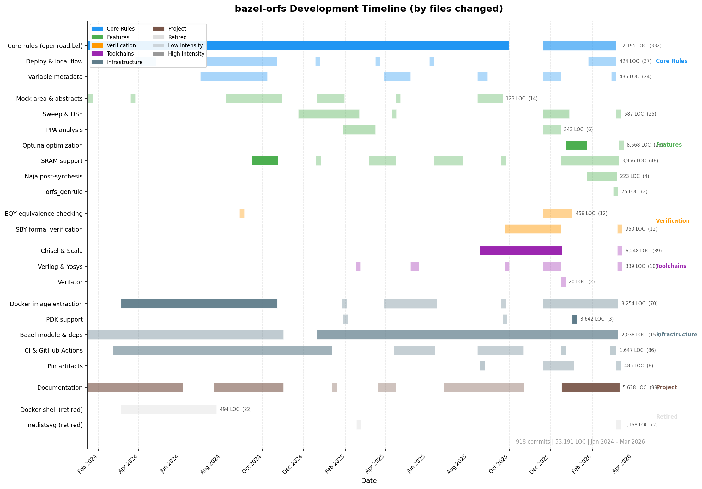

# bazel-orfs

This repository contains [Bazel](https://bazel.build/) rules for wrapping [OpenROAD-flow-scripts](https://github.com/The-OpenROAD-Project/OpenROAD-flow-scripts) (ORFS).

## Why Bazel on top of ORFS?

bazel-orfs gives all the expected Bazel advantages to ORFS: artifacts, parallel builds, remote execution, repeatable builds, etc.

Also, ORFS and OpenROAD is work in progress and you should expect for
large designs to get involved with the community or need a
support contract with [Precision Innovations](https://www.linkedin.com/in/tomspyrou/).

Using ORFS directly, instead of modifying it or creating an alternative flow,
makes it easy to get the very latest features and version of OpenROAD and ORFS
as well as having access to all ORFS features, including debugging
features such as `make issue` and `deltaDebug.py`.

Since bazel-orfs uses the unmodified ORFS, it is easy to articulate familiar
and easily actionable github issues for the OpenROAD and ORFS maintainers.

## Use cases

| I want to... | Go to |
|---|---|
| Run my first build | [Get started](#get-started) |
| Define a new design flow | [Define a design flow](#define-a-design-flow) |
| Add bazel-orfs to my project | [Use as an external dependency](#use-bazel-orfs-as-an-external-dependency) |
| View results in the OpenROAD GUI | [View results in the GUI](#view-results-in-the-gui) |
| Build with local ORFS | [Use the local flow](#use-the-local-flow) |
| Create macros with LEF/LIB | [Work with macros and abstracts](#work-with-macros-and-abstracts) |
| Quickly estimate macro sizes | [Mock area targets](#mock-area-targets) |
| Tweak floorplan or placement settings | [Tweak and iterate on designs](#tweak-and-iterate-on-designs) |
| Run a single substep (e.g. resizing) | [Substep targets](#substep-targets) |
| Reduce artifacts for stable designs | [Squashed flows](#squashed-flows) |
| Speed up CI or development builds | [Speed up your builds](#speed-up-your-builds) |
| Understand CI timing breakdown | [Where CI time goes](#where-ci-time-goes) |
| Query timing interactively | [Query timing interactively](#query-timing-interactively) |
| Monitor long-running builds | [Monitor long-running builds](#monitor-long-running-builds) |
| Sweep design parameters | [Design space exploration](#design-space-exploration) |
| Run formal verification | [sby/README.md](sby/README.md) |
| Integrate Chisel designs | [chisel/README.md](chisel/README.md) |
| Pin slow-to-build artifacts | [tools/pin/README.md](tools/pin/README.md) |
| Debug or create issue archives | [Create a make issue archive](#create-a-make-issue-archive) |
| Upgrade bazel-orfs or ORFS | [Upgrade bazel-orfs](#upgrade-bazel-orfs) |
| Override configuration variables | [Override configuration variables](#override-configuration-variables) |

## Requirements

* [Bazelisk](https://bazel.build/install/bazelisk) or [Bazel](https://bazel.build/install) - if using Bazel, please refer to [.bazelversion](./.bazelversion) file for the recommended version of the tool.
* [Docker](https://docs.docker.com/get-docker/) - Bazel utilizes Docker to set up the environment using ORFS artifacts from the container.
  The Docker image used in the flow defaults to `openroad/orfs`, with tag specified in the [module](./MODULE.bazel) file.

  > **NOTE:** The `bazel-orfs` doesn't execute flows inside the Docker container, but rather uses the container as a source of ORFS artifacts.
* (Optional) Locally built [ORFS](https://github.com/The-OpenROAD-Project/OpenROAD-flow-scripts). To use it, `env.sh` file from OpenROAD-flow-scripts has to be sourced or `FLOW_HOME` environment variable has to be set to the path of the local `OpenROAD-flow-scripts/flow` installation.

## Get started

### Run your first build

To build the `cts` (Clock Tree Synthesis) stage of the `L1MetadataArray` target, run:

```bash
bazel run @bazel-orfs//test:L1MetadataArray_cts
```

Bazel automatically downloads the Docker image with the ORFS environment and runs the flow. Results are placed in the `tmp/results` directory under the workspace root.

### View results in the GUI

To open the OpenROAD GUI for a completed stage:

```bash
bazel run <target>_<stage> gui_<stage>
```

For example, to view the route stage of `L1MetadataArray`:

```bash
bazel run @bazel-orfs//test:L1MetadataArray_route gui_route
```

You can also run the build and view results in two steps:

```bash
bazel run @bazel-orfs//test:L1MetadataArray_route
# Start the GUI
tmp/test/L1MetadataArray_route/make gui_route

# Or open the CLI instead
tmp/test/L1MetadataArray_route/make open_route
gui::show
```

GUI and CLI are available for these stages: `floorplan`, `place`, `cts`, `grt`, `route`, `final`.

### Use the local flow

The local flow lets you build with a locally compiled [ORFS](https://openroad-flow-scripts.readthedocs.io/en/latest/user/UserGuide.html) instead of the Docker image.

1. Source `env.sh` of your local ORFS installation or set the `FLOW_HOME` environment variable:

   ```bash
   source <ORFS_path>/env.sh
   # Or
   export FLOW_HOME=<ORFS_path>/flow
   ```

2. Initialize dependencies and run the stage:

   ```bash
   # Initialize dependencies for the synthesis stage
   bazel run @bazel-orfs//test:L1MetadataArray_synth_deps

   # Build synthesis using local ORFS
   tmp/test/L1MetadataArray_synth_deps/make do-yosys-canonicalize do-yosys do-1_synth

   # Initialize dependencies for the floorplan stage
   bazel run @bazel-orfs//test:L1MetadataArray_floorplan_deps

   # Build floorplan
   tmp/test/L1MetadataArray_floorplan_deps/make do-floorplan
   ```

> **NOTE:** The synthesis stage requires `do-yosys-canonicalize` and `do-yosys` to be completed before `do-1_synth`. These steps generate the required `.rtlil` file.

> **NOTE:** If `FLOW_HOME` is not set and `env.sh` is not sourced, `make do-<stage>` uses the ORFS from [MODULE.bazel](./MODULE.bazel) by default.

> **NOTE:** Files are always placed in `tmp/<package>/<name>/` under the workspace root (e.g. `tmp/sram/sdq_17x64_floorplan_deps/` for `//sram:sdq_17x64_floorplan_deps`, `tmp/MyDesign_floorplan_deps/` for the root package), which is added to `.gitignore` automatically.
>
> You can override the installation directory with `--install`:
>
> ```bash
> bazel run <target>_<stage>_deps -- --install /path/to/dir [<make args...>]
> ```
>
> This is useful on systems where `/tmp` is small or when you want to place the build artifacts in a specific location.

You can also forward arguments to make directly:

```bash
bazel run <target>_<stage>_deps <make args...>
```

### Parallel local builds

Multiple `_deps` deployments are independent and can run in parallel. This
is useful when building multiple designs or deploying all stages at once:

```bash
# Deploy and build two independent designs in parallel
bazel run //test:tag_array_64x184_synth_deps &
bazel run //test:lb_32x128_synth_deps &
wait

# Run synthesis in parallel (each in its own directory)
tmp/test/tag_array_64x184_synth_deps/make do-yosys-canonicalize do-yosys do-1_synth &
tmp/test/lb_32x128_synth_deps/make do-yosys-canonicalize do-yosys do-1_synth &
wait
```

You can also pre-deploy all stages of a single design for faster iteration:

```bash
# Deploy all stages at once (each _deps is independent)
for stage in synth floorplan place cts grt route final; do
  bazel run //test:L1MetadataArray_${stage}_deps &
done
wait

# Now iterate on any stage without re-deploying
tmp/test/L1MetadataArray_floorplan_deps/make do-floorplan
tmp/test/L1MetadataArray_place_deps/make do-place
```

> **NOTE:** Each stage's `make` invocation still requires its input artifacts
> from the previous stage to be present, so the `make` commands must run
> sequentially. Only the `_deps` deployments (which just set up the directory
> structure) can run in parallel.

## Define a design flow

### Use bazel-orfs as an external dependency

To use `orfs_flow()` in another project, add bazel-orfs as a dependency through one of [Bazel Module Methods](https://bazel.build/rules/lib/globals/module):

From a git repository:

```starlark
bazel_dep(name = "bazel-orfs")
git_override(
    module_name = "bazel-orfs",
    remote = "<URL to bazel-orfs repository>",
    commit = "<git hash for specific bazel-orfs revision>",
)
```

From a local directory:

```starlark
bazel_dep(name = "bazel-orfs")
local_path_override(
    module_name = "bazel-orfs",
    path = "<path to local bazel-orfs workspace>",
)
```

### Write an orfs_flow() target

Core functionality is implemented as `orfs_flow()` Bazel macro in `openroad.bzl` file. Place the macro in your BUILD file:

```starlark
orfs_flow(
    name = "L1MetadataArray",
    abstract_stage = "route",
    arguments = {
        "CORE_MARGIN": "2",
        "CORE_UTILIZATION": "3",
        "MACRO_PLACE_HALO": "30 30",
        "PLACE_DENSITY": "0.20",
        "PLACE_PINS_ARGS": "-annealing",
        "SYNTH_HIERARCHICAL": "1",
    },
    macros = ["tag_array_64x184_generate_abstract"],
    sources = {
        "SDC_FILE": [":constraints-top.sdc"],
    },
    verilog_files = ["rtl/L1MetadataArray.sv"],
)
```

This spawns the following Bazel targets:

```
Dependency targets:
  //test:L1MetadataArray_cts_deps
  //test:L1MetadataArray_floorplan_deps
  //test:L1MetadataArray_generate_abstract_deps
  //test:L1MetadataArray_grt_deps
  //test:L1MetadataArray_place_deps
  //test:L1MetadataArray_route_deps
  //test:L1MetadataArray_synth_deps

Stage targets:
  //test:L1MetadataArray_cts
  //test:L1MetadataArray_floorplan
  //test:L1MetadataArray_generate_abstract
  //test:L1MetadataArray_grt
  //test:L1MetadataArray_place
  //test:L1MetadataArray_route
  //test:L1MetadataArray_synth
```

The example is based on the [test/BUILD](./test/BUILD) file in this repository.

### Use variants

To test different variants of the same design, provide the optional `variant` argument:

```starlark
orfs_flow(
    name = "L1MetadataArray",
    abstract_stage = "route",
    macros = ["tag_array_64x184_generate_abstract"],
    # [...]
    variant = "test",
)
```

This creates targets with the variant appended after the design name:

```
Dependency targets:
  //test:L1MetadataArray_test_cts_deps
  //test:L1MetadataArray_test_floorplan_deps
  ...
  //test:L1MetadataArray_test_generate_abstract_deps

Stage targets:
  //test:L1MetadataArray_test_synth
  //test:L1MetadataArray_test_floorplan
  ...
  //test:L1MetadataArray_test_generate_abstract
```

## Configure and customize

### Override configuration variables

You can override configuration variables on the command line by passing them as arguments:

```bash
$ bazel run //test:tag_array_64x184_floorplan print-CORE_UTILIZATION
[deleted]
CORE_UTILIZATION: 20
```

```bash
$ bazel run //test:tag_array_64x184_floorplan CORE_UTILIZATION=5 print-CORE_UTILIZATION
[deleted]
CORE_UTILIZATION: 5
```

### Pass constraints to stages

Pass constraint files to `orfs_flow()` through `sources`:

```starlark
orfs_flow(
    name = "tag_array_64x184",
    sources = {
        "SDC_FILE": [":constraints-sram"],  # constraint file label
    },
    verilog_files = ["//another:tag_array_64x184.sv"],
    visibility = [":__subpackages__"],
)
```

If your constraints file includes additional TCL scripts, define them in a filegroup with the `data` attribute:

```starlark
filegroup(
    name = "constraints-sram",
    srcs = [
        ":constraints-sram.sdc",
    ],
    data = [
        ":util.tcl",  # additional TCL script
    ],
    visibility = [":__subpackages__"],
)
```

### Force a rebuild

Sometimes it is desirable, such as when hacking ORFS, to redo a build stage even
if none of the dependencies for that stage changed. You can achieve this by adding
a `PHONY` variable to that stage and bumping it:

```diff
diff --git a/test/BUILD b/test/BUILD
--- a/test/BUILD
+++ b/test/BUILD
 orfs_flow(
     name = "L1MetadataArray",
     abstract_stage = "route",
     arguments = {
+        "PHONY": "1",
         "SYNTH_HIERARCHICAL": "1",
         ...
     },
```

## Work with macros and abstracts

### Generate abstracts

Abstracts (`.lef` and `.lib` files) are generated at the `<target>_generate_abstract` stage, which follows the stage defined via the `abstract_stage` attribute:

```starlark
orfs_flow(
    name = "tag_array_64x184",
    abstract_stage = "place",  # generate abstracts after this stage
    arguments = SRAM_ARGUMENTS | {
        "CORE_ASPECT_RATIO": "2",
        "CORE_UTILIZATION": "40",
        "PLACE_DENSITY": "0.65",
    },
    stage_sources = {
        "floorplan": [":io-sram"],
        "place": [":io-sram"],
        "synth": [":constraints-sram"],
    },
    verilog_files = ["//another:tag_array_64x184.sv"],
    visibility = [":__subpackages__"],
)
```

By default, `abstract_stage` is set to `final` (the latest ORFS stage).

> **NOTE:** Abstracts can be generated starting from the `place` stage, because pin placement happens during the place stage. The legal values for `abstract_stage` are: `place`, `cts`, `grt`, `route`, `final`.

Abstracts are useful for estimating sizes of macros with long build times and checking if they fit in upper-level modules without running the full place and route flow.

> **NOTE:** Stages that follow the one passed to `abstract_stage` are not created by `orfs_flow()`.

### Mock area targets

Mock area targets override `_generate_abstract` to produce mocked abstracts with the same pinout as the original macro but with a scaled size. This is useful in early design stages.

The flow contains:
* `<target>_synth_mock_area` — synthesis with internal logic removed
* `<target>_mock_area` — reads `DIE_AREA` and `CORE_AREA` from the default floorplan and scales them by `mock_area`
* `<target>_floorplan_mock_area` — floorplan with overridden `DIE_AREA` and `CORE_AREA`
* `<target>_generate_abstract` — abstracts generated from mocked synthesis and floorplan

To create mock area targets, add `mock_area` to your `orfs_flow` definition:

```starlark
orfs_flow(
    name = "lb_32x128",
    arguments = LB_ARGS,
    mock_area = 0.5,
    stage_sources = LB_STAGE_SOURCES,
    verilog_files = LB_VERILOG_FILES,
)
```

### Fast floorplanning with mock abstracts

To skip cts and route and create a mock abstract where you can check that macros fit at the top level, set `abstract_stage` to `place`:

> **WARNING:** Although mock abstracts can speed up turnaround times, skipping place, cts, or route can lead to errors that don't exist when these stages are run.

```diff
diff --git a/test/BUILD b/test/BUILD
--- a/test/BUILD
+++ b/test/BUILD
 orfs_flow(
     name = "L1MetadataArray",
-    abstract_stage = "route",
+    abstract_stage = "place",
     arguments = {
         ...
     },
```

You can verify the generated targets with `bazel query`:

```bash
bazel query '...:*' | grep 'L1MetadataArray'

//test:L1MetadataArray_synth_deps
//test:L1MetadataArray_synth
//test:L1MetadataArray_floorplan_deps
//test:L1MetadataArray_floorplan
//test:L1MetadataArray_generate_abstract
```

The abstract target always follows the `<target>_generate_abstract` naming pattern:

```bash
bazel build @bazel-orfs//test:L1MetadataArray_generate_abstract
```

The output `LEF` file can be found under `bazel-bin/results/<module>/<target>/base/<target.lef>`.

## Tweak and iterate on designs

### Adjust floorplan parameters

The `CORE_ASPECT_RATIO` parameter is a floorplan variable, so
changing it only rebuilds from the floorplan stage:

```diff
diff --git a/test/BUILD b/test/BUILD
--- a/test/BUILD
+++ b/test/BUILD
 orfs_flow(
     name = "tag_array_64x184",
     arguments = SRAM_ARGUMENTS | {
-        "CORE_ASPECT_RATIO": "10",
+        "CORE_ASPECT_RATIO": "4",
         "CORE_UTILIZATION": "20",
     },
```

Bazel detects this change specifically as a change to the floorplan, re-uses the synthesis result, and rebuilds from the floorplan stage.
Similarly, if `PLACE_DENSITY` is modified, only stages from placement onward are rebuilt.

To apply and view the changes:

```bash
# Build and view in GUI
bazel run @bazel-orfs//test:tag_array_64x184_floorplan gui_floorplan
```

### Substep targets

Each ORFS stage runs multiple substeps internally — e.g., the `place` stage
runs global placement, IO placement, resizing, and detailed placement as a
single Bazel action via `do-place`. ORFS already exposes individual substeps
as make targets (`do-3_4_place_resized`, `do-2_4_floorplan_pdn`, etc.) and
the `_deps` mechanism deploys stage artifacts where users can manually invoke
these targets. However, `_deps` has high cognitive load:

1. **Manual dependency management**: you must build preceding stages first
   (`bazel build synth`, then `floorplan`, then `place`) before running a
   substep via `_deps`.
2. **No change tracking**: `_deps` doesn't detect when BUILD parameters
   change — you must re-run `bazelisk run ..._deps` manually.
3. **Opaque naming**: you must know internal ORFS make target names
   (e.g., `do-3_4_place_resized`) and run them through the `tmp/.../make`
   wrapper.
4. **Error-prone**: forgetting to rebuild a preceding stage silently uses
   stale artifacts, leading to confusing results.

`orfs_flow()` auto-generates manual-tagged Bazel targets for individual
substeps that solve all of these problems:

- **Automatic dependency chain** — Bazel handles synth → floorplan → place
  before deploying and running the substep
- **ORFS naming** — `3_4_place_resized` maps 1:1 to `do-3_4_place_resized`
  in the ORFS Makefile
- **GUI support** — append `gui_<stage>` to open the result in the OpenROAD GUI
- **Tagged `manual`** — never built by `bazel build //...`, no impact on
  existing workflows

#### Before: iterating on resizing with `_deps`

```bash
# 1. Build all preceding stages manually
bazelisk build //coralnpu:CoreMiniAxi_synth
bazelisk build //coralnpu:CoreMiniAxi_floorplan
bazelisk build //coralnpu:CoreMiniAxi_place

# 2. Deploy place artifacts
bazelisk run //coralnpu:CoreMiniAxi_place_deps

# 3. Know and run the internal make target
tmp/coralnpu/CoreMiniAxi_place_deps/make do-3_4_place_resized

# 4. If BUILD changed, re-deploy (easy to forget!)
bazelisk run //coralnpu:CoreMiniAxi_place_deps
tmp/coralnpu/CoreMiniAxi_place_deps/make do-3_4_place_resized
```

#### After: one command

```bash
# Builds entire chain, deploys, runs only resizing
bazel run //coralnpu:CoreMiniAxi_place_3_4_place_resized

# Open GUI to inspect
bazel run //coralnpu:CoreMiniAxi_place_3_4_place_resized gui_place

# After editing BUILD, same command picks up changes automatically
bazel run //coralnpu:CoreMiniAxi_place_3_4_place_resized
```

#### Available substeps per stage

| Stage | Substeps |
|-------|----------|
| floorplan | `2_1_floorplan`, `2_2_floorplan_macro`, `2_3_floorplan_tapcell`, `2_4_floorplan_pdn` |
| place | `3_1_place_gp_skip_io`, `3_2_place_iop`, `3_3_place_gp`, `3_4_place_resized`, `3_5_place_dp` |
| cts | `4_1_cts` |
| grt | `5_1_grt` |
| route | `5_2_route`, `5_3_fillcell` |
| final | `6_1_merge`, `6_report` |

Substep names are defined once in `STAGE_SUBSTEPS` in `private/stages.bzl` —
the single source of truth from which log and JSON file names in stage rules
are derived. Stages with only one substep (like cts) don't generate substep
targets since the stage target already runs exactly that substep.

> **NOTE:** The synth stage is not listed above because it uses a different
> execution model (Yosys, not OpenROAD). Synth has two internal operations
> (`1_1_yosys_canonicalize` and `1_2_yosys`) but they are handled as a
> single Bazel action with built-in dependency checking via `.rtlil`
> canonicalization, not as deploy-and-run substep targets.

> **NOTE:** ORFS could grow a metadata file (beyond `variables.yaml`) that
> lists substep names, their scripts, and dependencies. This would make
> `STAGE_SUBSTEPS` truly derived from ORFS rather than maintained as a copy
> in bazel-orfs.

#### How substep targets work

Substep targets are deploy-and-run wrappers (like `_deps`) that reuse the
parent stage's single set of artifacts. No new Bazel actions, no new ODB
checkpoints, no artifact explosion.

**Why not split stages into separate Bazel actions per substep?** ORFS substeps
share a single ODB file that is modified in-place through the pipeline. If each
substep were a separate Bazel action, every substep would need to declare its
own ODB output, and Bazel would store each intermediate checkpoint. For a design
with 5 placement substeps, that means 5 copies of the ODB instead of 1. Across
all stages, this artifact explosion would multiply storage by ~4-5x per design.
For CI with multiple PDKs and variants, this quickly becomes prohibitive.

#### Enabling substep targets

Substep targets are **off by default** (`substeps = False`) to keep the target
count small for stable designs. Enable them for designs under active development
where you need substep-level iteration:

```starlark
orfs_flow(
    name = "my_design",
    substeps = True,
    ...
)
```

Wrapper macros that call `orfs_flow()` internally (e.g. for SRAMs or register
files) should consider passing `substeps` through as a parameter so users can
enable it when debugging.

#### When to use `_deps` vs substep targets

| I want to... | Use |
|---|---|
| Run a single substep and view the result | Substep target |
| Iterate on a substep after editing BUILD | Substep target (auto-detects changes) |
| Run arbitrary make targets not in STAGE_SUBSTEPS | `_deps` |
| Edit Tcl scripts and re-run without Bazel | `_deps` (picks up file changes instantly) |
| Create a `make issue` archive | `_deps` |
| Use a local ORFS installation | `_deps` |
| Run `make bash` for interactive debugging | `_deps` |

Substep targets are the simpler tool for most iteration — one command, automatic
dependency chain, change detection. `_deps` remains essential when you need the
full Make wrapper: hacking ORFS scripts, running `make issue`, working with a
local ORFS installation, or running arbitrary make targets not exposed as substep
targets.

### Use remote caching for instant reverts

If remote caching is enabled for Bazel, reverting a change and rebuilding completes instantaneously because the artifact already exists:

```bash
# Revert the change
git restore test/BUILD

# Rebuild — instant cache hit
bazel run @bazel-orfs//test:tag_array_64x184_floorplan gui_floorplan
```

## Speed up your builds

### Disable expensive operations for CI and development

For CI or iterative development where timing closure isn't needed, you can
disable expensive operations. The `FAST_SETTINGS` dict in [test/BUILD](test/BUILD)
shows the recommended settings:

| Setting | Stage | What it disables | Speed impact |
|---------|-------|------------------|-------------|
| `REMOVE_ABC_BUFFERS` = `"1"` | floorplan | Removes synthesis buffers instead of running `repair_timing_helper` (gate sizing, VT swapping). Without this, floorplan timing repair can run for hours. | Very high |
| `GPL_TIMING_DRIVEN` = `"0"` | place | Timing-driven global placement. Skips timing path analysis and buffer removal during placement iterations. | High |
| `GPL_ROUTABILITY_DRIVEN` = `"0"` | place | Routability-driven global placement. Skips routing congestion estimation during placement. | Moderate |
| `SKIP_CTS_REPAIR_TIMING` = `"1"` | cts | Timing repair after clock tree synthesis. Skips iterative buffer insertion, gate sizing, gate cloning, and VT swapping. Can reduce CTS from hours to minutes. | Very high |
| `SKIP_INCREMENTAL_REPAIR` = `"1"` | grt | Incremental repair during global routing. Skips two rounds of `repair_design` + `repair_timing` with incremental re-routing. | Very high |
| `SKIP_REPORT_METRICS` = `"1"` | all | Metrics reporting (`report_checks`, `report_wns`, `report_tns`, `report_power`, `report_clock_skew`) at every stage. | Moderate |
| `FILL_CELLS` = `""` | route | Fill cell insertion (`filler_placement`). Required for manufacturing but not for design exploration. | Low |
| `TAPCELL_TCL` = `""` | floorplan | Custom tap/endcap cell placement script. Falls back to simple `cut_rows`. | Low |
| `PWR_NETS_VOLTAGES` = `""` | final | IR drop analysis for power nets (`analyze_power_grid`). | Low |
| `GND_NETS_VOLTAGES` = `""` | final | IR drop analysis for ground nets (`analyze_power_grid`). | Low |

Apply these settings in your `orfs_flow()` target:

```starlark
FAST_SETTINGS = {
    "FILL_CELLS": "",
    "GND_NETS_VOLTAGES": "",
    "GPL_ROUTABILITY_DRIVEN": "0",
    "GPL_TIMING_DRIVEN": "0",
    "PWR_NETS_VOLTAGES": "",
    "REMOVE_ABC_BUFFERS": "1",
    "SKIP_CTS_REPAIR_TIMING": "1",
    "SKIP_INCREMENTAL_REPAIR": "1",
    "SKIP_REPORT_METRICS": "1",
    "TAPCELL_TCL": "",
}

orfs_flow(
    name = "my_design",
    arguments = FAST_SETTINGS | {
        "CORE_UTILIZATION": "40",
        # ...
    },
    verilog_files = ["my_design.sv"],
)
```

### Set abstract_stage as early as possible

The `abstract_stage` parameter controls how far the flow runs. Setting it earlier
skips all subsequent stages:

| `abstract_stage` | Stages built | Stages skipped |
|------------------|--------------|----------------|
| `"place"` | synth, floorplan, place | cts, grt, route, final |
| `"cts"` | synth → cts | grt, route, final |
| `"grt"` | synth → grt | route, final |
| `"route"` | synth → route | final |
| `"final"` (default) | All stages | None |

Abstract generation requires at least the `place` stage because pins are placed
during placement. For macro size estimation, `"place"` is usually sufficient.
For timing analysis, `"cts"` provides clock tree data without expensive routing.

### Squashed flows

By default, `orfs_flow()` creates one Bazel target per stage (the default
`squash = False`), each storing its own ODB checkpoint. This is useful for
debugging — you can inspect any intermediate stage, re-run from a checkpoint,
and iterate on individual substeps.

`squash = True` combines all stages after synthesis into a single Bazel action.
Only the final stage's ODB is stored as an artifact. This is for mature, stable
designs like RAM macros where nobody needs to inspect intermediate stages:

```starlark
# Stable RAM macro — no need to inspect intermediate stages
orfs_flow(
    name = "sram_64x128",
    abstract_stage = "cts",
    squash = True,
    ...
)
```

The reduction in artifact count is significant: instead of 7 ODB checkpoints
(synth through final), you get 2 (synth + final). For CI with multiple PDKs
and variants, this saves considerable storage.

Which ODB files to checkpoint as artifacts is flow-specific — the default
per-stage boundaries are just one common case that `orfs_flow()` encodes.
`squash = True` is the other extreme. Advanced users can use `orfs_squashed`
directly for custom groupings (e.g., squashing only floorplan through place
while keeping later stages separate).

Wrapper macros (like those for SRAMs or register files) that call
`orfs_flow()` internally are good candidates for `squash = True`, since
sub-macros are typically stable once working and don't need per-stage
inspection.

By default, substep targets are still generated (manual-tagged) even with
`squash = True`, for debugging if something goes wrong later. Disable with
`substeps = False` to minimize the target count:

```starlark
# Minimal target footprint for stable RAM macro
orfs_flow(
    name = "sram_64x128",
    abstract_stage = "cts",
    squash = True,
    substeps = False,
    ...
)
```

### Query timing interactively

Open an interactive OpenROAD shell or GUI to investigate a completed stage:

```bash
# GUI with timing loaded
bazel run <target>_<stage> gui_<stage>

# Interactive TCL shell (no GUI)
bazel run <target>_<stage> open_<stage>
```

Useful TCL commands once inside OpenROAD:

| Command | What it shows |
|---------|---------------|
| `report_checks -path_delay max -group_count 5` | Top 5 worst setup timing paths |
| `report_checks -path_delay max -through [get_pins *name*]` | Worst path through a specific pin |
| `report_wns` | Worst negative slack |
| `report_tns` | Total negative slack |
| `get_cells -hier *name*` | Find instances by name pattern |

### Monitor long-running builds

ORFS stages can take minutes to hours. To monitor progress, find the active
OpenROAD processes and tail their log files.

**Step 1: Find what's running with `ps`**

```bash
# Find active openroad processes — the command line shows the script and log path
ps -Af | grep openroad | grep -v grep
```

Example output:

```
oyvind 2175870 ... openroad -exit ... flow/scripts/global_place.tcl -metrics .../3_3_place_gp.json
```

From the process command line you can read:
- Which script is running (`global_place.tcl` = placement stage)
- The sandbox path and log file name (replace `.json` with `.tmp.log` for the active log)

**Step 2: Tail the active log**

During execution, the active log has a `.tmp.log` suffix inside the Bazel sandbox.
When the action completes, the sandbox is destroyed — so `.tmp.log` files vanish.
The final `.log` is written to `bazel-out/` only on completion.

To capture live output, use `tee` to save a copy before the sandbox disappears:

```bash
# Find active .tmp.log files and tee them to /tmp for later inspection
find ~/.cache/bazel -name "*.tmp.log" -size +0c 2>/dev/null | \
  while read f; do
    name=$(basename "$f" .tmp.log)
    tail -f "$f" | tee "/tmp/${name}.log" &
  done
```

**Step 3: Monitor via the local flow** (easier, recommended for debugging):

```bash
# Start the build in the local flow
bazel run //test:L1MetadataArray_cts_deps
tmp/test/L1MetadataArray_cts_deps/make do-cts &

# In another terminal, watch the log
tail -f tmp/test/L1MetadataArray_cts_deps/logs/4_1_cts.log
```

**What to look for in logs:**

| Log pattern | What it means | Action to speed up |
|-------------|---------------|-------------------|
| `Iteration \| Overflow` decreasing slowly | Global placement convergence. Overflow should drop toward 0. | Set `GPL_TIMING_DRIVEN=0` and `GPL_ROUTABILITY_DRIVEN=0` to skip timing/congestion analysis per iteration. |
| `repair_timing` running for many iterations | Timing repair loop — can run for hours. | Set `SKIP_CTS_REPAIR_TIMING=1` (CTS) or `SKIP_INCREMENTAL_REPAIR=1` (GRT). Or set `SETUP_SLACK_MARGIN`/`HOLD_SLACK_MARGIN` to terminate early. |
| `[WARNING STA-1554]` "not a valid start point" (thousands) | SDC constraints reference pins that don't exist. Harmless but floods the log and slows STA. | Fix SDC constraints or filter with `suppress_message`. |
| `remove_buffers` / `repair_timing_helper` in floorplan | Buffer optimization after synthesis. | Set `REMOVE_ABC_BUFFERS=1` to skip this entirely. |
| `report_checks` / `report_wns` / `report_clock_skew` | Metrics reporting at stage end. | Set `SKIP_REPORT_METRICS=1` to skip. |
| `estimate_parasitics` | Parasitic estimation — usually fast. Indicates transition between sub-steps. | Normal, no action needed. |
| `filler_placement` | Fill cell insertion. | Set `FILL_CELLS=""` to skip (not needed for CI/DSE). |
| `analyze_power_grid` | IR drop analysis. | Set `PWR_NETS_VOLTAGES=""` and `GND_NETS_VOLTAGES=""` to skip. |

**Log file naming convention:**

Each ORFS stage produces numbered log files under `logs/`. During execution,
the active file has a `.tmp.log` suffix:

| Stage | Log files |
|-------|-----------|
| synth | `1_1_yosys_canonicalize.log`, `1_2_yosys.log` |
| floorplan | `2_1_floorplan.log` through `2_4_floorplan_pdn.log` |
| place | `3_1_place_gp_skip_io.log` through `3_5_place_dp.log` |
| cts | `4_1_cts.log` |
| grt | `5_1_grt.log` |
| route | `5_2_route.log`, `5_3_fillcell.log` |
| final | `6_1_merge.log`, `6_report.log` |

### Where CI time goes

The CI pipeline (`.github/workflows/ci.yml`) runs 6 jobs. The `test-make-target` job
is a matrix of 9 targets that run in parallel on separate runners. Use `--profile` and
`analyze-profile` to profile your own builds:

```bash
bazel build <target> --profile=/tmp/profile.gz
bazel analyze-profile /tmp/profile.gz
```

#### Smoketests (`bazel test ...`)

The smoketests job builds *everything* including sram, chisel, sby, and sky130 targets.
Critical path runs through the `sram/` hierarchical build (sdq_17x64 → top):

```
Critical path (553 s):
  Action                                          Time      %
  sram/sdq_17x64  1_1_yosys_canonicalize          5.5s    1%
  sram/sdq_17x64  1_2_yosys.v (synthesis)        31.2s    6%
  sram/sdq_17x64  2_floorplan.odb                28.0s    5%
  sram/sdq_17x64  3_place.odb                   298.1s   54%   ← placement dominates
  sram/sdq_17x64  generate_abstract               9.3s    2%
  sram/top         1_1_yosys_canonicalize          4.7s    1%
  sram/top         1_2_yosys.v (synthesis)         9.0s    2%
  sram/top         2_floorplan.odb                25.2s    5%
  sram/top         3_place.odb                   129.0s   23%   ← placement again
  sram/top         4_cts.odb                       9.0s    2%
  sram/top         generate_abstract               4.6s    1%
```

Placement (global_place + global_place_skip_io) accounts for ~77% of the critical path.

#### test-make-target matrix

Each target runs on a separate CI runner. The critical path target is
`tag_array_64x184_generate_abstract` (CTS abstract with hierarchical L1MetadataArray):

```
Critical path (465 s):
  Action                                          Time      %
  tag_array_64x184 synth                         20.9s    4%
  tag_array_64x184 floorplan                     21.8s    5%
  tag_array_64x184 place                        224.8s   48%   ← placement dominates
  tag_array_64x184 cts                           12.4s    3%
  tag_array_64x184 generate_abstract              4.5s    1%
  L1MetadataArray  synth                         16.4s    4%
  L1MetadataArray  floorplan                     18.9s    4%
  L1MetadataArray  place                        134.7s   29%   ← placement again
  L1MetadataArray  cts                            7.5s    2%
  L1MetadataArray  generate_abstract              3.3s    1%
```

Other matrix targets are faster since they build subsets of the same dependency chain.
The `subpackage/` targets duplicate `test/` builds in a separate Bazel package (203s
critical path for tag_array_64x184 alone).

#### Per-design timing (single-design, synth through CTS with FAST_SETTINGS)

| Design | Synth | Floorplan | Place | CTS | Abstract | Total |
|--------|-------|-----------|-------|-----|----------|-------|
| lb_32x128 (small) | 5s | 7s | 15s | 3s | - | 25s |
| tag_array_64x184 | 21s | 22s | 225s | 12s | 5s | 280s |
| sdq_17x64 (megaboom) | 37s | 28s | 298s | - | 9s | 362s |
| L1MetadataArray (hierarchical) | 16s | 19s | 135s | 8s | 3s | 181s |

Each OpenROAD sub-step has a minimum startup overhead of ~1.3s (loading the database,
reading libraries). For small designs, this overhead dominates. For large designs,
`global_place` dominates instead — it accounts for 50-85% of the placement stage.

### Force a cache miss for testing

Bazel caches based on content hashes. To force a specific stage to rebuild without
`bazel clean` (which is slow and rebuilds everything), change a variable that
belongs to that stage:

```starlark
# Force floorplan rebuild by changing a floorplan variable
"CORE_UTILIZATION": "21",  # was "20"

# Force placement rebuild by changing a placement variable
"PLACE_DENSITY": "0.21",   # was "0.20"
```

Each ORFS variable is assigned to a specific stage via `variables.yaml`. Changing a
variable only invalidates its stage and all subsequent stages — synthesis is preserved.
See `ORFS flow/scripts/variables.yaml` for which variables belong to which stage.

### Debug cache misses

Use `--explain` to understand why Bazel is rebuilding a target:

```bash
bazel build <target> --explain=/tmp/explain.txt --verbose_explanations
```

Avoid `bazel clean --expunge` — it forces a full rebuild. If you need to force-rebuild
one target, use the [`PHONY` variable trick](#force-a-rebuild) instead.

### CI optimization opportunities

Potential improvements to the bazel-orfs CI pipeline:

- **Placement dominates**: 50-85% of build time is `global_place`. ORFS upstream
  improvements to placement speed would have the largest impact.
- **Duplicate builds across packages**: `subpackage/` targets rebuild the same
  designs as `test/`, but in a separate Bazel package. The `test-make-target` matrix
  runs them on separate runners without shared caches.
- **Consolidate FAST_SETTINGS**: Three copies exist in `test/BUILD`, `sram/BUILD`,
  and `subpackage/BUILD`. A shared `.bzl` file would prevent drift.
- **STA-1554 warning flood**: tag_array_64x184 emits ~1000 `STA-1554` warnings
  ("not a valid start point") per placement stage. These are harmless but slow
  down log processing. Fixing the SDC constraints would eliminate them.
- **OpenROAD startup overhead**: Each sub-step takes ~1.3s minimum for database/library
  loading. For small designs, this overhead is significant. ORFS sub-step consolidation
  would help.
- **`SKIP_REPORT_METRICS=1` for all CI targets**: Already applied via FAST_SETTINGS.
  Metrics reporting adds minutes per stage on large designs.

## Design space exploration

bazel-orfs supports two approaches to design space exploration:

* **Bazel-native DSE** — sweep parameters using Bazel build settings, with Bazel handling parallelism efficiently. The `orfs_sweep` macro from `sweep.bzl` is the underlying mechanism. See [dse/README.md](dse/README.md).
* **Optuna-based DSE** — multi-objective optimization using Optuna's TPE algorithm to find near-optimal parameter combinations. See [optuna/README.md](optuna/README.md).

## Additional tools and integrations

| Tool | Description | Documentation |
|------|-------------|---------------|
| Chisel integration | Build Chisel designs, run tests | [chisel](chisel/README.md) |
| Formal verification | SymbiYosys bounded model checking | [sby](sby/README.md) |
| Artifact pinning | Cache long-running build results | [tools/pin](tools/pin/README.md) |
| Post-synthesis cleanup | najaeda netlist cleaning (experimental) | [naja](naja/README.md) |
| SRAM macros | fakeram and mock SRAM | [sram](sram/README.md) |
| ASAP7 tech files | Modified ASAP7 files for eqy | [asap7](asap7/README.md) |
| Equivalence checking (eqy) | Yosys-based combinational equivalence | [delivery](delivery/README.md) |
| Equivalence checking (LEC) | kepler-formal logic equivalence | [lec](lec/README.md) |
| Verilog generation | FIRRTL-to-SystemVerilog via firtool | [verilog](verilog/README.md) |

## Reference

### Stage targets

Each stage of the physical design flow is represented by a separate target following the naming convention `<target>_<stage>`.

The stages are:

* `synth` (synthesis)
* `floorplan`
* `place`
* `cts` (clock tree synthesis)
* `grt` (global route)
* `route`
* `final`
* `generate_abstract`

Stages with multiple substeps also generate manual-tagged substep targets
following the naming convention `<target>_<stage>_<substep>` (e.g.,
`L1MetadataArray_place_3_4_place_resized`). See [Substep targets](#substep-targets).

### Dependency targets

Dependency targets follow the naming convention `<target>_<stage>_deps` (or `<target>_<variant>_<stage>_deps`) and prepare the environment for running ORFS stage targets.

Each stage depends on two generated `.mk` files that provide the ORFS configuration:

```bash
<path>/config.mk                                                             # Common for the whole design
<path>/results/<module>/<target>/<variant>/<stage_number>_<stage>.short.mk   # Specific for the stage
```

Additionally, the dependency targets generate shell scripts for running ORFS stages in both the Bazel and local flows:

```bash
<path>/make     # Running the ORFS stages
<path>/results  # Directory for the results of the flow
<path>/external # Directory for the external dependencies
```

### GUI and CLI targets

GUI and CLI targets can only be run from the generated shell script.

For the GUI:

```bash
bazel run <target>_<stage> gui_<stage>
```

For the CLI:

```bash
bazel run <target>_<stage> open_<stage>
```

GUI and CLI are available for: `floorplan`, `place`, `cts`, `grt`, `route`, `final`.

### orfs_genrule

`orfs_genrule` is a drop-in replacement for Bazel's native `genrule` that keeps
`srcs` and `tools` in the **exec** configuration (`cfg = "exec"`).

Native `genrule` forces `srcs` into the **target** configuration. When `srcs`
reference targets produced by ORFS rules (which always build in the exec
configuration), this configuration mismatch causes the entire ORFS pipeline —
synthesis, placement, routing — to be **rebuilt a second time** under the target
configuration. For large designs this can add hours to the build.

`orfs_genrule` avoids this by matching the configuration where ORFS outputs
already live. Use it for any post-processing rule (reports, plots, CSV
transformations) whose inputs come from `orfs_flow` or `orfs_synth` targets.

It supports the same `cmd` substitutions as native `genrule`:
`$(location)`, `$(execpath)`, `$(SRCS)`, `$(OUTS)`, `$<`, `$@`, `$$`.

```starlark
load("@bazel-orfs//:orfs_genrule.bzl", "orfs_genrule")

orfs_genrule(
    name = "my_report",
    srcs = [":MyDesign_synth_report"],
    outs = ["my_report.csv"],
    cmd = "$(execpath :my_script) --input $< --output $@",
    tools = [":my_script"],
)
```

### How Bazel replaces ORFS Makefile dependencies

When using bazel-orfs, dependency checking is done by Bazel instead of ORFS's Makefile, with the exception of the synthesis canonicalization stage.

ORFS `make do-yosys-canonicalize` is special and does dependency checking using the ORFS `Makefile`, outputting `$(RESULTS_DIR)/1_1_yosys_canonicalize.rtlil`.

The `.rtlil` is Yosys's internal representation format of all the various input files that went into Yosys, however any unused modules have been deleted and the modules are in canonical form (ordering of the Verilog files provided to Yosys won't matter). However, `.rtlil` still contains line number information for debugging purposes. The canonicalization stage is quick compared to synthesis and adds no measurable overhead.

Canonicalization simplifies specifying `VERILOG_FILES` to ORFS in Bazel: simply glob them all and let Yosys figure out which files are actually used. This avoids redoing synthesis unnecessarily if, for instance, a Verilog file related to simulation changes.

The next stage is `make do-yosys` which does no dependency checking, leaving it to Bazel. `do-yosys` completes the synthesis using `$(RESULTS_DIR)/1_1_yosys_canonicalize.rtlil`.

The subsequent ORFS stages are run with `make do-floorplan do-place ...` and these stages do no dependency checking, leaving it to Bazel.

bazel-orfs also does dependency checking of options provided to each stage. If a property to CTS is changed, then no steps ahead of CTS are re-run. bazel-orfs does not know which properties belong to which stage; it is the responsibility of the user to pass properties to the correct stage. This includes some slightly surprising responsibilities, such as passing IO pin constraints to both floorplan and placement.

### openroad.bzl internals

The `openroad.bzl` file contains simple helper functions written in Starlark as well as the `orfs_flow()` macro.
The implementation of this macro spawns multiple `genrule` native rules which are responsible for preparing and running ORFS physical design flow targets during the Bazel build stage.

These are the genrules spawned in this macro:

* ORFS stage-specific (named: `target_name + "_" + stage` or `target_name + "_" + variant + "_" + stage`)
* ORFS stage dependencies (named: `target_name + "_" + stage + "_deps"` or `target_name + "_" + variant + "_" + stage + "_deps"`)

### Bazel flow (Docker)

The regular Bazel flow uses artifacts from the Docker environment with preinstalled ORFS.

It implicitly depends on a Docker image with ORFS environment pre-installed being present.
The Docker image used in the flow is defined in the [module](./MODULE.bazel) file. You can override the default by specifying `image` and `sha256` attributes:

```starlark
orfs = use_extension("@bazel-orfs//:extension.bzl", "orfs_repositories")
orfs.default(
    image = <image>,
    sha256 = <sha256>,
)
use_repo(orfs, "docker_orfs")
```

Setting this attribute to a valid image and checksum enables Bazel to automatically pull the image and extract ORFS artifacts on `bazel run` or `bazel build`:

```bash
bazel build <target>_<stage>
```

> **NOTE:** If `sha256` is set to an empty string `""`, Bazel attempts to use a local image with the name provided in the `image` field.

### Tools location after bazel run

A mutable build folder can be set up to prepare for a local synthesis run, useful when digging into some detail of the synthesis flow:

    $ bazel run //test:tag_array_64x184_synth_deps
    $ tmp/test/tag_array_64x184_synth_deps/make print-YOSYS_EXE
    YOSYS_EXE = external/_main~orfs_repositories~docker_orfs/OpenROAD-flow-scripts/tools/install/yosys/bin/yosys

This is actually a symlink pointing to the read-only executables, which is how yosys is able to find yosys-abc alongside itself needed for the abc part of the synthesis stage:

    $ ls -l $(dirname $(readlink -f tmp/test/tag_array_64x184_synth_deps/external/_main~orfs_repositories~docker_orfs/OpenROAD-flow-scripts/tools/install/yosys/bin/yosys))
    total 37456
    -rwxr-xr-x 1 oyvind oyvind 23449673 Aug 15 07:05 yosys
    -rwxr-xr-x 1 oyvind oyvind 14725193 Aug 15 07:05 yosys-abc
    -rwxr-xr-x 1 oyvind oyvind     3904 Aug  7 23:11 yosys-config
    -rwxr-xr-x 1 oyvind oyvind    65609 Aug 15 07:05 yosys-filterlib
    -rwxr-xr-x 1 oyvind oyvind    73845 Aug  7 23:11 yosys-smtbmc
    -rwxr-xr-x 1 oyvind oyvind    17377 Aug  7 23:11 yosys-witness

### Create a make issue archive

To create and test a `make issue` archive for floorplan:

    bazel run //test:lb_32x128_floorplan_deps
    tmp/test/lb_32x128_floorplan_deps/make ISSUE_TAG=test floorplan_issue

This results in `tmp/test/lb_32x128_floorplan_deps/floorplan_test.tar.gz`, which can be run provided the `openroad` application is in the path.

You can use a local ORFS installation by running `source env.sh`.

Alternatively, use the ORFS installation from Bazel by running `make bash` to set up the environment:

    tmp/test/lb_32x128_floorplan_deps/make bash
    export PATH=$PATH:$(realpath $(dirname $(readlink -f $OPENROAD_EXE)))
    tar --strip-components=1 -xzf ../floorplan_test.tar.gz
    ./run-me-lb_32x128-asap7-base.sh

### Run all synth targets

```bash
bazel query :\* | grep '_synth$' | xargs -I {} bazel run {}
```

This runs all synth targets in the workspace and places the results in the `tmp/results` directory.

### Build the immediate dependencies of a target

```bash
bazel build @bazel-orfs//test:L1MetadataArray_synth_deps
```

This builds the immediate dependencies of the `L1MetadataArray` target up to the `synth` stage and places the results in the `bazel-bin` directory.
Later, those dependencies are used by Bazel to build the `synth` stage for the `L1MetadataArray` target.

## Upgrade bazel-orfs

    bazelisk run @bazel-orfs//:bump

A single command that updates all version pins in your `MODULE.bazel` and
runs `bazelisk mod tidy`. It detects which project it's running in and does
the right thing — no need to remember which versions to update or where.

What it updates:

- **ORFS docker image** tag and sha256 (latest from Docker Hub)
- **bazel-orfs** git commit (latest from GitHub)
- **OpenROAD** git commit (latest from GitHub, if configured)

In downstream projects, it also injects commented-out boilerplate for
[building OpenROAD from source](docs/openroad.md) — uncomment to test the
latest OpenROAD before the docker image catches up. This is useful when an
OpenROAD bug fix or feature hasn't made it into the docker image yet.

## Repository layout

The root directory contains only external-facing concerns:

- `.bzl` rule files (`openroad.bzl`, `sweep.bzl`, `ppa.bzl`, etc.) loaded by downstream consumers
- `MODULE.bazel` and `BUILD` with public tools (`bump`, `plot_clock_period_tool`)
- Template files consumed by rules (`make.tpl`, `deploy.tpl`, `eqy.tpl`, `sby.tpl`, `mock_area.tcl`)
- `tools/` (pin, deploy), `extensions/` (pin)

Test and demo content lives in subdirectories:

- `test/` — CI test flows (tag_array_64x184, lb_32x128, L1MetadataArray, etc.) and supporting files
- `sram/` — SRAM macro tests with fakeram and megaboom variants
- `subpackage/` — cross-package reference tests
- `chisel/` — Chisel integration tests
- `sby/` — formal verification tests
- `optuna/` — hyperparameter tuning experiments
- `dse/` — design space exploration experiments

### Trivial test files

Most files under `test/` are short implementation details easily derived from
context. The TCL scripts (`cell_count.tcl`, `check_mock_area.tcl`, `report.tcl`,
`units.tcl`, `io.tcl`, `io-sram.tcl`, `fastroute.tcl`), SDC constraint files,
and simple RTL (`Mul.sv`, `lb_32x128_top.v`) are boilerplate — an LLM can
regenerate them from the BUILD target definitions.

Non-trivial files worth understanding: `wns_report.py` (complex report parsing),
`L1MetadataArray.sv` (cache metadata controller), `patcher.py` (ELF binary
patching), and the plot scripts.

## Retired features

Features removed from bazel-orfs. Check git history for the original implementation.

- **netlistsvg** — SVG schematic generation from Yosys JSON netlists. Removed
  along with all JavaScript dependencies (`aspect_rules_js`, `rules_nodejs`,
  `npm`, `pnpm`). See `netlistsvg.bzl`, `main.js` in git history.

### Deprecated

- **yosys.bzl** — standalone Yosys rule. Still present but unused in CI.
  Superseded by the synthesis stage in `orfs_flow`.

## Feature history

Development timeline generated from `git --numstat` (actual files changed, not
just commit messages). Bar opacity reflects lines of code changed. Numbers show
total LOC changed and commit count per activity.



<!-- To regenerate: python docs/generate_gantt.py -o docs/gantt.png
     To update activities: edit docs/gantt_activities.yaml then regenerate -->
