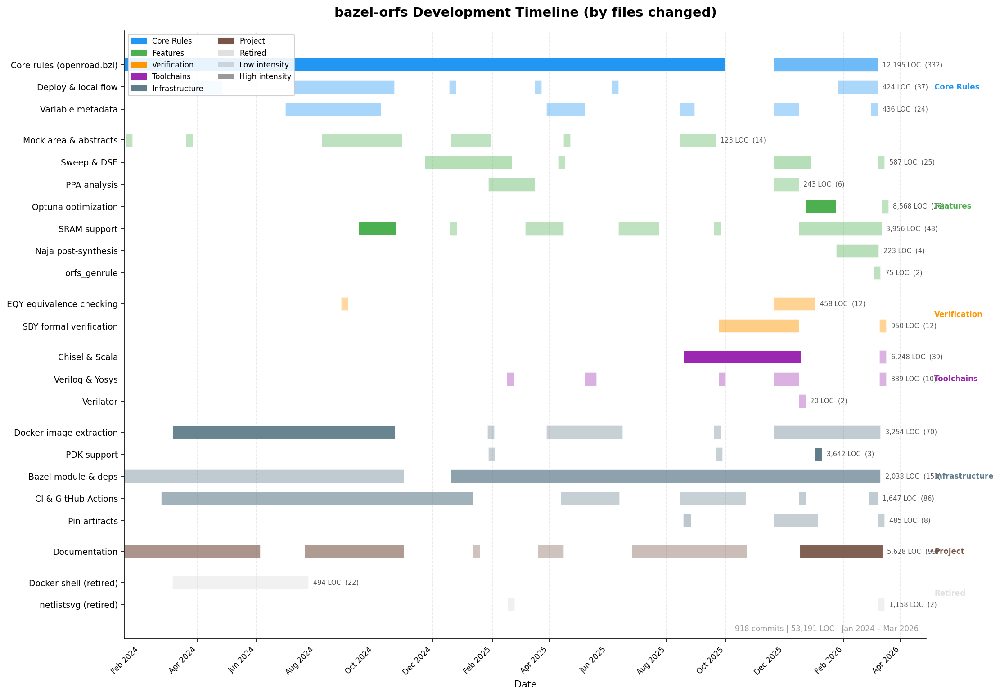

# History

Retired and deprecated features, and the development timeline.

Features removed from bazel-orfs. Check git history for the original implementation.

- **netlistsvg** — SVG schematic generation from Yosys JSON netlists. Removed
  along with all JavaScript dependencies (`aspect_rules_js`, `rules_nodejs`,
  `npm`, `pnpm`). See `netlistsvg.bzl`, `main.js` in git history.
- **optuna/** — Multi-objective Bayesian optimization (Optuna TPE) for hardware
  DSE with multi-fidelity (synth→place→grt) progressive refinement. Included a
  parameterized `mock-cpu.sv` test design. See `optuna/` in git history.
- **dse/** — Bazel-native DSE example using `string_flag` build settings with
  `orfs_flow(settings = {...})` to sweep utilization and density. The
  `settings` attribute and the `--define` variable-override channel were
  later removed as well: overriding ORFS variables from the Bazel command
  line invalidates every stage the variable touches, and the
  `orfs_arguments`/`extra_arguments` JSON overlay plus `orfs_run_executable`
  replaced it. See `dse/` in git history.
- **Sweep reports** — `orfs_sweep` emitted a `<name>_sweep.json` description
  of the sweep (via `write_binary.bzl`) for out-of-band WNS report scripts
  (`test/wns_report.py`, `test/sweep-wns.tcl`, `test/plot-retiming.py`).
  None of the scripts had BUILD targets; all removed together. See git
  history.
- **orfs_tuner proposal** — `ideas/optimization-function.md` sketched a rule
  emitting a Bazel-less tuner executable for a DSE engine. Superseded by
  `orfs_run_executable`, which already provides the standalone binary with
  `KEY=VALUE` variable overrides. See git history.

### Deprecated

- **yosys.bzl** — standalone Yosys rule. Still present but unused in CI.
  Superseded by the synthesis stage in `orfs_flow`.

## Feature history

Development timeline generated from `git --numstat` (actual files changed, not
just commit messages). Bar opacity reflects lines of code changed. Numbers show
total LOC changed and commit count per activity.

<!-- To regenerate: python docs/generate_gantt.py -o docs/gantt.png
     To update activities: edit docs/gantt_activities.yaml then regenerate -->
