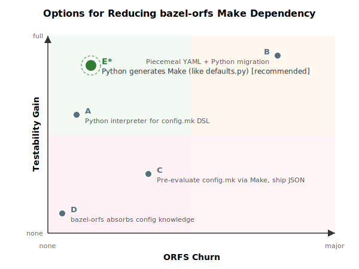
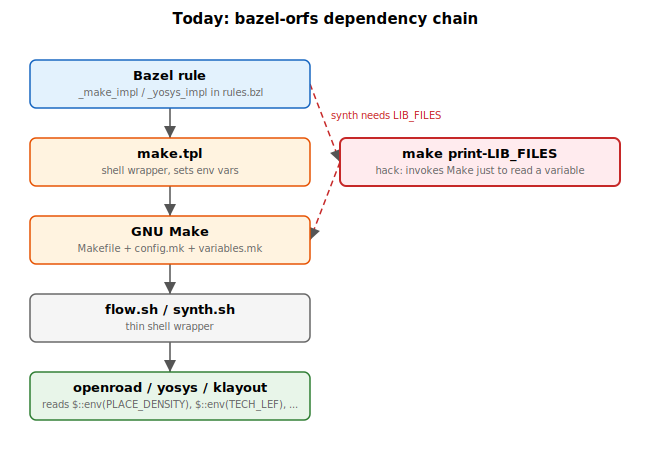
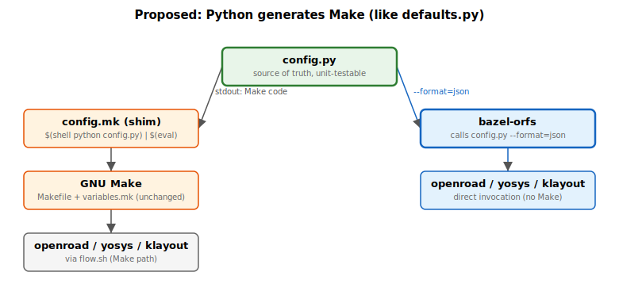

# Plan: Reducing bazel-orfs's Dependency on Make

> This plan was computer-generated by Claude from an exhaustive analysis
> of every config.mk, variables.mk, Makefile recipe, and TCL script in
> ORFS, plus the bazel-orfs rule implementations. The narrative section
> is written for humans. The appendices are data-heavy reference material
> for an AI code assistant to execute the implementation.

---



---

## 1. The Situation Today

bazel-orfs builds chip designs by running OpenROAD-flow-scripts (ORFS)
stages: synthesis, floorplan, placement, clock tree synthesis, routing,
and finishing. Each stage boils down to running a tool (OpenROAD, Yosys,
or KLayout) with a TCL script and ~155 environment variables.

Today the dependency chain looks like this:



The TCL scripts get their configuration entirely from environment
variables (`$::env(...)`). They never read config.mk. The entire purpose
of the Make layer is to evaluate config.mk files -- which use Make
syntax -- into a flat set of environment variables, and then exec the
tool.

bazel-orfs already does most of the work itself: it manages the stage
dependency graph, declares inputs/outputs, and writes a config.mk file
with the design's variables. But it still needs Make to evaluate the
platform's `config.mk` (which uses Make-specific syntax) and to run the
`do-<stage>` recipes. It even resorts to running `make print-LIB_FILES`
(rules.bzl:517) just to extract a single variable value from Make's
evaluation.

## 2. The Problem

**Make is untestable.** There is no way to write unit tests for
config.mk variable resolution. When asap7's config.mk uses
`$(foreach vt,$(OTHER_VT),$(eval ADDITIONAL_LEFS += ...))` to
dynamically generate library paths, there is no test that verifies the
output is correct. Bugs silently propagate to TCL scripts as wrong
environment variable values.

**Make creates a dependency inversion.** Bazel is the build system, but
it must shell out to a second build system (Make) for variable
evaluation. This means bazel-orfs can't use `ctx.actions.run()` (which
gives Bazel full visibility into the action for caching and remote
execution) -- it must use `ctx.actions.run_shell()` through Make.

**Make is a runtime dependency.** The Make binary must be present in the
Docker image and the Bazel sandbox. This complicates hermetic builds.

**Make's variable semantics are complex.** Platform config.mk files use
`?=` (conditional defaults), `+=` (append), `$(foreach)`/`$(eval)`
(meta-programming), `$(wildcard)` (globbing), `$(shell)` (subprocess
execution), `$($(CORNER)_LIB_FILES)` (variable indirection), and
various conditional blocks. These are essentially a DSL -- a
domain-specific language for platform configuration -- but expressed in
Make syntax where errors are silent and testing is impossible.

## 3. Possible Ways Forward

Several approaches could address the dependency inversion. They differ
in how much work happens in ORFS vs bazel-orfs, how much existing code
changes, and how quickly they deliver value.

**Important framing:** Make as a user interface to ORFS is not the
problem. For someone unfamiliar with ORFS, `make floorplan
DESIGN_CONFIG=...` has low cognitive load and is excellent for education
and quick exploration. The Make flow should be treated as a first-class
citizen, not deprecated. The problem is specifically that *bazel-orfs*
must invoke Make as an intermediary for variable evaluation and recipe
execution, when it could handle both directly.

### Option A: Python interpreter for the config.mk DSL

Treat the config.mk files as a domain-specific language and implement
a Python interpreter for the subset of Make they use. The interpreter
reads config.mk as-is and evaluates it into a flat dict. It lives in
ORFS alongside the existing files.

**Pros:** Config.mk files don't change at all. Make users unaffected.
Unit-testable. Gold tests verify Python matches Make.
**Cons:** Must implement enough Make semantics to cover all platforms
(see Section 5 -- the subset is bounded but non-trivial, especially
asap7's `$(foreach)/$(eval)`).

### Option B: Piecemeal migration to YAML + Python

Move data from config.mk into config.yaml files one variable group at
a time. A Python script generates Make assignments from YAML (for
backwards compat) and JSON (for bazel-orfs). The config.mk gradually
shrinks as data moves to YAML.

**Pros:** Cleaner end state. YAML is human-readable and obviously
testable. Migration is incremental.
**Cons:** More churn in ORFS. Dual source of truth during migration.
Requires ORFS maintainer buy-in for the YAML format.

### Option C: Pre-evaluate config.mk via Make, ship JSON

Add a Make target to ORFS that runs `make print-all-vars` and dumps the
result to JSON. Ship this JSON in the Docker image. bazel-orfs reads
JSON; Make users still use Make.

**Pros:** Zero changes to config.mk files. Simplest to implement.
**Cons:** Still depends on Make at image-build time. No unit tests for
the config itself. JSON can drift from config.mk if not regenerated.

### Option D: bazel-orfs absorbs config knowledge

Hardcode platform config values in Starlark (bazel-orfs side). Read
variables.yaml for defaults. Don't evaluate config.mk at all.

**Pros:** No ORFS changes needed. Fully hermetic.
**Cons:** bazel-orfs must mirror every config.mk change. Fragile.
Doesn't scale to new platforms. Violates DRY.

### Option E: Exploit Make's self-modifying nature -- move config.mk logic into Python piecemeal

This is the smoothest option. ORFS already has an existence proof:

**The defaults.py pattern.** `variables.yaml` stores variable metadata
in YAML. `defaults.py` reads it and prints `export VAR?=value` lines.
`variables.mk` calls `$(shell python defaults.py)` and `$(eval)`s the
result back into Make. Make literally modifies itself by executing
Python and injecting the output as Make code:

```makefile
# variables.mk line 44 -- Make calls Python, evals the output as Make assignments
$(foreach line,$(shell $(PYTHON_EXE) $(SCRIPTS_DIR)/defaults.py),\
  $(eval export $(subst __SPACE__, ,$(line))))
```

The same pattern can be applied to platform config.mk files. Instead of
writing Make syntax directly, move the variable computation into a
Python script that:

1. Reads data from a YAML/JSON file (or hardcoded Python dicts)
2. Computes the values (VT variants, corner selection, path expansion)
3. Prints `export VAR=value` or `export VAR?=value` lines
4. Make `$(eval)`s the output, exactly like it does with defaults.py

The key is that **Python generates Make language**. Make remains in
control -- it calls Python and evals the result as Make code. This is
not Python replacing Make; it's Make delegating computation to Python,
which is exactly what `variables.mk` already does:



Two consumers, one source of truth. Make generates its own code from
Python output (proven pattern). bazel-orfs calls the same Python
directly for JSON (new capability).

**How it works in practice for nangate45** (simplest case):

The current `config.mk` has ~40 variables, almost all pure data.
Create `config.py` alongside it:

```python
#!/usr/bin/env python3
"""Platform config for nangate45.

Generates Make variable assignments (same semantics as config.mk).
Also usable directly as a Python module: get_config() returns a dict.
"""
import glob
import os

def get_config(platform_dir=None):
    if platform_dir is None:
        platform_dir = os.environ.get(
            "PLATFORM_DIR", os.path.dirname(__file__)
        )

    # Hard overrides (= in Make: always set, design can't override)
    config = {}
    config["PROCESS"] = "45"
    config["TECH_LEF"] = f"{platform_dir}/lef/NangateOpenCellLibrary.tech.lef"
    config["SC_LEF"] = f"{platform_dir}/lef/NangateOpenCellLibrary.macro.mod.lef"
    config["PLACE_SITE"] = "FreePDK45_38x28_10R_NP_162NW_34O"
    config["TIEHI_CELL_AND_PORT"] = "LOGIC1_X1 Z"
    config["TIELO_CELL_AND_PORT"] = "LOGIC0_X1 Z"
    # ... all = assignments from config.mk

    # GDS_FILES needs globbing (replaces Make's $(sort $(wildcard ...)))
    gds = sorted(glob.glob(f"{platform_dir}/gds/*.gds"))
    config["GDS_FILES"] = " ".join(gds)

    # Defaults (?= in Make: design config.mk can override these)
    defaults = {}
    defaults["FILL_CELLS"] = "FILLCELL_X1 FILLCELL_X2 FILLCELL_X4 ..."
    defaults["PLACE_DENSITY"] = "0.30"
    defaults["IO_PLACER_H"] = "metal5"
    defaults["IO_PLACER_V"] = "metal6"
    defaults["PDN_TCL"] = f"{platform_dir}/grid_strategy-M1-M4-M7.tcl"
    # ... all ?= assignments from config.mk

    return config, defaults

def print_make():
    """Print Make-compatible output (same format as defaults.py)."""
    config, defaults = get_config()
    for k, v in sorted(config.items()):
        # = semantics: unconditional assignment
        print(f"export__{k}={str(v).replace(' ', '__SPACE__')}")
    for k, v in sorted(defaults.items()):
        # ?= semantics: only set if not already defined
        print(f"export__{k}?={str(v).replace(' ', '__SPACE__')}")

if __name__ == "__main__":
    import sys
    if "--format=json" in sys.argv:
        import json
        config, defaults = get_config()
        # For JSON consumers, merge (defaults first, config wins)
        json.dump(defaults | config, sys.stdout, indent=2)
    else:
        print_make()
```

The config.mk becomes a one-liner shim that calls Python and evals
the output as Make code -- the exact same mechanism as `variables.mk`
line 44:

```makefile
# platforms/nangate45/config.mk
# Python generates Make code; Make evals it. Same pattern as defaults.py.
$(foreach line,$(shell $(PYTHON_EXE) $(PLATFORM_DIR)/config.py),\
  $(eval $(subst __SPACE__, ,$(subst export__, export ,$(line)))))
```

Note: the `export__` prefix and `__SPACE__` substitution follow the
same workaround conventions as defaults.py. The `$(foreach)` splits on
whitespace, so spaces in values must be escaped.

Or, for a gentler transition, keep the existing config.mk and add
config.py alongside it. A CI test verifies they produce the same
variables. Migrate one platform at a time. The config.mk shim
replacement happens whenever people are comfortable.

**Why this is the smoothest path:**

- Uses a pattern ORFS already uses and trusts (defaults.py)
- config.py is unit-testable with pytest
- bazel-orfs can call config.py directly (no Make needed) and get JSON
- Make users see zero change in behavior -- Make still works, it just
  delegates computation to Python internally
- Migration is truly piecemeal: move one variable group, one platform
  at a time; config.mk can mix Python-generated and hand-written Make
  lines during the transition
- The `__SPACE__` hack already exists and is understood

**On the cost of rewriting config.mk to config.py:** The rewrite is
mechanical -- each config.mk is 100-220 lines of variable assignments.
As long as Make users experience zero cognitive load change (config.mk
still works, `make floorplan` still works, `make print-VAR` still
works), the rewrite in ORFS is not problematic. With Claude, converting
a platform's config.mk to an equivalent config.py with unit tests is a
single-session task, not a multi-day effort. The bottleneck is review
and CI validation, not writing the code.

**For asap7** (hardest case), the VT variant generation that today uses
`$(foreach)/$(eval)` becomes a Python for-loop -- cleaner, testable,
and identical output:

```python
for vt_type in other_vt:
    tag = vt_type.replace("VT", "")
    config[f"ADDITIONAL_LEFS"] += f" {platform_dir}/lef/asap7sc7p5t_28_{tag}_1x_220121a.lef"
    config[f"BC_NLDM_DFF_LIB_FILE"] += f" {lib_dir}/asap7sc7p5t_SEQ_{tag}VT_FF_nldm_220123.lib"
    # ... etc
```

**Pros:** Uses proven ORFS pattern. Truly piecemeal. Unit-testable.
Zero breaking changes. bazel-orfs can call config.py directly for JSON.
**Cons:** Two representations during transition (config.mk + config.py).
The `__SPACE__` hack is inherited. `$(eval)` output must exactly match
what config.mk would have produced.

### Recommended: Option E

Option E is the most attractive because it:

- Exploits a pattern ORFS already uses (not inventing anything new)
- Requires no new Make syntax or features
- Lets each platform migrate at its own pace
- Gives immediate value: config.py is testable from day one
- bazel-orfs benefits immediately: call config.py, get JSON, skip Make
- Is the lowest-risk path to the same end state as Options A or B

## 4. What Happens If We Do / Don't

### If We Do This (Option E)

- Platform configurations become unit-testable (bugs caught before they
  reach TCL scripts)
- bazel-orfs can call config.py directly for a JSON dict -- no Make
  binary needed
- bazel-orfs can use `ctx.actions.run()` for better caching and remote
  execution
- The `make print-LIB_FILES` hack in bazel-orfs goes away (still a
  useful feature for Make users debugging their configs)
- Future config changes are validated by pytest before they reach Make
- The ORFS Make flow works exactly as before -- Make calls Python
  internally, just like it already does with defaults.py

### If We Don't

- bazel-orfs continues depending on Make, which constrains its
  architecture
- Platform config bugs remain undetectable until they cause bad silicon
  or failed runs
- Remote execution and caching remain limited by `run_shell()`
- Every ORFS update that changes config.mk syntax risks breaking
  bazel-orfs
- The `make print-LIB_FILES` pattern proliferates as bazel-orfs needs
  more variable values

---

## 5. What config.mk Files Actually Do (The Make Subset)

An exhaustive analysis of all 6 public platform config.mk files reveals
what computation config.py must replicate for each platform. This is the
reference for anyone writing config.py files -- it catalogs every Make
construct used and what it accomplishes.

### Required Constructs

| Construct | Used By | Count | Example |
|-----------|---------|-------|---------|
| `export VAR = val` | All 6 | ~100+ | `export PLATFORM = asap7` |
| `export VAR ?= val` | All 6 | ~90 | `export PLACE_DENSITY ?= 0.77` |
| `VAR += val` | 5/6 | ~10 | `export DONT_USE_CELLS += ICG*` |
| `ifeq (a,b)` / `ifneq` / `else` / `endif` | 5/6 | ~15 | `ifeq ($(BLOCKS),)` |
| `$(VARNAME)` expansion | All 6 | Everywhere | `$(PLATFORM_DIR)/lef/...` |
| `$($(VAR))` indirection | asap7, gf180 | ~8 | `$($(CORNER)_LIB_FILES)` |
| `$(wildcard pat)` | 4/6 | ~5 | `$(wildcard $(PLATFORM_DIR)/gds/*.gds)` |
| `$(sort list)` | nangate45 | 1 | `$(sort $(wildcard ...))` |
| `$(strip text)` | asap7, ihp | ~4 | `$(strip $(ASAP7_USE_VT))` |
| `$(subst f,t,s)` | asap7 | ~7 | `$(subst PLACEHOLDER,$(VT),...)` |
| `$(patsubst p,r,t)` | asap7 | 2 | `$(patsubst %VT,%,$(PRIMARY_VT))` |
| `$(word n,list)` | asap7 | 1 | `$(word 1,$(VT_LIST))` |
| `$(wordlist s,e,l)` | asap7 | 1 | `$(wordlist 2,$(words ...),...)` |
| `$(words list)` | asap7 | 1 | `$(words $(VT_LIST))` |
| `$(addsuffix s,l)` | asap7 | 2 | `$(addsuffix $(VT_TAG),$(CELLS))` |
| `$(if c,t,e)` | asap7 | 1 | `$(if $(strip $(USE_VT)),...)` |
| `$(foreach v,l,b)` | asap7 | 1 block | `$(foreach vt,$(OTHER_VT),...)` |
| `$(eval expr)` | asap7 | Inside foreach | `$(eval VAR += ...)` |
| `$(shell cmd)` | ihp-sg13g2 | 1 | `$(shell sed ... $(SDC_FILE))` |
| `$(origin VAR)` | ihp-sg13g2 | 1 | `ifeq ($(origin VAR),undefined)` |
| `$(abspath p)` / `$(realpath p)` | gf180, asap7 | ~6 | `$(abspath $(PLATFORM_DIR)/...)` |
| `-include file` | gf180 | 1 | `-include $(DIR)/private.mk` |
| Backslash continuation | All 6 | Common | `export VAR = foo \` (newline) `bar` |

### NOT Required

The interpreter does NOT need: targets, recipes, `$@`/`$<`/`$*`
automatic variables, pattern rules, `.PHONY`, `define`/`endef` macros,
`$(MAKE)`, `$(MAKEFILE_LIST)`, `$(call ...)`, `VPATH`, order-only
prerequisites, or any recipe-execution features. These are used in the
Makefile and variables.mk but not in the config.mk files that define
platform/design configuration.

### config.py Template (Following the defaults.py Pattern)

Each platform's config.py follows the same structure as defaults.py:
read data, compute values, print `export VAR = value` lines. The
`--format=json` flag lets bazel-orfs get a dict instead.

```python
#!/usr/bin/env python3
"""Platform configuration for nangate45.

Generates the same variable assignments as config.mk.
Called by Make via $(shell) or by bazel-orfs for JSON output.

Usage:
  python config.py                    # Make-compatible output
  python config.py --format=json      # JSON dict for bazel-orfs
"""
import argparse, glob, json, os, sys

def get_config(platform_dir=None, overrides=None):
    if platform_dir is None:
        platform_dir = os.path.dirname(os.path.abspath(__file__))
    overrides = overrides or {}

    config = {}
    # --- Pure data (same as config.mk lines 1-109) ---
    config["PROCESS"] = "45"
    config["TECH_LEF"] = f"{platform_dir}/lef/NangateOpenCellLibrary.tech.lef"
    config["SC_LEF"] = f"{platform_dir}/lef/NangateOpenCellLibrary.macro.mod.lef"
    config["PLACE_SITE"] = "FreePDK45_38x28_10R_NP_162NW_34O"
    config["PLACE_DENSITY"] = overrides.get("PLACE_DENSITY", "0.30")
    # ... all other variables ...

    # --- Computation (replaces Make's $(sort $(wildcard ...))) ---
    gds = sorted(glob.glob(f"{platform_dir}/gds/*.gds"))
    additional = overrides.get("ADDITIONAL_GDS", "")
    config["GDS_FILES"] = " ".join(gds) + (" " + additional if additional else "")

    config.update(overrides)  # command-line overrides win
    return config

def main():
    parser = argparse.ArgumentParser()
    parser.add_argument("--format", choices=["make", "json"], default="make")
    parser.add_argument("--platform-dir", default=None)
    args = parser.parse_args()

    config = get_config(platform_dir=args.platform_dir)

    if args.format == "json":
        json.dump(config, sys.stdout, indent=2)
    else:
        for k, v in sorted(config.items()):
            # __SPACE__ workaround matches defaults.py convention
            print(f"export {k}={str(v).replace(' ', '__SPACE__')}")

if __name__ == "__main__":
    main()
```

### Test Strategy

```python
def test_nangate45_matches_make():
    """Gold test: config.py output matches Make's config.mk evaluation."""
    from platforms.nangate45.config import get_config
    python_vars = get_config(platform_dir="/path/to/nangate45")

    # Run Make and capture its variable values
    make_vars = run_make_print_all_vars("nangate45")  # subprocess

    for key in make_vars:
        assert python_vars.get(key) == make_vars[key], \
            f"{key}: python={python_vars.get(key)!r} make={make_vars[key]!r}"
```

This gold-test approach means we don't need to manually verify
correctness -- we verify against Make itself. As we gain confidence, the
Python path becomes the primary one and config.mk becomes a shim.

---

## 6. Implementation Phases (Option E)

### Phase 0: First platform config.py (ORFS PR, additive)

- Add `platforms/nangate45/config.py` alongside the existing config.mk
- config.py outputs `export VAR = value` lines, same as defaults.py
- Add `--format=json` flag so config.py can also emit JSON
- Add pytest: call config.py, call `make print-<var>`, assert equal
- **config.mk is unchanged** -- config.py is purely additive
- Migration order by complexity (see Appendix C):
  1. nangate45, sky130hs (trivial)
  2. sky130hd (slightly more)
  3. gf180 (corner indirection, conditional PLACE_SITE)
  4. ihp-sg13g2 (SDC parsing, conditional includes)
  5. asap7 (VT variant generation)

### Phase 1: Replace config.mk with shim (ORFS PR, per platform)

Once config.py is validated by CI, replace config.mk content with the
one-liner shim that calls config.py (same pattern as defaults.py):

```makefile
$(foreach line,$(shell $(PYTHON_EXE) $(PLATFORM_DIR)/config.py),\
  $(eval export $(subst __SPACE__, ,$(line))))
```

Make users see identical behavior. This is done one platform at a time.

### Phase 2: bazel-orfs calls config.py for JSON (bazel-orfs PR)

- At repository-rule time, run `config.py --format=json` for each
  platform and generate `config.json`
- Add `PdkInfo.config_json` provider
- New environment builder reads JSON instead of including config.mk
- Behind flag: `--@orfs//:use_make=False`
- CI runs both paths and diffs stage outputs

### Phase 3: bazel-orfs invokes tools directly (bazel-orfs PR)

- Replace `make --file Makefile do-<stage>` with direct invocation
  (see Appendix D for exact commands per stage)
- Remove `make.tpl`, `_make` attribute, `_makefile` attributes
- Remove the `make print-LIB_FILES` workaround in `_yosys_impl`

### Phase 4: Default flip and cleanup (bazel-orfs PR)

- Flip `use_make` default to `False`
- Remove Make invocation code from bazel-orfs (the ORFS Make flow
  itself is unaffected and remains a first-class way to use ORFS)

---

## 7. Risk Analysis

| Risk | Likelihood | Impact | Mitigation |
|------|-----------|--------|------------|
| Interpreter misses an edge case | Medium | Medium | Gold tests against Make catch any divergence |
| ORFS adds new Make syntax to config.mk | Low | Low | CI gold tests fail immediately; add to interpreter |
| ORFS maintainers resist the addition | Low | High | Zero changes to existing files; Python tests are clear value-add |
| Backwards compatibility breaks | Very Low | Very High | config.mk files are unchanged; Make flow untouched for years |
| asap7 foreach/eval is too complex | Low | Medium | This is the most complex case and is well-bounded; 14 lines of Make |
| Performance of Python interpreter | Very Low | Low | Config files are <250 lines; evaluation is instant |

---

## Appendix A: How ORFS Variables Flow to TCL Scripts

### Evaluation Order

1. Design's `config.mk` is included (Makefile:89)
2. Platform's `config.mk` is included (variables.mk:40)
3. `defaults.py` reads `variables.yaml` and emits `export VAR?=value` (variables.mk:44)
4. Derived paths: `LOG_DIR`, `RESULTS_DIR`, etc. (variables.mk:46-49)
5. Tool discovery: `OPENROAD_EXE`, `YOSYS_EXE`, etc. (variables.mk:89-129)
6. All exported variables become environment for child processes

### Key Insight

TCL scripts read `$::env(VARNAME)` exclusively -- 155 unique variables
across ~30 scripts. No TCL script sources config.mk. The Python
interpreter only needs to produce the same dict that Make would export.

### The defaults.py Precedent

ORFS already bridges Python and Make. `defaults.py` reads
`variables.yaml` and outputs Make syntax. `variables.mk:44` consumes it
via a fragile `$(foreach)/$(eval)/$(subst __SPACE__)` hack:

```makefile
$(foreach line,$(shell $(PYTHON_EXE) $(SCRIPTS_DIR)/defaults.py),\
  $(eval export $(subst __SPACE__, ,$(line))))
```

The `__SPACE__` workaround exists because Make's `$(foreach)` can't
handle spaces. This fragility is exactly what we're eliminating.

---

## Appendix B: TCL Environment Variable Inventory

155 unique variables consumed via `$::env(...)` across all TCL scripts.
Organized by script. No TCL script reads config.mk directly.

**load.tcl:** `SCRIPTS_DIR`, `TECH_LEF`, `SC_LEF`, `ADDITIONAL_LEFS`,
`RESULTS_DIR`, `DESIGN_NAME`, `PLATFORM_TCL`, `PLATFORM_DIR`,
`LAYER_PARASITICS_FILE`, `LIB_FILES`, `REMOVE_CELLS_FOR_EQY`,
`OBJECTS_DIR`, `LOG_DIR`, `NUM_CORES`

**synth_preamble.tcl:** `DESIGN_NAME`, `RESULTS_DIR`, `REPORTS_DIR`,
`OBJECTS_DIR`, `SCRIPTS_DIR`, `SYNTH_HDL_FRONTEND`,
`SYNTH_NETLIST_FILES`, `VERILOG_FILES`, `VERILOG_INCLUDE_DIRS`,
`VERILOG_DEFINES`, `SDC_FILE`, `SDC_FILE_CLOCK_PERIOD`, `LIB_FILES`,
`DONT_USE_CELLS`, `CLKGATE_MAP_FILE`, `DFF_MAP_FILE`,
`ADDER_MAP_FILE`, `LATCH_MAP_FILE`, `ABC_AREA`, `ABC_DRIVER_CELL`,
`ABC_LOAD_IN_FF`, `SYNTH_BLACKBOXES`, `SYNTH_SLANG_ARGS`,
`CACHED_REPORTS`

**synth.tcl:** `SCRIPTS_DIR`, `DESIGN_NAME`, `RESULTS_DIR`,
`REPORTS_DIR`, `SYNTH_HIERARCHICAL`, `SYNTH_OPERATIONS_ARGS`,
`FLOW_HOME`, `SYNTH_MINIMUM_KEEP_SIZE`, `SYNTH_MOCK_LARGE_MEMORIES`,
`SYNTH_MEMORY_MAX_BITS`, `PYTHON_EXE`, `SYNTH_KEEP_MOCKED_MEMORIES`,
`SYNTH_RETIME_MODULES`, `SYNTH_WRAPPED_OPERATORS`,
`SWAP_ARITH_OPERATORS`, `SYNTH_GUT`, `SYNTH_KEEP_MODULES`,
`SYNTH_HIER_SEPARATOR`, `SYNTH_INSBUF`, `DFF_LIB_FILE`,
`TIELO_CELL_AND_PORT`, `TIEHI_CELL_AND_PORT`

**floorplan.tcl:** `DIE_AREA`, `CORE_AREA`, `CORE_UTILIZATION`,
`CORE_ASPECT_RATIO`, `CORE_MARGIN`, `PLACE_SITE`, `ADDITIONAL_SITES`,
`FLOORPLAN_DEF`, `FOOTPRINT`, `SIG_MAP_FILE`, `MAKE_TRACKS`,
`PLATFORM_DIR`, `FASTROUTE_TCL`, `MIN_ROUTING_LAYER`,
`MAX_ROUTING_LAYER`, `ROUTING_LAYER_ADJUSTMENT`,
`SKIP_REPAIR_TIE_FANOUT`, `TIELO_CELL_AND_PORT`,
`TIEHI_CELL_AND_PORT`, `TIE_SEPARATION`, `REMOVE_ABC_BUFFERS`,
`FOOTPRINT_TCL`, `SCRIPTS_DIR`, `RESULTS_DIR`

**global_place.tcl:** `SCRIPTS_DIR`, `DONT_USE_CELLS`,
`GPL_TIMING_DRIVEN`, `FOOTPRINT`, `DONT_BUFFER_PORTS`,
`BUFFER_PORTS_ARGS`, `GPL_KEEP_OVERFLOW`, `MIN_PLACE_STEP_COEF`,
`MAX_PLACE_STEP_COEF`, `CELL_PAD_IN_SITES_GLOBAL_PLACEMENT`,
`CLUSTER_FLOPS`, `RESULTS_DIR`

**macro_place_util.tcl:** `OBJECTS_DIR`, `RTLMP_RPT_DIR`,
`RTLMP_RPT_FILE`, `RTLMP_BLOCKAGE_FILE`, `MACRO_WRAPPERS`,
`MACRO_PLACE_HALO`, `MACRO_BLOCKAGE_HALO`, `MACRO_PLACEMENT_TCL`,
`RTLMP_MAX_LEVEL`, `RTLMP_MAX_INST`, `RTLMP_MIN_INST`,
`RTLMP_MAX_MACRO`, `RTLMP_MIN_MACRO`, `RTLMP_MIN_AR`,
`RTLMP_AREA_WT`, `RTLMP_WIRELENGTH_WT`, `RTLMP_OUTLINE_WT`,
`RTLMP_BOUNDARY_WT`, `RTLMP_NOTCH_WT`, `RTLMP_FENCE_LX`,
`RTLMP_FENCE_LY`, `RTLMP_FENCE_UX`, `RTLMP_FENCE_UY`,
`RTLMP_ARGS`, `SCRIPTS_DIR`

**detail_place.tcl:** `SCRIPTS_DIR`, `PLATFORM_DIR`, `BALANCE_ROWS`,
`CELL_PAD_IN_SITES_DETAIL_PLACEMENT`, `DETAIL_PLACEMENT_ARGS`,
`ENABLE_DPO`, `DPO_MAX_DISPLACEMENT`, `RESULTS_DIR`

**resize.tcl:** `SCRIPTS_DIR`, `DONT_USE_CELLS`,
`EARLY_SIZING_CAP_RATIO`, `SWAP_ARITH_OPERATORS`, `RESULTS_DIR`

**cts.tcl:** `SCRIPTS_DIR`, `DONT_USE_CELLS`, `CTS_BUF_DISTANCE`,
`CTS_CLUSTER_SIZE`, `CTS_CLUSTER_DIAMETER`, `CTS_BUF_LIST`,
`CTS_LIB_NAME`, `CTS_ARGS`, `DETAILED_METRICS`, `CTS_SNAPSHOTS`,
`SKIP_CTS_REPAIR_TIMING`, `EQUIVALENCE_CHECK`, `LEC_CHECK`,
`RESULTS_DIR`

**global_route.tcl:** `SCRIPTS_DIR`, `GLOBAL_ROUTE_ARGS`,
`ENABLE_RESISTANCE_AWARE`, `dbProcessNode`, `VIA_IN_PIN_MIN_LAYER`,
`VIA_IN_PIN_MAX_LAYER`, `CELL_PAD_IN_SITES_DETAIL_PLACEMENT`,
`DONT_USE_CELLS`, `SKIP_INCREMENTAL_REPAIR`, `DETAILED_METRICS`,
`SKIP_ANTENNA_REPAIR`, `MAX_REPAIR_ANTENNAS_ITER_GRT`,
`GENERATE_ARTIFACTS_ON_FAILURE`, `REPORTS_DIR`, `RESULTS_DIR`

**detail_route.tcl:** `SCRIPTS_DIR`, `SKIP_DETAILED_ROUTE`,
`dbProcessNode`, `OR_SEED`, `OR_K`, `VIA_IN_PIN_MIN_LAYER`,
`VIA_IN_PIN_MAX_LAYER`, `DISABLE_VIA_GEN`, `REPAIR_PDN_VIA_LAYER`,
`DETAILED_ROUTE_END_ITERATION`, `DETAILED_ROUTE_ARGS`, `REPORTS_DIR`,
`RESULTS_DIR`, `SKIP_ANTENNA_REPAIR_POST_DRT`,
`MAX_REPAIR_ANTENNAS_ITER_DRT`

**fillcell.tcl:** `SCRIPTS_DIR`, `FILL_CELLS`, `RESULTS_DIR`

**density_fill.tcl:** `SCRIPTS_DIR`, `USE_FILL`, `FILL_CONFIG`,
`RESULTS_DIR`

**pdn.tcl:** `SCRIPTS_DIR`, `PDN_TCL`, `RESULTS_DIR`

**tapcell.tcl:** `SCRIPTS_DIR`, `TAPCELL_TCL`, `RESULTS_DIR`

**final_report.tcl:** `SCRIPTS_DIR`, `DESIGN_NAME`,
`SKIP_DETAILED_ROUTE`, `GND_NETS_VOLTAGES`, `PWR_NETS_VOLTAGES`,
`RCX_RULES`, `REPORTS_DIR`, `RESULTS_DIR`

**klayout.tcl:** `FILL_CONFIG`, `SEAL_GDS`, `DESIGN_NAME`,
`RESULTS_DIR`, `GDSOAS_FILES`, `WRAPPED_GDSOAS`,
`STREAM_SYSTEM_EXT`, `OBJECTS_DIR`, `UTILS_DIR`

**util.tcl:** `SCRIPTS_DIR`, `KEEP_VARS`, `PLATFORM_DIR`,
`RESULTS_DIR`, `REPORTS_DIR`, `CELL_PAD_IN_SITES_GLOBAL_PLACEMENT`,
`PLACE_DENSITY_LB_ADDON`, `PLACE_DENSITY`, `OPENROAD_HIERARCHICAL`,
`WRITE_ODB_AND_SDC_EACH_STAGE`, `RECOVER_POWER`

**report_metrics.tcl:** `CORNERS`, `REPORT_CLOCK_SKEW`,
`SKIP_REPORT_METRICS`, `REPORTS_DIR`

**open.tcl:** `ADDITIONAL_LEFS`, `RESULTS_DIR`, `PLATFORM_DIR`,
`DESIGN_NAME`, `ODB_FILE`, `DEF_FILE`, `V_FILE`, `DESIGN_NICKNAME`,
`GUI_TIMING`, `TECH_LEF`, `SC_LEF`, `SDC_FILE`,
`LAYER_PARASITICS_FILE`, `PLATFORM`, `SCRIPTS_DIR`, `FLOW_VARIANT`

**generate_abstract.tcl:** `SCRIPTS_DIR`, `DESIGN_NAME`, `RESULTS_DIR`,
`ABSTRACT_SOURCE`, `CDL_FILES`, `CORNERS`

**save_images.tcl:** `SCRIPTS_DIR`, `IR_DROP_LAYER`, `REPORTS_DIR`

---

## Appendix C: Platform Config Complexity

Migration order for the interpreter (simplest first):

### Tier 1: Trivial (nangate45, sky130hs)

**nangate45** (~109 lines): Almost pure key-value. One `$(sort
$(wildcard ...))` for GDS_FILES. No conditionals.

**sky130hs** (~108 lines): Same as nangate45. `$(wildcard ...)` for
GDS_FILES, `$(PLATFORM)` in a few paths, `+=` for DONT_USE_CELLS.

### Tier 2: Simple (sky130hd)

**sky130hd** (~154 lines): Same features as sky130hs with more
DONT_USE_CELLS entries. `$(PLATFORM)` in KLayout paths.

### Tier 3: Medium (gf180, ihp-sg13g2)

**gf180** (~149 lines): Adds `$(abspath)`, conditional PLACE_SITE
(`ifeq ($(TRACK_OPTION),9t)`), corner-based variable indirection
(`$($(CORNER)_LIB_FILES)`), and `-include private.mk`.

**ihp-sg13g2** (~182 lines): Adds `$(shell sed ...)` for SDC clock
period extraction, `$(origin ...)` for existence check, conditional
file inclusion based on `FOOTPRINT_TCL`, and `??=` (non-standard).

### Tier 4: Complex (asap7)

**asap7** (~217 lines): All of the above plus `$(foreach)/$(eval)` for
VT variant generation (14 lines of metaprogramming), `$(subst
PLACEHOLDER,...)` template expansion, `$(word)`/`$(wordlist)` for list
slicing, `$(addsuffix)`, and `$(if)`.

---

## Appendix D: Stage-to-Script Mapping

What each `do-<stage>` target actually executes. This is what bazel-orfs
needs to replicate when invoking tools directly (Phase 3).

### OpenROAD Stages

Each runs via `flow.sh`:
```bash
mkdir -p $RESULTS_DIR $LOG_DIR $REPORTS_DIR $OBJECTS_DIR
$OPENROAD_EXE $OPENROAD_ARGS -exit -no_splash $SCRIPTS_DIR/<script>.tcl \
  -metrics $LOG_DIR/<step>.json 2>&1 | tee $LOG_DIR/<step>.log
$PYTHON_EXE $UTILS_DIR/genElapsedTime.py --match <step> -d $LOG_DIR
```

| Step | TCL Script | Dependencies |
|------|-----------|--------------|
| 1_synth | synth_odb.tcl | 1_2_yosys.v, 1_2_yosys.sdc |
| 2_1_floorplan | floorplan.tcl | 1_synth.odb, LEFs, LIBs |
| 2_2_floorplan_macro | macro_place.tcl | 2_1_floorplan.odb |
| 2_3_floorplan_tapcell | tapcell.tcl | 2_2_floorplan_macro.odb |
| 2_4_floorplan_pdn | pdn.tcl | 2_3_floorplan_tapcell.odb |
| 3_1_place_gp_skip_io | global_place_skip_io.tcl | 2_floorplan.odb |
| 3_2_place_iop | io_placement.tcl | 3_1_place_gp_skip_io.odb |
| 3_3_place_gp | global_place.tcl | 3_2_place_iop.odb |
| 3_4_place_resized | resize.tcl | 3_3_place_gp.odb |
| 3_5_place_dp | detail_place.tcl | 3_4_place_resized.odb |
| 3_6_place_repair_timing | repair_timing_post_place.tcl | 3_5_place_dp.odb |
| 4_1_cts | cts.tcl | 3_place.odb |
| 5_1_grt | global_route.tcl | 4_cts.odb |
| 5_2_route | detail_route.tcl | 5_1_grt.odb |
| 5_3_fillcell | fillcell.tcl | 5_2_route.odb |
| 6_1_fill | density_fill.tcl | 5_route.odb |
| 6_report | final_report.tcl | 6_1_fill.odb (outputs .log) |

### Copy Steps

| Target | Source |
|--------|--------|
| 2_floorplan.odb | 2_4_floorplan_pdn.odb |
| 2_floorplan.sdc | 2_1_floorplan.sdc |
| 3_place.odb | 3_5_place_dp.odb |
| 3_place.sdc | 2_floorplan.sdc |
| 4_cts.odb | 4_1_cts.odb |
| 5_route.odb | 5_3_fillcell.odb |
| 5_route.sdc | 5_1_grt.sdc |
| 6_1_fill.sdc | 5_route.sdc |
| 6_final.sdc | 5_route.sdc |

### Yosys Stage

```bash
$YOSYS_EXE $YOSYS_FLAGS -c $SYNTH_SCRIPT 2>&1 | tee $LOG_DIR/1_2_yosys.log
cp $SDC_FILE $RESULTS_DIR/1_2_yosys.sdc
```

### KLayout/GDS Stage

```bash
$KLAYOUT_CMD -zz \
  -rd design_name=$DESIGN_NAME \
  -rd in_def=$RESULTS_DIR/6_final.def \
  -rd in_files="$GDSOAS_FILES $WRAPPED_GDSOAS" \
  -rd seal_file="$SEAL_GDSOAS" \
  -rd out_file=$GDS_MERGED_FILE \
  -rd tech_file=$OBJECTS_DIR/klayout.lyt \
  -rd layer_map=$GDS_LAYER_MAP \
  -r $UTILS_DIR/def2stream.py
```

### generate_abstract

```bash
$OPENROAD_CMD $SCRIPTS_DIR/generate_abstract.tcl \
  -metrics $LOG_DIR/generate_abstract.json
```
(Not via flow.sh -- invoked directly.)
