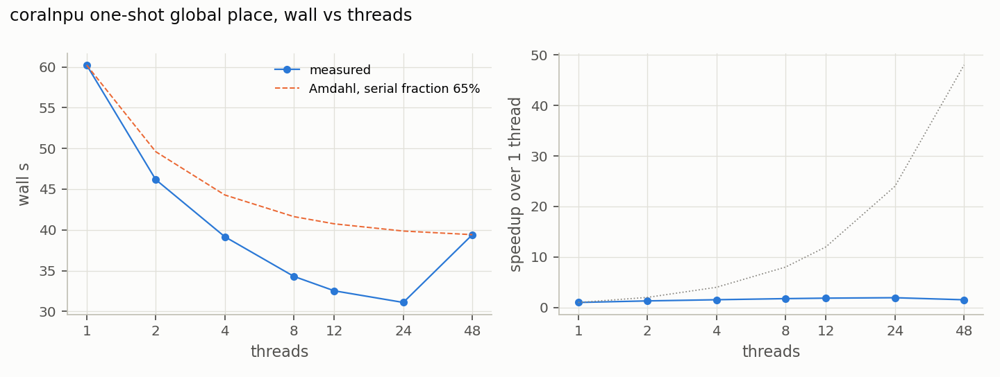
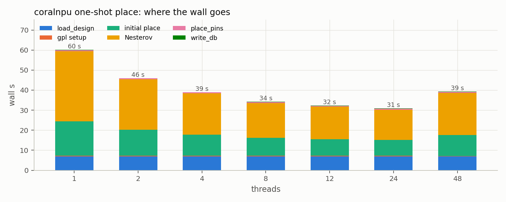
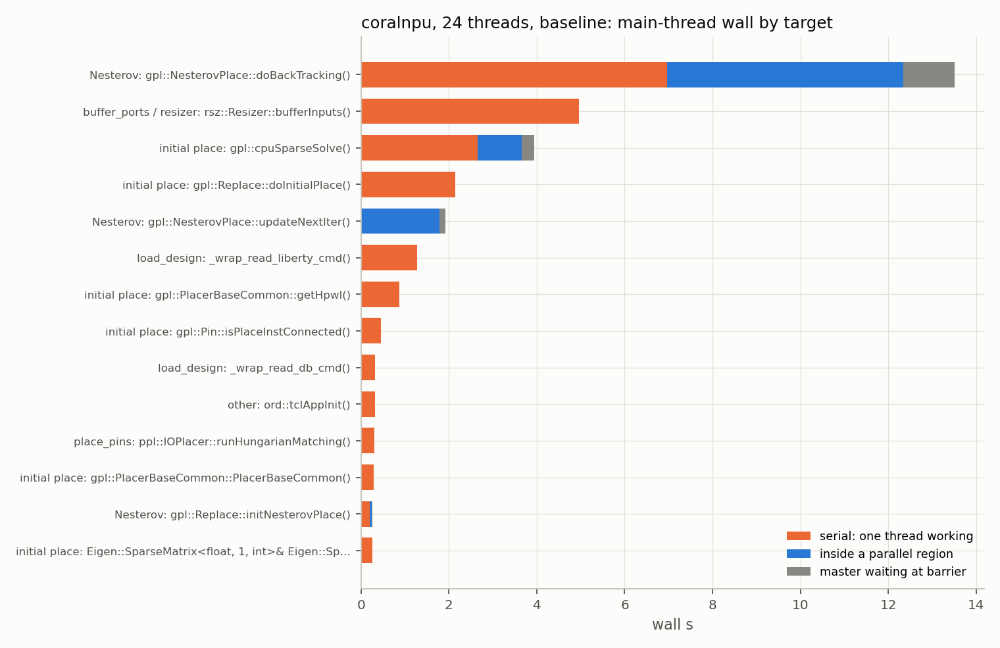
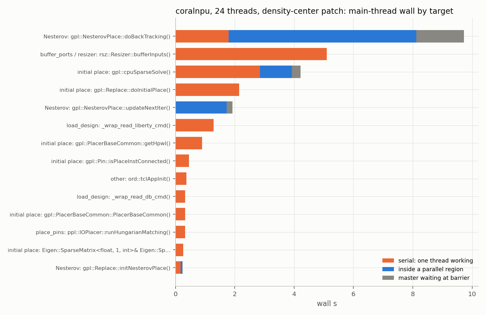
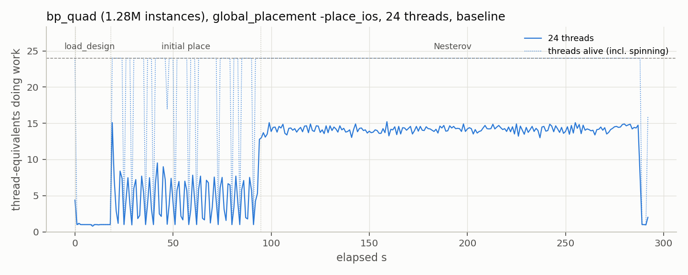
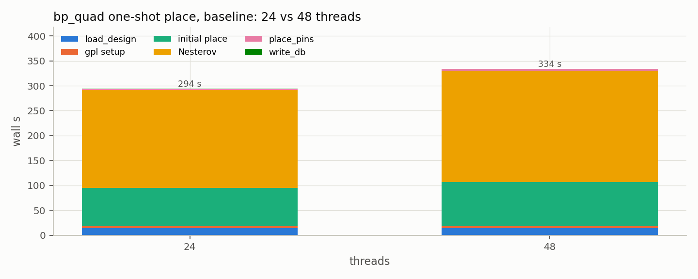
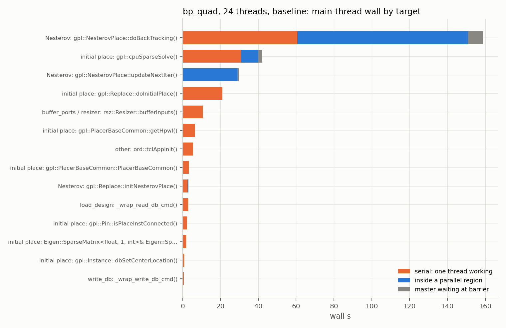
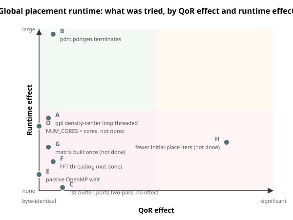

# Where a single global placement spends its time

This directory holds the method, the reproduction commands and the
figures. The numbers in the tables are the ones the figures were drawn
from, produced by `test/gpl_runtime/` on one machine; re-running the
campaign regenerates both.

## The question

ORFS will place cells and IO pins in one `global_placement -place_ios`
call, straight from the floorplan ODB, instead of today's three steps
(`3_1_place_gp_skip_io`, `3_2_place_iop`, `3_3_place_gp`). What does that
one call cost on a machine with many cores and plenty of memory, where
does the wall time go, and which of it would a change to OpenROAD move?

The unit of measurement is **one run, alone on the machine, at the thread
count ORFS hands OpenROAD** (`NUM_CORES`, which defaults to `nproc`).
Throughput across many concurrent runs is a different question with
different answers, and nothing here speaks to it.

Timing-driven and routability-driven placement are out of scope on
purpose: `-place_ios` refuses both (GPL-0179, GPL-0181), and their cost is
the resizer's and the router's, not the placer's.

## Method

`test/gpl_runtime/gpl_place_ios.tcl` is the future place stage as one
OpenROAD run: `load_design 2_floorplan.odb`, dont-use and port buffering
as `global_place.tcl` does them, `global_placement -place_ios` with the
flow's density and padding, then `place_pins` to legalize the pins onto
tracks. It runs inside a deployed ORFS place tree, so every flow variable
is the design's own, and `OPENROAD_EXE` in the environment selects the
binary -- the flow's, or one built from a patched checkout.

`test/gpl_runtime/profile.sh` runs it once under `perf stat` and
`perf record`, with every log line stamped with elapsed seconds
(`--@bazel-orfs//:log_timestamps`'s wrapper, passed as `RUN_CMD`), and
records the SHA-1 of the written ODB and the closing HPWL line so a
change can be graded byte-identical without a second thought.

`test/gpl_runtime/perf_summary.py` reduces a run to a JSON: wall, CPU
utilization and peak memory from ORFS's closing line; the phase
boundaries from the stamped log (`load_design`, initial place, Nesterov,
`place_pins`); and from the samples, the self-time share per function and
per code category, and **thread-equivalents doing work per second** --
working samples over the sampling rate, so 48 threads of which 47 spin in
an OpenMP barrier read as 1, not 48. `plots.py` draws the figures from
those JSONs.

Sampling is at 199 Hz per thread. The OpenMP runtime's wait loops
(`kmp_flag_64::wait`, `__kmp_hardware_timestamp`) are counted as
spinning; everything else as work.

## Reproducing

Build the design's floorplan once and deploy its place tree:

```sh
bazelisk build @orfs//flow/designs/asap7/coralnpu:CoreMiniAxi_floorplan
bazelisk run @orfs//flow/designs/asap7/coralnpu:CoreMiniAxi_place_deps
```

Profile one run at a thread count, alone on the machine:

```sh
test/gpl_runtime/profile.sh \
  tmp/flow/designs/asap7/coralnpu/CoreMiniAxi_place_deps \
  tmp/gpl_runtime/coralnpu_t24 24
python3 test/gpl_runtime/perf_summary.py tmp/gpl_runtime/coralnpu_t24 \
  -o tmp/gpl_runtime/coralnpu_t24/summary.json
```

With a binary of your own -- a patched OpenROAD checkout built with bazel,
frame pointers kept so `CALLGRAPH=1` gives usable call chains:

```sh
# in the OpenROAD checkout, at the commit bazel-orfs pins
bazelisk build -c opt --copt=-g1 --copt=-fno-omit-frame-pointer //:openroad
OPENROAD_EXE=$(readlink -f bazel-bin/openroad) CALLGRAPH=1 \
  test/gpl_runtime/profile.sh <tree> <out_dir> 24
```

Then the figures:

```sh
python3 test/gpl_runtime/plots.py sweep  tmp/gpl_runtime/coralnpu_t*/summary.json -o sweep.png
python3 test/gpl_runtime/plots.py phases tmp/gpl_runtime/coralnpu_t*/summary.json -o phases.png
python3 test/gpl_runtime/plots.py timeline tmp/gpl_runtime/coralnpu_t48/summary.json -o timeline.png
```

bp_quad's floorplan does not come out of bazel on this pin, because its
`pdngen` never finishes (see below). Deploy the floorplan tree and run the
steps by hand; the last one with a binary carrying the pdn patches:

```sh
bazelisk run @orfs//flow/designs/nangate45/bp_quad:bsg_chip_floorplan_deps
T=tmp/flow/designs/nangate45/bp_quad/bsg_chip_floorplan_deps
OPENROAD_EXE=$BASE $T/make do-2_1_floorplan do-2_2_floorplan_macro do-2_3_floorplan_tapcell NUM_CORES=24
OPENROAD_EXE=$PATCHED $T/make do-2_4_floorplan_pdn NUM_CORES=24
```

The pdngen failure is packaged as an untar-and-run reproducer, hosted as
a bazel-orfs release because the ODB makes it 95 MB:
<https://github.com/The-OpenROAD-Project/bazel-orfs/releases/tag/repro-pdn-bp_quad-nangate45>.

`test/gpl_runtime/pdn_regen.tcl` re-runs `pdngen` alone on a finished
floorplan (`pdngen -ripup`, re-source the platform PDN, `pdngen`), for a
binary-to-binary comparison of that step without the 30 minutes in front
of it.

Two things the reproduction depends on. The runs must not overlap with
anything else on the machine: a compile running beside one 48-thread run
turned 1.8 s of gcd placement into 16.8 s, because 48 spinning OpenMP
threads and 24 compiler processes contend for 48 hardware threads. And
`perf report` must be told `--no-inline`; resolving inlined frames through
`addr2line` on a 380 MB binary takes longer than the run it reports on.

## What was measured on coralnpu (asap7, 149k instances, 2015 IO pins)

The smallest design worth measuring: one run is half a minute, so the
whole thread sweep fits in ten minutes and repeats are cheap. Three runs
at 24 threads landed within 2%, three at 48 within 1.5%. Every run, at
every thread count and with both binaries, wrote a byte-identical ODB.

### It stops scaling at a dozen threads, and SMT costs time



| threads | wall | load_design | initial place | Nesterov |
| --- | --- | --- | --- | --- |
| 1 | 60.2 s | 7.0 | 17.2 | 35.0 |
| 4 | 39.2 s | 7.0 | 10.5 | 20.5 |
| 12 | 32.5 s | 6.9 | 8.2 | 16.2 |
| 24 | 31.1 s | 6.9 | 7.8 | 15.2 |
| 48 | 39.4 s | 6.8 | 10.4 | 21.1 |

24 threads on 24 cores is the best case, 1.9x over one thread. 48
threads, which is what `NUM_CORES = nproc` hands OpenROAD on this
machine, is slower than 4. The extra 24 are SMT siblings, and an OpenMP
thread spinning in a barrier on one sibling slows the working thread on
the other. A passive wait policy (`OMP_WAIT_POLICY=passive`,
`KMP_BLOCKTIME=0`) recovers a little of that (36.8 s), not all of it.

The difference between cores and threads is of the same order as any
single change in this study -- 20% here, 13% on bp_quad -- and it is not
one a flow can ask for today: `openroad -threads N` counts threads, there
is no `-cores`, and `nproc` counts SMT siblings as CPUs. ORFS's variable
is called `NUM_CORES` and is passed straight to `-threads`. Either the
tool learns the topology, or the flow does; neither does now.



### Two thirds of the wall is one thread working

The main thread is always on CPU, so its call-graph samples are wall
time. At 24 threads:

| main thread is | share of wall |
| --- | --- |
| in serial code, 23 workers idle | 69% |
| inside a parallel region | 26% |
| waiting at a barrier for the slowest worker | 5% |

The workers agree: 61% of their samples are in `__kmp_fork_barrier`,
waiting for the *next* region to open. Load imbalance inside regions is
not the problem; the code between regions is.



The serial time, by what a patch would have to touch:

| serial item | wall at 24 threads | what it is |
| --- | --- | --- |
| `NesterovBase::updateGCellDensityCenterLocation` | 5.1 s | a loop over every gcell, every iteration; a store per gcell, but through a handle, so memory-latency bound |
| `Resizer::bufferInputs` (`buffer_ports`) | 5.0 s | the run's first STA query: one constant propagation and one levelization of the design (not per port, as first read; see below) |
| Eigen BiCGSTAB dense vector ops | 1.9 s | serial in Eigen; only the sparse product is threaded |
| sparse matrix rebuilt from ODB, 20 times | 2.1 s | `createSparseMatrix`, `set_from_triplets`, `dbInst` scans |
| `read_liberty` | 1.3 s | parsing |
| `PlacerBaseCommon::getHpwl` per initial-place iteration | 0.9 s | serial reduction |

### Two single-concern patches, each attributed alone against the same baseline binary

Both binaries built from the pinned commit with the same flags; the only
variable in each row is the one patch.

| change | 24 threads | 48 threads | ODB | Chesterton's Fence |
| --- | --- | --- | --- | --- |
| baseline | 31.1, 31.9 s | 39.2 s | `ab0f845` | |
| gpl: thread the density-center update (3 lines) | 27.5, 27.4 s | 31.6 s | identical | upstream threaded the neighbouring scatter (Aug 2026) and the GPU path (Jun 2026) and left this loop serial; nothing in the history says why, and a store per gcell looks free until it is profiled |
| rsz: decide which ports to buffer before inserting any (17 lines) | 30.9, 30.7 s vs 30.7, 31.2 s | | identical | **no effect**; the hypothesis behind it was wrong, see below |

The density-center patch is the B2 experiment from an earlier local
branch, re-measured here on a vehicle where it shows. After it, the main
thread is 60% serial instead of 69%, and Nesterov's serial share drops
from 22% of wall to 6%; the remaining serial time is `buffer_ports` and
initial place.



### What did not move the needle

- **`buffer_ports` two-pass.** The call graph put 72% of `bufferInputs`'s
  5 s under `Sta::isConstant -> Sim::ensureConstantsPropagated ->
  findDisabledEdges`, and the obvious reading was that every buffer
  insertion invalidates the propagation and the next port's `isConstant()`
  redoes it: O(ports x design). A patch that decides all ports before
  inserting any buffer measured 30.9 and 30.7 s against 30.7 and 31.2 s
  for the baseline. The reading was wrong: the propagation runs once, and
  the 5 s is one full constant propagation plus one levelization of the
  design, paid by the first STA query of the run whatever asks it. On
  bp_quad, with 63 ports, the same fixed cost is 10 s. Recorded here so
  the next reader of that flame graph does not draw the same conclusion.
- `OMP_WAIT_POLICY=passive` / `KMP_BLOCKTIME=0` at 48 threads: 39.4 to
  36.8 s. Spinning is not the cost; the serial fraction is.
- Nothing at 24 threads is imbalance: master-waits-at-barrier is 5% of
  wall, and it sits under `doBackTracking`, which is where the biggest
  regions are.

## A caveat this design cannot answer

coralnpu is the largest asap7 design ORFS ships, and one run is half a
minute. A serial loop that costs 5 s here costs proportionally more on a
design where the placer runs for tens of minutes, and the initial-place
solve scales worse than linearly. The design that puts global placement
in that range is nangate45 `bp_quad` (1.7M standard cells); its numbers
follow below, after the detour its floorplan forced.

## A detour the vehicle forced: pdngen on bp_quad never finished

Building bp_quad's floorplan to get to its placement stalled in `pdngen`:
75 minutes single-threaded at 34 GB resident before the run was stopped.
Each `perf record -p` sample of the running process, and each patch that
removed what the sample showed, uncovered the next layer. Five patches,
each one concern, on the branch carried here:

| # | change | what the sample showed before it | result |
| --- | --- | --- | --- |
| 1 | `Shape` keeps its via-connection counts instead of rescanning its via list | 92% in `Shape::getNumberOfConnectionsAbove` and `Via::getLowerLayer`, from `findRepairChannels` asking every strap shape whether it has a via above | scan gone; run still unfinished at 22 min, 53 GB |
| 2 | bulk-load the two via R-trees in `Grid::makeVias` instead of inserting one via at a time | 40% in boost R-tree insert and redistribute | inserts gone; still unfinished at 11 min, 58 GB and rising |
| 3 | drop a grid's previous vias from the shapes they attach to before regenerating them (`Shape::clearVias` had no callers) | `makeVias` runs once per repair pass and every pass appended a new generation of vias to shapes still holding the old ones | one `makeVias` on the core grid: 0.3 s; memory flat at 2.7 GB; and now visible: **the repair loop never terminates**, 495 passes at 4 channels |
| 4 | a "continued" repair that changes neither width nor spacing marks the strap exhausted | `Continue repair ... changing width from 0.14 um to 0.14 um`, every pass, forever: `isAtEndOfRepairOptions()` said no because the spacing was above minimum, `continueRepairs()` could change nothing | the strap stops; a fresh strap for the same channel is created every pass instead, 1959 passes |
| 5 | do not create another repair strap for a channel that already has an exhausted one | same channel area re-repaired every pass | **terminates**: 28 passes, 58 s, 2.7 GB, and reports what the loop had been hiding |

What it reports is `[ERROR PDN-0179] Unable to repair all channels`: four
channels on metal1 at the die's edge that no width or spacing of a metal4
repair strap can close. That is the answer pdngen was designed to give for
an unrepairable channel; on this design at this OpenROAD commit it had
been unreachable, because the code path that should have concluded
"nothing left to try" instead tried the same thing forever, with a cost
per pass of minutes and a memory footprint growing by one generation of
vias each time. Whether bp_quad's PDN configuration or a change to the
repair code made those four channels unrepairable is an ORFS question the
study does not answer; the followpin and row-height handling in pdn was
reworked two weeks before the pinned commit, which is one place to look.

All five patches produce byte-identical output on all 151 pdn regression
tests (114 golden-DEF matches, 24 expected-error tests, no divergence).

Proposed upstream, rebased onto OpenROAD master, one concern per pull
request, each carrying the reproducer link:

| PR | patches | on the reproducer, alone, five-minute cap |
| --- | --- | --- |
| [#11362](https://github.com/The-OpenROAD-Project/OpenROAD/pull/11362) termination | 4, 5 | ends: 28 passes, 58 s, 3.2 GB, `PDN-0179` |
| [#11363](https://github.com/The-OpenROAD-Project/OpenROAD/pull/11363) previous vias dropped | 3 | loops, 637 passes, memory flat at 2.7 GB |
| [#11364](https://github.com/The-OpenROAD-Project/OpenROAD/pull/11364) via bookkeeping | 1, 2 | loops, 1161 passes, 28 GB |
| master | | loops, 314 passes, 9.6 GB and climbing |

Chesterton's Fence, per patch: 1 and 2 are the natural first
implementation and cost nothing on the test designs; 3 is a missing call
nobody needed while grids were small; 4 and 5 are the recursion's
termination argument, which assumed a pass either fixes a channel or runs
out of options, and a strap whose width is at minimum and whose spacing is
above it satisfies neither branch.

The runtime numbers are not a before/after pair: the unpatched run does
not end. The placement runs below use the floorplan as it stood after
tapcell insertion, without a power grid, which global placement does not
read.

## What was measured on bp_quad (nangate45, 1.28M placeable instances, 63 IO pins)

The largest public design ORFS ships, and the one that puts a single
global placement into minutes rather than seconds. The floorplan was run
by hand from the deployed tree (24 minutes of timing repair, 3.4 minutes
of macro placement, 5 seconds of tapcells), and the placement measured on
the tapcell floorplan without a power grid, for the reason above.



| 24 threads, baseline | wall | of which |
| --- | --- | --- |
| load_design | 14 s | serial |
| initial place | 77 s | 20 BiCGSTAB solves in X and Y at ~6 thread-equivalents |
| Nesterov | 195 s | 566 iterations, 0.34 s each, at ~14 thread-equivalents |
| place_pins, write_db | 3 s | |
| total | 293 s | CPU utilization 1959% of 2400% |

At 48 threads the same run takes 334 s: initial place 88 s instead of 77,
Nesterov 224 s instead of 196. The SMT penalty coralnpu showed holds at
scale.



The main thread is 52% serial, 44% inside parallel regions and 4% waiting
at a barrier. The workers agree: 48% of their samples are the fork
barrier, waiting for the master to reach the next region.



The serial time at this scale, in wall seconds:

| serial item | wall | note |
| --- | --- | --- |
| `updateGCellDensityCenterLocation` | 31 s | the same loop as on coralnpu, 566 times over 1.3M gcells plus fillers |
| Eigen BiCGSTAB dense vector ops | 24 s | serial in Eigen |
| sparse matrix rebuilt from ODB, 20 times | 21 s | `createSparseMatrix`, `set_from_triplets`, `dbInst` scans |
| Ooura FFT (`ddct`, `ddxt2d_sub`, `cftmdl1`) | 12 s | single-threaded on a 1024 x 1024 bin grid |
| `Resizer::init` for 42 port buffers | 10 s | levelizing a 1.3M-instance graph once; the per-port rescans coralnpu showed do not appear with 63 ports |
| `PlacerBaseCommon::getHpwl` per initial-place iteration | 6 s | serial reduction |
| `read_db` | 3 s | |

### The density-center patch at scale

| change | 24 threads | Nesterov | ODB |
| --- | --- | --- | --- |
| baseline | 292.9 s | 195.3 s | `d13691f` |
| gpl: thread the density-center update | 279.9 s | 181.2 s | identical |

A 4.5% win on the whole run and 7% on Nesterov, against 12% and 24% on
coralnpu: the loop is a smaller share of a run whose parallel regions are
also longer, and threading a memory-latency-bound loop over 1.3M handles
does not give 24x.

## The two axes



| | what | QoR | runtime | status |
| --- | --- | --- | --- | --- |
| A | gpl: thread the density-center update | byte-identical ODB on both designs | -12% coralnpu, -4.5% bp_quad | carried, `patches/0060` |
| B | pdn: five fixes in via bookkeeping and channel-repair termination | 151 regression tests identical | pdngen on bp_quad: never finished, now 58 s | carried, `patches/0061`-`0065` |
| C | rsz: `buffer_ports` decides which ports to buffer before inserting any | identical | none: 30.9, 30.7 s vs 30.7, 31.2 s | measured, refuted, not carried |
| D | run one thread per core, not per SMT sibling | none | 39 -> 31 s on coralnpu, 334 -> 295 s on bp_quad | needs a `-cores` the tool does not have, or topology in the flow |
| E | `OMP_WAIT_POLICY=passive`, `KMP_BLOCKTIME=0` | none | 39.4 -> 36.8 s at 48 threads | not worth a knob |
| F | gpl: thread the Ooura FFT | would be byte-identical if reductions keep order | ~4% of bp_quad wall at most | not done |
| G | gpl: build the initial-place sparse matrix once | byte-identical | ~7% of bp_quad wall at most | not done |
| H | gpl: fewer initial-place iterations | changes the placement | ~8% of bp_quad wall at most | a QoR knob, not done |

## TL;DR, in the form an OpenROAD pull request can quote

One `global_placement -place_ios` run, alone on a 24-core / 48-thread
machine, at the thread count ORFS passes (`NUM_CORES`). Wall seconds; the
ODB SHA-1 is the QoR statement.

| design | threads | baseline | with `gpl: parallelize the density-center location update` | ODB |
| --- | --- | --- | --- | --- |
| coralnpu, asap7, 149k instances | 24 | 31.1, 31.9, 30.7, 31.2 | 27.5, 27.4 | identical |
| coralnpu | 48 | 39.4, 39.1, 38.9 | 31.6 | identical |
| bp_quad, nangate45, 1.28M instances | 24 | 292.9, 294.6 | 279.9 | identical |
| bp_quad | 48 | 334.0 | | identical |

Why it is a win: on the main thread the loop is 16% of a 24-thread run's
wall on coralnpu and 11% on bp_quad, with every worker idle at the fork
barrier while it runs; threading it is order-independent because each
gcell is written once.

For `pdngen` on bp_quad: the unpatched run does not terminate (75 min and
34 GB before it was stopped, once); with the five pdn patches it ends in
58 s and 2.7 GB with `PDN-0179` for four channels no strap can close.
