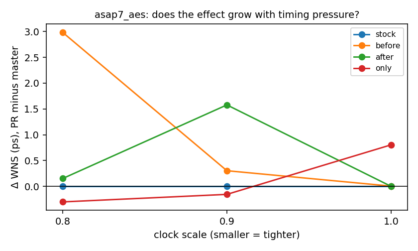
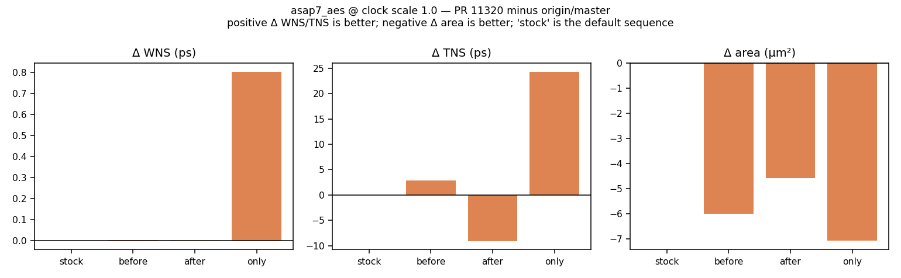
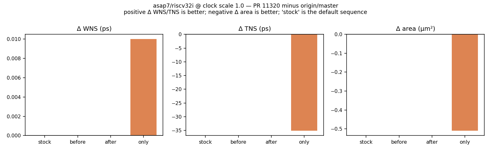

# Dogfooding bazel-orfs on OpenROAD PR 11320

We wanted an AI-friendly way to integration-test and plot the QoR effect
of a PR, and used [OpenROAD PR
11320](https://github.com/The-OpenROAD-Project/OpenROAD/pull/11320)
(`rsz: make size_down_fanout less conservative and high-fanout aware`) as
the subject. The PR looked like an obvious improvement, so a small
smoke-test integration run seemed like good economics.

**This is a method demonstration, not a study.** The experimental design
has real flaws, listed at the bottom. They are left in place deliberately:
the point is the fishing rod, not the fish. Someone who knows `rsz` will
see immediately what should have been done differently, and that critique
is more useful than another run.

## Reference points

| role | commit |
| --- | --- |
| baseline (arm A) | `63fe72c577` — `origin/master`, 2026-09-05 |
| PR (arm B) | `f0ea6bb51b` — PR 11320 cherry-picked onto `63fe72c577` |
| PR as submitted | `06b9e3d1a5`, parent `0b54bb3203` (39 commits behind master) |

The PR was rebased onto current `master` rather than measured against its
own parent: QoR is relative to what ships today, and intervening work can
wash out or amplify a change. The rebase was clean, and the only
binary-affecting difference between the two trees is
`SizeDownFanoutGenerator.{cc,hh}`.

The repo's OpenROAD pin was bumped to the same `63fe72c577` so the
placement the measurement starts from and the repair under test are built
from one revision.

## What the run does

`size_down_fanout` is **not in the default move sequence** —
`SetupLegacyBase` carries a literal `// Disabled by default for legacy
parity`. So the PR cannot affect a stock ORFS flow at all, and reaching
it needs a `config.mk` change (`SETUP_MOVE_SEQUENCE`). Four sequences are
compared, `stock` being the default sequence spelled out explicitly:

| name | sequence |
| --- | --- |
| `stock` | `unbuffer,vt_swap,sizeup,swap,buffer,clone,split` |
| `before` | `unbuffer,vt_swap,`**`size_down`**`,sizeup,swap,buffer,clone,split` |
| `after` | `unbuffer,vt_swap,sizeup,`**`size_down`**`,swap,buffer,clone,split` |
| `only` | `unbuffer,vt_swap,`**`size_down`**`,swap,buffer,clone,split` |

Each configuration is a leaf of a `fork`/`join` walk over one placed and
routed design (`//study`), so routing is paid once and shared across the
configurations that differ only in repair. That seam is
`patches/0050`.

## Results

`stock` is **bit-identical between arms at every design and period
tested** — the PR is inert on the default flow, measured rather than
inferred.

### asap7/aes — the effect grows with timing pressure

`before` is the ordering the PR's own new regression test uses.



| clock scale | ΔWNS (ps) | ΔTNS (ps) | Δinsts | Δarea (µm²) | baseline WNS |
| --- | --- | --- | --- | --- | --- |
| 1.0 | +0.003 | +2.8 | −19 | −6.01 | −4.78 |
| 0.9 | +0.302 | +131.1 | −7 | −1.14 | −42.94 |
| 0.8 | +2.984 | +19.1 | −16 | −0.60 | −82.87 |

Positive ΔWNS/ΔTNS is better, negative Δarea is better. At the stock
period this is a clean Pareto move: better WNS, better TNS **and** 6 µm²
smaller.



### asap7/riscv32i — exactly inert, for a traceable reason



Every sequence is bit-identical between arms, including ones where the
move runs and commits 19 downsizes. Move-level debug output explains it,
and the arithmetic closes exactly:

| | baseline | PR |
| --- | --- | --- |
| rejected at the `fanout >= 10` gate | 174 | 0 (check deleted) |
| rejected "Couldn't size down any gates" | 21130 | 21304 |
| accepted downsizes | 19 | 19 |

`21130 + 174 = 21304`. Removing the fanout limit surfaces exactly the 174
high-fanout drivers the old code skipped — and every one is then rejected
downstream anyway. On this design the binding constraint is the per-load
delay budget, not the conservatism the PR removes.

### Design suitability is measurable, and it decided the outcome

`riscv32i` was chosen first out of convenience and showed nothing.
`//study:*_probe` measures the two properties the move needs — high-fanout
nets, and loads with a smaller swappable sibling (via
`report_equiv_cells`):

| design | hi-fanout nets % | loads w/ headroom % | **hi-fanout loads w/ headroom %** |
| --- | --- | --- | --- |
| asap7/aes | 3.1 | 34.3 | **29.3** |
| asap7/ethmac | 4.2 | 30.6 | **23.3** |
| asap7/ibex | 3.4 | 21.9 | **21.9** |
| asap7/jpeg | 1.9 | 43.1 | **20.9** |
| asap7/riscv32i | 4.2 | 20.3 | **17.5** |
| sky130hd/aes | 3.8 | 11.9 | **6.8** |
| sky130hd/jpeg | 0.9 | 5.1 | **2.6** |
| sky130hd/ibex | 3.7 | 4.8 | **2.2** |

The platform matters more than the design: every asap7 design offers
17–29% headroom, every sky130hd design 2–7%. sky130hd is a poor vehicle
for this change.

### The multi-Vt arm was invalid, and is reported as untested

`asap7/aes_multivt` (`patches/0051`) is `aes` with the full RVT/LVT/SLVT
ladder. Run at aes's 380 ps it **closes** — WNS +0.09 ps, TNS exactly 0.0,
at every clock scale down to 0.8×. A repair-stage measurement on a design
with no negative slack measures nothing, so this arm tested the PR not at
all. It is **not** evidence that `vt_swap` makes the move redundant.

ORFS designs sit a percent or two past closure, which is what makes them
useful QoR cases (`aes` −1.3% of period, `riscv32i` −2.0%). A faster
library at an unchanged period destroys that calibration — which is
exactly why ORFS's own `aes_lvt` retimes the clock to 360 ps. The design
here is retuned to 285 ps, measured at −8.24 ps (−2.89% of period), and
left ready for someone to use. We did not re-run the arm.

## Known flaws

* One design family with signal (`asap7`), one design (`aes`).
* One run per point; no repeat-noise estimate, so small deltas are not
  distinguishable from run-to-run variation.
* Stops at global route: no detailed-route DRC, no post-route power.
  Congestion, not DRC, is the routability check.
* The clock scale is applied to a fixed placement before CTS. It is a
  repair-*pressure* knob, not a flow-level period sweep — synthesis and
  placement still reflect the stock period.
* At 0.8× the design is far from closing (baseline WNS −80 ps); that
  column is relative improvement in a failing design, not closure.
* The post-CTS repair is held at stock so the fork point can sit after
  routing, making it a controlled variable rather than a swept one.
* No cross-product of designs × conditions. Deliberately: the ideal is
  every design under every condition, but a good study is also economical.

## Reproducing

```sh
bazel run //study:asap7_aes_probe -- \
    OPENROAD_EXE=/abs/path/to/openroad \
    STUDY_DESIGN=asap7_aes RESULTS_OUT=/abs/out

bazel run //study:asap7_aes_walk -- \
    OPENROAD_EXE=/abs/path/to/openroad \
    STUDY_ARM=base STUDY_DESIGN=asap7_aes \
    STUDY_PERIOD_SCALE=1.0 RESULTS_OUT=/abs/out

python3 study/collect.py /abs/out... -o results.csv
python3 study/plot.py results.csv -d .
```

The arm is chosen per invocation via `OPENROAD_EXE`, so no local path is
baked into any committed file.
