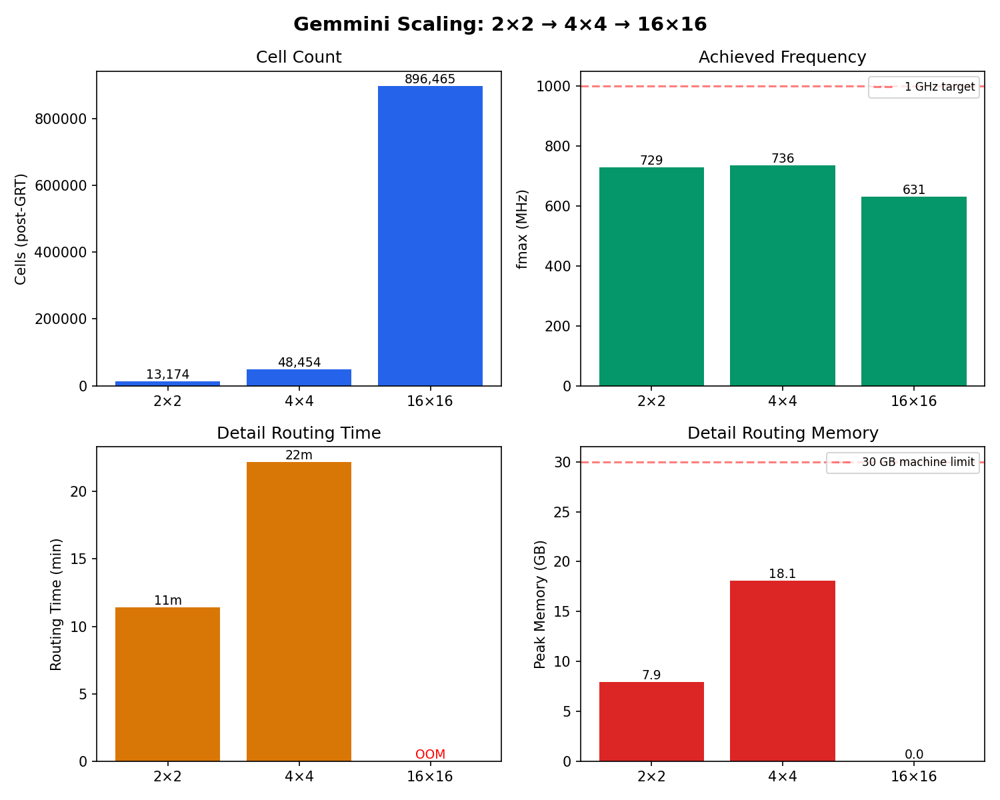
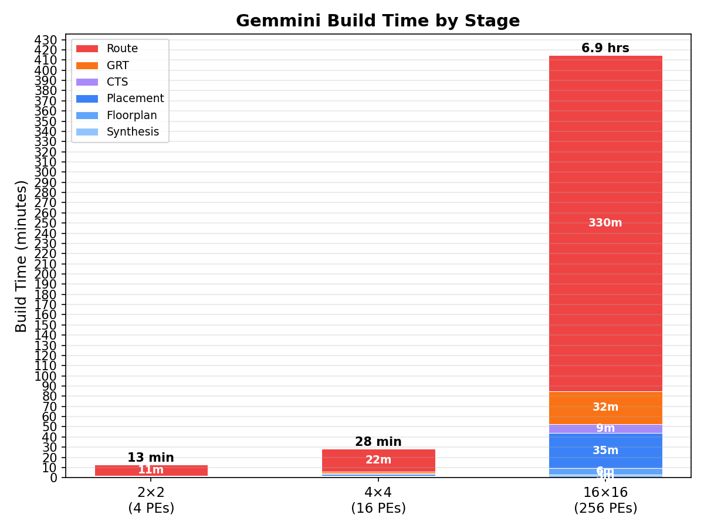

# Gemmini — Berkeley Systolic Array ML Accelerator

[Gemmini](https://github.com/ucb-bar/gemmini) by UC Berkeley is a spatial array
machine learning accelerator. Written in Chisel, it features a configurable
systolic mesh for matrix multiplication.

## What This Demo Builds

**MeshWithDelays** — the 16x16 INT8 systolic array core, targeting ASAP7 7nm:

- **Architecture**: 16x16 mesh of PEs, each with a MAC unit (8-bit x 8-bit -> 32-bit accumulate)
- **Dataflow**: Supports both output-stationary and weight-stationary
- **Pipeline**: Configurable tile latency with SRAM-based shift registers
- **Target frequency**: 1 GHz (1000ps clock period)

The Chisel source is compiled to Verilog at build time using bazel-orfs's
Chisel rules — bypassing Chipyard/sbt entirely. A compatibility patch adapts
the Gemmini Chisel 3.6 code to Chisel 7.2 and removes Rocket-Chip dependencies.

## Scaling Comparison



_Generated by `bazelisk run //scripts:gemmini_scaling`._



_Generated by `bazelisk run //scripts:gemmini_build_times`._

Three configurations demonstrate how cells, fmax, routing time, and memory
scale with mesh dimension. The 2×2 and 4×4 complete in minutes; the 16×16
OOMs during routing on a 30 GB machine.

## Status: GRT Complete — Routing In Progress

The flow has completed through **GRT** (global routing). Detail routing
requires ~29 GB RAM and 6+ hours on 16 threads — it exceeds the 30 GB
available on the development machine.

### Per-Stage Results

| Stage | Time | Peak Memory | Notes |
|-------|-----:|------------:|-------|
| Synthesis | 177s (3 min) | 533 MB | Hierarchical, mocked SRAMs |
| Floorplan | 354s (6 min) | 3.7 GB | Timing repair runs 177s but cannot fix -1007ps WNS |
| Placement | 2080s (35 min) | 6.4 GB | 5 substeps; overflow converges normally |
| CTS | 533s (9 min) | 7.9 GB | Timing repair skipped (`SKIP_CTS_REPAIR_TIMING=1`) |
| GRT | 1943s (32 min) | 16.8 GB | Zero overflow, fmax 631 MHz |
| Detail route | >6 hrs (incomplete) | 28.9 GB | OOM-killed at 90% of iteration 0 on 30 GB machine |

Total time through GRT: ~85 minutes. Detail routing is the bottleneck.

### Key Metrics (post-GRT)

| Metric | Value |
|--------|-------|
| Cells | 896,465 |
| Design area | 103,705 μm² |
| Core utilization | 41.2% |
| fmax (GRT) | 631 MHz (target: 1 GHz) |
| Setup TNS (GRT) | -3.9 ms |
| Clock skew (setup) | 61.0 ps |
| Clock skew (hold) | 68.9 ps |

### Timing Analysis

The design has a large setup WNS (-1007ps at floorplan, ~-601ps at GRT),
achieving only 63% of the 1 GHz target. The critical path runs through
`transposer/pes_0_0/io_outL[0]$_DFFE_PP_/D` — the transposer data path
between processing elements.

`SETUP_SLACK_MARGIN` and `HOLD_SLACK_MARGIN` are set to -1100ps to skip
futile timing repair iterations at floorplan, CTS, and GRT stages. Without
this, floorplan timing repair alone spins for 1200 iterations (~3 minutes)
with no improvement.

### Memory and Routing Challenges

Detail routing is the main obstacle to completing this design:

- **Peak memory**: 28.9 GB at 16 threads — barely fits in 30 GB RAM
- **Memory oscillation**: Swings between 7-28 GB as the router processes
  different regions of the chip
- **Iteration 0 runtime**: ~6 hours at 16 threads (90% complete when killed)
- **Violations**: Accumulated 175K violations in iteration 0 — these get
  fixed in subsequent optimization iterations (typically 3-5 more iterations)

Options to complete routing:

1. **Reduce threads**: `"ROUTING_ARGS": "-threads 8"` cuts peak memory ~30%
   but doubles runtime
2. **Use a 64 GB machine**: Provides comfortable headroom
3. **Lower PLACE_DENSITY**: From 0.65 to 0.5 — reduces routing congestion but
   requires re-running from placement
4. **Enable routability-driven placement**: Set `GPL_ROUTABILITY_DRIVEN=1` —
   also requires re-running from placement

### Current BUILD.bazel Configuration

```python
arguments = {
    "SYNTH_HIERARCHICAL": "1",
    "SYNTH_MINIMUM_KEEP_SIZE": "0",
    "SYNTH_MOCK_LARGE_MEMORIES": "1",
    "CORE_UTILIZATION": "40",
    "PLACE_DENSITY": "0.65",
    "SETUP_SLACK_MARGIN": "-1100",
    "HOLD_SLACK_MARGIN": "-1100",
    "GPL_ROUTABILITY_DRIVEN": "0",
    "GPL_TIMING_DRIVEN": "0",
    "SKIP_CTS_REPAIR_TIMING": "1",
    "SKIP_INCREMENTAL_REPAIR": "1",
    "SKIP_LAST_GASP": "1",
    "FILL_CELLS": "",
    "TAPCELL_TCL": "",
}
```

These settings prioritize build speed over QoR. To improve timing:
- Remove `SKIP_CTS_REPAIR_TIMING` and `SKIP_INCREMENTAL_REPAIR`
- Reduce slack margins (or remove them)
- Enable `GPL_TIMING_DRIVEN=1` and `GPL_ROUTABILITY_DRIVEN=1`

## Configuration Constraints Discovered

When creating scaled-down configurations, Claude encountered two Chisel
assertions that constrain valid mesh dimensions:

1. **`meshRows * tileRows == meshColumns * tileColumns`** (`MeshWithDelays.scala`)
   — the mesh must be square when tiles are 1×1. This is satisfied by any N×N mesh.

2. **`isPow2(dim)`** (`Transposer.scala`) — the `AlwaysOutTransposer` requires
   power-of-2 dimensions. A 5×5 mesh fails this assertion at Chisel elaboration time.

3. **`n_simultaneous_matmuls >= 5 * latency_per_pe`** (`MeshWithDelays.scala`)
   — with `tile_latency=1` and 1×1 tiles, `latency_per_pe = 2.0`, so
   `n_simultaneous_matmuls >= 10`. The 16×16 hardcodes 16 (passes), but a 4×4
   with `n_simultaneous_matmuls=4` fails. Setting `-1` auto-computes the minimum.

**Valid configurations**: 2×2, 4×4, 8×8, 16×16, 32×32 (power-of-2, square mesh).
The 5×5 was attempted and failed — this is documented here so future attempts
don't repeat the experiment.

## Module Sizes (from hierarchical synthesis)

The design is dominated by mocked SRAM memories used as shift registers.
Key modules:

| Module | Cells | Notes |
|--------|------:|-------|
| `mem_0_*` (mocked SRAMs) | ~50K | Dozens of variants (2x1 to 30x32) |
| MeshWithDelays (top glue) | 4,603 | Control logic, muxing |
| PE_256 (processing element) | 1,802 | x256 instances (16x16 mesh) |
| TagQueue | 1,298 | Tag tracking for matmul IDs |
| MacUnit (multiply-accumulate) | 457 | x256 instances |

## Future Improvements

- **Complete detail routing**: Needs 64 GB RAM or reduced thread count
- **Improve timing closure**: Current fmax is 631 MHz vs 1 GHz target.
  The transposer data path is the bottleneck — may need pipelining or
  a relaxed clock constraint (e.g. 1500ps for 667 MHz target)
- **Port to Chisel 7 properly**: the current patch removes HardFloat and stubs
  out Float/DummySInt arithmetic. Upstream Gemmini could add Chisel 7 support.
- **Replace mocked memories**: use real SRAM macros for the shift register banks
- **Hierarchical synthesis**: build PE or Tile as separate macros for faster iteration
- **Enable routability-driven placement**: `GPL_ROUTABILITY_DRIVEN=1` may reduce
  routing congestion and memory usage at the cost of longer placement
- **Remove Rocket-Chip exclusions**: 25 source files were excluded due to Rocket-Chip
  dependencies. A standalone MeshWithDelays could be upstreamed to Gemmini.

## Chisel 7 Compatibility Patch

The patch (`patches/chisel7-compat.patch`) makes these changes:
- Removes `import hardfloat._` and all Float arithmetic (not needed for INT8)
- Fixes `case class` Bundles -> `class` Bundles (Chisel 7 requirement)
- Replaces `log2Up` -> `log2Ceil` (deprecated API)
- Fixes `.zipped` -> `.lazyZip` (Scala 2.13 deprecation)
- Adds `chiselTypeClone` for nested Bundle fields
- Adds `chiselTypeOf` for hardware-to-type conversion in Shifter
- Excludes 25 files with Rocket-Chip/TileLink/FireSim dependencies

## Build

```bash
# Full Chisel -> Verilog -> ORFS pipeline
bazel build //gemmini:MeshWithDelays_synth

# Continue through routing (synth/place/CTS/GRT are cached)
bazelisk build //gemmini:MeshWithDelays_route

# Then finish
bazelisk build //gemmini:MeshWithDelays_final

# Update gallery with final results
/demo-update gemmini

# Analyze module sizes
bazelisk run //scripts:module_sizes -- \
  $(pwd)/bazel-bin/gemmini/reports/asap7/MeshWithDelays/base/synth_stat.txt
```

## References

- [Gemmini GitHub](https://github.com/ucb-bar/gemmini)
- [Gemmini: Enabling Systematic Deep-Learning Architecture Evaluation via Full-Stack Integration](https://arxiv.org/abs/1911.09925) (DAC 2021)
- [bazel-orfs Chisel rules](https://github.com/The-OpenROAD-Project/bazel-orfs/blob/main/toolchains/scala/chisel.bzl)
