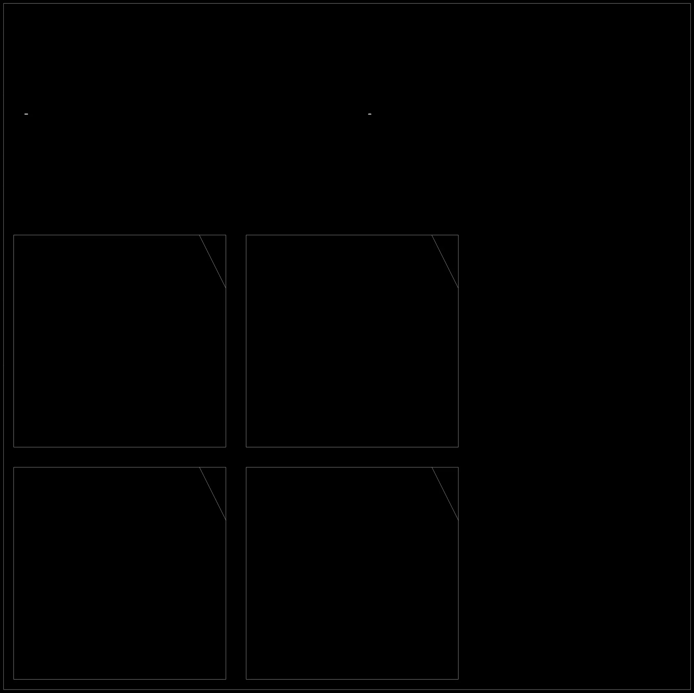
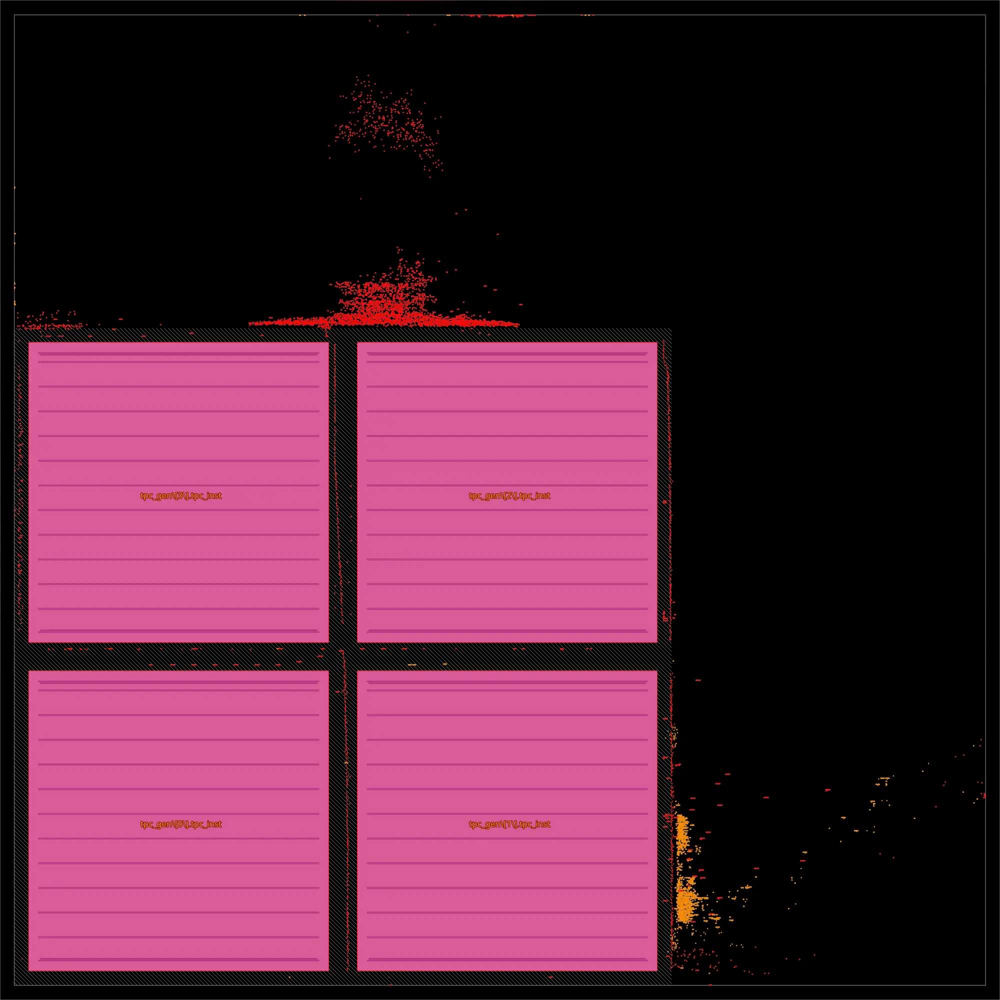

# Tensor Accelerator — 4-Level Hierarchical TPU

```bash
bazelisk run //tensor_accelerator:tensor_accelerator_top_cts gui_cts
```

[tensor_accelerator](https://github.com/profitmonk/tensor_accelerator) by profitmonk
is an FPGA tensor processing unit with a 4-level macro hierarchy, designed for
INT8 matrix multiply workloads.

## What This Demo Builds

**tensor_accelerator_top** — the full accelerator targeting ASAP7 7nm:

- **Architecture**: 4× Tensor Processing Clusters (TPCs) in a 2×2 mesh
- **Per-cluster**: systolic array + 64-lane vector unit + 16-bank SRAM + DMA engine
- **Systolic arrays**: 16 MAC processing elements per cluster (INT8)
- **Target frequency**: 1 GHz (1000ps clock period)

### Hierarchy

| Level | Module | PDN Pins | Metal Budget |
|-------|--------|----------|--------------|
| 0 | `mac_pe` | M5 | M1–M5 (platform BLOCK) |
| 1 | `systolic_array` | M6 | M1–M6 (platform BLOCKS) |
| 2 | `tensor_processing_cluster` | M8 | M1–M8 (custom) |
| 3 | `tensor_accelerator_top` | M9 | M1–M9 (custom) |

## Reported vs. Actual Results

This is an FPGA design without published ASIC results. This demo measures
its ASAP7 performance through CTS.

| Metric         | Reported | Actual      |
|----------------|----------|-------------|
| Frequency      | —        | —           |
| Cells          | —        | —           |
| Area (μm²)    | —        | 44,562      |
| WNS (ps)       | —        | —           |
| Power (mW)     | —        | —           |

| Floorplan | Place | CTS |
|:---------:|:-----:|:---:|
|  |  |  |

## Future Improvements

- **Complete routing** (`_route`, `_final`): currently through CTS
- **Enable timing-driven placement** (`GPL_TIMING_DRIVEN=1`): measure actual frequency
- **Tune die areas**: TPC and top use conservative explicit areas
- **Remove FAST overrides**: re-enable routability-driven placement, fill cells, CTS repair

## Build

```bash
# Level 0: MAC PE (leaf macro)
bazelisk build //tensor_accelerator:mac_pe_place

# Level 1: Systolic array (mac_pe macros)
bazelisk build //tensor_accelerator:systolic_array_generate_abstract

# Level 2: Tensor Processing Cluster (systolic_array macro)
bazelisk build //tensor_accelerator:tensor_processing_cluster_generate_abstract

# Level 3: Top (4× TPC macros) — through CTS
bazelisk build //tensor_accelerator:tensor_accelerator_top_cts
```

## References

- [profitmonk/tensor_accelerator](https://github.com/profitmonk/tensor_accelerator) — upstream repository
