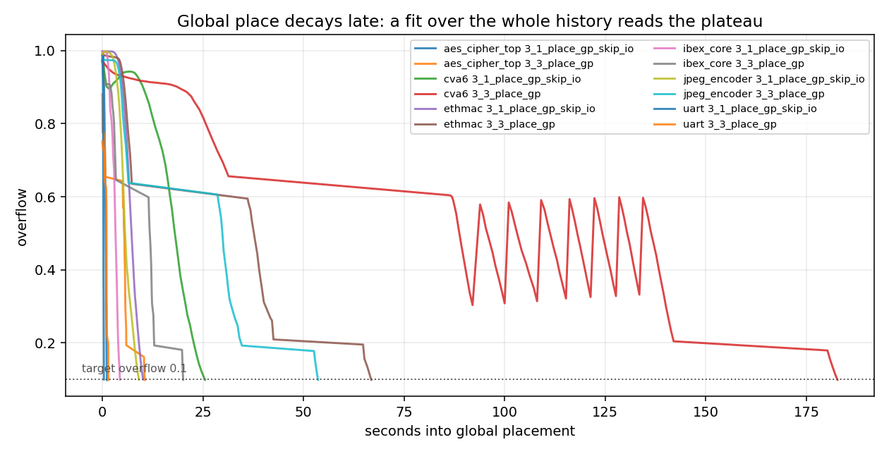
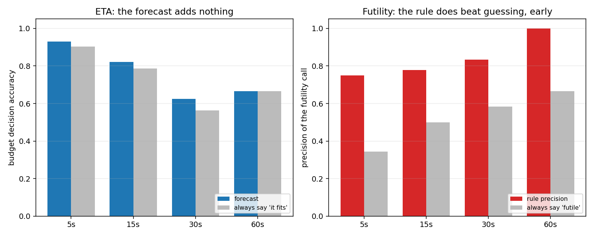
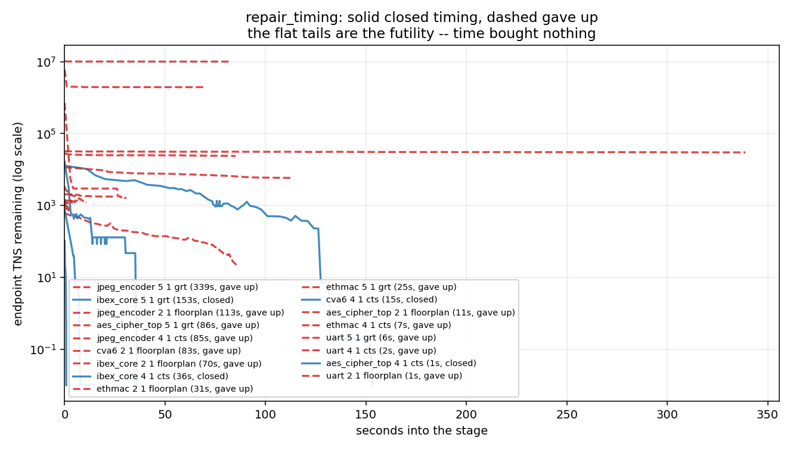
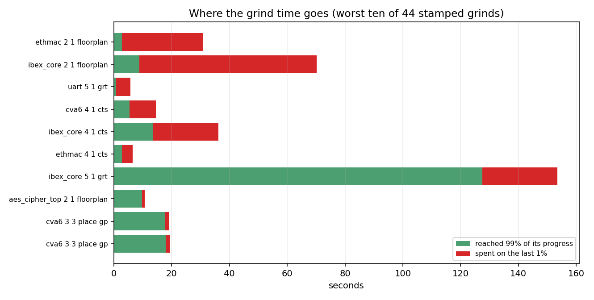

# Forecasting ORFS grinds: measured, and mostly a warning

Status: **run, and answered.** The idea as posed does not survive its own
evidence. A smaller idea inside it does, and is cheaper than the one that
was asked for.

The apparatus is committed alongside this document so the numbers can be
disputed; if you are reading this after `ideas/eta/` was deleted, it is
recoverable from the commit named at the bottom.

## The question

OpenROAD grinds. Global placement iterates toward an overflow target,
`repair_design` walks a net list, `repair_timing` runs pass after pass
against timing that may or may not close. The default posture is tapeout
or bust: keep going until a hard limit trips. For design-space
exploration that is the wrong trade -- a run that will not converge is
worth killing early, and a run that has already banked its progress is
worth stopping.

The proposal was: capture the progress OpenROAD prints, forecast time to
completion with TimesFM, and feed the forecast into "anti-futility"
parameter settings that could be tuned per flow.

Three questions, in order, with the rule that a *no* at any of them ends
it:

1. Can the progress series be extracted at all?
2. Is there enough wall-clock information to turn iterations into time?
3. Is the resulting forecast good enough to change a decision -- and is
   TimesFM better at it than a two-line baseline?

## What was built

* `--@bazel-orfs//:log_timestamps` -- an additive debug flag that prefixes
  every ORFS log line with elapsed seconds. This shipped separately as a
  feature in its own right; see `docs/debugging.md`. It required an ORFS
  patch (`patches/0048`) because `flow.sh` spelled out `run_command.py`
  by hand instead of going through `RUN_CMD`, so no override reached a
  stage log.
* `ideas/eta/parse.py` -- log to typed series.
* `ideas/eta/collect.py` -- corpus harvesting.
* `ideas/eta/forecast.py` -- `naive` (last-rate extrapolation),
  `parametric` (exponential fit), `library` (nearest-neighbour on prior
  runs of the same design).
* `ideas/eta/backtest.py` -- prefix-by-prefix scoring.
* `ideas/eta/timesfm_eval.py` -- TimesFM 3.0.1, hermetically wired
  through its own pip hub.

## The corpus

81 series from 7 asap7 designs (`gcd`, `uart`, `aes_cipher_top`,
`ethmac`, `ibex_core`, `jpeg_encoder`, `cva6`), 52 of them usable --
stamped, terminated, at least 8 points. 1581 seconds of grind in total;
the longest single grind is jpeg's global-route `repair_timing` at 339
seconds over 351 printed rows. 39 converged, 13 gave up short of target.

Two designs that would have widened the range could not be built at all,
for reasons unrelated to this work: `riscv32i` fails synthesis with
`SYNTH_HIERARCHICAL=1` and no `SYNTH_KEEP_MODULES` (the failure
`private/orfs_design.bzl` already warns about), and `swerv_wrapper` fails
with `unknown module 'OPENROAD_CLKGATE'`. **So no hours-long grind is
represented here.** That is the single biggest limitation of everything
below.

## Q1 and Q2: yes, and yes

The series extract cleanly, and the timestamps are faithful -- stamps
advance smoothly across tens of seconds rather than arriving in bursts,
so per-iteration wall time is real. Getting there cost three parser bugs
that only real logs could have exposed:

* **Unknown tables donate rows to whichever table printed a header
  last.** There is a fifth progress printer (`Rebuffer.cc`) that is not
  in the obvious list, and its rows were landing in the `repair_design`
  series. Rows are now classified by shape, not by the last header seen,
  because OpenROAD *interleaves* these grinds -- rebuffer runs inside
  global placement, and gpl resumes afterwards without reprinting.
* **One grind can look like four.** Global place reprints its header
  after each timing-driven interruption. Fragments are rejoined when the
  iteration counter keeps climbing across the boundary, which correctly
  does not merge a second `repair_design` call (that restarts at 0).
* **`repair_timing` marks iterations with a trailing asterisk** -- `0*`,
  `10*`. An `isdigit()` check drops every one of them, which silently
  deleted the entire setup-repair grind: the longest, most futility-prone
  series in the corpus, and the whole point of the exercise.

## The trap: the obvious progress column is not a progress signal

`repair_timing` prints a `Viol Endpts` column. It is the natural thing to
forecast, and it is useless:

```
  iter     viol        wns     st_tns     en_tns
     0    719.0    -35.841    -3279.6   -12639.3
   451    719.0     -6.911    -2914.3     -228.2
   639    719.0     -0.117    -2894.4       -0.2
  1121    719.0     -0.117    -2894.4       -0.2
  1121      0.0      0.079    -2894.2        0.0
```

The count is not recomputed during the run. It sits at 719 for all 153
seconds and becomes 0 in the final row. Endpoint TNS is the signal that
actually moves, four orders of magnitude of it.

Anyone building on this should read the trajectory from TNS or WNS and
take the *verdict* from the endpoint count, which is authoritative only
in the final row. Forecasting the frozen column produces a corpus of flat
lines and a forecaster that declines to answer.

Note also what the third and fourth rows say: this run reaches
`en_tns = -0.2` at iteration 639 and then runs to 1121 with every number
frozen. That is the futility, visible without any model.

## Two shapes worth knowing before fitting anything



**Global place decays late.** Overflow sits near its starting value for
the first third of the run and then falls off a cliff. A curve fitted
over the whole history is dominated by the plateau: on jpeg it predicted
164 seconds remaining against a truth of 4.6. This is why the trivial
`naive` forecaster, whose window is the last five points, beat a
"proper" model -- it was local and the model was not.

**For a crossing forecast, the stopping rule dominates the fit.**
Sweeping window length against floor policy, the window barely mattered
and the floor changed everything: declaring the crossing at a thousandth
of the starting gap gives 300-600% median error, while declaring it at
one more reporting step gives 53-94%. Same fit, six-fold difference. If
you take one engineering lesson from this document over the statistics,
take that one.

## Q3: the forecast does not change a decision



```
ETA accuracy, converged runs only
forecaster      at     n  declined median APE   decision   base
naive           5s     19         1        71%        93%    90%
naive          15s      8         1        91%        82%    79%
naive          30s      5         1        87%        62%    56%
naive          60s      3         0        86%        67%    67%
parametric      5s     19         0       160%        80%    91%
parametric     30s      5         1        74%        62%    56%
```

Median error 71-160%, and the decision column -- "will this run fit in a
budget of 30/60/120/300 seconds" -- **tracks the base rate**. Answering
"yes, it fits" without reading the log scores 90% where the forecast
scores 93%, and 79% where it scores 82%; at 60s the two are equal. Three
points of margin, on 19 samples, is not a decision procedure.

### TimesFM, given a fair run

TimesFM 3.0.1, same prefixes, same stopping rule, series resampled onto a
uniform one-second grid (it is a fixed-horizon forecaster; the raw series
is indexed by iteration, and iterations are not equal length). The first
attempt fed it the metric directly and it declined on every run at 30s --
so it was given the log-space series, which is the space `parametric`
fits and the space a four-order-of-magnitude decay lives in.

| at | timesfm declined | timesfm APE | naive declined | naive APE |
|---|---|---|---|---|
| 10s | 4 of 5 | 157% | 0 of 5 | **38%** |
| 15s | 2 of 3 | 95% | 1 of 3 | 94% |
| 30s | 3 of 4 | 84% | 1 of 4 | 89% |
| 60s | 2 of 2 | - | 0 of 2 | **71%** |

It declines on most runs -- its forecast never crosses the target inside
the horizon -- and where it answers it never beats last-rate
extrapolation. On the smallest checkpoint it is four times worse.

This is a small sample and it is not a claim about TimesFM in general.
It is a claim about this shape of problem: a short, monotone,
multi-order-of-magnitude decay, 30-100 points long, where the question is
a crossing time rather than a value. A foundation model's advantages --
seasonality, regime structure, long uniform context -- are not present
here, and the ETA it would improve is the part that adds nothing over the
base rate.

### The warm regime is untested, not disproven

The premise worth the most to a DSE user is that a design's *own* prior
runs predict its next one. That was never measured, because building the
sibling runs needs varied-knob targets that the ORFS design DSL does not
expose directly.

A weaker proxy -- does one stage's grind predict another stage's grind on
the same design -- fails outright: 85-95% median error, no better than
naive, and predicting futility from design identity alone scores 56%
against a 67% prevalence, i.e. worse than always guessing "futile". But
cross-stage is a poor stand-in for same-stage-different-knob, and this
does not settle the question.

## What did survive: futility is observable, not predictable



The dashed lines gave up; the solid ones closed timing. jpeg's
global-route repair is a flat line for 339 seconds. ibex's floorplan
repair holds at 2x10^6 for 70 seconds. Nothing about those runs needs
forecasting -- they are *visibly* not moving while they run.

Quantified: **11% of all measured grind time (167 of 1578 seconds) is
spent acquiring the last 1% of a run's own progress.**



| design / stage | total | on the last 1% | share |
|---|---|---|---|
| ethmac floorplan | 30.8s | 27.9s | 91% |
| ibex_core floorplan | 70.2s | 61.3s | 87% |
| uart grt | 5.7s | 4.9s | 85% |
| cva6 cts | 14.5s | 9.2s | 63% |
| ibex_core cts | 36.1s | 22.5s | 62% |
| ethmac cts | 6.6s | 3.7s | 57% |
| ibex_core grt | 153.4s | 25.9s | 17% |

It concentrates almost entirely in `repair_timing`; the global-place and
`repair_design` grinds waste essentially nothing.

And the crude detector works, unlike the forecaster. Reading "no crossing
in sight" as "this will not converge":

```
rule            at   TP   FP   TN   FN  recall  precis  preval
naive           5s    9    3   16    1     90%     75%     34%
naive          15s    7    2    6    1     88%     78%     50%
naive          30s    5    1    4    2     71%     83%     58%
naive          60s    4    0    3    2     67%    100%     67%
```

75% precision at five seconds in, against a 34% base rate, catching 9 of
the 10 futile runs. Unlike the ETA column, that is a real margin over
guessing. The errors are also
asymmetric in the direction one would choose: killing a run that was
about to land loses real work, while missing a futile run merely leaves
today's behaviour in place.

## A methodological trap, recorded because it nearly became a result

An earlier version of the harness placed its checkpoints at *fractions of
each run's true duration* -- 25%, 50%, 75%. Under that design the trivial
rule "remaining time equals the time already spent" scored **6% median
error**, an order of magnitude better than everything else.

It was circular. At "50% of the way through", remaining/spent is 1.0 by
construction; the rule scored brilliantly while knowing nothing. The
number was already written into a summary before the cause was spotted.

Checkpoints are now absolute wall-clock moments and budgets are absolute
seconds, which is also the question a DSE sweep actually asks. Every
number in this document is post-fix. **If you evaluate a forecaster
against a checkpoint defined in terms of the answer, you will measure
your own definition.**

## Verdict

**The idea as posed is not viable.** Forecasting time-to-completion from
ORFS progress logs, with or without TimesFM, does not beat the base rate
on the decision it exists to inform. Wiring a forecast into anti-futility
parameter selection would be building on a measurement that is not there.

**The smaller idea inside it is viable and much cheaper.** `repair_timing`
plateaus, visibly, while it is still running, and 11% of grind time in
this corpus went to progress not worth having. A stop rule of the form
"halt when TNS has not improved by more than X% over the last N passes"
needs no model, no forecast, and no new dependency -- only the numbers
OpenROAD already prints. That rule is a candidate for
`REPAIR_TIMING_MAX_PASSES` and friends, which is the anti-futility knob
the original proposal wanted, arrived at from the other end.

## Moratorium

**Do not re-attempt ETA forecasting of ORFS grinds, and do not re-attempt
TimesFM on this data, without one of the conditions below.** The result
is not "we did not try hard enough"; it is that the decision the forecast
would inform is dominated by its base rate, and no improvement in the
forecast changes that.

It breaks if:

1. **An hours-long grind is measured.** No run here exceeded 339 seconds.
   Against a budget of hours, the base rate stops being trivially right
   and a forecast could earn its keep. This is the most likely condition
   to fire, and requires `swerv_wrapper`/`riscv32i` (or an equivalently
   large design) to build.
2. **Same-design, different-knob sibling runs exist.** The warm regime is
   untested, not refuted. A DSE sweep produces this history for free; if
   a design has 3-10 prior runs of the *same stage*, the curve-library
   approach deserves its measurement.
3. **The progress printers get finer or configurable intervals.**
   `RepairDesign.hh` self-tunes between 10 and 1000, so a large design can
   print five rows for a long grind. More resolution, more to forecast.
4. **The question changes from crossing-time to marginal-rate.** Nothing
   here refutes forecasting *improvement per second*; it refutes
   forecasting *when the target is reached*. They are different targets
   and the second is the one the plateau finding actually wants.

What does *not* break it: a newer forecasting model, a better fit, more
tuning of the existing forecasters. Those all improve the number that was
measured to be irrelevant.

## Reproducing

```sh
bazelisk build --@bazel-orfs//:log_timestamps @orfs//flow/designs/asap7/ibex:ibex_core_grt
bazelisk run //ideas/eta:collect  -- --out ideas/eta/corpus.jsonl <bazel-bin logs dir>
bazelisk run //ideas/eta:backtest -- ideas/eta/corpus.jsonl
bazelisk run //ideas/eta:plots    -- ideas/eta/corpus.jsonl --outdir ideas
bazelisk run //ideas/eta:timesfm_eval -- ideas/eta/corpus.jsonl
```

`timesfm_eval` downloads model weights from HuggingFace at run time and
is therefore not hermetic; everything else is.
