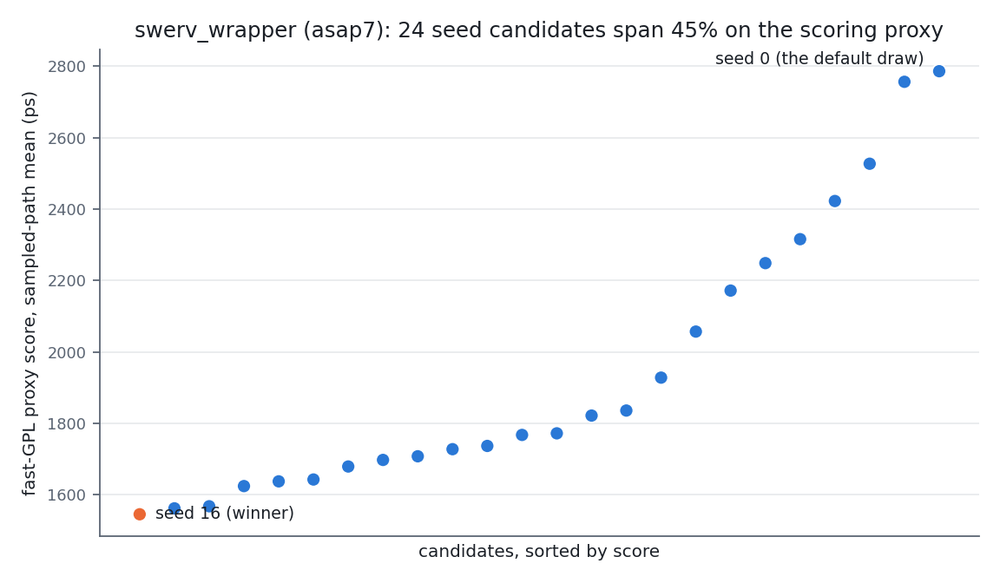

# How can we improve RTL-MP?

Written for OpenROAD maintainers. This is an FYI, not a feature
request: an account of what we needed from RTL-MP, what we measured,
and the small set of properties that turned out to matter — so the
conclusions are usable whether or not anyone acts on them. Two
independent routes arrived at the same architecture: the Partcl
macro-placement contest proved it at competition scale, and we got
there by studying where our flow's noise originates — after a detour
worth telling, because RTL-MP is on the same detour today.

To find out how to improve RTL-MP, we have to start somewhere that
looks unrelated: a misconception, the fool's errand it launched, and
the road back.

## 1. The misconception

We knew we couldn't have an infinitely fast global-route estimator.
The field has chased fast route estimation for thirty-plus years —
RISA's net-weighted bounding boxes (Cheng, ICCAD 1994), probabilistic
congestion maps, RUDY (DATE 2007), today's ML routability predictors
(RouteNet, ICCAD 2018, and descendants) — without producing a general
oracle. Our mistake was subtler than chasing it anyway: **because we
couldn't have it, we concluded it must be what we needed.**

## 2. The fool's errand

So we lifted the restriction. Not a *general* fast GRT estimator — a
decent one *for our design*. The estimation ladder in
`test/estimation_ladder/` is that attempt, and without macros it was
encouraging: single-digit-percent period error at 10–20x speedup, and
one correction term (pre-route optimism is nearly uniform) removes
most of the error. Then we took macros into account, and the error
was much worse than single digits. It looked like it had all ended in
tears.

## 3. The real question

It hadn't — we had been answering the wrong question. What we
actually need to know is **whether a PR is an improvement, in
quantifiable KPI terms**: quickly and locally for quality of life
(AI-assisted iteration), and on the server in PR CI (satisfying to
see). Global route itself we'd plot *over time*, not per-PR. That is
a comparison problem, not a prediction problem — and comparisons are
governed by noise, not by estimator accuracy.

One scoping rule before any data: **"improve" here means clock
period.** Area and power come later. We separate concerns and push
one axis at a time — not because the axes aren't interlinked, but
because this is design-space exploration: if an individual axis
cannot be pushed to the goal on its own, the combined point does not
exist on the product's Pareto front, and it is cheapest to learn that
early. Area and runtime are still recorded next to every period
verdict, but as diagnostics (they expose repair buying period with
area and runtime — effort masking), never as consolation prizes.

## 4. Where the noise lives

So we measured where the noise originates (`stage_variance`, PR #866
and successors). Downstream of a fixed macro placement this flow is
quiet — sigma 0.7–1.4% on the achieved period. The macro placer's
response to its inputs swings the achieved period ~25%. Choosing a
macro placement is choosing the downstream outcome. A finding worth
its own sentence along the way: **timing-driven global placement adds
noise but does not improve the ability to compare.**

None of this is a defect in OpenROAD. Andrew B. Kahng and Stefanus
Mantik measured it across industry tools a generation ago
(*Measurement of Inherent Noise in EDA Tools*, ISQED 2002,
https://vlsicad.ucsd.edu/Publications/Conferences/131/c131.pdf):
meaning-preserving perturbations of a tool's input move results by
amounts comparable to claimed optimization improvements. Seed sweeps
are unavoidable — in commercial flows and in OpenROAD alike. That is
the nature of the problem, not a flaw in the software.

**A single run is a draw.**

## 5. Back to RTL-MP: the same errand in miniature

RTL-MP's annealing cost is a fast estimator of downstream outcome —
computed on a coarse clustered model, mid-anneal, on the near side of
global placement, CTS, routing and all their repair. It is our fool's
errand run under strictly harsher conditions: we failed to build a
usable estimator *with the whole netlist placed*; the anneal's
estimator sees less than that.

We audited it (`macro_score`, on multiplier_top): the probability the
objective picks the better of two of its own placements by achieved
period at grt is a **coin flip** (~0.47 raw, n=19). It predicts area,
not period. And the reasons it cannot be fixed in place are
structural, verified against the mpl source and by run:

1. **No evaluate API.** `src/mpl/src/mpl.i` exposes only the placer,
   `place_macro`, and guidance/halo/blockage setters. The Total Cost
   it prints is **normalized per run**
   (`SimulatedAnnealingCore<T>::calNormCost`), so even its own totals
   are not comparable across two runs. Only the RAW component values
   in the debug penalty table (`set_debug_level MPL
   hierarchical_macro_placement 1`) are placement properties.
2. **The search space is sequence-pair packings**
   (`packFloorplan`). Forcing the annealer onto an arbitrary target
   geometry via guidance regions fails structurally — measured 80–247
   um of non-compliance, including against the placer's own winner.
3. **The model is clustered.** Whatever terms are added to the cost,
   they are evaluated on cluster abstractions before the fog; the
   information needed to rank placements by flow outcome is not
   present at that point in the run.

Improving that estimator is the errand we just abandoned, and it
should be abandoned for the same reason. The good news is that
nothing needs it to be better.

## 6. Distributions: what to do instead of estimating better

The reframe that worked for us works here. Stop asking the placer's
estimator to be right; treat the placer as what it already is — **a
generator of draws from a distribution** — and put the intelligence
in how a draw is selected.

The distribution is real and wide. On asap7 swerv_wrapper (~28 SRAM
macros in three fakeram sizes — a design where big-vs-small channel
formation gives congestion something to do), 24 seeds of
`rtl_macro_placer -random_seed` span **45%** on a post-placement
sampled-path metric, and the default draw — seed 0, what every
unselected flow ships — happened to be the worst of the 24:

(Read this as a distribution plot, not a validation plot: the curve is
monotone by construction — any score sorted against itself looks this
smooth, a random one included. What it shows is the spread and where
the unselected default lands. Whether the score *ranks* correctly is a
question about score vs independent outcome — the two-row figure
below.)

Best-of-k arithmetic says what selection is worth: the expected gain
of taking the best of k draws from spread sigma is roughly
sigma·sqrt(2·ln k) — strongly worth having at k around 10–20,
diminishing after. For A/B comparisons (a PR gate), pair the
candidate seeds between arms so selection bias cancels.

But selection only converts variance into QoR **if the selector can
rank** — and ranking requires a score measured on the far side of the
fog. A fast non-timing-driven global placement is such a score: it
prices density and congestion implicitly by doing the placement, at
~70 s per candidate on swerv_wrapper. The in-anneal cost cannot be
such a score even in principle (section 5). The figure below is the
direct comparison — the same 24 candidates, the same design, the same
flow outcomes at grt; only the x-axis changes between rows:

*[Figure: score_vs_flow — row 1: RTL-MP objective (raw debug-table
components recombined under one fixed normalization) vs flow KPIs at
grt; row 2: fast-GPL proxy score vs the same KPIs. One point per
candidate, Spearman rho with bootstrap 95% CI per panel, the
±delta_tie band from the design's own stage_variance walk shaded on
the timing panels. Generator: `test/estimation_ladder/score_vs_flow.py`;
the panel data lands when the swerv evaluate campaign completes.]*

Two disciplines come with the distribution view, both borrowed from
the noise work:

- **Ties below the noise floor are ties.** Every verdict is published
  next to the design's own measured resolvable delta (delta_tie from
  its stage_variance walk). A selector must never be rewarded for
  predicting noise.
- **Gate on aggregate KPIs, not extremal ones.** The fog forgives the
  worst path but transmits the aggregate: on achieved period (a max),
  winners and deliberately scrambled placements overlap; on the mean
  of the sampled worst-25% paths they separate by ~20%. Report
  runtime and std-cell area next to period — repair rescues bad
  placements by spending grt runtime (>10x observed) and area, and a
  period-only verdict credits that trade as free.

## 7. The external proof

The winners of the Partcl × Hudson River Trading macro-placement
challenge arrived at this architecture independently, at competition
scale: multi-start seed generation with physical diversity, external
candidate ranking, pick the winner. Their scoring intelligence lived
in the **ranker**, not in the generator — and they found congestion
dominates once wirelength saturates (they re-tuned to WL + density +
2.5·congestion against the contest's WL + 0.5·density +
0.5·congestion, with finals judged on real OpenROAD flow outcomes).

- Contest: https://github.com/partcleda/macro-place-challenge-2026
- Winner write-up (ArchGen): https://www.archgen.tech/blog/posts/how-we-ranked-first-in-the-partcl.html
- TILOS MacroPlacement (proxy-cost lineage, BSD-3): https://github.com/TILOS-AI-Institute/MacroPlacement

If a flow's measured proxy ever proves blind on some KPI, the upgrade
path is theirs: an analytic ranking score (grid HPWL, top-decile
density, RUDY-style congestion, congestion weighted up) — in the
ranker, computed against ODB directly. Never in the anneal.

## 8. What RTL-MP needs to be

Not smarter — **usable as a distribution generator**. Four
properties, each small, each with a minimal reproducer verified
against stock master and filed as an issue. We carry fixes as patches
in bazel-orfs (drop-at-bump notes in its MODULE.bazel) while mpl is
churning, and will re-upstream when it settles:

1. **Seedable and deterministic**: `rtl_macro_placer -random_seed` —
   same seed, same placement; different seed, an independent draw.
   (Feature; carried as a patch, returns as a PR.)
2. **Re-entrant**: today a second `rtl_macro_placer` call in one
   process segfaults — the physical hierarchy tree is destroyed at
   the end of `run()` and only ever created in the constructor.
   Issue: The-OpenROAD-Project/OpenROAD#11277.
3. **Round-trips its own output**: the Snapper rounds up at the
   top/right core edge, so winners poke a snap residue past the core
   and `place_macro` rejects the placer's own
   `-write_macro_placement` file with MPL-0034.
   Issue: The-OpenROAD-Project/OpenROAD#11278.
4. **Injection equals production**: with every macro fixed, the
   MPL-0013 skip path omits the temporary std-cell seeding and the
   macro soft blockages that every generating run produces — a
   re-injected placement diverges ~2% downstream from the run that
   generated it, with bit-identical macro geometry.
   Issue: The-OpenROAD-Project/OpenROAD#11279.

With 3 and 4 in place, materializing a selected winner by its
coordinates (`MACRO_PLACEMENT_TCL`) is honest; without them, re-run
the winning seed instead.

Explicitly **not** needed, and we say so having started down each
road: a better in-anneal cost function, an evaluate-only API for
external placements (`report_macro_placement_cost`), or a congestion
term in the SA objective. The audit's objective scores come from the
existing debug tables; the selection intelligence lives outside.

## 9. The recipe, as a flow adapts it

What we run today (bazel-orfs `test/estimation_ladder/`,
`macro_select.tcl`, PR #868 stacked on #867):

1. **Generate**: one production floorplan spine, then k seed
   candidates, each running the production `macro_place.tcl` with
   `-random_seed` appended to the flow's own argument list. Fork
   children off the shared spine; candidates are single-threaded and
   embarrassingly parallel.
2. **Score**: the fast non-timing-driven global placement rung per
   candidate (`RUN_MACRO_PLACE=1, RUN_PLACE=1`, TD/RD off), then the
   shared sampled-path instrument. Measured on a 24C/48T machine:
   12-way parallel is the throughput knee at **65 candidates/hour**
   (serial multi-threaded is 3x slower — GPL saturates on internal
   parallelism; jobs=24 buys 1% for double the latency). k=24 costs
   ~22 minutes: nightly-affordable, and PR-gate-affordable for the
   designs that matter.
3. **Select** on an aggregate sampled-path KPI (never WNS), publish
   the verdict next to delta_tie, and materialize the winner.

First A/B on swerv_wrapper at grt (n=1 per arm, delta_tie walk in
flight): on the goal axis — period — the selected placement wins the
macro-path mean by 11.2% and gives up 2.9% on the extremal achieved
period, a delta whose significance is exactly what the noise floor
will decide. The −4.5% std-cell area rides along as a diagnostic
(less repair effort spent), not as the verdict. That the
proxy and grt disagree by a hair on the general-path aggregate is the
P_pick question, now being quantified on this design with the same
audit math that condemned the objective.

## 10. Evidence trail

- PR #867: the audit — stage variance decomposition, the macro_score
  campaign, the KPI discipline.
- PR #868: the selector — carried patches, calibration, the
  swerv_wrapper campaign, this document's figures.
- OpenROAD issues #11277, #11278, #11279 — minimal reproducers,
  verified against stock master.
- Carried patches: `patches/0040..0043-openroad-mpl-*.patch` in
  bazel-orfs, with drop-at-bump notes tied to the issues.
- Kahng & Mantik, ISQED 2002; RISA, ICCAD 1994; RouteNet, ICCAD 2018
  — the literature anchors for sections 1 and 4.
