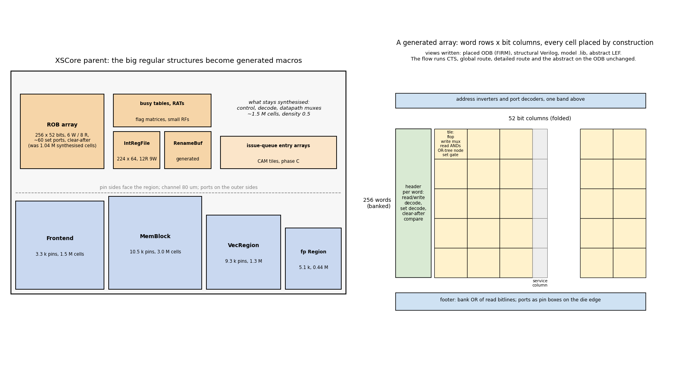

# The big regular structures become generated macros

*Plan, 2026-09-21, for the record in PR #1055.*

## Why

Take 21's placed parent, read through odb-debug: 3.85 M cells in a
1.2 x 1.1 mm blob between the four hardened blocks, bins up to 87 %, and
the 18 densest bins owned half by the reorder buffer, a quarter by
dispatch's tables and a quarter by the memory-control tables. The ROB is
256 copies of `RobEntryCell(idx[8:0], in[3618:0]) -> entry[51:0]`: every
entry receives the same 3 619-bit bus and decodes locally, 926 000
broadcast pin-bits and 4 000 cells to hold 52 bits of state. Yosys cannot
share that decode across entries, global placement cannot spread it, CTS
drops its buffers into it, and the legaliser after CTS ran five hours
(negotiation) and past two (diamond) re-seating it.

These are not jobs for general synthesis and placement. A real core of
this class has its reorder buffer, register files, rename and busy tables
and issue-queue arrays as compiled structures. The literature has said so
since the reorder buffer was invented: Smith and Pleszkun (IEEE TC 1988),
Sohi's RUU (1990), the R10000 active list (Yeager, IEEE Micro 1996) are
circular buffers with decoded, indexed updates; Palacharla, Jouppi and
Smith (ISCA 1997) give the wire-delay reason the issue window and the
register file are the structures that set the clock; Rixner et al. (HPCA
2000) and Zyuban and Kogge (ISLPED 1998) the port-count scaling that
makes a many-ported file a macro everywhere.

`tools/structured_gen` already builds XiangShan's six register files that
way: a C++ generator linked against OpenROAD's own database, a `key
value` spec naming the RTL module and its ports, and out come a placed
ODB (every cell FIRM, by construction), a structural Verilog netlist, a
model Liberty and an abstract LEF; the flow runs CTS, global route,
detailed route and the abstract on the ODB unchanged, and swaps the macro
in for the RTL module by name.

## The plan

1. **Generator: entry arrays.** Two new port kinds in the spec and two
   gates in the tile: `set <valid> <idx> <bit>`, a writeback channel that
   decodes a 9-bit index once in the header and sets one flag bit in that
   word; `clear_after <valid> <idx>`, the redirect, one 9-bit comparator
   per word. The 52-bit entry is the word, the six enqueue channels are
   the write ports, commit and walk the read ports. Tiling, decoders,
   banking and views are reused as they are.
2. **RTL: the ROB's array as a module.** A Chisel patch in the XiangShan
   fork extracts the entry array from `Rob` into a module with the
   generator's port shape (payload write ports, flag set ports,
   clear-after, read ports), leaving pointers, commit and exception logic
   in RTL. The update rules per field come from `Rob.scala`; the
   generated array reproduces them exactly.
3. **Correctness: one-off equivalence.** The generated netlist and the
   extracted RTL module have the same state bits (one flop per entry
   bit, same reset), so the check is combinational equivalence under a
   register correspondence: a logic equivalence check between the RTL
   module and the generated structural Verilog, run once per generator or
   RTL change, plus the study's CoreMark simulation as the end-to-end
   check.
4. **Flow: the macros in the parent.** `STRUCTURED_MEMORIES` in the
   planned parent for the ROB array, `IntRegFile` and `RenameBufferFile`
   (the plan variant had dropped them; they are flops in the blob today).
   The parent's plan re-derived from its measured cells (about 1.5 M
   after the arrays leave) at density 0.5, with the partner pin segments
   and an 80 um channel floor.
5. **Then the next arrays, by the same measure**, cell area and port
   shape: dispatch's busy tables and rename tables (flag matrices and
   small register files), the memory-control tables, the LSQ's queue
   payloads inside MemBlock, and, as a third tile kind, the issue-queue
   entries' CAM match.

## What it costs and returns

| step | effort | returns |
|---|---|---|
| 1 generator ports | a day | ROB array as a macro: 1.04 M cells out of the parent, the broadcast gone |
| 2 Chisel patch | half a day, plus the read of `Rob.scala` | the module the flow swaps by name |
| 3 equivalence | hours once the netlists exist | the correctness argument, reusable per change |
| 4 parent take | one flow day | the first global route of a parent whose clock tree is small and even |
| 5 next arrays | one to two days each | the parent shrinks toward control and muxes |

## Rules

- A structure goes to the generator when it is regular (words x bits,
  ports), large (100 k cells or more), and flop-dense; the tangled
  control logic stays synthesised.
- The RTL patch extracts, it does not redesign: the same state, the same
  update rules, a module boundary where the generator's ports are.
- Every generated macro is equivalence-checked against the module it
  replaces before a take uses it.

## Progress

- **2026-09-21, step 1 and 2 as one patch.** The ROB's entry payload did
  not need a new generator: the fields written once at enqueue are a
  plain multi-port register file, so XiangShan patch 0008 extracts them
  into `RobEntryFile`, a `utils.RegVecFile` (8 write ports at the allocate
  pointers, 16 read ports for the eight banks' two lines, 352 x 21 bits),
  and `RobEntryFile.regfile` hands it to `structured_gen` as it stands.
  The cell keeps its read-modify-write state and a shared bus of a few
  dozen bits per enqueue port instead of the whole uop. The planned
  flows now harden the generated register files of every module they
  keep (the parent: `IntRegFile`, `RenameBufferFile`, `RobEntryFile`;
  Frontend: the Ftq queues), and the plan's macro placement marks the
  planned blocks FIRM and lets `rtl_macro_placer` place the parent's own
  macros around them. Take 22 runs it. The `set` and `clear_after` ports
  of the plan's step 1 are still wanted, for the flag matrices (the ROB's
  remaining state, the busy tables) in step 5.
- **2026-09-21, placed netlists.** A macro is right only for a terminal
  block at an edge with a narrow, registered interface; an array in the
  middle of the logic as a macro costs the parent its cross-boundary
  placement, clock tree and routing and a wall of pins to route around.
  ORFS patch 0078 adds `mode netlist` to a STRUCTURED_MEMORIES spec: the
  module stays blackboxed in synthesis (no abc on it), the generator's
  structural netlist is linked when the design loads, and at floorplan
  its placed cells are dropped FIRM onto the parent's rows where
  `STRUCTURED_PLACEMENT` says, site- and row-snapped with the row
  orientation matched; tapcell, global placement and the legaliser treat
  them as fixed, the clock tree and the router as ordinary cells. Proven
  on `test/structured_netlist` (a 16 x 8 two-port file inside a parent:
  1 440 cells FIRM at the planned corner, parent cells placed around).
  The planner emits `netlists.txt`, the parent's arrays in a row along
  the top of its logic region. The table's macro/netlist column is now:
  the four planned blocks are macros; every generated array is a placed
  netlist inside its block or the parent.

## Generator depth backlog (2026-09-21)

What take 23's first synthesis on slang still spent ABC time on, per
module, and whether a generator should own it. Two thirds of every
session below is one single-threaded ABC call.

| module | synth | what ABC chews | generator |
|---|---|---|---|
| Rob | 995 s | 6 417 nine-bit pointer compares, 352-wide and/or trees, 16 x 352-way one-hot muxes over the 352 `RobEntryCell` (30 bits each); the 21-bit file is generated (xiangshan-timing.md entry 9) | flag matrix for the cells' state; pointer-window read (eight consecutive entries at a rotating pointer); fork patch 0009 shares the decode |
| Region_1 (fp) | 727 s, 8.4 GB | `DataPath_1`, `BypassNetwork_6` wide muxes; four fp issue queues | bypass network as a generated mux tile; issue queues as CAM tile plus payload |
| PhysicalStoreQueue | > 5 min | 64 `SqEntryCell` x 249 bits (vaddr 50, paddrHigh 36, data 128, mask); `ForwardModule` 3 086 lines and no registers, the store-to-load compare of a query address against all 64 entries with byte masks; `DeqModule` window read | payload file + address CAM + window read; the RTL keeps the pointers |
| SqForwardPipe | 447 s | the age-ordered 64-entry x 16-byte forward select over 685 register bits | the same CAM and priority tile |
| LoadQueueReplay | 430 s | per-entry replay state and selection | flag matrix + payload file |
| MissQueue, L2TLBWrapper | 227 s each | entry match, TLB compare | CAM tile |
| Rename | 217 s | RAT with snapshots | snapshot-copy file |
| Region (int) | 185 s | `DataPath`, `BypassNetwork` over the generated IntRegFile | bypass mux tile |
| SSIT | 176 s | a table | plain extraction |
| IBuffer, Sbuffer | not reached (15 k and 39 k lines) | instruction buffer; store buffer with masked writes | plain extraction; masked-write port |
| VecRegionModule's four IQs | not reached (26 k lines each) | vector issue queues | CAM tile + payload |
| Bpu 547 s+, Ifu 328 s, DecodeStage 180 s, NewCSR 179 s, DCacheWrapper 241 s, Tage 208 s | | predictor, fetch and predecode, decoders, CSRs, cache control, table logic around blackboxed SRAMs | nothing for it: real logic |

The store queue is the clearest case for going deeper: one payload file
with 64 entries, one address CAM feeding the forward select, one window
read, and the RTL keeps only the pointers, the way Rob should end up.
Order of work is execution optimisation only; all of the "generator"
rows are wanted before the parent is asked to route.

## Correctness: kepler-formal, wired in bazel

yosys equivalence (eqy) does not scale to a 224 x 64 file with 21 ports
and is not the tool. The check per generated structure is kepler-formal
(github keplertech/kepler-formal), LEC on Verilog with a liberty library,
which requires the same sequential boundaries and the same names for
sequential instances and top terminals in both designs. So
`structured_gen` names its flops after the RTL registers it replaces,
bit by bit, and the check runs per module against the RTL side mapped
to the same liberty cells. Wire it up here in bazel, as a dev dependency
on the latest upstream (the tool is being fixed rapidly; never pin an old
release or a local checkout). Not started.
