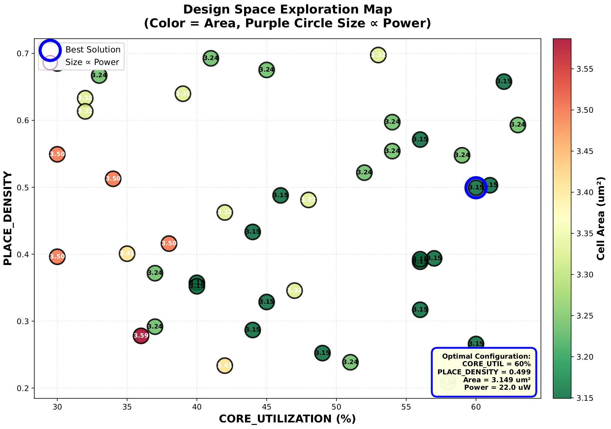

# Optuna-Based Design Space Exploration (DSE)

Parameter optimization using Optuna to find optimal design parameter combinations that meet timing constraints.

## Experiment Design

**Goal**: Find optimal CORE_UTILIZATION and PLACE_DENSITY at a fixed clock frequency to minimize area (or area + power).

**Why Optuna?**
- Design parameter space is **multi-dimensional** (CORE_UTILIZATION × PLACE_DENSITY)
- Brute-force search of multiple dimensions is impractical
- Optuna's TPE algorithm efficiently finds near-optimal solutions
- Supports constrained optimization (must meet timing) and multi-objective optimization (area + power simultaneously)
- Optuna shines in simplicity and good results for limited effort. No need install or configure a server for remote execution.

## Screenshots



## Quick Start

### Main Tool: Parameter Optimization (Recommended)

```bash
# Single-objective: Minimize area
bazelisk run //optuna:_optimize_dse_impl -- --n-trials 20

# Multi-objective: Minimize area and power (Pareto frontier)
bazelisk run //optuna:_optimize_dse_impl -- --multi-objective --n-trials 30

# Custom parameter ranges
bazelisk run //optuna:_optimize_dse_impl -- \
  --min-util 30 --max-util 70 \
  --min-density 0.2 --max-density 0.7 \
  --n-trials 25

# View help
bazelisk run //optuna:_optimize_dse_impl -- --help
```

## Command Line Options

- `--min-util INT`: Minimum CORE_UTILIZATION % (default: 30)
- `--max-util INT`: Maximum CORE_UTILIZATION % (default: 70)
- `--min-density FLOAT`: Minimum PLACE_DENSITY (default: 0.20)
- `--max-density FLOAT`: Maximum PLACE_DENSITY (default: 0.70)
- `--n-trials INT`: Number of optimization trials (default: 20)
- `--seed INT`: Random seed for reproducibility (default: 42)
- `--multi-objective`: Enable multi-objective optimization (area + power)
- `--output-dir PATH`: Output directory for results (default: optuna/results)

## Experiment Flow

1. **Fixed constraint**: Clock period = 72ps (~13.9 GHz)
2. **Search parameters**:
   - CORE_UTILIZATION: 30-70%
   - PLACE_DENSITY: 0.2-0.7
3. **Timing constraint**: Slack ≥ 0 (must meet)
4. **Optimization objectives**:
   - Single-objective: Minimize cell_area
   - Multi-objective: Minimize (cell_area, power) → Pareto frontier

## Output Results

Results are saved in `optuna/results/` by default (customizable via `--output-dir`):

### Single-Objective Optimization
- **optuna_dse_results.txt**: Best solution and all feasible trials
- **optuna_dse_results.pdf**: 5 plots
  1. CORE_UTILIZATION vs Area
  2. PLACE_DENSITY vs Area (colored by Power)
  3. Area vs Power (Pareto frontier if multi-objective)
  4. Optimization history (convergence curve)
  5. Parameter space heatmap

## Research Questions Answered

- "What is the optimal CORE_UTILIZATION to meet timing?"
- "How does PLACE_DENSITY affect area and power?"

## Technical Details

### DSE Configuration

Tight constraints ensure parameter effects are visible:
- **Clock period**: 72 ps (~13.9 GHz) vs default 1500 ps
- **Timing-driven optimization**: Enabled (GPL_TIMING_DRIVEN=1)
- **Area/power tradeoff**: Controlled via CORE_UTILIZATION

### PPA Metric Extraction

- `extract_ppa.tcl`: Extracts from CTS stage:
  - Performance: frequency, slack, achievable_period
  - Power: estimated based on cell count (FF ~2uW, combo ~0.5uW)
  - Area: die_area, core_area, cell_area, utilization

### Optimization Algorithm

- Sampler: TPE (Tree-structured Parzen Estimator)
- Constraint handling: constraints_func (slack >= 0)
- Single-objective: direction="minimize"
- Multi-objective: directions=["minimize", "minimize"]

## Files

- `optimize_dse.py`: Main DSE optimization script (~450 lines)
- `extract_ppa.tcl`: PPA metric extraction script
- `extract_timing.tcl`: Timing metric extraction script
- `constraints-dse.sdc`: Tight timing constraints (72ps clock)
- `BUILD`: Bazel build configuration

## Future Work

- Add a simple Chisel design that can be parameterized
- Drive a study that finds highest throughput (computation width * clock frequency) and maximum compute/energy
