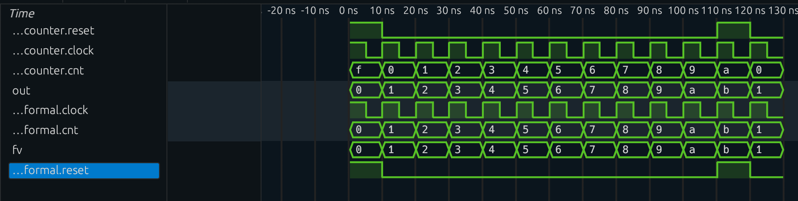

# Chisel testing with sby

Test example, which should succeed:

    bazelisk test //sby:counter_test

Modify Counter.scala to have an error and re-run with:

    bazelisk test //sby:counter_test --sandbox_debug

In the output look for:

    Files found in /home/.../.cache/bazel/.../sby/counter_test.run.sh.runfiles/_main

Run:

    find /home/.../.cache/bazel/.../sby/counter_test.run.sh.runfiles/_main -printf "%P\n"

Which outputs all the files sby used:

    sby
    sby/counter_test_bmc
    sby/counter_test_bmc/logfile.txt
    sby/counter_test_bmc/status
    sby/counter_test_bmc/model
    sby/counter_test_bmc/model/design.log
    sby/counter_test_bmc/model/design_smt2.ys
    sby/counter_test_bmc/model/design_smt2.log
    sby/counter_test_bmc/model/design_prep.ys
    sby/counter_test_bmc/model/design.il
    sby/counter_test_bmc/model/design_prep.il
    sby/counter_test_bmc/model/design.ys
    sby/counter_test_bmc/model/design_prep.log
    sby/counter_test_bmc/model/design_smt2.smt2
    sby/counter_test_bmc/model/design.json
    sby/counter_test_bmc/engine_0
    sby/counter_test_bmc/engine_0/logfile.txt
    sby/counter_test_bmc/engine_0/trace.smtc
    sby/counter_test_bmc/engine_0/trace_tb.v
    sby/counter_test_bmc/engine_0/trace.vcd
    sby/counter_test_bmc/engine_0/trace.yw
    sby/counter_test_bmc/src
    sby/counter_test_bmc/src/counter.sv
    sby/counter_test_bmc/config.sby
    sby/counter_test_bmc/FAIL
    sby/counter_test_bmc/counter_test_bmc.xml
    sby/counter_test_bmc/status.path
    sby/counter_test
    sby/counter_test/status.sqlite
    sby/counter.sv
    sby/counter_test.sby
    sby/counter_test.run.sh

## vcd file in the case of a failure

Of particular interest is the .vcd file seen above in the case of a failure.

