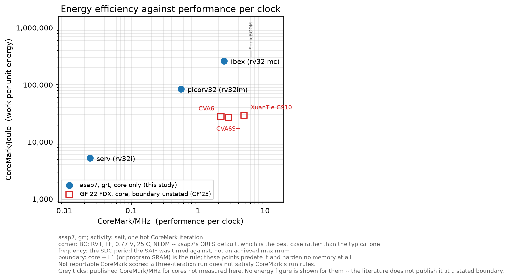

# CoreMark/MHz and CoreMark/Joule for Four RISC-V Cores on ASAP7, from an Open and Re-runnable Flow

*As of September 2026, this is the best we could do.* Four RISC-V
cores, SERV, picorv32, ibex and VeeR EH1, are hardened on ASAP7 with
OpenROAD and measured for CoreMark/MHz and CoreMark/Joule at global
route, with the switching activity taken from one hot CoreMark
iteration. Every input is open and pinned, so the whole chain re-runs
with one command, and a later reader with better tools or more time can
move every number here.

The study was done in a few days with Claude Code on the bazel-orfs
framework, OpenROAD and ORFS. The cost was CPU time, in the days, and
a token spend that never became a concern. A study of this shape --
several cores, a hardened netlist for each, an activity capture and a
power engine, with every intermediate checked -- would have been
uneconomic without that combination. It is offered as an example of
the kind of question a reader can now put to bazel-orfs directly: state
the question, spend the compute and some tokens, and get a measured
answer with its limitations attached.

We found no other published comparison that meets all three of: more
than one core hardened to an ASIC netlist, activity from CoreMark
itself, and open re-runnable inputs. FPGA implementations are excluded,
since an FPGA's Joules belong to the fabric. EEMBC's ULPMark-CM
leaderboard [2] has dozens of MCUs measured on silicon, one core each,
and a seven-core survey [15] reports the metric directly, at 8.7 CoreMark
iterations/mJ for ibex, on what it calls an ASIC prototyping platform and we
read as an FPGA; the closest published
comparison at a modern node [5] pairs CoreMark/MHz with power measured
on a different benchmark; and two comparisons of two and three small
cores [12, 13] measured CoreMark energy with PrimeTime in 65 nm
processes, which a reader can cite but not re-take. [§4.5](#45-what-else-could-be-plotted-and-why-almost-nothing-can) records
that check against the literature, dated.

We examine CoreMark and only CoreMark, on purpose, for two reasons. It
is the one benchmark every core already reports, so a CoreMark energy
figure is the only one with a comparator on every datasheet and in
every README; a study measured on anything else produces a number
nobody can set beside another. And its whole working set fits inside a
core + L1, which is exactly the boundary this study draws and
verifies ([§3.1](#31-the-measurement-boundary)). Nothing here speaks to workloads that leave it.

**A measurement study in the bazel-orfs repository.** The flow targets are
not in CI and the parsers and number checks are; Table 1 and every ratio the
prose quotes are rendered from `results.json` and checked against it by a
test. [§10](#10-running-it-and-adding-your-own-core) is how to run any of it,
and how a fifth core joins.

---

## Contents

- [Abstract](#abstract)
- [Limitations, ranked](#limitations-ranked)
- [1. Introduction](#1-introduction)
- [2. Background](#2-background)
- [3. Method](#3-method)
- [4. Results](#4-results)
- [5. Threats to validity](#5-threats-to-validity)
- [6. What the flow got wrong](#6-what-the-flow-got-wrong)
- [7. Related work](#7-related-work)
- [8. Further work](#8-further-work)
- [9. Conclusion](#9-conclusion)
- [10. Running it, and adding your own core](#10-running-it-and-adding-your-own-core)
- [11. Licensing](#11-licensing)
- [Appendix A. Commodity silicon on the same axes](#appendix-a-commodity-silicon-on-the-same-axes)
- [References](#references)

---

## Abstract

CoreMark/MHz is reported for almost every open-source RISC-V core;
CoreMark/Joule almost never is, because the energy half needs a
hardened netlist, a switching-activity capture, and a power engine, and
each of the three has a way of producing a plausible number that is not
a measurement. We build the whole chain in a reproducible flow —
CoreMark ELF, RTL simulation, CRC gate, synthesis, global route,
gate-level simulation, SAIF over one hot iteration, `report_power` —
and screen at global route so a point costs minutes rather than hours.
We report four cores on ASAP7: SERV (0.0243 CoreMark/MHz), picorv32
(0.5531), ibex (2.4543) and VeeR EH1 (4.7979), spanning nearly two
hundred times in performance per clock.

**Every point is measured at the same stated boundary — the core and
its L1, and nothing beyond it — and the boundary is verified rather
than asserted.** Cores with no cache are hardened together with the
tightly-coupled memory they execute from; each wrapper counts every
transfer that leaves the hardened block, and for all four cores one hot
CoreMark iteration sends **zero**. Closing that boundary is itself the
study's largest result: it costs the cacheless cores **between 3.3x and 5.1x** of their CoreMark/Joule, with CoreMark/MHz unchanged to every
digit, and it compresses the ordering: ibex reads 13.45x better than VeeR
EH1 when its memory is outside the measurement and 4.08x better when it
is inside. Any CoreMark/Joule quoted for a small core without stating
whether its memory was measured is uninterpretable at roughly an order
of magnitude.

The study's central methodological contribution is negative and
checkable. OpenSTA does not fail when a pin carries no annotated
switching activity: it estimates one, and the estimate is
indistinguishable from a measurement in the report. We therefore
enumerate every pin, classify every pin the SAIF did not reach, and
bound what the estimator could be worth by sweeping the default
activity across its entire range. For the three cacheless cores the
SAIF annotates **100 % of pins** (28,264 / 53,694 / 81,165), **zero**
are unannotated, and for all four cores the SAIF-driven total is
bit-identical at ten significant figures across the whole sweep, while
the same sweep moves the vectorless total by 21--144 %. The energy
numbers are therefore free of OpenSTA's probabilistic activity model: it
contributes nothing to them. That is not the same as saying the SAIF
determines all of them, and the difference is worth stating. A clock-network
pin takes $2/\mathrm{period}$ from the SDC whether or not the SAIF reached
it ([§2.2](#22-what-opensta-does-with-an-unannotated-pin)), and the clock group
plus the clock-pin-driven share of sequential and macro internal power is most
of every point ([§4.7](#47-where-the-power-goes)) -- which is why a SAIF time
base wrong by 2.14x moved one core's total by 2.9 %
([§6.1](#61-the-saifs-time-base-has-to-be-the-sdc-period)). What the SAIF
determines is the combinational term and the data-pin share of the rest; what
the SDC determines is the clock. Neither is an estimate.

The shape the points make is reported with its diagnosis. The three
cacheless cores lie close to a line in log--log axes; extrapolating it to
VeeR's performance overpredicts VeeR's efficiency by **7.88x** with every
memory inside the boundary and by **15.2x** with the cacheless cores'
memories outside it ([§4.6](#46-is-the-shape-real-the-boundary-and-the-memory-model), [§4.2](#42-what-the-boundary-costs)), so the boundary was most of the
disagreement, and the line that remains is the memory model's,
and we report that inversion rather than the confirmation alone, because
it is what the data supports: **CoreMark/Joule is not yet a
discriminating axis among cores of this class.**

The limitations are listed and ranked below, and quantified or bounded in
[§5](#5-threats-to-validity); the largest by far is that every memory is a
fitted view rather than a characterised one. [§4.8](#48-cross-checks-against-the-nearest-published-studies) checks the numbers
against the three nearest published studies, measures the one disagreement down
to the netlist, and reports what is left unexplained.

---

## Limitations, ranked

In the order they move the numbers. Each is quantified or bounded in
[§5](#5-threats-to-validity).

1. The memory model is a fitted one, not a characterised one: every SRAM
   is `tools/memory_macro_scaler`'s view, whose energy and leakage follow
   the memory's shape after CACTI's decomposition but whose fit its own
   documentation calls a first-order anchor, and memory is 66 to 78 %
   of every point ([§5.1](#51-the-memory-model-and-the-memory-this-study-chose), [§8.7](#87-a-memory-model-that-knows-its-size)).
2. Every point has an error bar from five placement seeds, and the
   largest 2σ is 1.5 % of its point, and a gap inside that did not
   resolve ([§5.11](#511-five-placement-seeds-behind-every-point)).
3. The corner is the kit's best case: fast process, high voltage ([§5.6](#56-the-corner-is-asap7s-best-case-not-its-typical)).
4. The simulation is zero-delay and carries no glitch power ([§5.2](#52-zero-delay-simulation-carries-no-glitch-power)),
   which [§2.4](#24-when-glitch-power-is-worth-measuring-and-when-it-is-premature) argues is the right depth for a screening study and
   [§5.3](#53-glitch-power-in-the-multiplier-measured) spot-checks on the unit most exposed to it; the differential
   bias between cores is still an argument rather than a number, and [§5.4](#54-a-second-core-and-where-that-stops)
   records the second-core attempt that was to have measured it.
5. The parasitics are estimated at global route, not extracted ([§5.5](#55-estimated-not-extracted-parasitics--one-point-measured)).
6. Every frequency is a derived period from two passes of the
   period tuner on one floorplan; the second pass moved ibex by 14 ps
   and VeeR by 2 ps, and the floorplans have not been re-derived on the
   new memory views ([§5.7](#57-frequency-and-what-deriving-it-changed), [§8.4](#84-a-second-period-pass)).
7. The kit is predictive. No absolute Watt here is a silicon Watt ([§5.8](#58-a-predictive-kit-not-a-foundry-pdk)).

And one cross-check against published numbers comes back implausible
and, after measurement, still unexplained: ibex's post-synthesis energy
per CoreMark iteration here, at 7 nm, sits between two published 65 nm
figures for the same core at the same stage, where node scaling says it
should sit well below both ([§4.8](#48-cross-checks-against-the-nearest-published-studies)).

---

## 1. Introduction



**Figure 1.** CoreMark/Joule against CoreMark/MHz, both axes
logarithmic. Blue: measured here on ASAP7 at global route, with
activity from one hot CoreMark iteration. Red: a published GF 22 FDX
series, derived from another paper's numbers and drawn in its own
colour because it is not like-for-like ([§4.4](#44-a-22-nm-literature-series-and-what-it-is-and-is-not)).
Error bars on the blue points are 2σ over five placement seeds ([§5.11](#511-five-placement-seeds-behind-every-point)).

Two shaded regions place this study's cores against commodity silicon.
Both are drawn as regions rather than as markers: three parts stand in
for a class, and a marker beside these points would invite reading
silicon on N7, Intel 7 and N4 against a predictive 7 nm kit as one
trend.

The purple one is where **one x86 or Arm core** sits, and it is measured
rather than apportioned. Appendix A reads total power at the wall plug while
CoreMark runs on n active cores and attributes energy by the *slope* of
watts against active core count, which cancels the platform's fixed
draw and any systematic meter offset. Its stated boundary is "core and
its private caches" — the same boundary this study hardens and reports,
reached by a different route, which is what makes the comparison
possible at all. Three parts: a Threadripper 3970X (Zen 2), a Xeon 8558U
(Emerald Rapids) and an X Elite X1E78100 (Oryon), spanning 7.4 to 12.5 CoreMark/MHz
and 4,700 to 11,520 CoreMark/Joule.

What is *not* corrected: those are shipping parts on real nodes, and
these four are a predictive kit at its best-case corner ([§5.8](#58-a-predictive-kit-not-a-foundry-pdk), [§5.6](#56-the-corner-is-asap7s-best-case-not-its-typical)),
with estimated parasitics ([§5.5](#55-estimated-not-extracted-parasitics--one-point-measured)) and no glitch power ([§5.2](#52-zero-delay-simulation-carries-no-glitch-power)). The
comparison is between a measurement and a screen, and the screen is the
optimistic one.

The green region above is an observation, not a target. At the
performance per clock those cores reach, **nothing in this study, in
Appendix A, or in the literature series reaches that efficiency** — the
region is empty. Its floor is the top of the measured band and its edges
are that class's own range, so what it marks is the size of the gap a
design would have to cross to be a major advance rather than a better
point on a known curve.

<!-- table1 -->
| core | ISA | CoreMark/MHz | cycles/iter | f (MHz) | P (SAIF) | dynamic | leakage | CoreMark/Joule | memory inside the boundary | 2σ over seeds |
|---|---|---|---|---|---|---|---|---|---|---|
| SERV | rv32i | 0.0243 | 41,202,900 | 2283.1 | 54.7 mW | 54.7 mW | 0.00 mW | 1,013 | 32 kB instruction memory and 8 kB data memory | ±2 (5) |
| picorv32 | rv32im | 0.5531 | 1,807,889 | 2141.3 | 56.6 mW | 56.6 mW | 0.00 mW | 20,926 | 32 kB instruction memory and 8 kB data memory | ±105 (5) |
| ibex | rv32imc | 2.4543 | 407,448 | 771.6 | 22.5 mW | 22.5 mW | 0.00 mW | 84,167 | 32 kB instruction memory and 8 kB data memory | ±333 (5) |
| VeeR EH1 | rv32imc | 4.7979 | 208,425 | 627.7 | 146.0 mW | 145.8 mW | 0.02 mW | 20,629 | 16 kB instruction cache and 64 kB DCCM | ±317 (5) |
<!-- /table1 -->

**Table 1.** The four measured points, all at [§3.1](#31-the-measurement-boundary)'s boundary: the core
and its L1, or the tightly-coupled memory that stands in for one. Every
point is verified to send zero transfers outside the hardened block
during the iteration measured. [§4.2](#42-what-the-boundary-costs) reports what closing that boundary
cost — between 3.3x and 5.1x of CoreMark/Joule on the three cores that
had been measured without their memories, at unchanged CoreMark/MHz.
The last column is what each tile hardens inside the boundary; for the
three cacheless cores it is this study's choice, not the core's ([§5.1](#51-the-memory-model-and-the-memory-this-study-chose)).

The question is the shape of the curve: does spending area and
switching on a wider machine buy back its own energy? The literature
that answers it for large cores answers it with
signoff tools [5, 6]. For small cores it is mostly not answered at all,
and the reason is that the energy half of the metric is easy to get
wrong in ways that do not look like errors.

Three such ways shape the method below. A SAIF captured against one
netlist and applied to another does not fail — OpenSTA falls back to
default activity for the nets that did not match. A gate-level netlist
whose memory macro has no behavioural model does not report low memory
power — it computes the wrong answer, and only a functional check
notices. And a power report whose pins are largely unannotated is not
labelled as an estimate; it is labelled "Total".

By taking full advantage of RISC-V's unrestricted licensing, this
framework provides a completely open, peer-verifiable PPA baseline right
out of the box. Every core, the benchmark, the toolchain, the PDK and
the EDA flow are fetched from their own upstreams at pinned commits and
built by one command; there is no vendored RTL, no licensed tool and no
number a reader cannot re-take. For teams developing internal hardware,
the modular bazel-orfs setup makes it straightforward to drop your own
RTL into the flow: a core joins the study as a `config.mk`, a bus
adapter to the two-word platform of [§3.2](#32-the-chain), and a `units.json` ([§10.3](#103-adding-your-own-core) has the whole list) — and it
then inherits the annotation audit of [§3.5](#35-annotation-completeness-and-the-bound-on-the-estimator) and every gate in [§10.1](#101-re-running-the-study)
unchanged.

The contributions are:

1. A reproducible, fully automated CoreMark → CoreMark/Joule chain in
   an open flow, screened at global route ([§3.2](#32-the-chain)).
2. A performance metric that removes CoreMark's ten-second run rule
   from a problem no simulator can satisfy, with an automated test that
   its premise cannot rot ([§3.3](#33-performance-a-differential-iteration)).
3. An activity window anchored on an observable event in the benchmark
   rather than on an instrumented one ([§3.4](#34-activity-one-hot-iteration)).
4. **An automated, complete account that OpenSTA's probabilistic
   activity model does not enter the result** — enumeration,
   classification, and a measured bound ([§3.5](#35-annotation-completeness-and-the-bound-on-the-estimator), [§4.3](#43-annotation-completeness-and-the-estimator-bound)).
5. An explicit statement of the boundary the study intends, of the gap
   between it and these four points, and of the direction of every
   remaining bias ([§5](#5-threats-to-validity)).

---

## 2. Background

### 2.1 Vectorless and vector-driven power estimation

Dynamic power in a CMOS netlist is set by how often each node
switches. Two families of technique supply that [3]. *Probabilistic*
(vectorless) estimation propagates signal probabilities and transition
densities forward from the primary inputs through each gate's Boolean
function; it is cheap, needs no stimulus, and is blind to the temporal
and spatial correlation that reconvergent fanout creates. *Vector-driven*
estimation reads the switching activity from a simulation of the actual
workload, and is the basis of signoff power [8].

The distinction matters for this study because a report produced the
first way and a report produced the second way look identical. The
number is a Watt either way.

### 2.2 What OpenSTA does with an unannotated pin

Read from the pinned OpenSTA [9] (`power/Power.cc`, `power/SaifReader.cc`
at `65bd9df5`) rather than assumed, because the whole of [§3.5](#35-annotation-completeness-and-the-bound-on-the-estimator) rests on
it:

- `read_saif` matches each SAIF `NET` name against a **pin** of the
  enclosing instance and records it with origin `saif`. Hierarchical,
  internal and power/ground pins are skipped. It prints
  `Annotated N pin activities.`
- `seedActivities()` seeds the *levelization roots* — top-level input
  ports and tie-cell outputs — with each pin's annotated activity if it
  has one, and otherwise with `input_activity_`, whose default is
  `0.1 / min_clock_period` at duty 0.5. This default is the only path
  by which a density OpenSTA invented enters the design.
- `PropActivityVisitor::visit()` prefers an annotated activity over a
  propagated one for every pin it visits. A design in which every pin
  is annotated therefore never propagates at all.
- Everything not annotated and not a root is propagated: a BDD
  evaluation of the driving cell's function over its inputs' densities
  and duties — Najm's transition density [3, 4], with its known
  blindness to reconvergent-fanout correlation.
- A clock-network pin bypasses both paths and is given $2/\mathrm{period}$ at
  the clock's duty, taken exactly from the SDC. That one is not an
  estimate -- but see the next item.
- **Every pin's density, annotated or not, is then clamped to
  `1/slew`** (`PropActivityVisitor::setActivityCheck`): a net cannot
  toggle faster than its own transition. The slew is the delay
  calculator's, not the SDC's `set_clock_transition`. With a clock tree
  the clamp is far above $2/\mathrm{period}$ and does nothing; [§4.8](#48-cross-checks-against-the-nearest-published-studies) measures it
  doing nothing at global route. On a synthesis netlist, where one port
  drives two thousand flop clock pins with no buffer, the clock's slew
  is nanoseconds and the flops are charged a third of the clock edges
  the SDC says they see.

OpenSTA exposes `report_activity_annotation`, which enumerates
annotated and unannotated pins; the command exists because this
question was asked of it [10].

### 2.3 Why CoreMark/Joule falls as CoreMark/second rises

The two axes of Figure 1 are not independent, and the way they are
coupled is worth writing down before any number is read off the plot.

Start from the identity:

$$\mathrm{CoreMark/Joule} = \frac{\mathrm{CoreMark/MHz}\cdot f}{P}, \qquad P = P_\mathrm{dyn} + P_\mathrm{leak}$$

$$P_\mathrm{dyn} = \alpha\, C\, V^2 f, \qquad P_\mathrm{leak} = V\, I_\mathrm{leak}(V, T)$$

**At fixed voltage and fixed microarchitecture, energy per unit of work
does not depend on frequency at all.** Substituting $P_\mathrm{dyn}$ into the
identity, the $f$ cancels: $\mathrm{CoreMark/Joule} = \mathrm{CoreMark/MHz} / (\alpha C V^2)$.
Doing the same work twice as fast costs twice the power for half the
time. This is the part that surprises people, and it is why "run slower
to save energy" is wrong as stated.

**The leakage term pushes the same way.** Leakage energy per operation
is $P_\mathrm{leak} / (\mathrm{CoreMark/MHz}\cdot f)$, which falls as $1/f$: a faster part
spends less time leaking per unit of work. This is the whole argument
for race-to-idle, and in a leakage-dominated regime — a small core at a
low frequency — it is the dominant term. No point in this study is in that
regime: SERV is the smallest core and the fastest clock here, and its
leakage rounds to zero on the scaler's anchor ([§5.1](#51-the-memory-model-and-the-memory-this-study-chose)),
so the term is named for completeness and does nothing to these four.

So if frequency were free, higher would be better. It is not free, and
what it costs is where the efficiency goes.

**Route one: buy frequency with voltage.** $f_\mathrm{max}$ rises roughly
linearly with $V$ over the usable range, while $E_\mathrm{dyn}$ per operation
rises as $V^2$. Energy per operation therefore scales as $f^2$, and
CoreMark/Joule as $1/f^2$. Reaching 3 GHz this way from ibex's 772 MHz
would need 3.9× the supply, which at 7 nm is not a voltage, it is a
breakdown. ASAP7's whole headroom from typical to best case is 0.70 V to
0.77 V — about 10 %, worth maybe 10–20 % of frequency for 21 % more
dynamic energy per operation. Voltage is exhausted almost immediately,
and it was a losing trade before it ran out.

**Route two: buy frequency with microarchitecture.** Shorten the logic
between registers and the same silicon closes at a higher clock: more
pipeline stages, more flops, more clock tree, and an optimiser that
upsizes cells to make each stage fit. Every one of those raises `C` per
operation while `V` stays put. This is the route real 3–5 GHz parts
take, and it is why a datacenter core is not a small core clocked up —
it is a different design whose energy per instruction is structurally
higher.

The consequence for this study is that **the interesting cores are not
reachable by pushing a knob on the cores it has.** A 3 GHz point is a
different microarchitecture, and [§8.1](#81-cores-after-the-first-four)'s roadmap is the honest way to get
one. What the existing cores *can* say is where their own knee is: [§8.5](#85-the-pareto-curve)'s
Pareto sweep, which measures route two directly by pushing the period
until the tools start upsizing wholesale, and shows the cost of speed as
a curve rather than as a projection.

It also bears on [§4.6](#46-is-the-shape-real-the-boundary-and-the-memory-model). The near-degeneracy there — power almost constant
across a 101× span in performance — is partly this: the three cores span
3× in frequency at one voltage, so the term that would separate them --
voltage -- has not been exercised.


### 2.4 When glitch power is worth measuring, and when it is premature

A glitch is a transition the logic function did not ask for: a node
settles only after its inputs have finished arriving, and every
intermediate value it passed through charged a real capacitance on the
way. So a glitch exists only where two signals arrive at different
times. RTL expresses no arrival times at all, which is the whole reason
this section exists -- the quantity is a property of an implementation,
not of a description.

**It is large and it is not a constant.** Shum and Anderson measure it
the way [§5.3](#53-glitch-power-in-the-multiplier-measured) does, comparing "a functional (zero-delay) and
timing simulation of each circuit", and report glitch power ranging
from **5.8 % to 45.4 % of dynamic power across their benchmark
circuits, averaging 26.0 %** [24]. That is FPGA rather than ASIC, and the absolute numbers do
not transfer, but the spread does: a factor of eight between designs
measured by one method on one fabric. Glitch is not a budget line you
can carry as a constant.

**It also moves when the implementation moves, with the RTL held
fixed.** This study has that measurement by accident. [§5.3](#53-glitch-power-in-the-multiplier-measured)'s window was
run twice on ibex's multiplier -- same RTL, same stimulus, same
benchmark cycles -- across a re-baseline that changed the clock period,
the memory model and the placement seed. Glitch over the window went
from +27.2 % to +15.6 %, on the busy cycles from +47.4 % to +5.3 %, and
back to back from +35.1 % to +0.2 %. Nothing the designer wrote changed.
A figure that moves by a factor of nine when the floorplan moves cannot
be used to choose between architectures.

**So the remedies belong to an implementation, not to a description.**
Quieting glitch means holding inputs still when a unit is idle, or
balancing arrival times into a converging cone -- and the standard
low-power methodology inserts both operand isolation and clock gating
during synthesis [26]. That is not the whole story: operand isolation
has real register-transfer content and has been automated at RT level
since [25], so unlike scan insertion it is genuinely upstreamable, and a
public core *can* carry it. ibex's `RV32MFast` simply does not, which
[§5.3](#53-glitch-power-in-the-multiplier-measured) measured directly -- its operands change on every idle cycle.
What is reliably absent from public RTL is the part that is a flow
output: the balancing, the buffering, the isolation a tool inserted
against one library at one corner. There is nothing general to upstream
in it, because it is an answer to one implementation's arrival times.

**There is a shift-left push, and it does not contradict any of this.**
Vendors market glitch power estimation at the RTL stage [27, 28]. What
moves earlier is the cost of measuring, not the need for an
implementation: the published descriptions take the implemented
design's timing as an input and avoid the gate-level *simulation*, not
the gate-level *design* -- "true glitch detection required gate-level
data" [28]. The parallel is the achieved clock period, which is equally
a property of the implementation and which this study derives by
running the flow rather than predicting it ([§5.7](#57-frequency-and-what-deriving-it-changed)) -- a derivation that
caught one of these cores being published at a period it misses by
74 ps.

**Where that leaves a screening study.** The value of automated glitch
discovery is proportional to the uncertainty about where the glitch is,
and for a CPU that uncertainty is low: the literature nominates
arithmetic units [7, 8], so this study went at the multiplier rather
than scanning the core for hot spots. Shift-left tooling is
strongest in the opposite case -- a novel accelerator, an unfamiliar
dataflow, a datapath nobody has characterised -- where there is no body
of knowledge to pick the place to look. A well-studied core is the
weakest case for it.

**Prior knowledge picked the right unit and predicted the wrong
mechanism**, which is worth stating because it bounds how much the
first can substitute for measurement. The literature's account of
multiplier glitch is imbalance in the partial-product tree during
multiplication, so the expected result was that the unit glitches when
it multiplies. [§5.3](#53-glitch-power-in-the-multiplier-measured) measured +0.2 % back to back against +20.8 %
idle: the unit was right, the mechanism was not, and the remedy that
follows is operand gating rather than tree balancing. Domain knowledge
says where to look. It does not say what is there.

This study therefore reports vector-driven activity from a zero-delay
simulation, states the resulting bias and its direction ([§5.2](#52-zero-delay-simulation-carries-no-glitch-power)), and
spot-checks one unit chosen from prior knowledge ([§5.3](#53-glitch-power-in-the-multiplier-measured)). A full
glitch campaign becomes worth its cost at the point where the RTL is
frozen, the work per cycle is settled, and one implementation has been
committed to -- which is the same point at which the extracted-parasitics
flow of [§5.5](#55-estimated-not-extracted-parasitics--one-point-measured) and [§8.6](#86-extract-the-parasitics-on-every-point-not-one) becomes worth its cost, and for the same reason.

---

## 3. Method

### 3.1 The measurement boundary

The designs in this study span about three decades of CoreMark/MHz and
are not variants of one another. A bit-serial state machine that takes
41 million cycles per CoreMark iteration and a superscalar
out-of-order tile that takes a few hundred thousand are qualitatively
different objects: different pipeline depths, different memory systems,
different amounts of machinery that has no counterpart at the other
end of the range. There is no configuration knob that turns one into
the other, so there is no sense in which they are the same experiment
run at different settings.

An apples-to-apples comparison across that range is therefore not
something the designs give us. It has to be *constructed*, and the only
thing available to construct it out of is the definition of what is
being measured. **This study defines the measured object as the core
and its L1 caches — and explicitly not whatever surrounds them.** The
L2, the interconnect, the peripherals, the debug infrastructure and the
rest of the SoC are outside the boundary on every point, however much
or little of that a given repository happens to ship. What is compared
is the same *kind* of thing each time, even though the things
themselves are not alike.

Above about 5 CoreMark/MHz the core + L1 cannot be told apart in
any case: the caches sit inside the tile, share its clock and its
floorplan, and neither the repositories nor the literature delivers a
number for the core without them. Drawing the boundary anywhere else
there means drawing it around an abstraction that does not exist.

The smallest cores have no caches at all. They have a small memory that
holds the program the hot loop runs out of, and **that memory is what
gets measured**, hardened as part of the core. This is not an exception
granted to the small end; it is the same rule reaching the same object.
In both cases the boundary encloses the core and the memory it fetches
and loads from at the first level, and excludes everything past it. A
cacheless core is not credited with a free, perfect memory merely
because its memory is small enough to be overlooked.

One rule, applied to every point: **the core, its L1 or the tightly-coupled
memory that stands in for one, and nothing beyond.**

None of picorv32, SERV or ibex ships such a memory — their testbenches
use simulation arrays — so this study supplies one: a 32 kB instruction
memory and an 8 kB data memory, at separate addresses, hardened inside
each tile (`rtl/cmj_progmem.sv`, `sw/port/link.ld`). Two memories rather
than one, because that is what VeeR already is — an ICCM and a DCCM at
separate architectural addresses — and because disjoint memories let a
fetch and a load proceed in the same cycle, so no arbiter of this
study's invention sits between a core and the number being reported.
The image is copied in from external memory by the C runtime before the
first iteration and never read from outside again.

**The boundary is checkable, and it is checked.** Each wrapper counts
every transfer crossing it, split into an instruction side and a data
side, and takes the same two-minus-three-iteration difference the cycle
count uses ([§3.3](#33-performance-a-differential-iteration)). For all four cores that difference is **zero**: one
hot CoreMark iteration — the iteration the SAIF is captured over — sends
nothing outside the hardened block. A boundary that is stated but not
verified is an intention; this one is a measurement, and [§4.2](#42-what-the-boundary-costs) reports
what enforcing it cost the numbers.

### 3.2 The chain

    ELF → RTL simulation → CRC gate → synthesis → global route
        → netlist → gate-level simulation → SAIF (one hot iteration)
        → report_power

| path | what |
|---|---|
| `sw/port/` | the CoreMark port layer; CoreMark's sources stay byte-unmodified ([§11](#11-licensing)) |
| `sw/` | ELF builds, one per ISA and iteration count |
| `rtl/cmj_<core>.v` | each core's configuration, frozen, shared by the simulator and the flow |
| `rtl/cmj_progmem.sv` | the two tightly-coupled memories hardened inside each cacheless tile |
| `rtl/cm_soc_<core>.v` | simulation wrapper: external memory, sim-control device, boundary traffic counters |
| `sim/` | the Verilator harness and the measurement targets |
| `designs/asap7/<core>/` | `config.mk`, constraints, `units.json`, `pin_policy.json` |
| `scripts/` | parsers and checks, each with a unit test |

Two memory-mapped words are the whole bare-metal contract, and all
four cores see the same two: a byte written to `0x1000_0000` is one
character of stdout, and a 1 written to `0x1000_0008` stops the
simulation. That is why one C runtime, one linker script and one
CoreMark port serve cores whose buses, privilege models and CSR support
have nothing in common. Cycles are counted in the harness rather than
read from a CSR, because ibex has `mcycle`, picorv32 has no
machine-mode CSRs at all, and SERV's CSR block is a build option. The
image carries entry points for both reset conventions in play: `0x000`
for a core that starts at its reset address, `0x180` for ibex, which
fetches from `boot_addr_i + 0x80`.

**The netlist the power is reported on and the netlist that was
simulated are the same netlist**, written from the stage's own ODB by
`flow/write_netlist.tcl`. This is the alignment that lets a SAIF bind
at all: a capture against one stage applied to another leaves nets
unmatched, and [§2.2](#22-what-opensta-does-with-an-unannotated-pin) says what OpenSTA does with those.

**Correctness is gated on the gate-level netlist, not only on RTL.**
The gate is CoreMark's three printed CRCs — not its own error count and
not the exit status, because the port stubs the timer to a constant and
CoreMark therefore reports "must execute for at least 10 secs" on every
run. A converted memory is blackboxed at synthesis so the Liberty view
wins, and a blackbox stores nothing; run the netlist without a
behavioural model for it and the register file does not hold values, so
CoreMark fails its CRCs or never terminates rather than quietly
reporting low memory power. `memories.json` records
`behavioral_model: {file, module}` for that reason, and the CRC gate
runs against the netlist for that reason.

### 3.3 Performance: a differential iteration

$$\mathrm{CoreMark/MHz} = \frac{10^6}{\mathrm{cycles}_3 - \mathrm{cycles}_2}$$

Two ELFs are built per configuration, at `ITERATIONS=2` and
`ITERATIONS=3`, and the difference is one CoreMark iteration. It
cancels reset, `.bss` zeroing, data init, the CRC checks and the whole
printed report — everything that is not the benchmark. It is also what
removes CoreMark's ten-second run rule from a problem no simulated core
can satisfy.

The two ELFs differ by one word of `.data`, and
`//test/coremark_joule/sw:iteration_delta_test` asserts exactly that,
so the subtraction's premise cannot rot.

**These are not reportable CoreMark scores** [1]: a three-iteration run
does not satisfy CoreMark's run rules. The numbers are comparable
within this study and not against published figures.

### 3.4 Activity: one hot iteration

Switching activity has to come from the part of the run that represents
the benchmark, and that is not the whole run. Startup, data init and
the first iteration execute cold; the report at the end is `ee_printf`
and nothing else. So the window is exactly **one iteration, the last
one** — the same quantity the cycle count uses, and the one running
hot. This matches the practice of the papers we compare against, which
select a warm window explicitly [5].

There is an exact, observable anchor for it. CoreMark prints nothing
until its report, so the cycle of the first character out is precisely
where the benchmark loop ended. With `D` the cycles per iteration, the
last iteration spans `[first_output - D, first_output]`, and the
harness records `first_output` alongside the cycle count. Nothing in
the benchmark is modified to mark it. Cycle behaviour is identical
between the RTL and gate-level simulations, so the window is derived
from the cheap RTL run and applied to the expensive netlist one; on
picorv32 that checks out two ways, since the window start computed from
`first_output - D` equals `cycles_2 - report_cost` exactly.

Two capture mistakes are worth not repeating, because both produce a
plausible SAIF rather than an error:

- **Dumping on a time base relative to the window.** Absolute time
  makes the SAIF's `DURATION` span the whole prologue, dividing every
  toggle rate by however far into the run the window starts.
- **Dumping at one clock phase.** Sampling once per cycle always
  catches the clock at the same level, and the SAIF then records a
  clock that never toggles — not a small error on the busiest net in
  the design.

A correct capture is checkable: `clk` should show `TC` equal to twice
the window's cycle count, and the duration should equal one iteration.

### 3.5 Annotation completeness, and the bound on the estimator

[§2.2](#22-what-opensta-does-with-an-unannotated-pin) establishes that OpenSTA silently estimates an unannotated pin.
The claim this study needs is therefore not "we read a SAIF" but "the
estimator contributed nothing", and that claim is made two ways.

**The accounting.** `flow/activity_audit.tcl` loads the same ODB the
power is reported on, reads the same SAIF, and emits facts: OpenSTA's
own annotated and unannotated listings
(`report_activity_annotation -report_annotated -report_unannotated`)
alongside the ODB's view of every pin — master type, port direction,
signal type, net, net signal type. `scripts/classify_pins.py` puts each
unannotated pin in exactly one class, and each class carries a declared
policy:

| class | policy | why |
|---|---|---|
| `clock_network` | benign | OpenSTA takes $2/\mathrm{period}$ from the SDC exactly; unannotated is the correct state |
| `tied_constant` | benign | driven by a tie cell or wired to a rail: no switching |
| `unconnected` | benign | connected to no net |
| `power_ground` | benign | excluded from the power calculation by construction |
| `scan_test` | benign, with a written reason | tied off for functional operation |
| `top_port` (input) | **fatal** | a levelization root: where a default activity enters and spreads |
| `macro_pin` | **fatal** | an unannotated SRAM is memory energy invented rather than measured |
| `internal_cell_pin` | **fatal** above the design's declared budget | the catch-all, and the class the study exists to empty |
| `unmatched` | **fatal** | OpenSTA named a pin the ODB table does not have: a join failure hiding whatever the pin was |

The per-design budgets and every waiver live in
`designs/asap7/<core>/pin_policy.json`, each with a reason in writing.

**A small unmatched fraction is allowed, stated, and meant to be
driven down.** The `internal_cell_pin` budget is zero on every design
and is expected to stay there. The `unmatched` budget is a *fraction*
rather than a count, because a fraction is the quantity worth reporting
and worth reducing — a count would churn with every flow change while
saying nothing about whether it is small. Three of the four designs
declare zero. VeeR declares 1.1 % against a measured **1.0073 %**, for a
reason [§4.3](#43-annotation-completeness-and-the-estimator-bound) gives, and the intent is to whittle it toward zero rather
than to keep it.

What makes that tolerable rather than a loophole is that the sweep does
not care how a root came to be unannotated. It varies the default seeded
into *every* unannotated root at once — matched or not, classified or not —
and measures whether the answer moves; a non-root pin is reached through the
propagation that default feeds. The one class it cannot reach is
`clock_network`, which bypasses both paths for
$2/\mathrm{period}$ ([§2.2](#22-what-opensta-does-with-an-unannotated-pin)) —
and that is the class whose unannotated state is already the correct one. So
the classification says what was left out, and the sweep says what it was
worth everywhere the estimator could have spoken.

OpenSTA's own summary line above the listings is deliberately not
parsed. `Power::reportActivityAnnotation` computes `unannotated` as
`pinCount()` minus the size of the annotated map, over two pin sets
that filter power/ground pins differently, in unsigned arithmetic; it
can undercount, and on a design whose annotation reaches pins
`pinCount()` does not count, it underflows. The enumerations below it
are the ground truth, and `classify_pins_test.py` pins that choice.

**The bound.** Counting pins is necessary and not sufficient; what a
reader needs is how much the estimator could move the answer.
`set_power_activity -input` is the knob: it sets the density seeded
into every unannotated root, and [§2.2](#22-what-opensta-does-with-an-unannotated-pin) establishes that this is the only
path by which an invented number enters. `flow/activity_sweep.tcl`
sweeps it from 0.0 (an unannotated root never toggles) through
OpenSTA's own default of 0.1 to 2.0 (it toggles as often as the clock),
and reports power at each point.

`-global` is deliberately **not** used: it short-circuits
`Power::findActivity` and overrides every pin including the annotated
ones, which would make the test pass by destroying what it measures.

The sweep runs in two arms, because a flat line is only evidence if the
knob works. The `vectorless` arm runs before the SAIF is read and is
the positive control; the `saif` arm runs after. Power is reported with
`-digits 10`, because at `report_power`'s default resolution a flat arm
and a small one look the same and the test would pass by not being able
to see.

### 3.6 Corner, parasitics and stage

Power is reported at global route, with parasitics from
`estimate_parasitics -global_routing` rather than from an extracted
SPEF. This is what makes a point cost minutes rather than hours and is
the reason the study screens here. [§5.5](#55-estimated-not-extracted-parasitics--one-point-measured) measures what it costs on one
core: 10.9 % on the switching term, 2.05 % on the total, with detailed
route changing nothing else measurable and congestion at zero.

The corner is ASAP7's ORFS default, `CORNER = BC`: **RVT, FF process,
0.77 V, 25 °C**, NLDM. It is the *best-case* corner — the fast process
at the high voltage — not the typical one. [§5.6](#56-the-corner-is-asap7s-best-case-not-its-typical) gives the direction and
the rough size of the difference.

The Liberty files actually read are recorded per design in
`<name>_design.json` by the audit, so the corner in this section is
machine-checked against the run rather than asserted here.

**One flow setting is turned off for speed, and exactly one.** bazel-orfs
carries a `FAST_SETTINGS` dict (in `//test:BUILD`, and copied in
`examples/` and `test/smoketest/`) that disables the expensive parts of
the flow for CI. It is the right dict for a smoke test and the wrong one
for a measurement, because most of its entries **change the netlist**:

| setting | what it changes | usable here |
|---|---|---|
| `GPL_TIMING_DRIVEN=0`, `GPL_ROUTABILITY_DRIVEN=0` | placement stops optimising timing and congestion | no |
| `SKIP_CTS_REPAIR_TIMING=1` | no buffer insertion, sizing or VT swap after CTS | no |
| `SKIP_INCREMENTAL_REPAIR=1` | no repair at global route | no |
| `REMOVE_ABC_BUFFERS=1` | strips synthesis buffers instead of repairing | no |
| `FILL_CELLS=""`, `TAPCELL_TCL=""` | no fillers or taps — area, density and leakage | no |
| `PWR_NETS_VOLTAGES=""`, `GND_NETS_VOLTAGES=""` | skips IR-drop at `final` | moot, this study stops at global route |
| **`SKIP_REPORT_METRICS=1`** | **reporting only** | **yes** |

A study cannot buy speed with the thing it measures, so every design
here takes the last line and refuses the rest. Nothing in the study
reads ORFS's metrics: power comes from `flow/power_grt.tcl`, the
derived period from `flow/period_probe.tcl`, and the floorplan
derivation takes WNS from `sta::worst_slack_cmd` directly. The
distinction between netlist-affecting and analysis-only is not marked in
`FAST_SETTINGS`' own documentation, which is why it is spelled out
here.

### 3.7 Functional-unit attribution

Each design sets `SYNTH_HIERARCHICAL=1` with an explicit
`SYNTH_KEEP_MODULES` and runs OpenROAD with `OPENROAD_HIERARCHICAL=1`,
so module boundaries survive synthesis, placement, CTS and global route
and `report_power -saif -instances` has something to attribute power
to. `units.json` maps each kept Verilog module to an architectural unit
— fetch, decode, execute, load/store, register file, CSR. `synth.tcl`
errors on a kept-module name that is not in the elaborated design, so
the enumeration cannot rot silently: an upstream rename fails the build
instead of quietly moving a unit into "other".

How well this works is a property of the RTL, and it differs sharply:

| core | RTL structure | attribution delivered |
|---|---|---|
| SERV | excellent — one module per architectural function | **none** — its kept modules are parameterized and do not reach the ODB ([§6.2](#62-attribution-does-not-survive-parameterized-modules)) |
| ibex | excellent — the pipeline stages are modules | yes |
| picorv32 | **poor** — `picorv32.v` defines eight modules and the CPU is one of them; decode, execute, the ALU and control are all inline | partial — `picorv32_pcpi_mul` and `picorv32_pcpi_div` survive intact, the rest is waived in `units.json` |

picorv32 therefore carries a written, reasoned waiver in its
`units.json` rather than a silent shortfall. "This core cannot be
attributed" is itself a result worth reporting about open-source RTL.
[§6.2](#62-attribution-does-not-survive-parameterized-modules) covers the second, mechanical gap.

### 3.8 What sets a CPU core's frequency, and what the SDC must therefore say

A CPU core is not a macro in the middle of a datapath, and constraining
it as though it were produces a netlist optimised for a situation that
never arises. This section states the model, because every frequency and
every watt in [§4](#4-results) depends on it.

**Only register-to-register paths can fail timing closure.** Everything
else — input to register, register to output, input straight through to
output — is an *optimisation target*: a number that tells the tools how
hard to work, not a condition the design must satisfy to be correct.
This is the argument ASAP7's own
`$PLATFORM_DIR/constraints.sdc` makes, and it is the model this study
adopts wholesale.

**For a CPU the argument is stronger than for a macro in general,
because of what is on the other side of the pins.** A core is not wired
into somebody else's combinational cone. It is attached to a
clock-crossing bridge, or to a bus register, or to a GPIO pad — in every
case to something that *terminates* the path rather than continuing it.
There is no correct value for `set_input_delay` on a CPU's bus port,
because the number it wants is the time already consumed upstream of the
pin *within the same cycle*, and upstream of a CPU's pin there is a flop.

So the model is: **assume a register immediately outside every port.**
The consequences follow mechanically.

- An input-to-register path inside the core shares its cycle with the
  outside register's clock-to-q and with the setup at the far end. The
  core's share is most of the period but not all of it, and 0.8 is the
  figure ORFS uses for this core on this PDK. Same for
  register-to-output.
- A combinational path straight through the core has a register at both
  ends, outside, so it gets a smaller share still — 0.6.
- Nothing else about the outside world needs to be known, and in
  particular the clock tree does not. This matters: the time given to
  `set_input_delay` is measured from the clock insertion point, so it
  cannot be written down at all without assuming a clock tree that does
  not exist yet. `set_max_delay -ignore_clock_latency` has no such
  problem, which is why the platform file uses it and this study follows.
- **No hold cells are inserted on IO paths**, because `set_input_delay`
  is what would have demanded them. On a design with VeeR's six hundred
  ports that is a large amount of area and leakage that would otherwise
  be charged to the core for a hold requirement its real environment
  does not impose.

**So the minimum clock period is the reg2reg one, and this study takes
it from the platform's own path group.** `$PLATFORM_DIR/constraints.sdc`
ends by partitioning the design with four `group_path` commands —
`in2reg`, `reg2out`, `reg2reg`, `in2out` — and `flow/period_probe.tcl`
asks for the worst slack in `reg2reg` by name. Two consequences, both
deliberate:

- **The overall WNS is not used, and reporting it would understate every
  core here.** It is the worst slack across all four groups, so it can
  be set by an in2reg or reg2out path whose budget is the 0.8/0.8/0.6
  fraction *this study chose* to stand in for a register outside the
  pin. That budget is an assumption about how the core is connected to
  the world — a clock-crossing bridge, a bus register, a GPIO pad — and
  which of those it is changes the number without changing the design.
  A frequency derived from it would be limited by our own assumption.
- **The group is asked for by name rather than re-derived.** Writing
  `-from [all_registers] -to [all_registers]` in the probe would be a
  second definition of the same partition, free to drift from the file
  that actually constrains the design. The probe also reports the
  group's path count, because a group that matches nothing and a group
  whose worst slack is zero both produce a zero and are very different
  facts.

The same reasoning is what `auto_period` ([§5.7](#57-frequency-and-what-deriving-it-changed)) will drive: push the
period until the **reg2reg** slack goes slightly negative, and ignore
what the other three groups are doing, because they are measuring an
environment this study does not model.

**The same model covers the small cores, for the same reason.** Once
[§3.1](#31-the-measurement-boundary)'s boundary is met, the memory a small core runs out of is inside
it, so its remaining ports are GPIO-like: either fast enough to fit the
budget, or registered on the other side. Either way the path stops at
the pin. One model, applied to every point — which is what [§3.1](#31-the-measurement-boundary) says the
comparison is made of.

**What this costs if it is left unsaid** is not small. The platform's
`set_max_delay` default, when a design supplies no budget, is **80 ps**
— a figure its own comment describes as right for "a small macro on
ASAP7". At a 1000 ps period that is a twelvefold over-constraint on
every path touching a port, and an optimiser given an impossible target
does not decline it: it upsizes cells and inserts buffers, and their
power is then reported as the core's. Every design in this study now
sets the budget explicitly (see each `constraints.sdc`); [§6.3](#63-the-io-budget-and-what-the-platform-default-cost) records
that the numbers in Table 1 predate it.

---

## 4. Results

### 4.1 The four cores

Table 1. Across a factor of 198 in CoreMark/MHz, CoreMark/Joule spans a factor of 83: SERV's extreme serialism costs it 41 million
cycles per iteration, and paying for a 40 kB memory over every one of
them is what dominates its Joule. Every point meets the study's boundary and
is verified to send zero transfers outside it during the iteration measured;
[§4.2](#42-what-the-boundary-costs) is what that cost.

The reader is cautioned on two things instead. Every memory here is a
fitted view, and 66 to 78 % of each point's power comes from a
model whose fit is a first-order anchor rather than a characterised
library ([§5.1](#51-the-memory-model-and-the-memory-this-study-chose)). And CoreMark/Joule is not a discriminating axis across these
four: [§4.6](#46-is-the-shape-real-the-boundary-and-the-memory-model) shows it within 1.22x of proportional to CoreMark/MHz over
the three cacheless cores, for reasons that are a property of the
platform's memory model rather than of the designs.

### 4.2 What the boundary costs

A core measured without the memory it runs out of is credited with a
free, perfect memory: every fetch and load served at zero area and zero
energy. The error runs one way, against the wide machines. A design
that spends area and energy on an L1 to go faster is charged for the L1
and credited with the speed, while a design with no L1 is charged for
neither. picorv32 and SERV have no caches, and ibex is configured with
`ICache=0`, so for all three the entire memory system is that memory;
SERV's 41 million cycles per iteration are 41 million cycles of paying
for it, because the scaler's Liberty charges a macro on every clock edge
whatever the enable does ([§4.7](#47-where-the-power-goes)) -- not 41 million
accesses, which a bit-serial datapath does not make.

**The three cacheless cores harden the memory they run out of.**
Each tile -- `cmj_serv`, `cmj_picorv32`, `cmj_ibex` -- contains the core
plus a 32 kB instruction memory and an 8 kB data memory, both SRAMs of
`rtl/cmj_sram_models.sv` with LEF and Liberty from
`tools/memory_macro_scaler` ([§8.7](#87-a-memory-model-that-knows-its-size); `rtl/cmj_progmem.sv` is the wiring
between the core's bus and the SRAM), both placed and routed with the
core, and both inside what `DESIGN_NAME`
names and therefore inside what `report_power` totals.

<!-- table8 -->
| core | CoreMark/MHz | CoreMark/Joule, core-only | CoreMark/Joule, core + L1 | factor |
|---|---|---|---|---|
| ibex | 2.4543 | 277,510 | **84,167** | 3.30x |
| picorv32 | 0.5531 | 86,024 | **20,926** | 4.11x |
| SERV | 0.0243 | 5,190 | **1,013** | 5.12x |
| VeeR EH1 | 4.7979 | 20,629 | 20,629 | 1.00x (already met) |
<!-- /table8 -->

**Table 2.** What the boundary is worth: each core measured with its memory
outside the boundary (core-only) and inside it. CoreMark/MHz is the
same to every digit -- the memory's position changes no cycle of any
run -- so the entire difference is on the energy axis.

Three things in that table are worth separating.

**The correction is large.** It is between 3.3x and 5.1x. The core-only
column is from the earlier builds at chosen periods; the core + L1
column is at the derived ones ([§5.7](#57-frequency-and-what-deriving-it-changed)), which moved it by at most 3.5 %. Any CoreMark/Joule
figure quoted for a small core without saying whether its memory was in
the measurement is uninterpretable at roughly an order of magnitude,
which is wider than the difference between most of the cores anyone
would want to compare.

**The correction shrinks as the core grows.** 5.12x, 4.11x, 3.30x, in
order of CoreMark/MHz. The memory is the same in all three tiles, so a
larger core amortises a fixed overhead over more work per cycle. That
is the mechanism by which the cacheless boundary flattered small cores
specifically, and it is why the straight line of [§4.6](#46-is-the-shape-real-the-boundary-and-the-memory-model) existed at all.

**The ordering compresses.** Before, ibex looked 13.45x better than VeeR
EH1 on CoreMark/Joule. Measured at the same boundary it is 4.08x better,
at 0.51x the performance per clock. The conclusion a reader would have
drawn from the old numbers -- that the minimal cores dominate the energy
metric -- does not survive the correction.

**Verified, not asserted.** Each tile's wrapper counts every transfer
that crosses its boundary, split into an instruction side and a data
side, and `scripts/bus_probe.py` takes the same two-minus-three
iteration difference the cycle count uses. All four cores
send **zero transfers per hot iteration** on every external
counter: the boot copy is 51k--70k fetches and 7k--8.5k data accesses,
and the hot iteration adds none of either. The benchmark is resident
inside the hardened block, and that is a measurement rather than a
design intention.

    bazelisk build //test/coremark_joule/sim:serv_rv32i_bus_traffic \
                   //test/coremark_joule/sim:picorv32_rv32im_bus_traffic \
                   //test/coremark_joule/sim:ibex_rv32imc_bus_traffic \
                   //test/coremark_joule/sim:veer_rv32imc_bus_traffic

**Above about 5 CoreMark/MHz the boundary stops being a caveat and
becomes the measurement**, which is why it had to be settled before the
first core in that range rather than after. Those cores arrive as tiles
or SoCs with L1s, an L2, an interconnect and peripherals attached.
Harden what the repository hands you and the uncore swamps the core's
energy; harden less than the L1 and the misses are served by a free
memory that no longer resembles how it runs. Core plus L1, with the L2
and everything past it excluded, is the line that can be drawn on every
one of them -- and [§8.1](#81-cores-after-the-first-four)'s roadmap starts from four
points that are on it.

### 4.3 Annotation completeness and the estimator bound

| core | pins listed | annotated (SAIF) | unannotated | unmatched | verdict |
|---|---|---|---|---|---|
| SERV | 28,264 | 28,264 (100.0000 %) | 0 | 0 | pass |
| picorv32 | 53,694 | 53,694 (100.0000 %) | 0 | 0 | pass |
| ibex | 81,165 | 81,165 (100.0000 %) | 0 | 0 | pass |
| VeeR EH1 | 762,068 | 754,384 (98.9917 %) | 7,684 | **1.0073 %** | pass |

**Table 3.** Pin activity annotation at global route. "Pins listed" is
OpenSTA's own pin set for power — leaf pins plus top-level ports, less
internal and power/ground pins. Every class in [§3.5](#35-annotation-completeness-and-the-bound-on-the-estimator) is empty for the
three cacheless cores: there is nothing to waive. The counts are on
the tiles with their memories inside the boundary ([§4.2](#42-what-the-boundary-costs)) and on the
shape-aware memory model's interface ([§8.7](#87-a-memory-model-that-knows-its-size)), which replaced every macro
pin in the design; complete annotation survived that total change of
the macro pin set, which is the sort of thing a gate is for.

**VeeR is the exception, and its 7,684 are itemised rather than
tolerated.** Eight are waived by name: the four top-level input ports
that `cm_soc_veer.sv` ties to constants, which Verilator therefore never
emits into the SAIF, and the four pins of the one clock-gate cell
[§6.5](#65-two-carried-workarounds)'s renamer touched, two of them on clock nets and two -- its
enable and its scan enable -- not. The
remaining 7,676 — the 1.0073 % — are pins OpenSTA's hierarchical network
carries that odb's own instance enumeration does not reach: the same
clock cells whose SAIF entries had to be dropped, for the same reason,
their names containing the hierarchy separator. They were never going
to be annotated; what is conceded is classifying them from the database
rather than from their names, and the intent is to drive the fraction to
zero rather than keep it ([§3.5](#35-annotation-completeness-and-the-bound-on-the-estimator)).

| core | SAIF arm spread | vectorless arm spread | vectorless at OpenSTA's default | measured |
|---|---|---|---|---|
| SERV | **0.0000 %** | 21.06 % | 59.38 mW | 54.737 mW |
| picorv32 | **0.0000 %** | 40.84 % | 69.74 mW | 56.561 mW |
| ibex | **0.0000 %** | 79.46 % | 38.83 mW | 22.519 mW |
| VeeR EH1 | **0.0000 %** | 144.41 % | 63.53 mW | 145.576 mW |

**Table 4.** Total power as the default activity seeded into
unannotated roots is swept over 0.0, 0.1, 1.0 and 2.0 toggles per clock
period. The SAIF-driven total is bit-identical at ten significant
figures at every point — for picorv32, 5.6561295e-02 W four times. The
vectorless total over the same sweep runs 52.78 → 65.57 mW (SERV),
53.62 → 82.86 mW (picorv32), 18.95 → 48.46 mW (ibex) and 21.71 →
145.41 mW (VeeR).

The control arm's spread is the part of this table that is not a
constant of the study: 21 % on SERV, 41 % on picorv32, 79 % on ibex,
144 % on VeeR. Across the three cacheless cores it orders itself by how
much of each design the estimator is free to invent — least room where a
macro's internal power dominates a total that seeding an input activity
cannot move, most where the design is logic whose activity it has to
guess. SERV is the extreme — 78 % of its power is macro — and it is the
one core where a reader might reasonably ask whether the control is
strong enough for the null result to mean much. It still moves 12.8 mW,
against a SAIF arm that moves zero at ten significant figures, but it
is the weakest control in the study and it is weakest for a reason
worth knowing.

**VeeR breaks that ordering, and the reason is the clock gates.** At
75 % macro it sits inside the other three's range, yet its control arm moves
to nearly seven times its own floor — 21.71 mW at zero activity against
145.41 mW at two toggles per cycle. It is the one core in the study with
a real clock-gating network ([§6.4](#64-veers-clock-gates-and-what-mapping-them-cost)), and a gated clock's activity *is*
the enable's activity: told the enables never toggle, the estimator
switches off a clock tree that carries 18.8 % of the design's power;
told they toggle every cycle, it runs the whole tree flat out. Clock
gating is precisely the structure that gives a probabilistic estimator
the most room, which is worth stating plainly — the spread is not a
defect of VeeR's netlist but a measurement of how much a vectorless
report would be guessing about it. The SAIF arm still does not move at
all.

Read together, Tables 3 and 4 are the study's central methodological
claim, and it is a measured one rather than an assurance: **OpenSTA's
probabilistic activity model contributes nothing to the reported
energy.** The knob that would let it contribute is demonstrably live —
it moves the same design's power by 21 to 144 % when activity is not
annotated — and it moves the annotated result by zero.

**VeeR is the case that shows why the sweep, not the audit, is the
claim.** It is the one design with unmatched pins — 1.0073 % of
its pin set — and its SAIF arm is still bit-identical at ten
significant figures across the whole sweep, while its vectorless arm runs
21.71 mW to 145.41 mW. Read carefully, that is two findings rather than
one. The sweep bounds every path by which the estimator could have invented
a density, and it comes back at zero: whatever those 7,684 pins cost, it is
not the estimator. What they are is clock cells, and a clock pin takes
$2/\mathrm{period}$ from the SDC rather than a guess
([§2.2](#22-what-opensta-does-with-an-unannotated-pin)), so their unannotated
state is the correct one. The first half is measured and the second is
classified, and the claim needs both.

A secondary observation falls out of the control arm. At OpenSTA's own
default activity a vectorless report says 59.4 mW for SERV against a
measured 54.7 (1.09x), 69.7 mW for picorv32 against 56.6 (1.23x),
38.8 mW for ibex against 22.5 (1.72x) — and 63.5 mW for VeeR against
146.0 measured (0.43x), the one core it *understates*, because told
nothing about the enables it runs the clock gates at a guess. The error
is differential and changes sign across the table. A vectorless
CoreMark/Joule comparison of these four cores would put ibex 1.03x
of VeeR where the measurement puts it 4.08x above: not wrong in
magnitude only, but blind to the one difference between the two cores
that [§4.7](#47-where-the-power-goes) shows is real.

### 4.4 A 22 nm literature series, and what it is and is not

The red open squares in Figure 1 are not measurements from this study.
They are CVA6, CVA6S+ and the XuanTie C910 as published in *Ramping Up
Open-Source RISC-V Cores* [5]: GlobalFoundries 22 FDX, Synopsys
PrimeTime 2022.03, post-layout netlist simulation, typical corner
(0.8 V, TT, 25 °C, RC typical), 64 kB two-way L1 instruction and data
caches. CoreMark/Joule is *derived* here as
`CoreMark/MHz × frequency / power` from that paper's own numbers.

They are drawn in their own colour and marker because reading the two
series as one trend would be wrong, in four separate ways:

- **Different process.** ASAP7 is a predictive 7 nm kit, not a foundry
  PDK. Its absolute energy is not a silicon number.
- **Different tools and stage.** PrimeTime on a post-layout netlist
  against `report_power` at global route with estimated parasitics.
- **Different corner.** Their typical against our best case ([§5.6](#56-the-corner-is-asap7s-best-case-not-its-typical)).
- **Different boundary — and theirs is not stated.** Our points harden
  the memory each core runs out of ([§3.1](#31-the-measurement-boundary)). Theirs configure 64 kB L1s, but *the paper
  does not say whether the reported power includes them*: Figure 7's
  breakdown names Fetch, Decode, Issue, Integer Execution, Load/Store
  Unit, Floating Point and Control Flow, and no cache term appears in
  it. We therefore cannot claim that the red series is measured at core + L1.

A fifth caveat applies to the derivation rather than to the source. The
paper's power figures are stated for the `matmult-int` benchmark, while
its CoreMark/MHz is, necessarily, CoreMark. The derived CoreMark/Joule
therefore combines a CoreMark performance number with a matmult-int
power number, and is an estimate of that paper's energy efficiency
rather than a figure it reports.

What the series is good for is the shape: across a 2.2× range in
CoreMark/MHz, the derived CoreMark/Joule is nearly flat
(28.2k / 27.1k / 29.4k). That is the question this study asks,
answered independently at a different node with different tools.

### 4.5 What else could be plotted, and why almost nothing can

Figure 1 has two series because two is all there is, and the reason is
worth setting out as a criterion rather than as an apology. To place a
published core on these axes at the boundary of [§3.1](#31-the-measurement-boundary), a source must
supply four things:

1. **CoreMark/MHz**, on a stated compiler and ISA.
2. **A power figure**, in watts, with the frequency it was taken at.
3. **A stated measurement boundary** — specifically, whether the L1
   caches are inside the reported power.
4. **The same workload for both halves.** A CoreMark/Joule derived from
   a CoreMark performance number and a power number taken on a different
   benchmark is an estimate, not a reported figure.

The first is common; the rest are not. Of the sources checked while
building this study:

| source | CoreMark/MHz | power | boundary stated | same workload |
|---|---|---|---|---|
| *Ramping Up Open-Source RISC-V Cores* (CF'25) [5] | yes, 3 cores | yes, Fig. 7 | **no** — Fig. 7 names Fetch, Decode, Issue, Integer Execution, LSU, FP, Control Flow; no cache term, and no sentence says whether the 64 kB L1s are inside | **no** — power is for `matmult-int` |
| *From Swift to Mighty* (CARRV'21) [13] | yes, ibex and CV32E40P | yes, their Table 5, PrimeTime on a post-synthesis netlist, TSMC 65 nm | yes — core-only, no memory | yes — CoreMark |
| *Slow and steady wins the race?* (PATMOS'17) [12] | in the abstract, as ratios | yes, PrimeTime on post-layout activity, UMC 65 nm | core-only, from the cores' construction: no caches | yes — CoreMark; the table was not retrieved for this version |
| *Optimizing Energy Efficiency in Subthreshold RISC-V Cores* [14] | **no** — eight MachSuite kernels, an open but dormant accelerator suite from 2014 that no core reports a score on | yes, Table III, PrimeTime on gate-level activity from layout, commercial 130 nm at 300 mV | yes — core-only, ideal single-cycle memory assumed | **no** — CoreMark is not run |
| *RISC-V Resource-Constrained Cores: A Survey and Energy Comparison* [15] | yes, 7 cores | **reports CoreMark iterations/mJ directly** — 8.7 for ibex — but on an "ASIC prototyping platform" we read as an FPGA, so the Joules are the fabric's | n/a | yes, CoreMark |
| *The Cost of Application-Class Processing* [6] | not reported | yes, silicon | not established from the abstract; the full text was not surveyed here | n/a |
| *CoreMark Benchmarking for SweRV* [11] | **4.94**, and the exact generator configuration | no — FPGA prototype at 40 MHz, no ASIC power | n/a | n/a |
| SonicBOOM (CARRV 2020) [32] | 6.2 | no | n/a | n/a |

So one source clears enough of the bar to be drawn at the boundary this
study draws, and it clears items 3 and 4 only by our choosing to derive
from it anyway — which is why [§4.4](#44-a-22-nm-literature-series-and-what-it-is-and-is-not) draws it in its own colour with the
derivation stated, rather than merging it into the measured series. One
more, [13], clears all four items for ibex at the core-only boundary
this study abandoned in [§4.2](#42-what-the-boundary-costs), and [§4.8](#48-cross-checks-against-the-nearest-published-studies) uses it as a cross-check rather
than as a point on Figure 1. The rest contribute an x-coordinate and
nothing else; `results.json` carries them under `references`, and the
plot shows them as grey ticks on the x-axis rather than inventing a y.

**This is the argument for the study rather than a complaint about the
literature.** A CoreMark/MHz is cheap to publish and a CoreMark/Joule at
a stated boundary is not, so the second is largely missing — and a
number that is missing cannot be argued with. Producing it from an open
flow, with the boundary stated and the annotation audited, is the gap
this work is in.

**The uniqueness claim, dated.** "No other published comparison" is a
claim about the literature on a day, so it carries the date it was last
checked: **September 2026**, recorded in `results.json` under
`provenance.uniqueness` and checked against the dateline of this
document by `readme_numbers_test`. The check is the table above, read
against the three qualifiers the claim rests on, plus a search for the
metric by name; it is not a systematic survey, and a reader who names a
study that clears all three retires the claim. What it establishes is
that each qualifier excludes something real:

| drop this qualifier | and this enters |
|---|---|
| more than one core, each hardened to an ASIC netlist (FPGA excluded) | ULPMark-CM [2]: one silicon MCU per score, dozens of them; and the seven-core survey [15], which reports CoreMark iterations/mJ but on a prototyping fabric whose Joules are not the cores’ |
| activity from CoreMark itself | any vectorless report; and [5], whose power is measured on `matmult-int` |
| every input open and pinned, re-runnable with one command | [12] and [13]: three and two cores on CoreMark energy, PrimeTime on post-layout or post-synthesis activity, in UMC 65 nm and TSMC 65 nm; and [14], seven cores on MachSuite in a commercial 130 nm |

Two further qualifiers would each exclude every near miss on their own,
and neither is needed. **A sub-10 nm node:** [12], [13] and [14] are at
65 nm and 130 nm, [5] is at 22 nm, and no comparison of small cores
exists below that; ASAP7 is predictive ([§5.8](#58-a-predictive-kit-not-a-foundry-pdk)), so this one is claimed
for the shape of the comparison rather than for its Watts. **Both sides
of the out-of-order line:** no comparison in the table has a point above
5 CoreMark/MHz *and* one below 0.1. [12], [13] and [14] stop at
pipelined in-order cores; [5] starts at CVA6. This study already spans
198x in CoreMark/MHz, and when XiangShan lands ([§8.1](#81-cores-after-the-first-four)) it will span the
bit-serial to out-of-order range in one flow.

### 4.6 Is the shape real? The boundary and the memory model

**The degeneracy.** $\mathrm{CoreMark/Joule} = \mathrm{CoreMark/MHz}\cdot f/P$,
so if $f/P$ is constant across cores the energy axis carries no
information the performance axis did not. Across a 101x span in
CoreMark/MHz, the three cacheless cores' $f/P$ spans **1.22x**. The
energy axis is close to the performance axis in disguise.

**What the boundary is worth.** Extrapolating the three cacheless cores
to VeeR's performance overpredicts VeeR's CoreMark/Joule; how much
depends on whether the cacheless cores' memories are inside the
measurement, and, once they are, on whether every core runs at its
derived period. `scripts/fit_results.py` produces these figures from
`results.json`; it also fits slopes, which this section does not quote
(see the caveats below).

| | core-only | core + L1, derived periods ([§4.2](#42-what-the-boundary-costs), [§5.7](#57-frequency-and-what-deriving-it-changed)) |
|---|---|---|
| extrapolation to VeeR overpredicts by | 15.2x | **7.88x** |
| $f/P$ spread, three cacheless cores | 1.89x | **1.22x** |
| power spread, those three | 1.15x | **2.52x** |

Closing the boundary took 48 % out of the disagreement between the
cacheless cores and the one core that already met it, which is [§4.2](#42-what-the-boundary-costs)'s
correction measured. It did not loosen the line: $f/P$ spans 1.22x with
the memories inside against 1.89x with them outside. Deriving the
periods widened the power spread to 2.52x without widening $f/P$: two
cores doubled their frequency and their power followed, which is [§2.3](#23-why-coremarkjoule-falls-as-coremarksecond-rises)'s
cancellation observed.

**The line is the memory model.** Every memory in this study is on
one shape-aware model ([§8.7](#87-a-memory-model-that-knows-its-size)), and the macros are 66 to 78 % of each
point's power ([§4.7](#47-where-the-power-goes)). The three cacheless cores run the same benchmark
out of the same two memories, so what separates them is access rate and
the model's per-access energy for a memory of the right size, and the
axis reflects that.

The same model is applied to all four points, so what the comparison
says about the cores is not confounded by the memory being modelled
differently for each of them; but it makes CoreMark/Joule a
non-discriminating axis among cores of this class, because the term
that dominates every point is the same memory on every cacheless core.

**Two caveats.** No slope or $R^2$ is reported for three or four
points: with one degree of freedom they would be numbers without
evidence. And each frequency is now derived rather than chosen ([§5.7](#57-frequency-and-what-deriving-it-changed)),
so $f/P$ does not mix a measured power with a guessed frequency --
though each is one flow's derived period on one floorplan, not a Pareto
front ([§8.5](#85-the-pareto-curve)).

**What it takes to make the axis mean something.** A memory model whose
energy depends on the size of the memory was the first of it, and that is
done ([§8.7](#87-a-memory-model-that-knows-its-size)) -- the axis above is already the
shape-aware one, and it is still this flat. What is left is a *characterised*
model rather than a fitted one, cores whose memory systems genuinely differ
([§8.1](#81-cores-after-the-first-four)'s roadmap), and a second period pass on
the derived floorplans ([§8.4](#84-a-second-period-pass)). The present data cannot
separate a real law from the memory model's flatness, and says so.

**Where the four points actually land.** VeeR delivers **1.95x** ibex's
performance per clock at **0.25x** its CoreMark/Joule, drawing 6.49x
the power. With ibex's memory outside the measurement the same ratio
reads 0.07x, and the conclusion it would support -- that the minimal
cores dominate the energy metric -- is an artefact of the boundary. What
the corrected numbers support is much weaker, which is the honest state
of the evidence.

**A corroboration, still carefully.** VeeR
lands at **0.70x to 0.76x** of the GF 22 FDX series of [§4.4](#44-a-22-nm-literature-series-and-what-it-is-and-is-not)
(27,108--29,412), below it; ibex sits 2.9x above it. That is a consistency check
between cores measured at a stated core + L1 boundary on different
nodes with different tools, and all four of this study's points meet
that boundary. It remains consistency, not validation: [§4.4](#44-a-22-nm-literature-series-and-what-it-is-and-is-not)'s caveats are unchanged, and
[§4.8](#48-cross-checks-against-the-nearest-published-studies) adds the cross-checks against the near-miss studies, one of which
does not come back clean.

### 4.7 Where the power goes

`report_power` groups by cell kind, and the grouping turns [§4.6](#46-is-the-shape-real-the-boundary-and-the-memory-model)'s
statistical findings into mechanical ones. Table 5 is the state after
[§4.2](#42-what-the-boundary-costs) and [§8.7](#87-a-memory-model-that-knows-its-size): every memory inside the boundary, on the
shape-aware model.

<!-- table7 -->
| core | total | Clock | Sequential | Combinational | **Macro** | logic (all but macro) |
|---|---|---|---|---|---|---|
| ibex | **22.50 mW** | 2.73 (12.1 %) | 2.45 (10.9 %) | 2.44 (10.8 %) | **14.90 (66.2 %)** | 7.60 (33.8 %) |
| picorv32 | **56.60 mW** | 7.69 (13.6 %) | 6.20 (11.0 %) | 1.98 (3.5 %) | **40.70 (71.9 %)** | 15.90 (28.1 %) |
| SERV | **54.70 mW** | 5.63 (10.3 %) | 4.53 (8.3 %) | 1.88 (3.4 %) | **42.70 (78.1 %)** | 12.00 (21.9 %) |
| VeeR EH1 | **146.00 mW** | 27.40 (18.8 %) | 6.95 (4.8 %) | 2.36 (1.6 %) | **109.00 (74.7 %)** | 37.00 (25.3 %) |
<!-- /table7 -->

**Table 5.** Power by cell kind at the four reported points, in mW: every
memory inside the boundary ([§4.2](#42-what-the-boundary-costs)) and
on the shape-aware model ([§8.7](#87-a-memory-model-that-knows-its-size)).

**The memory is the measurement.** 66 to 78 % of every point: 78.1 % of SERV down to 66.2 % of ibex.
For the three cacheless cores the macro column is between 2.0 and 3.6 times everything
else in the row, and [§4.6](#46-is-the-shape-real-the-boundary-and-the-memory-model)'s extrapolation error is this column.

**The logic tracks state, not work.** Clock plus sequential is
5.2 to 13.9 mW on the three cacheless cores and is set by how much state a
design has and how fast it is clocked, not by how fast it retires work:
picorv32 and SERV at over 2 GHz spend more on clock and flops than ibex
does at 772 MHz while retiring a fraction of its work per cycle. The
term that actually tracks the architecture is combinational power,
1.88--2.44 mW, and it is the smallest term in every row. That is [§4.6](#46-is-the-shape-real-the-boundary-and-the-memory-model)'s
1.22x $f/P$ spread stated as a mechanism.

**VeeR is the one row that looks different, and it is instructive.**
Its macro share is 75 %, inside the range of the other three, but
its clock power is 27.4 mW -- 10.0x ibex's -- because it has an
order of magnitude more state and a real clock-gating network to
distribute. Its logic alone is 37.0 mW against ibex's 7.6 mW:
**4.9x the logic power for 1.95x the performance per clock.** The
memory is no longer the whole story once a core is big enough to have
one worth having.

**A caveat on the macro column specifically.** Every row's macro figure
comes from one fitted model ([§5.1](#51-the-memory-model-and-the-memory-this-study-chose), [§8.7](#87-a-memory-model-that-knows-its-size)), whose Liberty charges each
memory's read-write energy on every clock edge whatever the enable
does. So the column scales with the memory's shape and with clock
cycles, not with accesses; a core that idles its memory for a cycle
pays for the cycle. All four rows are equally affected, which is the
point of putting them on one generator -- but it means this column
measures memory size times cycles, not accesses.

This is the SRAM-against-logic split [§8.2](#82-deep-physical-metrics) asks for, arriving early
because [§4.2](#42-what-the-boundary-costs) put something in the macro column for every core.

### 4.8 Cross-checks against the nearest published studies

Three published comparisons come close enough to this one to check its
numbers against ([§4.5](#45-what-else-could-be-plotted-and-why-almost-nothing-can)). None is like-for-like -- different nodes,
corners, tools, boundaries, and in one case a different workload -- so
what follows are plausibility checks, not validation, and one of them
fails in a way this study cannot yet explain.

**ibex against *From Swift to Mighty* [13].** Gallmann et al. measure
the default ibex configuration -- RV32IMC, no instruction cache, the
core this study measures -- running CoreMark on a post-synthesis
netlist in TSMC 65 nm at 1.2 V, typical corner, with PrimeTime and
activity from a post-synthesis simulation. One configuration difference is
theirs and not ours: they state that "a latch-based register file
implementation has been used for both the cores", where this study's ibex is
`ibex_register_file_ff` and hardens as flops
([§5.9](#59-where-each-cores-register-file-ends-up)). No memory is inside their
boundary, so the comparable quantity here is *core-only*: the tile's
total less its macro group. To compare at the same stage, this study's
ibex was taken to synthesis and no further, at its first-pass 1282 ps
([§5.7](#57-frequency-and-what-deriving-it-changed)) and at
the two periods the published netlists were synthesised for, with the
same SAIF window captured on each netlist and power reported with no
wires and no clock tree (`flow/power_synth.tcl`; the arms are the
`ibex_synth100` and `ibex_synth500` packages, the table is
`results/ibex_synth_crosscheck.md`).

| arm | f | core-only P | of which clock | core-only dynamic / iteration | CoreMark/MHz |
|---|---|---|---|---|---|
| this study, global route, 1282 ps | 780 MHz | 7.80 mW | 2.96 mW | 4.07 µJ | 2.45 |
| this study, synthesis, 1282 ps | 780 MHz | 2.50 mW | 0.14 mW | 1.30 µJ, clamped | 2.45 |
| this study, synthesis, 2000 ps | 500 MHz | 1.96 mW | 0.14 mW | 1.60 µJ, clamped | 2.45 |
| **this study, synthesis, 10000 ps** | 100 MHz | 0.59 mW | 0.06 mW | **2.40 µJ** | 2.45 |
| [13], synthesised for 100 MHz | 100 MHz | -- | none | **3.40 µJ** | 2.36 |
| [13], synthesised for 500 MHz | 500 MHz | -- | none | **0.92 µJ** | 2.36 |

**Three things the arms established before they compared anything.**
First, the three synthesis netlists are byte-identical: this flow's
synthesis does not depend on the clock period, so the three synthesis
arms are one netlist -- 22,471 cells, 1,979 flops -- driven by one SAIF
at three durations, and a quantity that should be period-independent
had better come out so. Combinational and macro power did, to three
digits. Sequential internal power did not, and the reason is [§2.2](#22-what-opensta-does-with-an-unannotated-pin)'s
last item: the clock port drives all 1,979 flop clock pins with no
buffer, its slew is about 2.1 ns, and OpenSTA clamps the flops' clock
activity to 0.48 toggles per ns where the SDC says 1.56 (1282 ps) and
1.00 (2000 ps). A per-flop probe (`flop_power_probe`) shows exactly
that: 0.48/ns at both periods, 0.20/ns -- unclamped, equal to
$2/\mathrm{period}$ -- at 10000 ps, and 1.56/ns at global route, where the clock
tree has given the pins a real slew. Second, `set_clock_transition`
does not lift the clamp, because the clamp reads the delay calculator's
slews rather than the ideal clock's; arms with a 20 ps clock transition
moved nothing. Third, because the netlist and the toggles are the same
in every arm, the unclamped 10000 ps arm *is* the post-synthesis
dynamic energy per iteration of this netlist at any period: **2.40 µJ**,
and the clamped arms understate it by the ratio of clamped to true
clock activity, 3.25x on the flop term at 1282 ps.

**What the comparison then says.** The performance halves agree to
4 %: 2.36 against 2.45 CoreMark/MHz, on GCC 10 with `-O3` and loop
unrolling against GCC 13 with the flags of [§5.10](#510-the-compiler-flag-sweep-is-not-wired-up). The stage costs a
measured **1.70x**: 4.07 µJ at global route against 2.40 µJ at
synthesis, which is the clock tree (2.96 mW of 7.80), the estimated
wires and the sizing that closing at 780 MHz took. That is a smaller
share of the original disagreement than the clamped arms suggested, and
it leaves the rest at the netlist. **At the same stage, with no wires
and no clock tree, ibex on ASAP7 costs 2.40 µJ per iteration against
3.40 and 0.92 µJ published for the same RTL at 65 nm: 0.71x one row and
2.6x the other.** Two process generations and a $V^2$ ratio of 0.41
should put a 7 nm energy per operation several times below a 65 nm one,
and it is not there. What the measurement has ruled out: the stage, the
clock tree and the wires (1.70x, measured), the SAIF (identical toggles
in every arm), and the estimator ([§4.3](#43-annotation-completeness-and-the-estimator-bound)). What it has not: ASAP7's
predictive Liberty energies -- the flops alone cost 1.64 fJ per
flop-cycle here, from the unclamped arm -- the mapping, 22,471 cells
of which 2,328 are buffers for a core Design Compiler mapped in
23.7 kGE, and **the register file**, latches on their side and flops on
ours. The last one is a 32x32 array clocked every cycle, and the direction
is the direction of the disagreement; its size is unmeasured, and measuring
it means hardening ibex here with a latch-based file, which is a change to
the design being measured and so a decision rather than a run. On the published side, the two rows are one RTL synthesised
twice and differ by 3.7x in dynamic energy per iteration for a 33 %
change in area, a spread the source does not explain either. **This
cross-check is reported as measured down to the netlist and unexplained
below it**; the next measurement is one of theirs re-taken with their
tools, or one of ours with a characterised library.

**Ordering against the subthreshold study [14].** Djupdal et al.
implement SERV, picorv32 and ibex -- three of this study's four cores
-- with QERV, Rocket and two Vex variants, through Genus and Innovus to
layout in a commercial 130 nm process at 300 mV, with PrimeTime Power
on activity from gate-level simulation of the final netlist. Their
boundary is the one this study abandoned: no memory, a single-cycle
ideal memory assumed. Their workload is eight MachSuite kernels rather
than CoreMark, every core is configured RV32E, and four of the seven
carry a latch-based register file the upstream cores do not ship. They
report energy per instruction averaged over the eight kernels.

| core | [14] energy / instruction | [14] power | [14] clock period | [14] area | this study, core-only, energy / CoreMark iteration | this study, core-only power |
|---|---|---|---|---|---|---|
| SERV | 78.74 pJ | 2.85 µW | 478 ns | 0.096 mm² | 193 µJ | 6.68 mW |
| picorv32 | 19.74 pJ | 5.37 µW | 686 ns | 0.235 mm² | 11.6 µJ | 6.43 mW |
| ibex | 14.10 pJ | 6.13 µW | 1,450 ns | 0.384 mm² | 3.60 µJ | 7.37 mW |

The core-only column is the earlier build at 1200 ps. At the first-pass 1282 ps, with the SAIF timed to it, ibex core-only
is 7.80 mW and 4.07 µJ, and the ratios below move by less than 15 %.

The ordering agrees: ibex, then picorv32, then SERV, in both. The
ratios do not, and the reason is instructive. Per instruction, SERV
costs 5.6x ibex there; per CoreMark iteration it costs 53x here, and
the two are not the same quantity -- SERV runs `rv32i` here with
multiplication in software, so its iteration is several times more
instructions than ibex's `rv32imc` one, and this harness does not yet
count retired instructions to say how many. The power ratios alone
tell the rest: SERV draws 0.46x ibex's power at 300 mV and 0.91x at
0.77 V. At subthreshold, power is leakage and leakage is area, so a
core a quarter the size draws a quarter the power; at the
superthreshold corner here, power is clock tree and flops, and SERV's
flops toggle every cycle for 41 million cycles. The same three cores
order the same way in both regimes and spread differently, in the
direction each regime predicts. That is what a plausibility check can
say; a retired-instruction count in the harness would make it a
comparison, and it is cheap to add.

**The three PULP cores of [12].** Schiavone et al. compare Riscy,
Zero-riscy and Micro-riscy on CoreMark energy in UMC 65 nm with
PrimeTime on post-layout activity. Zero-riscy is the core lowRISC took
over and renamed ibex, so their Zero-riscy row is this study's ibex row
a generation earlier. From the abstract: Zero-riscy is more than 2x
smaller than Riscy, consumes 2x less energy, and takes 1.3x longer on
CoreMark. The table itself was not retrieved for this version, so this
cross-check is recorded as owed rather than done; what it would test is
ibex's absolute energy per iteration a third time, at a third node,
against the [13] disagreement above.

### 4.9 The literature, side by side, and the discrepancies worth chasing

Four numbers describe a core to the people who publish them: gate
equivalents, minimum clock period, CoreMark/MHz and CoreMark/Joule. This
study measures the last two and, with `<design>_physical`, the first
two; the literature gives some subset of the four for each core, on
some node, at some boundary, with some confidence. Putting them in one
table is only worth doing if every cell says which of those it is, so
the table is rendered from `pin_results.py`, where each row carries a
`source`, a `locator` (the figure, table or slide the number is on), a
`confidence` (`stated`, `derived` here from the source's own figures,
or `estimated` by the source itself), and for a frequency what kind of
frequency it is: silicon, sign-off, synthesis-only, an announced target,
or the SDC period this study closed. A cell the source does not give is
a dash, never a guess.

```sh
bazelisk run //test/coremark_joule:pin -- --table
```

Gate equivalents follow the convention every paper in the table uses:
standard-cell area over the area of the library's smallest two-input
NAND, macros excluded. On ASAP7 that NAND is `NAND2xp33_ASAP7_75t_R`
at 0.05832 µm²; the probe writes the cell and its area next to the
count so the division can be redone against another. The published
kGE figures rarely say which NAND they used, and some (ibex's) come from
yosys on a different library with a different register file, so the
column is comparable to within tens of percent, not to the digit.

| core | source | node | kGE | f (MHz) | CoreMark/MHz | CoreMark/Joule |
|---|---|---|---|---|---|---|
| ibex (rv32imc) | this study, grt | asap7 | probe | 772 (SDC) | 2.45 | 84167 |
| picorv32 (rv32im) | this study, grt | asap7 | probe | 2141 (SDC) | 0.55 | 20926 |
| serv (rv32i) | this study, grt | asap7 | probe | 2283 (SDC) | 0.02 | 1013 |
| veer (rv32imc) | this study, grt | asap7 | probe | 628 (SDC) | 4.80 | 20629 |
| XiangShan KMH V3 (rv64gc) | this study, floorplan | asap7 | ~19,900 | 833 (SDC, untimed) | 8.29 | pending |
| CVA6 | [5] | GF 22 FDX | 730 | 1083 (signoff) | 2.19 | 28205 |
| CVA6S+ | [5] | GF 22 FDX | 851 | 1081 (signoff) | 2.84 | 27108 |
| XuanTie C910 | [5] | GF 22 FDX | 2674 | 1543 (signoff) | 4.86 (7.1 in [32]) | 29412 |
| Ariane | [6] | GF 22 FDX | 210 | 1700 (silicon) | -- | -- |
| XiangShan Kunminghu V2 | [31] | 7 nm | -- (1.8–2.1 mm² with 1 MB L2) | 3000 (signoff) | -- | -- |
| XiangShan Nanhu V2 | [31] | 14 nm | -- | 2500 (silicon) | -- | -- |
| SonicBOOM | [32] | FinFET, unnamed | -- | 1000 (synthesis) | 6.20 | -- |
| ibex (small) | [33] | yosys kGE | 26.6 | -- | 2.47 | -- |
| SERV | [34] | "typical CMOS" | 2.1 | -- | -- | -- |
| picorv32 | [35] | FPGA only | -- | -- | -- | -- |
| VeeR EH1 | [11], [36] | 28 nm | -- | 1800 (target) | 4.94 | -- |
| VeeR EL2 | [37] | TSMC 16 nm | -- (0.023 mm²) | 600 (target) | 3.60 | -- |

The `probe` cells are `//test/coremark_joule/designs/asap7/<core>:*_physical`,
attached to each point by `//test/coremark_joule:pin` from the same
global-route ODB the power came from; they are filled in when the pinned file is
next re-derived. XiangShan's gate count is from its floorplan report
(1.159 mm² of standard cells) with the turnaround synthesis settings
its `config.mk` records, and is a ceiling rather than a measurement
until the measured run replaces them. The CF'25 kGE is that paper's
Figure 6 total with its Icache and Dcache bars taken out, so it is a
core-without-caches count like the others; its CoreMark/Joule is the
[§4.4](#44-a-22-nm-literature-series-and-what-it-is-and-is-not) derivation.

What the table is for is the discrepancies. Five are worth chasing,
and for each the question is the same: is the gap a property of the
core, of ASAP7, or of this flow?

**1. XiangShan is 7.4× the gates of the C910 for 1.7× its CoreMark/MHz.**
The C910 is a 3-issue out-of-order core at 2.67 MGE; Kunminghu is
6-wide rename, 13 stages, a 160-entry reorder buffer holding six
instructions per entry, 64 kB L1s with 8-way data and a vector unit, at ~19.9 MGE on ASAP7. Some of that ratio
is real width, but not all of it, and the parts to look at first are
the flow's. Hierarchical synthesis with ~90 kept modules, the turnaround list in
its `config.mk`, blocks constant propagation and logic sharing across every boundary, and the
netlist shows the symptom: 156,482 tie-high cells, one for every constant
port a kept module cannot see through. ABC ran its area script, and
the reset is asynchronous, which costs a larger flop on 147,039
registers. The published cross-check is only indirect: KMHv2 with 1 MB
of L2 is 1.8–2.1 mm² in a foundry 7 nm [31], and our 1.35 mm² of
instance area without the L2 is the same order once the L2's SRAM is
taken out of theirs. So the gap to the C910 is more likely to be real
than the gap to XiangShan's own number; flattening the turnaround
modules and re-measuring is the experiment that says how much.

**2. VeeR EH1 closes at 628 MHz on ASAP7 against an 1.8 GHz target on
28 nm.** This is the largest frequency discrepancy in the table and it
points the wrong way: a 7 nm-class kit should not be 2.9× slower than a
28 nm one. Two readings. The announcement number is a target, never
demonstrated in a paper, and CoreMark Benchmarking for SweRV [11]
reports only the FPGA. Or the flow leaves it on the table: the derived
1593 ps is what one flow closed on one floorplan ([§5.7](#57-frequency-and-what-deriving-it-changed), [§8.4](#84-a-second-period-pass)), and the
ICCM/DCCM access path runs through a memory view whose access time is a
fitted model, not a characterised macro ([§8.7](#87-a-memory-model-that-knows-its-size)). `swerv_wrapper_period`
reports the worst reg2reg endpoint; if it is on a macro pin, the
discrepancy is the memory model, and re-deriving the floorplan on the
new views ([§8.4](#84-a-second-period-pass)) is the pass not yet run.

**3. Kunminghu's 3 GHz against our untimed 1200 ps.** KMHv2 signs off at
3.0 GHz [31], a 333 ps cycle on 13 stages. Our SDC asks for 1200 ps and
the floorplan closed it only after the asynchronous reset was declared a
false path in its `constraints.sdc` and ABC's buffering was left out. The question is what
the reg2reg critical path is once placement and CTS have run. If it is
inside the core logic, then OpenROAD without retiming or useful skew,
on a predictive kit at 0.77 V, is 3.6× off a commercial 7 nm flow, which
is a number worth knowing on its own. If it runs through one of the 303
SRAM banks, the discrepancy is the memory view's timing model again, as in 2.

**4. Two CoreMark/MHz for the C910, 1.5× apart.** CF'25 measured 4.86
[5]; SonicBOOM's comparison chart carries the vendor's 7.1 [32]. Nothing
in the hardware changed. The gap is the compiler, the flags and the
run rules, and it bounds how seriously any two CoreMark/MHz figures from
different hands can be compared: about ±20 % around their mean. Our own
figures sit inside that band of their publications, ibex 2.454 against
2.47 and VeeR 4.798 against 4.94, both low by the compiler this study
fixes for all cores rather than tunes per core. XiangShan's 8.29 has no
published CoreMark to sit against; KMHv2's SPEC CPU2006 of 14.7/GHz
[31] is the closest, and a 6-wide core landing only 1.3× above
SonicBOOM's 6.2 on CoreMark says more about CoreMark's loop bodies than
about the core.

**5. CoreMark/Joule at 22 nm is flat where ASAP7's is not.** CF'25's
three cores span 2.2× in CoreMark/MHz and 3.7× in gates and land within
9 % of each other in CoreMark/Joule ([§4.4](#44-a-22-nm-literature-series-and-what-it-is-and-is-not)). Our four span 198× in
CoreMark/MHz and 83× in CoreMark/Joule, with ibex at 84k against CVA6's
28k for a similar CoreMark/MHz and 30× fewer gates. Part of this is the
corner ([§5.6](#56-the-corner-is-asap7s-best-case-not-its-typical): FF at 0.77 V is the best case) and part is the boundary
CF'25 does not state. But ibex against CVA6 is the cleanest pair in the
table, same class of core and same CoreMark/MHz within 12 %, and a 3.0×
energy gap for a 30× gate gap says most of the energy in both is not in
the gates that differ. [§4.7](#47-where-the-power-goes) says where ours is: 78–94 % in the macros
and the clock. Whether CF'25's is too is the question its Figure 7
cannot answer, and the reason the two series stay separate in Figure 1.

## 5. Threats to validity

### 5.1 The memory model, and the memory this study chose

The boundary of [§3.1](#31-the-measurement-boundary) is met, and what it cost is
measured in [§4.2](#42-what-the-boundary-costs). What that leaves is the memory
itself: one fitted model carrying two thirds to four fifths of every point, sizes
this study chose rather than the cores', and one artefact of how the tiles wire
them.

*The memory model is fitted, and switching it moved every cacheless
point.* When this section was first written every macro was a FakeRAM
view, generated by the tool that produced the platform's own
`fakeram7_*` views, and FakeRAM's ASAP7 backend emits **one** switching
energy and **one** leakage number for every shape it is asked for:

| shipped shape | area | `cell_leakage_power` | `clk` `internal_power` |
|---|---|---|---|
| `fakeram7_64x21` | 56.4 µm² | 128.9 | 1.345 |
| `fakeram7_256x32` | 344.0 µm² | 128.9 | 1.345 |
| `fakeram7_256x256` | 2,751.9 µm² | 128.9 | 1.345 |
| `fakeram7_2048x39` | 3,353.9 µm² | 128.9 | 1.345 |

Area scaled; energy and leakage did not, so halving every memory would
have moved no number in the paper. [§8.7](#87-a-memory-model-that-knows-its-size) replaced it with
`tools/memory_macro_scaler`, one model for every memory on every point,
whose read energy, write energy and leakage follow rows and bits. What
the switch alone did, at unchanged periods and floorplans:

<!-- switch -->
| core | power, FakeRAM | power, scaler | CoreMark/Joule, FakeRAM | CoreMark/Joule, scaler | change | macro share, scaler |
|---|---|---|---|---|---|---|
| SERV | 44.3 mW | 54.7 mW | 1,251 | 1,013 | -19 % | 78 % |
| picorv32 | 45.7 mW | 56.6 mW | 25,918 | 20,926 | -19 % | 72 % |
| ibex | 19.0 mW | 22.8 mW | 100,760 | 83,966 | -17 % | 66 % |
| VeeR EH1 | 86.9 mW | 144.0 mW | 34,702 | 20,942 | -40 % | 76 % |
<!-- /switch -->

**Table 6.** The memory model switched and nothing else: same
netlists' periods and floorplans, same SAIF windows, the macro views
replaced.

The three cacheless cores fell together, by 17 to 19 %, because they
share the same two memories and the model charges the 32 kB instruction
memory more than FakeRAM's flat number did. VeeR fell 40 %: its 28
macros -- eight DCCM banks of 2048 x 39, sixteen cache data arrays of
256 x 34, four tag arrays -- each cost more per clock than FakeRAM's one
figure, and its macro column went from 59 % to 76 % of the point. That
is a ranking change: VeeR (20,942) now sits level with picorv32
(20,926) where it was 1.3x above it, so the one conclusion the FakeRAM
numbers supported about the two -- that the pipelined core with a real
L1 beat the multi-cycle core with a tightly-coupled memory on energy --
is a property of the memory model, not of the cores. The scaler's own
documentation calls its fit a first-order anchor with published
residuals of about 25 % on SRAM area, and its Liberty charges the
read-write energy on every clock edge whatever the enable does ([§4.7](#47-where-the-power-goes)).
Its leakage anchor is 1 pW per bit at 45 nm scaled linearly with the
node, which puts a 32 kB macro at 41 nW where FakeRAM charged 129 µW
for every shape; at ASAP7's fast corner the truth is likely one to two
orders of magnitude above the scaler's figure and below FakeRAM's, so
the leakage term in Table 1 is now small to the point of vanishing and
should be read as a lower bound. That is the caveat this paper now
carries in place of FakeRAM's, and it is a smaller one: a model that is
wrong by a bounded factor for every shape, rather than one that is
blind to shape.

*ibex is measured with `ICache=0`, and that is a finding rather than a
gap.* Turning the cache on was built and measured, and it closes
nothing.

Two things stop it. **The cache cannot buy a cycle.** It sits in front
of a tightly-coupled memory that already answers in one, so
CoreMark/MHz is 2.4543 with the cache on and 2.4543 with it off --
identical to the digit, on both marches. **And it cannot hold the
benchmark.** ibex's cache is 4 kB (`IC_SIZE_BYTES` is a package
parameter, not one an instantiation can override) against 24--30 kB of
`.text`, so the configuration that would exercise it -- `.text` in
external memory, fetched through the cache, which is what VeeR does --
would miss continuously and break the residency check of
[§4.2](#42-what-the-boundary-costs).
VeeR gets away with that arrangement because its cache is 16 kB and
CoreMark fits.

What the cache does change is energy, and mostly for a reason that
belongs to the memory model:

| | CoreMark/MHz | CoreMark/Joule | power | macro |
|---|---|---|---|---|
| `ICache=0` (the configuration reported) | 2.4543 | 99,284 | 20.60 mW | 11.90 mW |
| `ICache=1` | 2.4543 | 64,316 | 31.80 mW | 21.40 mW |

Both rows are at 1200 ps rather than the derived 1296 ps ([§5.7](#57-frequency-and-what-deriving-it-changed)), so the
comparison between them stands while neither is the reported point;
Table 1 has that.

A 1.54x energy penalty for no performance at all, and 9.5 mW of the
11.2 mW rise is macro power. The mechanism is arithmetic: a cache hit
reads both ways' tags and both ways' data, four macro accesses, in
place of one access to the program memory -- and FakeRAM charged the
same energy per access whatever the memory's size. Four small accesses
therefore cost four times one large one. In silicon they cost a
fraction of it, and that difference is the entire reason caches exist.
**Under that memory model a cache could only ever lose**, so the 1.54x
was not a measurement of ibex's cache; it was a measurement of the
model. Both rows predate [§8.7](#87-a-memory-model-that-knows-its-size)'s shape-aware model, under which the four
small accesses cost less than the one large one; re-measuring this table
under it is the experiment the old model could not run, and it is not
yet done.

Both configurations are kept.
`//test/coremark_joule/designs/asap7/ibex_icache` builds the cache
version to global route, which keeps the ASAP7 `prim_ram_1p` and the
two cache-RAM macros from rotting -- a configuration that silently
reverted to flip-flops would be 44,032 of them, twenty times ibex's own
flop count, and would fail there rather than in a number nobody
re-derives. Supplying that `prim_ram_1p` is not a change to ibex:
lowRISC ships the primitive twice, `prim_generic` and `prim_xilinx`
side by side, which is the library saying a real target provides its
own. No ibex source is modified and `ibex_top`'s parameters are
untouched.

When the memory power model knows how big a memory is, this becomes a
real experiment and the table above should be re-measured rather than
cited.

*The memory is the study's, not the cores'.* None of the three
repositories ships a memory; their testbenches use simulation arrays.
So the sizes, the port shape and the address map are choices this study
made and documented (`sw/port/link.ld`, `rtl/cmj_progmem.sv`) rather
than something taken from the designs. They are held constant across
every core and every march precisely so that the memory is not a
variable in a comparison that exists to have only one, but a different
defensible choice would move all three numbers together.

*A core can be charged for toggling it does not have to do.* Each tile
presents the core's address bus to the macro's address pins directly,
with no register in between, so a core whose address bus moves between
accesses pays for that movement in the macro's input-pin energy. SERV
does: its datapath is bit-serial, and it has the **highest** macro power
of the three (42.70 mW, against picorv32's 40.70 and ibex's 14.90) despite
by far the lowest access rate. That is real for this netlist and it
would be real in silicon built this way, but it is a property of the
tile rather than of SERV, and registering the address would change it.
It is left as it is and reported rather than quietly fixed, because
fixing it changes a measured number.

### 5.2 Zero-delay simulation carries no glitch power

The gate-level simulator is Verilator: two-state and zero-delay. It
cannot produce a glitch, because it has no notion of a delay for one to
arise from. Signoff practice is an SDF-annotated, event-driven
simulation precisely so that glitch power is captured, and the
literature treats the difference between zero-delay and SDF-annotated
activity as a first-order term rather than a refinement [7, 8].

This study therefore **under-reports dynamic power**, and the
under-reporting is not uniform: a design with deep combinational logic
between registers glitches more than a short pipeline, so the bias
distorts the comparison between cores and not only the absolute
numbers. SERV's bit-serial datapath and ibex's two-stage pipeline are
at opposite ends of that. [§5.3](#53-glitch-power-in-the-multiplier-measured) puts a number on it for the unit
most exposed to it; the core-wide figure remains unmeasured, for the
reasons the rest of this section gives.

**This is a stated depth rather than a shortfall.** [§2.4](#24-when-glitch-power-is-worth-measuring-and-when-it-is-premature) is the
argument: glitch is a property of an implementation, it moves by
factors when the floorplan moves under fixed RTL, and the remedies for
it are inserted against one implementation's arrival times. A screening
study that has not committed to an implementation is measuring a moving
target if it optimises against glitch, which is why this one reports
activity without it, says which way the bias runs, and spot-checks the
unit prior knowledge nominates.

The direction of this bias is *opposite* to [§4.2](#42-what-the-boundary-costs)'s: glitch power would
push every point down in CoreMark/Joule, and most for the cores with
the deepest logic.

**What has been built, and what it could not do.** The chain a glitch
measurement needs exists and works: `flow/write_sdf.tcl` takes
per-instance delays from the same ODB the netlist and the power report
come from; `lib_to_verilog` now declares the `specify` paths those
delays annotate onto, which ASAP7 supplies no Verilog for;
`scripts/iverilog_inputs.py` reconciles what OpenSTA writes with what
iverilog can read, taking annotation failures from 96.2 % of instances
to 3 in 21,151; and `test/glitch_smoke` demonstrates the whole point on
two gates, where an SDF-annotated run emits a pulse on an output whose
logic function is permanently zero and a zero-delay run emits nothing.

**On ibex's full netlist it does not work.** One annotation runs and
every larger one stops the core. The oracle is the fetch address over a
60-cycle window past reset, which is a cheap way to ask whether the
core is still executing rather than whether any one bit is clean.

| annotated | cells | fetch address over 60 cycles |
|---|---|---|
| nothing | 0 | 48 changes, 7 distinct, no X |
| the multiplier | 3,116 | 48 changes, 7 distinct, no X |
| the sequential cells | 1,979 | freezes after one change, no X |
| one clock delay buffer | 1 | X within a cycle |
| the combinational cells | 19,172 | X within a cycle |
| ditto, less every clock-named cell | 18,912 | X within a cycle |

**Table 7.** What each annotation does to ibex on the first-pass 1282 ps
netlist ([§5.7](#57-frequency-and-what-deriving-it-changed)), same testbench and window throughout.

The first two rows are the measurement [§5.3](#53-glitch-power-in-the-multiplier-measured) reports: annotating the
multiplier alone leaves the core executing the identical instruction
sequence, which is what makes a transition count taken inside it a
count of the same work. The rest are the blocker, and they fail in two
distinguishable ways -- a frozen core with no X when the flops are
annotated, X across the netlist when anything on a clock or
combinational path is. Two failure modes rather than one is itself a
finding: whatever this is, it is not a single mechanism.

Eliminated, each by measurement rather than by argument: **delay
magnitude** (an SDF with every delay rewritten to 1 ps fails
identically, so it is not timing being too slow); **setup violations**
(a simulated period of 5000 ps against a design that closes at 1282 ps
fails identically); **clock skew** (the last row of Table 7 -- taking
all 260 clock-named cells out of the full set changes nothing); and
**cell family** (no one cell type is responsible). Six standalone
reproductions -- a single buffer, a buffer chain, a chain inside a
submodule, a partly annotated chain, a delayed clock into an annotated
flop, and a flop with asynchronous reset -- all behave correctly under
the same annotation path.

**The bisection is worth recording because it converges on the wrong
thing.** Binary search over the combinational set does terminate, at
one cell: `delaybuf_22_clk`, a `BUFx24` with a 17 ps delay on a clock
branch. It is not the answer. Annotating one clock delay buffer while
every data path is still zero-delay is a guaranteed hold violation --
data launched by an early-clocked flop reaches a late-clocked flop in
no time at all -- so that subset breaks for a reason the full set does
not have, and the last row of Table 7 confirms it: removing all 260
clock-named cells, `delaybuf_22_clk` among them, from the full set does
not fix anything. The predicate "this annotation breaks the design" is
not monotone in the annotated set, and binary search over a
non-monotone predicate converges on whatever the search happens to
touch. A bisection is only as good as its oracle, and also only as good
as its premise.

So the failure needs something the full netlist has that none of the
standalone reproductions do, and no subset of it isolates. Finding it
means debugging `vvp`'s event scheduler against a 25,835-instance
design, which is a simulator project and not a measurement. Three
`(CELL` entries out of 21,151 also remain unannotated -- `A2 -> Y` and
`C -> Y` arcs on three cells in the prefetch buffer -- too few to be
the cause, but the only known remaining gap in the annotation itself.

Two false leads are recorded because they cost time and were both
mistakes in the measuring apparatus rather than in what was measured.
The testbench released reset on a clock edge, which zero-delay event
ordering resolves silently and 17 ps of annotated skew turns into X
across the netlist. And the first detector treated any X bit in the
fetch address as failure, so it converged on the buffer driving
`dbg_instr_addr[5]` -- the cell feeding the instrument, not the cell
breaking the design. A bisection is only as good as its oracle.

**A second blocker, independent of the first, and it has a
mechanism.** An event-driven gate-level simulation of ibex runs at
**76 cycles per second** unannotated. Annotated it starts at 42 and
falls: 15.7 cycles/s between cycles 2,000 and 10,000, and under 4.9
averaged over a nine-hour run that had still not reached cycle 155,111.
The cause is measurable. Sampling RSS every 30 s over two otherwise
identical runs, the zero-delay arm is flat at 139,432 kB from 30 s
onward while the annotated arm climbs from 139,760 to 154,076 kB over
4.5 minutes and keeps climbing -- about 53 kB/s, proportional to
simulated events. **iverilog leaks memory under SDF annotation**, and a
slowdown that compounds with simulation time does not extrapolate, which
is why the estimates made from short runs here were wrong by hours. It
is recorded as a candidate for upstreaming rather than acted on
(`CLAUDE.md`).

One CoreMark iteration is 407,448 cycles, so the window this study
reports power over is 1.5 hours per arm before annotation, and very
much longer with it. Verilator covers the same iteration in minutes: the ratio is
about three orders of magnitude, and it is the reason this study uses a
cycle-based simulator in the first place. It also rules out hunting for
the cycles that matter inside a whole-core run -- CoreMark dispatches
its matrix work per list item, and 40,000 cycles from reset contain no
multiply at all, so reaching the interesting cycles costs hours before
anything is measured.

**So the measurement moves to the multiplier**, which needs none of
that, and [§5.3](#53-glitch-power-in-the-multiplier-measured) reports it. What that cannot give is the core-wide
number this section is about, and the distinction is kept rather than
blurred.

### 5.3 Glitch power in the multiplier, measured

The multiplier is a preserved module boundary of 3,206 cells, 12.4 % of
the design, and the structure the literature names as the worst
offender for glitch: unbalanced arrival times into a partial-product
tree, with spurious switching growing row by row [7, 8]. It is also
separable, and that is what makes it measurable when the whole core is
not.

**The method is replay, not a second hardening.** Hardening the
multiplier on its own would give a different netlist -- its own
synthesis context, cell choices, clock tree and parasitics -- and the
quantity wanted is a bound on the multiplier this study reports power
for. So the module is taken out of the hardened netlist as it stands,
carries the same per-instance delays `write_sdf` wrote for the whole
design, and is driven by its own recorded boundary: every one of its 88
input ports, per cycle, from the zero-delay whole-core run's dump. The
8 clock leaves come from the testbench, because the buffers driving
them are outside the module and their delays are not in its SDF; the
other 80 are replayed, promoted nets included, because inventing them
would be inventing the module's inputs.

Three things make the replay checkable, and all three pass. Every one
of the 3,123 cells that has a timing arc annotates without an SDF error
-- the other 83 are tie cells, which have none. The recorded outputs
are an oracle, and both arms reproduce them with **zero mismatches**.
And the arms reproduce the whole-core run's 530 multiplies and 1,589
busy cycles exactly, so they are the same work. The only unknown values
anywhere are four bits -- `alu_adder_ext_i[0]`, `[33]` and
`imd_val_q_i[33:32]` -- that are X in *every* recorded change, so they
are constants carrying no information and contribute no transition to
either arm.

**The oracle is the reason any of this is reportable.** On the
re-baselined netlist the first run came back with 549 mismatches out of
5,001 cycles, and exactly one bit of 169 was wrong: `valid_o`. ibex
keeps the accumulator *outside* the multiplier, so almost everything
the module drives is combinational from the replayed inputs and matched
regardless; `valid_o` is the one output that depends on internal state.
The cause was a port silently replaying as 0 -- a VCD gives one
identifier to every name of the same net, and the sampler's reverse
lookup kept whichever alias was declared first. The port was `rst_ni`,
so the multiplier sat in reset for the whole window and its state
machine never advanced. Without the recorded outputs to check against,
that run produces a glitch figure in an entirely plausible range from a
multiplier that was never running. A port the dump does not name is now
an error rather than a zero.

It also runs in **4 seconds an arm**, against a whole-core run that had
not finished in nine hours.

| arm | zero delay | annotated | glitch | of annotated |
|---|---|---|---|---|
| the window, 31.8 % duty | 2,717,041 | 3,140,149 | +15.6 % | 13.5 % |
| its busy cycles | 910,432 | 958,348 | +5.3 % | 5.0 % |
| its idle cycles | 1,806,609 | 2,181,801 | +20.8 % | 17.2 % |
| back to back, 100 % duty | 707,551 | 708,989 | +0.2 % | 0.2 % |

**Table 8.** Transitions in the multiplier over 5,001 cycles
containing 530 multiplies, and over the same multiplies with the idle
cycles between them removed.

Per multiply that is **90 extra transitions**, and per idle cycle
**110**. Reweighted from the window's 31.8 % duty to the 6.92 % the unit
has over a hot iteration, the annotated run makes **19.6 % more
transitions than the zero-delay one**, so 16.4 % of what the multiplier
really switches is switching the logic function did not ask for.

**What it is worth.** The multiplier is 264 µW of ibex's 22.5 mW, 1.17 %
of the core. Scaling its dynamic power by the measured transition ratio
puts the glitch at **52 µW, or 0.23 % of the core's total** -- so for
this core, on this workload, the glitch this study's zero-delay activity
cannot see is under a quarter of a percent of the answer. That last step
assumes the energy of a transition is the same wherever in the module it
happens, which is the one approximation here that a measurement could
remove: OpenSTA reads a VCD directly, so both arms can be reported
against real extracted capacitances instead of scaled.

**Multiplying is not what makes this multiplier glitch.** Run back to
back it glitches by 0.2 %, against 20.8 % on the cycles it is idle, and
it makes fewer transitions a cycle saturated than it does over a real
iteration -- 445 against 532. ibex's `RV32MFast` has no operand
isolation: during a multiply the operands are held for three cycles and
only the accumulator moves, while an idle cycle exposes the whole
partial-product array to whatever the ALU buses happen to be doing. So
the worst case for this unit is idling rather than working, its glitch
is bounded by the idle figure and not the busy one, and the design-level
fix is to gate the operands rather than to make the multiplier faster.
That is the opposite of what the literature's framing would suggest --
the structure is the one named as the worst offender, and here it
offends least when it is used.

**What this is not.** The inputs arrive at the cycle boundary as the
dump records them, not staggered as they arrive in the core, so what is
bounded is the glitch the tree generates from its own path imbalance and
not the glitch injected at its boundary; the true figure is higher.
Interconnect delays are absent throughout, for the reason above, which
biases the same way. It is one unit, one window, one core. And the
figures move with the hardening: measured on the netlist from before
this paper's re-baseline the same window gave +27.2 % rather than
+15.6 %, and a busy-cycle figure of +47.4 % rather than +5.3 %, on a
multiplier of 3,199 cells rather than 3,206. The conclusion survived
the change and the numbers did not, which is the honest summary of how
much weight one window on one hardening carries.

### 5.4 A second core, and where that stops

[§5.2](#52-zero-delay-simulation-carries-no-glitch-power)'s threat is not that this study under-reports power. It is that
it under-reports it *differentially*: deep combinational logic glitches
more than a short pipeline, so the bias distorts the comparison between
cores rather than only the absolute numbers. One unit on one core does
not bound that. This section records an attempt to measure a second
core, what it cost, and why it is not finished.

**VeeR was the right second core and offered a better experiment than
expected.** It has four instances of `exu_alu_ctl` in one hardening --
same RTL, same chip, same recording -- at 2,250, 2,250, 2,249 and 2,137
cells and 70, 68, 72 and 67 ports. Synthesis already treated them
differently by context. Glitch across those four would be a
*within-design* measurement of [§2.4](#24-when-glitch-power-is-worth-measuring-and-when-it-is-premature)'s claim, with none of the
confounds the across-re-baseline comparison carries.

**It is not finished.** `exu.i0_alu_e1` replays with no SDF errors and
every stateful cell seeded from the recording, and most of its outputs
reproduce it digit for digit -- `flush_path` and `pc_ff` match. Two do
not: `out` is X and `predict_p_ff` differs, so the oracle fails and
there is no number. `GLITCH_RESUME.md` carries the untested hypothesis
and what would settle it.

**What the attempt did establish, and it is not nothing.** Five distinct
defects, every one of which produced a plausible number rather than an
error:

| | what it did |
|---|---|
| memories never initialised | VeeR read locations never written, X reached the fetch path, the core stopped by cycle 20,000 |
| escaped `/` treated as hierarchy | one module appeared to have twenty instances |
| a name matching nothing accepted | an ALU reported busy on 0 of 2,001 cycles |
| names resolved without scope | a unit replayed against a *different instance's* signals |
| flops start X mid-stream | state whose enable never asserts inside the window never resolves |

**Table 9.** Defects found extending the method to a second core.

The fourth is the one worth the detour. A whole-design recording holds
four instances of the same ALU, each with its own `out`, and the sampler
took whichever the dump declared first -- silently. That would have
corrupted the per-unit sweep [§8.9](#89-glitch-power-per-unit-and-per-core) describes, whose entire premise is
recording once and cutting units out of it, and ibex could never have
revealed it because its recording was scoped to a single module.

**Three of the five are the same thing**, and it is the standing hazard
of this kind of measurement: X out of uninitialised state, invisible
from a two-state simulator. Together with [§5.2](#52-zero-delay-simulation-carries-no-glitch-power)'s whole-core
annotation failure and the testbench that released reset on a clock
edge, four-state gate-level simulation accounted for every dead end in
this work that was not a tool limitation.

**Why it stopped here.** Each fix revealed another layer, five deep, and
the sixth is a question about when a gated clock first ticks inside a
module being replayed from mid-stream. That is a simulation-methodology
problem rather than a power-measurement one, and the study's remaining
uncertainty is [§8.1](#81-cores-after-the-first-four)'s larger cores rather than a second glitch
figure. The machinery is committed and tested, the failure is
characterised, and resuming needs the one hypothesis tested rather than
the chain rebuilt.

**What is therefore still unmeasured**: the differential bias [§5.2](#52-zero-delay-simulation-carries-no-glitch-power)
names. Glitch is measured on one unit of one core ([§5.3](#53-glitch-power-in-the-multiplier-measured)), and the
claim that it distorts comparison *between* cores remains an argument
rather than a number. SERV would settle it best -- a bit-serial datapath
should glitch worst of the four -- and SERV is structurally out of
reach: its kept modules are parameterized and do not survive into the
ODB ([§6.2](#62-attribution-does-not-survive-parameterized-modules)), so there is no module boundary to cut.

### 5.5 Estimated, not extracted, parasitics — one point, measured

`estimate_parasitics -global_routing` is a model of the wiring, not the
wiring. Switching power is $\alpha C V^2 f$, and the $C$ here is the
estimate's. That is the deliberate cost of screening at global route:
the flow tail from global route to a finished, extracted design is the
expensive part of a run, and the received wisdom is that absent
congestion the parasitics estimate is close. This section is one
measurement of it.

**The experiment is a pair, not a comparison of stages.** Running ibex
to `6_final` and comparing its power against the reported global-route
number would move two things at once: the parasitics model, and whatever
detailed route did to the netlist. So both numbers are taken on the
*same* `6_final` ODB with the *same* SAIF, and only the parasitics
source differs — one reads the extracted `6_final.spef`, the other calls
`estimate_parasitics -global_routing` on the very netlist that SPEF
describes.

| ibex, one hot iteration | internal | switching | leakage | total |
|---|---|---|---|---|
| global route, estimated | 15.80 | 3.02 | 0.646 | **19.50 mW** |
| `6_final`, estimated | 15.80 | 3.02 | 0.646 | **19.50 mW** |
| `6_final`, extracted SPEF | 15.80 | **2.69** | 0.646 | **19.10 mW** |

**Table 10.** The parasitics estimate against extraction, on one design.
All three arms are the pre-scaler build of [§8.7](#87-a-memory-model-that-knows-its-size),
so the totals are not Table 1's 22.5 mW; what the experiment isolates is the
difference between the arms, and that is unaffected.

**The estimate is wrong by 10.9 % on the term it models, and by 2.05 %
on the answer.** It overstates switching power — 3.02 mW against an
extracted 2.69 mW — but switching is 15 % of ibex's total, so the total
moves 2.05 %. The 81 % of this design's power that is internal is a
function of the library's own tables and the toggle counts, and the
parasitics estimate does not touch it.

**Detailed route changed nothing measurable.** The estimated number at
`6_final` is identical to the estimated number at global route, to every
digit reported. So for this design the end-to-end cost of screening
early *is* the parasitics delta: there is no second effect hiding in the
netlist changes between the two stages.

**The precondition is congestion, and this design has none.** Global
route reports 50.5 % utilization, peak layer usage of 16.2 % on M3, and
maximum horizontal, maximum vertical and total congestion all zero;
detailed route converged to zero violations. So this point confirms the
received wisdom in the regime where it is asserted to hold, and says
nothing about a congested design — where the estimate has more to get
wrong and is likelier to get it wrong in the other direction.

**What one point is not.** It is one core, one floorplan, one corner. A
design whose power is less internal-dominated would show more of the
10.9 % in its total; SERV and picorv32 are 78 % and 72 % macro, where
the macro's own internal energy is a lookup rather than anything
parasitics reach, so the direction is predictable and the size is not.
[§8.6](#86-extract-the-parasitics-on-every-point-not-one) is the sweep that would settle it.

Reproduce:

```sh
bazelisk build //test/coremark_joule/designs/asap7/ibex:cmj_ibex_final_power_extracted
bazelisk build //test/coremark_joule/designs/asap7/ibex:cmj_ibex_final_power_estimated
```

### 5.6 The corner is ASAP7's best case, not its typical

`CORNER = BC` means FF process, 0.77 V, 25 °C ([§3.6](#36-corner-parasitics-and-stage)). Two consequences.
Dynamic power scales with $V^2$, so at the nominal 0.70 V the same activity
would give roughly $(0.70/0.77)^2 \approx 0.83$ of it — about 17 % lower.
**That applies to the whole dynamic term, not only to switching**, which is
worth saying because switching is the small half: on ibex it is 15 % of the
total against 81 % internal ([§5.5](#55-estimated-not-extracted-parasitics--one-point-measured)),
and a correction applied to switching alone would understate the corner by
roughly six times. It is an estimate either way — the internal term comes
from Liberty tables characterised at each corner rather than from a formula,
so the only way to have the number is to read the TT Liberty and re-report,
which this study has not done. Leakage is higher again at FF than
at TT, by more than the voltage ratio alone. The reported Watts are
therefore an upper bound among ASAP7's corners, and the comparison in
[§4.4](#44-a-22-nm-literature-series-and-what-it-is-and-is-not) against a typical-corner 22 nm series is biased against this
study's points on that account.

Because all four cores are measured at the same corner, the
*comparison between them* is unaffected. Only the absolute number and
the cross-series comparison are.

### 5.7 Frequency, and what deriving it changed

[§3.8](#38-what-sets-a-cpu-cores-frequency-and-what-the-sdc-must-therefore-say) says what a CPU core's frequency *is* — the reciprocal of its
longest register-to-register path, with everything touching a port an
optimisation target rather than a closure condition, and that the number
comes from the platform's `reg2reg` path group rather than from the
overall WNS. This section is about the other half: which period is
used. Each core's is derived from its own reg2reg slack by
`//test/coremark_joule/scripts:auto_period` -- build, read the slack,
ask for `period - WNS`, build again, and pin the tightest period that
closed. The period is a synthesis input, so every candidate re-runs
synthesis and everything after it; the loop is a job that is run, not a
build.

**Derived against committed periods.** The committed column is the
period each design was scored at before the derivation, and it
quantifies what a chosen frequency is worth.

| core | was | derived | error |
|---|---|---|---|
| SERV | 700 ps (1429 MHz) | **438 ps (2283 MHz)** | 60 % too slow |
| picorv32 | 1000 ps (1000 MHz) | **467 ps (2141 MHz)** | 114 % too slow |
| ibex | 1200 ps (833 MHz) | **1296 ps (772 MHz)** | 7.4 % **too fast** |
| VeeR EH1 | 1600 ps (625 MHz) | **1593 ps (627.7 MHz)** | 0.4 % too slow |

**Table 11.** Committed against derived periods. The derivation is
`//test/coremark_joule/scripts:auto_period`; each core's walk is in its
`auto_period.json`.

**ibex was the serious one.** Its committed 1200 ps was not a
conservative guess but an unmet one: the netlist missed it by 73.99 ps
on all eight reg2reg paths, and the study reported 833.333 MHz anyway.
By this section's own rule — deeply negative means repair gave up — the
best-scoring core in the study was being scored at a frequency it does
not reach. It closed at 1282 ps with 0.50 ps to spare on the first pass, on FakeRAM's views; the second pass on the scaler's is [§8.4](#84-a-second-period-pass).

**How it was possible.** The reported frequency was a literal in
`sim/BUILD.bazel` and the period the design was built at was a
`set clk_period` in its `constraints.sdc`: one fact, declared twice, and
nothing compared them. `cm_per_joule` now reads the constraints file, so
`auto_period` pins the period and the reported frequency follows. The
class of defect is gone rather than the instance of it.

**The energy axis barely moved, and that is the result.**

| core | f | power | CoreMark/Joule |
|---|---|---|---|
| SERV | +60 % | +54 % | **+3.5 %** |
| picorv32 | +114 % | +107 % | **+3.2 %** |
| ibex | −6.4 % | −5.3 % | **−1.1 %** |
| VeeR EH1 | +0.6 % | +1.2 % | **−0.6 %** |

**Table 12.** What re-deriving the period did to each point.

picorv32's frequency was wrong by more than a factor of two and its
CoreMark/Joule moved 3.2 %. That is the model this section always
argued, now measured rather than asserted: dynamic energy per iteration
is frequency-independent — power rises with `f` and the iteration takes
proportionally less time — so only the *leakage* term moves, and running
twice as fast halves leakage energy per iteration. The ranking is
unchanged. The energy conclusions are therefore more robust to the
frequency choice than this study was previously entitled to claim, and
that robustness is now a measurement rather than an argument.

**What a derived period is not.** It is the tightest period the flow
closed at, on one floorplan, at one corner, with this optimiser. [§8.4](#84-a-second-period-pass)
notes that the floorplan is derived at a period and the period achieved
on a floorplan, so the two interact and two passes are wanted; only one
pass has been run. And `period - WNS` from a single reading is *not*
the answer — measurably, on the first pass: VeeR closed at 1591 ps with 10.65 ps of slack,
which predicts 1580 ps, and 1581 ps fails. A slack is what the optimiser
had left over when it stopped trying, not what it could have delivered
if asked for more.

### 5.8 A predictive kit, not a foundry PDK

ASAP7 is a predictive 7 nm process design kit. Its absolute energy is
not a silicon number, and no claim here should be read as one. Relative
comparisons within the study stand.

### 5.9 Where each core's register file ends up

| core | register file in RTL | hardened as |
|---|---|---|
| picorv32 | inline `reg [31:0] cpuregs [0:31]` array | flip-flops |
| SERV | `serv_rf_ram`: array + read register + x0 gating | flip-flops |
| ibex | `ibex_register_file_ff`, flops by construction | flip-flops |

None of the three converts to an SRAM macro, and in each case for a
reason in the RTL rather than a flow defect. A memory is converted by
blackboxing a module so the Liberty view replaces its body, which needs
a module that is nothing but the memory. picorv32's is an inline array;
SERV's module carries the read register and the x0 gating besides;
ibex's is flops by design.

SERV is the one that matters. Keeping the register file in SRAM is its
whole architectural trick, and measuring it as flip-flops understates
it. Getting the macro would mean splitting the array out into its own
module — a patch on SERV's RTL, and so a change to the design being
measured. That is a decision to take deliberately rather than by
default, and it is recorded here rather than made quietly.

Where a core's register file *is* a module, `AUTO_MEMORIES=1` maps it
onto a generated SRAM view and `memories_applied_test` asserts the
macro reaches the netlist, because a generated-then-ignored macro is a
silent wrong answer rather than a failure. The generated views come
from a synthetic memory compiler, so wherever conversion does apply, a
memory's contribution to CoreMark/Joule is a model rather than silicon.

### 5.10 The compiler flag sweep is not wired up

Every point is built with the same flags: `-O3 -funroll-all-loops
-finline-functions -falign-functions=16 -falign-jumps=4`, plus `-march`
per core, `-mabi=ilp32`, `-mstrict-align` because picorv32 and SERV
trap misaligned access, and `-DTOTAL_DATA_SIZE=2000`, on GCC 13.2.0
(`sw/BUILD.bazel`, `sw/elf.bzl`). CoreMark scores are sensitive to
compiler flags -- [11] measured a 2 % swing between two GCC releases on
identical hardware -- and comparing cores at different flag settings
would not be a comparison of cores. No sweep over flags is wired up.

### 5.11 Five placement seeds behind every point

Every number in Table 1 was, until this section, one flow run at the
platform's default placement seed and one gate-level simulation.
Re-running it reproduces the digits, because every input is pinned and
the flow is deterministic for fixed inputs, but that is repeatability,
not uncertainty. The stage-variance study in this repository (bazel-orfs
PR #866) found that the run-to-run noise of this flow is born at
placement and propagates through every later stage, so the quantity a
reader needs is how far the same design's power moves when only the
placement seed changes.

It is now measured. Each core is placed five times -- the design's own
draw, which every audit and sweep in this paper was run on and which
stays the pinned point, plus `GPL_RANDOM_SEED` 11 through 14 -- from the
same synthesis and floorplan, and each draw goes through the whole
chain: global route, netlist, gate-level CoreMark, SAIF over the same
hot iteration, `report_power`. The spread is reported as 2σ over the
five, beside the point in Table 1 and as error bars on Figure 1.

<!-- seeds -->
| Core | own draw | seed 11 | seed 12 | seed 13 | seed 14 | 2σ CoreMark/J | 2σ / point | 2σ power (mW) |
|---|---|---|---|---|---|---|---|---|
| SERV | 1,013 | 1,015 | 1,013 | 1,015 | 1,015 | ±2 | 0.2 % | ±0.11 |
| picorv32 | 20,926 | 21,038 | 21,001 | 20,926 | 20,926 | ±105 | 0.5 % | ±0.28 |
| ibex | 84,167 | 83,794 | 84,167 | 84,167 | 84,167 | ±333 | 0.4 % | ±0.09 |
| VeeR EH1 | 20,629 | 20,771 | 21,062 | 20,771 | 20,771 | ±317 | 1.5 % | ±2.19 |
<!-- /seeds -->

**Table 13.** Every draw of every core. The spread is small: SERV 0.2 %, picorv32 0.5 %, ibex 0.4 %, VeeR EH1 1.5 % of the point, and VeeR EH1's is the largest. `report_power` prints three significant figures, so a point near 20 mW is quantised at 0.1 mW; ibex's five draws span 0.1 mW, which is that last digit, so ibex's 2σ is the report's resolution rather than a measured placement effect, and the other three resolve above it. The seeds change the placement, and with it the wires, the buffering and the clock tree; they do not change the SAIF's activity, which is a property of the RTL, so what moves is the wire and clock power and the macro column stays put.

What a reader can do with it: two points whose gap is inside the larger of their 2σ are not different, and one of Table 1's gaps is. The smallest gap in the table, VeeR to picorv32, is 1.4 % of the smaller point, against a 2σ of 1.5 % on VeeR, so VeeR EH1 and picorv32 are not different at this resolution: the pipelined core with a real L1 and the multi-cycle core with a tightly-coupled memory tie on energy, on this memory model. Every other gap is at least 4x and no seed spread reaches it. At five runs per arm the resolvable difference between two points is $2\sigma\sqrt{2/5}$, and a difference inside it is *did not resolve*, never *no effect*.

---

## 6. What the flow got wrong

The five findings here are not threats to this study's validity; they are
defects in the flow that this study happened to be the one to hit, and each
applies to designs that have nothing to do with CoreMark. Four of them were
silent -- a number that looked plausible, a report that came back empty, a
frequency that could not be measured. The two in
[§6.5](#65-two-carried-workarounds) were not, and that is the luck rather than
the design: `write_verilog` emitted a netlist Verilator refused, and
`read_saif` stopped at a name its lexer could not hold. A more tolerant reader
would have taken either one and reported a number from a design that was never
simulated. [§6.3](#63-the-io-budget-and-what-the-platform-default-cost) is the widest: every ORFS design
that does not override the platform's IO budget carries it.

### 6.1 The SAIF's time base has to be the SDC period

A SAIF records real time, and OpenSTA reads it as transitions divided by
duration. So the period the simulator times a capture with has to be the
period the design is built at, or every toggle rate -- and the dynamic
power with it -- is wrong by the ratio between them.

It was wrong, between two commits of this study. The simulator's period
was a literal in `sim/BUILD.bazel` carrying a comment that it must equal
the SDC's, and [§5.7](#57-frequency-and-what-deriving-it-changed)'s derivation re-pinned every SDC without touching
it. SERV's activity was measured against a 700 ps clock it no longer had
(it ran at 438) and picorv32's against 1000 ps (it ran at 467) -- rates
low by 1.60x and 2.14x.

**What it cost was far smaller than those ratios, for a reason worth
keeping.** Only combinational switching rides on data-pin densities. A
sequential cell's internal power is dominated by its clock pin, and a
macro's by its own clock pin, and OpenSTA takes both from the SDC at
`2/period` rather than from the SAIF ([§3.5](#35-annotation-completeness-and-the-bound-on-the-estimator)). So the error reached 4 % of
picorv32's total and moved its reported power by 2.9 %, not by 114 %.

The same mechanism is why nothing looked wrong: the macro column is
66 to 78 % of every point and scaled correctly with the new periods, so
the re-measurement read as plausible while a smaller term underneath it
stayed frozen at the old clock.

The fix is the one [§5.7](#57-frequency-and-what-deriving-it-changed) describes for the frequency: one reader of
`set clk_period`, called by the SAIF's time base, the reported frequency
and the period tuner alike. Two copies of this single fact had already
drifted by the time the second was found; a third warning comment beside
a fourth copy would not have been an improvement on deleting the copy.
### 6.2 Attribution does not survive parameterized modules

The per-unit breakdown works today only for designs whose kept modules
are unparameterized, and the failure is silent: the flow completes, the
netlist is valid, and the breakdown comes back empty.
`power_units_grt.tcl` prints the module-instance count for that reason,
and `hier_probe` says at which stage the hierarchy was lost.

SERV is the case that matters. Its kept modules are all parameterized,
so yosys names them `$paramod\serv_alu\W=s32'...`; all thirteen are
present in `1_2_yosys.v`, but the global-route ODB has zero module
instances and the written netlist is one flat module. picorv32's
plainly named `picorv32_pcpi_mul` and `picorv32_pcpi_div` survive
intact, complete with hierarchical paths.

The obvious fix — renaming the kept modules to their design names
during synthesis — is explicitly warned against in
`synth_canonicalize_module.tcl`, which keeps canonical names because
OpenROAD's macro placement and the parent netlist's instance references
use them; renaming in the module partition alone would desync the two.
The established pattern for mangled names is to de-uniquify at the
reporting layer, and that is the right shape here — but it does not
rescue SERV, whose instances are absent rather than mangled. A
consistent rename across the whole merged netlist, definition and
instantiation together, is the candidate fix, and it is untried.

This threat affects [§3.7](#37-functional-unit-attribution)'s breakdown only. It does not affect Table 1,
Table 3 or Table 4, which are whole-design numbers.
### 6.3 The IO budget, and what the platform default cost

This records what the platform's default IO budget was worth, measured
on three designs before [§4.2](#42-what-the-boundary-costs) at the core-only boundary.

`$PLATFORM_DIR/constraints.sdc` on ASAP7 constrains every
input-to-register, register-to-output and input-to-output path with
`set_max_delay`, and **defaults each to 80 ps** when the design does not
override it — a figure its own comment describes as right for "a small
macro on ASAP7". The study's `constraints.sdc` for picorv32, SERV and
ibex sets only the clock period, so all three inherit that default. At a
1000 ps period it is a twelve-fold over-constraint on every path that
touches a port.

This is not a convergence detail; it lands in the number. An optimiser
given an impossible target does not give up quietly — it upsizes cells
and inserts buffers trying to reach it, and those cells draw power that
is then attributed to the core. The three cores have modest port counts
(a simple memory bus), so the effect is smaller than it would be on a
design with hundreds of ports, but it is not known to be zero and it has
not been measured.

**All four designs now set the budget** — `in2reg_max` and
`reg2out_max` at 0.8 of the period, `in2out_max` at 0.6, ORFS's own
ratios — and the three measured cores have been re-run. What the default
was worth:

| core | P at 80 ps | P budgeted | delta | CoreMark/Joule |
|---|---|---|---|---|
| SERV | 6.640 mW | 6.680 mW | **+0.6 %** | 5,222 → 5,190 |
| picorv32 | 6.580 mW | 6.430 mW | **−2.3 %** | 84,063 → 86,024 |
| ibex | 7.770 mW | 7.370 mW | **−5.1 %** | 263,224 → 277,510 |

**These four columns are measured at the core-only boundary**, and are
left as taken rather than restated against Table 1. The quantity the experiment
isolates is the delta, and re-running it against tiles whose power is
66 to 78 % memory would measure a smaller relative effect for a reason
that has nothing to do with the IO budget. The absolute CoreMark/Joule
figures in the last column are superseded by Table 1.

CoreMark/MHz is unchanged in every case, as it must be: it is a cycle
count and knows nothing about timing constraints.

**The error scales with the port count**, which is what the mechanism
predicts. SERV's interface is one bit wide and it barely moved — and
moved the wrong way, which is a reminder that removing an over-constraint
frees the optimiser to spend its effort elsewhere rather than simply
spending less. picorv32 has a 32-bit bus; ibex has the widest interface
of the three and lost the most. That it is differential is the part that
mattered: it was distorting the comparison between cores, not only the
absolute figures.

`check_sdc.py` now makes this a checked property rather than a comment:
every design SDC must state all three budgets and must use neither
`set_input_delay` nor `set_output_delay`. It is a non-manual test,
because what it guards is silent in every report downstream of it.

This is a measurement of an error that **every ORFS design inheriting
the 80 ps default carries**, taken on three designs at once. Its size on
a design with many more ports — VeeR has some six hundred — is not
measured here, but the trend across these three does not suggest it is
smaller.

Two sub-findings worth separating out, because they are reasons the
override matters rather than consequences of it:

- `set_max_delay` rather than `set_input_delay`/`set_output_delay` is the
  platform's deliberate choice, and its argument is good: the time given
  to `set_input_delay` is relative to the clock insertion point, so it
  cannot be written down without assuming a clock tree that does not
  exist yet.
- Because `set_input_delay` is not used, **no hold cells are inserted on
  IO paths**. On a design with VeeR's port count that is a large amount
  of area and leakage that would otherwise be charged to the core.
### 6.4 VeeR's clock gates, and what mapping them cost

VeeR builds its clock gating in RTL. `beh_lib.sv` defines
`` `TEC_RV_ICG `` as a transparent-low latch and an AND —

```systemverilog
always @(CP, enable) if (!CP) en_ff = enable;
assign Q = CP & en_ff;
```

— and `rvclkhdr`/`rvoclkhdr` instantiate it. The macro names the
definition and the instantiation together, so the module cannot be
redirected from outside the sources: whatever name `` `TEC_RV_ICG ``
carries, `beh_lib.sv` defines it. (`PHYSICAL` is not the obstacle. It
guards `rvdffe`'s generate block, not the gate definition.)

Left alone, VeeR's global-route netlist contained **952 latch cells**
(`DLLx1` ×951, `DLLx2` ×1) and **zero ICG cells**, though ASAP7 ships
ten of them. **It showed up first as timing, not as energy.**
`flow/period_probe.tcl` returned eight reg2reg paths all with slack
exactly 0.000000, every one ending at a latch D pin inside a clock gate
(`...lsu_freeze_c2dc1_cgc.clkhdr.en_ff$_DLATCH_N_/D`). Eight identical
zeros is not repair stopping at non-negative; it is what a latch-
terminated path looks like when time borrowing is unconstrained.

**The substitution has to happen after elaboration and before flatten.**
yosys's `synth -extra-map` is too late — it runs inside the techmap
step, by which point every instance has been inlined — so
`patches/0068` adds `SYNTH_POST_HIERARCHY_SCRIPTS`, a design-supplied
yosys script run immediately after `hierarchy`. It cannot be a plain
techmap file either: the slang frontend elaborates one module per
instance and names each after the instance path
(`\clockhdr$swerv_wrapper.mem.free_cg.rvclkhdr` and ~100 siblings), so
nothing in the design has type `clockhdr` and a bare `techmap -map`
matches nothing while reporting success. `chtype` folds the uniquified
names back onto one first. `flow/cmj_veer_icg.ys` is four lines and
`flow/cmj_veer_icg_map.v` maps VeeR's port names (`TE`, `E`, `CP`, `Q`)
onto ASAP7's (`SE`, `ENA`, `CLK`, `GCLK`).

**What it moved.** 1,066 `ICGx1_ASAP7_75t_R` cells, zero latches, and
design area 60,226 → 60,243 µm² (+0.03 %) — a real clock gate costs
what a latch and an AND cost.

| | before | after |
|---|---|---|
| clock power | 26.80 mW (30.7 %) | 25.20 mW (29.5 %) |
| total power | 87.30 mW | 85.51 mW |
| CoreMark/Joule | 34,349 | 35,072 |
| reg2reg slacks | 8 × 0.000000 ps, latch D pins | 9.68 … 28.96 ps, flop D pin |
| derived $f_\mathrm{max}$ | not measurable | 628.8 MHz |

**Table 14.** VeeR before and after its clock gates were mapped onto the
library's ICG cell, both measured at 1600 ps rather than the derived
period ([§5.7](#57-frequency-and-what-deriving-it-changed)), so these two columns are a like-for-like comparison of
the change, not the study's reported numbers. Table 1 has those.

The energy effect is 2.1 %: [§4.7](#47-where-the-power-goes) puts 75 % of VeeR's power in the macros, and
the clock group is dominated by the tree driving thirty thousand flops
and twenty-eight SRAM macros rather than by a thousand gating cells. The
[§4.6](#46-is-the-shape-real-the-boundary-and-the-memory-model) conclusion rests on the macro column and does not move.

**The timing effect is the one that mattered.** Eight distinct slacks
ending on a flop (`swerv.ifu.bp/bht_dataoutf.genblock.dff.dout[5]`
`$_DFF_PN0_/D`) replace eight zeros ending in latches, so VeeR's reg2reg
slack is a measurement the period derivation ([§5.7](#57-frequency-and-what-deriving-it-changed)) can read.

**Three side effects, none of them intended.** A gated clock
is a clock net the tree is built on, so the clock network grew by about
160 pins of the kind [§4.3](#43-annotation-completeness-and-the-estimator-bound)'s budget already concedes, pushing VeeR's
unmatched fraction on Table 14's build from 0.986 % to 1.0128 %, against a
budget of 1.1 % (1.0073 % at the reported point, Table 3), with that reason
written into `pin_policy.json`. On that build the SAIF filter dropped
9,223 clock-network names rather than 5,284 (9,320 on the pinned netlist,
[§6.5](#65-two-carried-workarounds)), for the same reason. And
[§6.5](#65-two-carried-workarounds)'s first workaround still has something to
rename: `write_verilog` emits the collision on the ICG netlist too, now between
two `ICGx1` cells rather than two latches, and the four pins it costs are waived
by name in `pin_policy.json` ([§4.3](#43-annotation-completeness-and-the-estimator-bound)).
### 6.5 Two carried workarounds

VeeR is the first design in the study with hardened macros and a
hierarchical ODB, and getting a number out of it needed two workarounds.
Both are carried here rather than reported upstream, per the moratorium
in `CLAUDE.md`; both cost the measurement something, and what they cost
is measured rather than waved at.

**A duplicate instance name in the written netlist.** OpenROAD's
`write_verilog` gives two different cells the same name inside one
hierarchical module, and the result is not valid Verilog. On the
pinned VeeR netlist it is one collision: the clock-header latch
`ifu_fetch_addr_f2_ff.genblock.clkhdr.clkhdr.latch` inside
`ifu_mem_ctl$swerv_wrapper.swerv.ifu.mem_ctl` appears twice, once for
the cell CTS placed and once for the resizer's clone of it. odb's own
instance namespace is unique per block, so the collision is created on
the way out: the name mapping in `write_verilog` is not injective.

Verilator rejecting it is the good outcome. **A reader that accepted it
would keep one of the two and simulate a design the power was not
reported on** — a plausible number from a netlist that does not exist.
`scripts/uniquify_netlist.py` renames rather than drops, and runs on
every core: the three cacheless cores carry a budget of zero, which
asserts that their netlists have no collisions, and VeeR a budget of
four, which its five placement draws ([§5.11](#511-five-placement-seeds-behind-every-point)) meet at zero or one
rename each. Cost: a renamed instance's pins carry a name the SAIF
cannot match, so every pin of a renamed cell goes unannotated -- four on
the ICG netlist -- and [§4.3](#43-annotation-completeness-and-the-estimator-bound)'s
audit counts them.

**Net names a SAIF cannot carry.** OpenSTA's SAIF lexer defines
`ID ([A-Za-z_])([A-Za-z0-9_$\[\]\\.])*` and `HCHAR "."|"/"`, so `/` is
the hierarchy separator and cannot appear inside a name — and an ID
cannot begin with a backslash, so no escaped spelling exists either.
Hierarchical CTS names leaf clock nets after their sink's full path,
which contains odb's own `/`:

    clknet_1_0__leaf_swerv.ifu.bp/BTB_FLOPS[39].btb_bank1_way1...clkhdr.Q

`read_saif` stops at the first such line with a parse error, having
annotated **nothing**. The failure is not a few unannotated pins, it is
the whole measurement — and had it not errored, `report_power` would
have run on default activity and produced a number nothing downstream
could distinguish from a measured one. (The vectorless run reports
63.5 mW for this design, for scale.)

`scripts/filter_saif.py` drops only the entries the format cannot carry
and classifies every one. On the pinned VeeR netlist: **9,320 clock-network
names** (`clknet_*`, `clkbuf_*`) and **one** the filter cannot classify
by name, `clonenet_1_swerv.ifu.mem_ctl/ifu_fetch_addr_f2_ff.genblock.clkhdr.l1clk`
— the output of the same cloned clock header the rename above is
about, a clock net named by the resizer's cloning pass rather than by
CTS. [§3.5](#35-annotation-completeness-and-the-bound-on-the-estimator) establishes that this is the benign case:
OpenSTA gives clock-network pins $2/\mathrm{period}$ from the SDC exactly,
bypassing the estimator, so being unannotated is their correct state and
the pin audit classifies them `clock_network`. The budget on non-clock
drops is zero by default; VeeR declares four, with that reason written
into its `BUILD`, and every draw uses one or none.

**Both are properties of the hierarchical flow**, which OpenROAD itself
warns about (`ORD-0012`, "in development"). The study keeps hierarchy
because [§3.7](#37-functional-unit-attribution)'s functional-unit attribution needs it, and pays these two
costs to have it. Before either is reported upstream, OpenROAD's own
history should be read first: it has carried fixes in this area before —
name escaping, and the `-hier` flow — so the fix may already exist, and a
bump is cheaper than a report.

## 7. Related work

The study this one most directly compares against is *Ramping Up
Open-Source RISC-V Cores* [5], which evaluates CVA6, CVA6S+ and the
XuanTie C910 in GF 22 FDX with PrimeTime on post-layout netlists and a
stated typical corner. Its method is the gold standard this study is
measured against in [§5](#5-threats-to-validity), and [§4.4](#44-a-22-nm-literature-series-and-what-it-is-and-is-not) explains why its points are drawn as a
separate series.

*The Cost of Application-Class Processing* [6] is the reference for
silicon-measured energy in the same technology family. It is cited for that
and not for the boundary: [§4.5](#45-what-else-could-be-plotted-and-why-almost-nothing-can)
records that its full text was not surveyed here, so what boundary it draws
is not established.

The studies nearest this one in method are [§4.5](#45-what-else-could-be-plotted-and-why-almost-nothing-can)'s near misses. [12] and
[13] measure CoreMark energy on three and two small cores with PrimeTime
in 65 nm processes; [14] measures seven cores, three of them this
study's, on MachSuite kernels at subthreshold in a commercial 130 nm
process; [15] compares seven cores and reports CoreMark iterations/mJ for
each, on an "ASIC prototyping platform" we read as an FPGA, where the Joules
belong to the fabric. [§4.8](#48-cross-checks-against-the-nearest-published-studies) checks this study's numbers against the first three.

EEMBC defines both halves of the metric. CoreMark [1] defines the
performance benchmark and its run rules; ULPMark-CoreMark [2] defines
the energy metric as CoreMark iterations per milli-Joule, which is the
same quantity this study reports per Joule. ULPMark-CM is measured on
silicon at a stated supply voltage, which no pre-silicon flow can
claim; the naming here follows it, the certification does not.

The theory of the estimator [§3.5](#35-annotation-completeness-and-the-bound-on-the-estimator) rules out is Najm's [3, 4]: signal
probability and transition density propagated forward through Boolean
functions, cheap and blind to reconvergent-fanout correlation. The
practice [§5.2](#52-zero-delay-simulation-carries-no-glitch-power) is missing is the SDF-annotated, event-driven capture
that signoff power flows use [7, 8].

---

## 8. Further work

The sections above measure four points at one operating point on one node.
What would turn this from a table into a comparison an architect or an EDA
researcher could cite is more cores and more measurement, and both are set
out below in the order the existing harness makes cheapest: [§8.1](#81-cores-after-the-first-four)
is the roadmap of cores, [§8.2](#82-deep-physical-metrics) onward is
everything else. [§8.4](#84-a-second-period-pass) has run once,
[§8.7](#87-a-memory-model-that-knows-its-size)'s generator exists, [§8.9](#89-glitch-power-per-unit-and-per-core)'s
per-unit replay is built and tested with its blocker characterised, and the
rest is not started.

### 8.1 Cores after the first four

The first four establish the low end and the edge of the band. The
interesting region is 5–15 CoreMark/MHz, and the structural fact that
shapes the study is that it is populated only by large out-of-order
cores: the x-axis spans about
three decades and the cost of a point grows with it. So the shape is
earned cheaply at the bottom and *extended* deliberately upward, each
core its own budgeted run.

| # | core | CoreMark/MHz | HDL | practical pain |
|---|---|---|---|---|
| — | SERV / picorv32 / ibex | 0.02 / 0.55 / 2.45 | Verilog / Verilog / SV | done |
| 4 | CV32E40P | ~3.1 | SystemVerilog | low |
| 5 | VeeR EL2 | ~2.6 | SystemVerilog | low |
| 6 | CVA6 | ~2.5 | SystemVerilog | medium — RV64 contrast at similar CoreMark/MHz |
| 7 | **VeeR EH1** | **4.798 measured** (4.94 published [11]) | SystemVerilog | **done** |
| 8 | OpenC910 | ~4.9–7 | Verilog/SV | medium — 3-issue OoO, silicon-proven |
| 9 | SonicBOOM | 6.2 | Chisel | high — pulls in the Scala generator |
| 10 | **XiangShan (KMH V3)** | **8.29 measured** | Chisel | **in flow — [§4.9](#49-the-literature-side-by-side-and-the-discrepancies-worth-chasing) has it against its publications** |

**Rungs 8–10 arrive with an L1 each**, as tiles or SoCs, and what gets
hardened stops being obvious. [§3.1](#31-the-measurement-boundary)'s boundary is what makes them
comparable with the four points here: without it the three cacheless
points overpredict VeeR by 15.2x, with it by 7.88x ([§4.6](#46-is-the-shape-real-the-boundary-and-the-memory-model)), and a rung
added alongside points measured without their memories inherits that
error.

**VeeR EH1 is wired from its own upstream** at a pinned commit through
the module graph, not from the sv2v-flattened copy ORFS vendors as
`swerv_wrapper`, whose configuration is baked in and unrecorded. The
configuration is generated once from upstream's own generator and
committed as a defines header with its provenance, so the core that is
simulated and the core that is hardened cannot differ. Western Digital's
published 4.94 CoreMark/MHz [11] was taken with a 64 kB ICCM and the
instruction cache off; this study keeps their 512-entry BTB and
2048-entry BHT and swaps the ICCM for the 16 kB instruction cache,
because the ICCM has no load path a gate-level netlist can use and the
cache is the L1 [§3.1](#31-the-measurement-boundary) says it measures. The configuration, the two slang
flags the RTL needs, what was taken from ORFS's design and what was
not, and how the frontend's errors were found are in
`designs/asap7/veer/README.md`. Two results from that work belong here.

**Measured here: 4.798 CoreMark/MHz** (208,425 cycles per iteration,
CoreMark's three CRCs correct on the gate of [§3.2](#32-the-chain)). Against Western
Digital's own numbers on the same core:

| source | CoreMark/MHz | compiler | instruction memory |
|---|---|---|---|
| Western Digital [11] | 4.94 | GCC 7.2.0 | 64 kB ICCM |
| Western Digital [11] | 4.84 | GCC 8.2.0 | 64 kB ICCM |
| **this study** | **4.798** | GCC 13.2.0 | **16 kB L1 instruction cache** |

Three per cent below their best figure, and below both — in the
direction each difference predicts. Their own GCC 7.2 → 8.2 step cost
2 % on identical hardware, and this build is five major releases further
on again; the remaining gap is the cache paying for the misses an ICCM
does not have. That the three land within 3 % of each other across two
memory systems and three compiler generations is the strongest
end-to-end evidence the harness has produced: the chain measures this
core the way its authors measured it.

The difference between 4.798 and 4.94 is therefore a property of the
memory configuration and the compiler, not evidence about the core.
Both are reported.

**And CoreMark does fit in the L1 — measured, not asserted.** The SoC
wrapper counts transfers on both external buses, and the count is taken
the same way the cycle count is: as the difference between a
two-iteration and a three-iteration run, which cancels the boot, the
`.data` copy and the cold pass that fills the cache.

| counter | during boot | added by one hot iteration |
|---|---|---|
| instruction bus | 2,788 transfers (22.3 kB) | **0** |
| load/store bus | 934 transfers (7.5 kB) | **0** |

Zero, on both buses, over 208,425 cycles. One CoreMark iteration leaves
the hardened block entirely untouched: every fetch is served by the
16 kB instruction cache and every load and store by the 64 kB DCCM. The
2,788 boot transfers are the 24 kB of `.text` streamed in once as cold
misses, and the 934 are the `.rodata`/`.data` copy plus the report's
characters — all of it before the measured window.

This was the first point in the study where [§3.1](#31-the-measurement-boundary)'s boundary was not
just intended but **verified**, and [§4.2](#42-what-the-boundary-costs) has since done the same for the
other three: whatever the SAIF captures over that window,
nothing outside the hardened block was doing anything while it was
captured. The boot traffic is carried in the result rather than
discarded, because zero steady-state traffic and a bus that never
worked at all look identical in a difference.

The same caution about vendored RTL applies to the other ORFS designs
in this family, and for the same reason. `asap7/cva6` would be the direct counterpart to
the 22 nm series of [§4.4](#44-a-22-nm-literature-series-and-what-it-is-and-is-not) — the same core at a different node on a
different toolchain — and `asap7/tinyRocket` is a fourth; in each case
what the study can take is the platform-side work, not the vendored
RTL. Rungs 4–8 need no generator toolchain; rungs 9–10 pull in Chisel,
which is the natural place to stop if the study stops early.

### 8.2 Deep physical metrics

Area and $f_\mathrm{max}$ are the headline numbers, but a physical designer wants
the underlying architecture's physical health, which those two hide.

- **Congestion and wirelength.** A large out-of-order core often
  suffers badly around the reorder buffer and the register-renaming
  logic, and a core that routes cleanly there is telling you something
  about how its RTL is structured. OpenROAD already produces the
  congestion map; the work is to capture it per core at a comparable
  utilisation and put the images side by side.
- **Standard-cell utilisation limits.** Not the area, but the highest
  utilisation density the router could still close at. A core that
  routes at 75 % against one that fails above 55 % is a crucial
  physical difference that no area number expresses. The harness's
  existing floorplan derivation is the natural place to find it, since
  it already races candidates.
- **SRAM against logic.** High-IPC cores demand large caches, so an
  area or power figure that does not separate them cannot distinguish a
  bloated datapath from a properly provisioned memory. The breakdown
  wanted is logic/datapath, control, and SRAM/macros. [§3.7](#37-functional-unit-attribution)'s kept-module
  machinery already attributes power this way; the macros need adding
  to it, which [§4.2](#42-what-the-boundary-costs)'s boundary work supplies.
- **Dynamic against leakage.** Reported at the target $f_\mathrm{max}$, split
  explicitly. [§5.7](#57-frequency-and-what-deriving-it-changed) explains why this is not cosmetic: dynamic energy
  per iteration is roughly frequency-independent while leakage energy
  per iteration is not, so a single total hides a term that moves with
  the operating point. Table 1 carries the split; what it does not yet
  carry is a leakage number worth reading, because the scaler's leakage
  anchor puts it near zero on every point ([§5.1](#51-the-memory-model-and-the-memory-this-study-chose)).

### 8.3 More than one node

A microarchitecture can look excellent on an older node, where wires are
thick and delay is logic-dominated, and come apart on a FinFET node
where wire resistance dominates timing. One node proves nothing about
the other.

- **ASAP7**, the predictive 7 nm kit this study already uses, is what
  makes a result relevant to a modern commercial architecture — with
  [§5.8](#58-a-predictive-kit-not-a-foundry-pdk)'s caveat that it is predictive rather than a foundry PDK.
- **A 130 nm open node** — sky130 — alongside it, so the design stays
  accessible to academic researchers and to startups using open
  multi-project-wafer shuttles, and so the node sensitivity above is
  visible rather than assumed.

**The 130 nm series stops at 5 CoreMark/MHz, and that is a decision
rather than a gap.** Above that the cores are large enough that a
130 nm implementation costs far more area, wirelength and run time than
the comparison returns. So the plan is both nodes up to and including
5 CoreMark/MHz, and ASAP7 alone above it. Where the two series overlap
is exactly where a node-sensitivity claim can be made, and it is stated
where it ends.

### 8.4 A second period pass

Each core's period is derived on its committed floorplan ([§5.7](#57-frequency-and-what-deriving-it-changed)). The
floorplan is derived at a period and the period achieved on a
floorplan, so the two interact, and both halves want a second pass.

**The period half has been run**, as part of the re-baseline that
switched the memory model ([§8.7](#87-a-memory-model-that-knows-its-size)): on the scaler's views, at unchanged
floorplans, the tuner re-probed every core from its first-pass period,
tightened where there was slack and relaxed where there was none, and
pinned what closed. Every probe is a full flow to global route and a
`report_checks` over the register-to-register paths.

| core | first pass | probes | second pass | moved |
|---|---|---|---|---|
| SERV | 438 ps | 438 closes (+11.05 ps); 427 fails (−0.29 ps) | **438 ps** | 0 |
| picorv32 | 467 ps | 467 closes (+13.89 ps); 454 fails (−21.77 ps) | **467 ps** | 0 |
| ibex | 1282 ps | 1282 fails (−1.54 ps); 1284 fails; 1294 fails (−1.67 ps); 1296 closes (+2.84 ps) | **1296 ps** | +14 ps (1.1 %) |
| VeeR EH1 | 1591 ps | 1591 fails (−1.82 ps); 1593 closes (+0.21 ps) | **1593 ps** | +2 ps (0.1 %) |

**Table 15.** The second period pass. ibex and VeeR no longer closed
at their first-pass periods on the scaler's views and paid 14 and 2 ps;
SERV and picorv32 kept theirs to the picosecond. The likely cause is
the views themselves -- the scaler's Liberty carries each shape's own
timing arcs where FakeRAM's carried one figure for every shape -- but
the critical paths were not inspected, so that is the plausible
reading rather than a measured one. The evidence is each design's
`auto_period.json`.

The walk is not monotone, which is why the loop pins a period it
measured rather than one it computed: ibex closes at 1296 ps with
2.84 ps of slack after failing 1294 by 1.67 ps, and picorv32 fails 454
by 21.77 ps after closing 467 with 13.89 ps to spare, because an
optimiser stops trying when it meets a target and tries harder when it
does not. A single reading's $\text{period} - \text{WNS}$ is an
optimistic estimate.

**The floorplan half has not.** Re-deriving each floorplan at its
derived period on the new views was attempted and found no
DRC-clean candidate at any utilization, because the scaler's LEF drew
its pins at one track pitch on a layer whose width is half that, so
every pin was a routing violation. The LEF is fixed (`tools/memory_macro_scaler`
now draws fakeram7's geometry, and every tile routes clean through
detailed routing), and the incumbent floorplans stand until the
derivation is re-run on it.

A derived period is one number from one flow. It is not a Pareto front,
which is [§8.5](#85-the-pareto-curve).

### 8.5 The Pareto curve

The single most useful graphic this study does not yet have, and the one
that follows most directly from what it already builds.

Rather than synthesising each core at one target frequency, sweep the
target clock period from something comfortable up to the point of
timing failure, and plot frequency against area — and against power —
with every core on the same axes. `orfs_sweep` already races period
candidates, and [§5.7](#57-frequency-and-what-deriving-it-changed)'s period-tuning discussion is the same machinery
seen from the other side: what tuning treats as a search, this treats as
the result.

What the curve shows that a point cannot is **the cost of speed**: where
each core enters diminishing returns, the wall at which the tools have
to upsize cells wholesale and burn disproportionate power to buy another
ten megahertz. Two cores with the same headline $f_\mathrm{max}$ can sit on very
different curves, and which one is on the better curve is the
architectural question. Plotting this study's cores, VeeR EH1 and a
large out-of-order core such as XiangShan together is what would make
the comparison definitive rather than indicative.

### 8.6 Extract the parasitics on every point, not one

[§5.5](#55-estimated-not-extracted-parasitics--one-point-measured) measures the parasitics estimate against extraction on ibex: the
estimate overstates switching power by 10.9 % and the total by 2.05 %,
on a design with no congestion at all. That is one point, and the two
things it cannot tell you are the two worth knowing.

**How it scales with the macro fraction.** The delta lands entirely on
switching power, which is 15 % of ibex's total and a smaller share of
SERV's and picorv32's, whose macro fractions are 78 % and 72 %. A
macro's internal energy is a Liberty lookup that no wiring model
reaches, so the total delta should *shrink* as the macro fraction rises.
Predictable in direction, unmeasured in size.

**What congestion does to it.** The received wisdom [§5.5](#55-estimated-not-extracted-parasitics--one-point-measured) tests is
explicitly conditional on the absence of congestion, and ibex has none:
zero on every congestion metric global route reports. A design that
routes hard is where an estimate has the most to get wrong, and this
study has no such point.

The work is a `stage_power(spef = ...)` target per core against its
existing one, which is four flow tails rather than one — hours, not
minutes, which is why it is here and not in [§5.5](#55-estimated-not-extracted-parasitics--one-point-measured). Worth pairing with a
deliberately congested variant of one core, since a sweep over four
uncongested designs would mostly re-measure the same regime four times.

### 8.7 A memory model that knows its size

The largest limitation the first version listed had a fix in
this repository, and it is applied. `tools/memory_macro_scaler` emits
Liberty views whose read energy, write energy and leakage are fitted to
the memory's rows and bits after CACTI's access-path decomposition, where
FakeRAM2.0 emitted one number for every shape. Every memory in the study
-- the two program memories of the cacheless tiles, VeeR's DCCM bank and
cache arrays, and the `ibex_icache` variant's tag and data arrays -- is
now one behavioural module in `rtl/cmj_sram_models.sv`, which the
simulators read for the gate-level runs and the scaler reads for the
views, so the two cannot disagree about a shape. [§5.1](#51-the-memory-model-and-the-memory-this-study-chose) reports what the
switch moved. It was done as one re-baseline with [§8.4](#84-a-second-period-pass)'s second pass and
[§5.11](#511-five-placement-seeds-behind-every-point)'s repeats, so every number in the paper moved once.

What it did not do: the scaler's Liberty charges the read-write energy
on every clock edge regardless of the enable ([§4.7](#47-where-the-power-goes)), and its fit is a
first-order anchor with about 25 % residuals on SRAM area. A
characterised memory compiler for ASAP7 would retire both; none is
open.

### 8.8 Reproducing a published CoreMark/MHz to the instruction

A strength of this study is that it trusts a published CoreMark/MHz and
then verifies it: VeeR's 4.798 against Western Digital's 4.94 ([§8.1](#81-cores-after-the-first-four)) is
the chain measuring the core the way its authors did, to 3 %. A failure
to reproduce is not automatically the core's fault or the publisher's.
It can be this study's, for compiling with a different compiler: [11]
measured a 2 % swing between two GCC releases on identical hardware,
and the remaining VeeR gap is GCC 13 against GCC 7 plus a cache in
place of an ICCM.

The sensitivity grows with the score. CoreMark/MHz is `1/T` for the
cycles `T` one iteration takes, and at ten CoreMark/MHz an iteration
is about a hundred thousand cycles, so a handful of instructions the
compiler did or did not remove from the hot loop is a visible fraction.
A core in the 10–15 range reproduced to within 3 % needs the same code
its publisher ran, not merely the same source.

When a reproduction misses, the compiler can be taken out of the
comparison. Published CoreMark/MHz figures are taken with a compiler
this study rarely has: a vendor build of GCC 7 in VeeR's case. The
practical workaround is to
replicate that compiler's output rather than to obtain the compiler:
vendor the assembly it produced where the publisher provides it, or
take this study's own compiler's assembly and apply the same decisions
the published build made -- the unrolling, inlining and scheduling that
`objdump` of a published binary shows -- until the published cycle count
is reproduced, with every difference listed. This is not hand-writing
machine code; it is reproducing another compiler's result when that
compiler is not available, and it is valid because the quantity under
test is the core's cycle count on a given instruction stream, not the
compiler's skill at producing it. It is the way to take any published
figure before trusting a measured one. Two rules go with
it: the build from this study's own toolchain stays in the table as the
number the flow produces unaided, and the replicated stream is checked
against CoreMark's Acceptable Use Agreement ([§11](#11-licensing)), which forbids the
trademark on a modified copy of the Software, before it is committed.

---

### 8.9 Glitch power per unit, and per core

[§5.3](#53-glitch-power-in-the-multiplier-measured) measures one unit of one core, and [§5.4](#54-a-second-core-and-where-that-stops) says why there is not
yet a second. The shape that would finish it is a sweep: `units.json`
already names the preserved modules per design, each replays in seconds
off one shared recording, and the expensive half -- the zero-delay
whole-design run, 35 minutes for ibex and nearly two hours for VeeR --
is paid once per design and cached. A bazel target would fan the units
out in parallel and re-run only the ones whose inputs moved.

What it would give is the first core-wide figure, and it has to be
reported as a lower bound: a sum over units cannot see the glitch
injected *between* them by staggered arrival at their boundaries, which
is where a good deal of real glitch lives. What it would not give is
the differential bias across cores that [§5.2](#52-zero-delay-simulation-carries-no-glitch-power) actually names, because
SERV -- the core whose bit-serial datapath should glitch worst -- has no
module boundary to cut ([§6.2](#62-attribution-does-not-survive-parameterized-modules)).

The obstacle is not the sweep. It is [§5.4](#54-a-second-core-and-where-that-stops)'s open question about
when a gated clock first ticks in a module replayed from mid-stream,
which every unit with un-reset state will meet. `GLITCH_RESUME.md`
carries the chain, the measured costs, and the hypothesis to test.

## 9. Conclusion

Four RISC-V cores, hardened on ASAP7 and measured for CoreMark/MHz and
CoreMark/Joule at global route with activity from one hot CoreMark iteration,
spanning 198x in performance per clock and 83x in energy efficiency. Three
things are worth taking from it, and one of them is a warning about the
metric itself.

**The boundary is most of the answer, and it is checkable.** Measuring the
core and its L1 -- or the memory a cacheless core actually runs out of --
rather than the core alone costs the small cores between 3.3x and 5.1x of
their CoreMark/Joule at unchanged CoreMark/MHz, and compresses ibex's lead
over VeeR EH1 from 13.45x to 4.08x ([§4.2](#42-what-the-boundary-costs)). The
boundary is verified rather than asserted: every tile counts the transfers
that cross it, and for all four cores one hot iteration sends zero. **A
CoreMark/Joule quoted for a small core without saying whether its memory was
measured is uninterpretable at roughly an order of magnitude** -- wider than
the difference between most cores anyone would want to compare.

**A power report does not tell you whether it measured anything.** OpenSTA
estimates an unannotated pin rather than failing, and labels the result
"Total". Enumerating every pin, classifying every one the SAIF did not
reach, and sweeping the default activity across its whole range shows the
estimator contributing nothing: the SAIF-driven total is bit-identical at ten
significant figures while the same sweep moves the vectorless total by 21 to
144 % ([§4.3](#43-annotation-completeness-and-the-estimator-bound)). That is
the check, not the number, and it is the part of this study most worth
copying.

**CoreMark/Joule is not yet a discriminating axis among cores of this
class.** Across a 101x span in performance per clock the three cacheless
cores' f/P spans 1.22x, so the energy axis is close to the performance axis
in disguise ([§4.6](#46-is-the-shape-real-the-boundary-and-the-memory-model)).
The reason is mechanical rather than architectural: the macros are 66 to 78 %
of every point, and every core runs the same benchmark out of the same fitted
memory model. What would make the axis mean something is a characterised
memory compiler rather than a fitted one, cores whose memory systems
genuinely differ, and the Pareto sweep of
[§8.5](#85-the-pareto-curve) that measures the cost of speed as a curve
instead of a point. The flow to do all three is here and re-runs with one
command.

## 10. Running it, and adding your own core

Everything in this directory is `tags = ["manual"]`, so nothing here is pulled
in by a wildcard build. The parsers, the number checks and the SDC model test
are not manual and do run in CI; the flow targets are not, and they last ran
against the commit that last touched this directory.

### 10.1 Re-running the study

```sh
# the cheap gates: every parser and every check, over fixtures (seconds)
bazelisk test //test/coremark_joule/scripts/...

# the prose against the pinned numbers: Table 1 and every quoted ratio
bazelisk test //test/coremark_joule/scripts:readme_numbers_test

# does the core boot and get a load/store right?
bazelisk test //test/coremark_joule/sim:smoke_picorv32_rv32im_test
# does CoreMark compute the right answer on it?
bazelisk test //test/coremark_joule/sim:picorv32_rv32im_crc_test

# the whole table, building every measurement it reports
bazelisk run //test/coremark_joule/sim:report

# annotation completeness, per core
bazelisk build //test/coremark_joule/designs/asap7/picorv32:cmj_picorv32_grt_activity_audit
# the estimator bound, per core
bazelisk build //test/coremark_joule/designs/asap7/picorv32:cmj_picorv32_grt_activity_sweep_check
# the boundary, per core: zero transfers per hot iteration
bazelisk build //test/coremark_joule/sim:picorv32_rv32im_bus_traffic

# §4.8's cross-check: ibex at synthesis, three periods, beside the published rows
bazelisk build //test/coremark_joule/designs/asap7/ibex:ibex_synth_crosscheck

# re-measure and rewrite the pinned results; then the plot, with no flow in the loop
bazelisk run   //test/coremark_joule:pin
bazelisk build //test/coremark_joule:plot

# A.1's commodity table against the exports it was built from. The four
# exports are Phoronix's data and are not committed: fetch them first from
# openbenchmarking.org/result/<id> for the ids in Appendix A's reference.
bazelisk run //test/coremark_joule/scripts:fetch_commodity -- \
    --exports $PWD/exports --check $PWD/test/coremark_joule/results/commodity_coremark.csv
```

`results.json` is committed, so iterating on the presentation never
re-runs a flow and a number that changes shows up as a line in a pull
request. Table 1 and every ratio the prose quotes are rendered from it
by `scripts/readme_numbers.py`, and `readme_numbers_test` fails when
the README and the file disagree; `bazelisk run
//test/coremark_joule/scripts:readme_numbers -- test/coremark_joule/results.json`
prints what the README must contain. SERV's runs are ~10^8 cycles each, so the report is minutes,
not seconds. When something fails, follow the `debug-rtl-sim` skill
rather than reaching for a waveform.

### 10.2 Reproducing the silicon appendix

```sh
python3 test/coremark_joule/scripts/extract_silicon.py \
    --xlsx <measurement workbook> --out test/coremark_joule/silicon.json
python3 test/coremark_joule/scripts/plot_silicon.py \
    --silicon test/coremark_joule/silicon.json \
    --out test/coremark_joule/silicon_throttling.png
```

`silicon.json` carries every swept point, both estimators, the fit range
and its maximum residual. The source workbook is not committed.

---

---

### 10.3 Adding your own core

The point of building this on bazel-orfs rather than as a one-off is that a
fifth core is a directory rather than a project. What a core has to supply,
and nothing else:

1. **A tile.** `rtl/cmj_<core>.v` freezes the core's configuration -- one file
   read by both the simulator and the flow, so the core that is simulated and
   the core that is hardened cannot differ. For a cacheless core, wrap it with
   `rtl/cmj_progmem.sv` to put the instruction and data memories inside the
   boundary ([§3.1](#31-the-measurement-boundary)).
2. **A bus adapter** to the two-word platform of [§3.2](#32-the-chain): a byte
   written to `0x1000_0000` is one character of stdout, a 1 written to
   `0x1000_0008` stops the simulation. That contract, one C runtime, one linker
   script and one CoreMark port serve cores whose buses, privilege models and
   CSR support have nothing in common, so no core brings its own software.
3. **A simulation wrapper**, `rtl/cm_soc_<core>.v`, carrying the external
   memory, the sim-control device and the boundary traffic counters that make
   [§4.2](#42-what-the-boundary-costs)'s zero-transfer check a measurement
   rather than an intention.
4. **A design directory**, `designs/asap7/<core>/`, with a `BUILD`, a `config.mk`, a
   `constraints.sdc` stating all three IO budgets
   ([§6.3](#63-the-io-budget-and-what-the-platform-default-cost) --
   `check_sdc.py` enforces it), a `units.json` mapping kept modules to
   architectural units, and a `pin_policy.json` declaring what the annotation
   audit may waive and why.

What a core inherits by doing that, unchanged: the differential cycle count
([§3.3](#33-performance-a-differential-iteration)), the activity window anchored
on the first character out ([§3.4](#34-activity-one-hot-iteration)), the
annotation audit and the estimator sweep
([§3.5](#35-annotation-completeness-and-the-bound-on-the-estimator)), the period
derivation ([§5.7](#57-frequency-and-what-deriving-it-changed)), the five-seed
error bar ([§5.11](#511-five-placement-seeds-behind-every-point)) and every gate
in [§10.1](#101-re-running-the-study). A core that cannot clear the CRC gate on
its own gate-level netlist produces no number at all, which is the intended
behaviour.

The rungs that need more than this are the ones arriving as a tile or an SoC
with an L1 already attached; [§8.1](#81-cores-after-the-first-four) says what
changes there.

## 11. Licensing

CoreMark's sources are byte-unmodified. Everything platform-specific
lives in `sw/port/`, which is the porting surface CoreMark documents —
`core_portme.{c,h}` and `ee_printf.c` all ship upstream as templates
whose platform bodies are `#error` stubs. CoreMark's Acceptable Use
Agreement forbids using the trademark in connection with a modified
copy of the Software.

Appendix A's commodity rows are not ours. The measured figures are extracted
from four public OpenBenchmarking.org result exports (Phoronix Media), cited
by result id in the reference list and not redistributed here;
`scripts/fetch_commodity.py` re-derives `results/commodity_coremark.csv` from
them so the extraction is checkable without copying the source. The four
rows PTS did not measure carry a vendor rating or a figure quoted from a
published review, each attributed where it is used, except Graviton4, which
has no published power and so is not in the table at all.

---

## Appendix A. Commodity silicon on the same axes

Nobody publishes CoreMark/Joule for a commodity CPU, so it has to be derived,
and this appendix derives it twice by two independent methods. **A.1** reads
CPU package power logged while CoreMark ran, from public result exports, for
twenty-six parts. **A.2** to **A.7** read total power at the mains plug on three
parts in the room, swept by active core count.

The two buy different things. The package method has the parts and the stated
boundary; the wall-plug method has the sweep, which is the only way to see a
part throttle, and an independent check on the first. The second costs
accuracy, and most of its length is spent on how much.

The short answer: **the throttling behaviour publishes, the two methods agree
on energy to within what their boundaries predict, and none of it belongs on
Figure 1** -- Figure 1 plots points whose boundary is verified by counting
every transfer that leaves the hardened block, and neither a package
measurement nor a plug delta is that.

### A.1 Package power, logged during the run

Nobody publishes CoreMark/Joule for a commodity CPU. CoreMark/MHz is
easy to find; the energy half has to be derived, and for once the
derivation can be done from measured power rather than a rating.
Phoronix runs CoreMark 1.0 in its CPU reviews, multi-threaded, `gcc -O2`,
and its test suite logs the CPU package power the kernel reports while
each test runs. The public result exports carry both numbers, so
CoreMark/Joule at the **package** boundary -- cores, caches, memory
controllers, IO die, everything on the socket -- is one division.
`results/commodity_coremark.csv` holds every row below with its result
identifier [16]; the two Apple rows and the Ampere row have no logged
power and are marked with what stands in for it.

| CPU | class | cores | reported clock | CoreMark/s | CPU power during CoreMark | CoreMark/Joule |
|---|---|---|---|---|---|---|
| AMD EPYC 9654, Zen 4 | server | 96 | 3.71 GHz | 3,753,920 | 312 W measured | **12,028** |
| AMD EPYC 9554, Zen 4 | server | 64 | 3.76 GHz | 2,950,220 | 287 W measured | 10,290 |
| AMD EPYC 9374F, Zen 4 | server | 32 | 4.31 GHz | 1,679,742 | 201 W measured | 8,374 |
| AMD EPYC 7763, Zen 3 | server | 64 | 2.45 GHz | 1,876,249 | 206 W measured | 9,089 |
| AMD EPYC 7713, Zen 3 | server | 64 | 2.00 GHz | 1,824,524 | 206 W measured | 8,860 |
| Intel Xeon Platinum 8490H, Sapphire Rapids | server | 60 | 3.50 GHz | 2,162,644 | 307 W measured | 7,055 |
| Intel Xeon Platinum 8380, Ice Lake | server | 40 | 3.40 GHz | 1,177,693 | 244 W measured | 4,827 |
| Ampere Altra Max M128-30, Neoverse N1 | server | 128 | 3.00 GHz | 2,823,599 | 250 W *rated* | 11,294 |
| AMD Ryzen 9 7950X, Zen 4 | desktop | 16 | 5.57 GHz | 1,012,072 | 137 W measured | 7,363 |
| AMD Ryzen 9 7900, Zen 4, 65 W part | desktop | 12 | 5.48 GHz | 648,202 | 79 W measured | 8,215 |
| AMD Ryzen 9 7900X, Zen 4 | desktop | 12 | 5.73 GHz | 737,516 | 143 W measured | 5,144 |
| AMD Ryzen 7 7700, Zen 4, 65 W part | desktop | 8 | 5.39 GHz | 493,775 | 80 W measured | 6,154 |
| AMD Ryzen 7 7700X, Zen 4 | desktop | 8 | 5.57 GHz | 514,276 | 112 W measured | 4,575 |
| AMD Ryzen 5 7600, Zen 4, 65 W part | desktop | 6 | 5.17 GHz | 369,594 | 82 W measured | 4,504 |
| AMD Ryzen 5 7600X, Zen 4 | desktop | 6 | 5.45 GHz | 387,173 | 99 W measured | 3,931 |
| AMD Ryzen 9 9950X, Zen 5 | desktop | 16 | 5.75 GHz | 793,794 | 158 W measured | 5,036 |
| AMD Ryzen 9 9900X, Zen 5 | desktop | 12 | 5.66 GHz | 633,447 | 130 W measured | 4,884 |
| AMD Ryzen 7 9700X, Zen 5, 65 W | desktop | 8 | 5.50 GHz | 545,799 | 77 W measured | 7,075 |
| AMD Ryzen 7 9700X, Zen 5, 105 W cTDP | desktop | 8 | 5.50 GHz | 582,558 | 112 W measured | 5,214 |
| AMD Ryzen 5 9600X, Zen 5, 65 W | desktop | 6 | 5.48 GHz | 427,217 | 79 W measured | 5,418 |
| AMD Ryzen 5 9600X, Zen 5, 105 W cTDP | desktop | 6 | 5.48 GHz | 434,740 | 98 W measured | 4,417 |
| Intel Core i9-13900K, Raptor Lake | desktop | 8P + 16E | 5.50 GHz | 831,717 | 149 W measured | 5,580 |
| Intel Core i9-14900K, Raptor Lake | desktop | 8P + 16E | 5.70 GHz | 872,643 | 170 W measured | 5,147 |
| Intel Core Ultra 9 285K, Arrow Lake | desktop | 8P + 16E | 5.70 GHz | 1,048,146 | 150 W measured | 6,978 |
| Apple M1, Mac mini | laptop-class | 4P + 4E | 3.20 GHz | 175,072 | 26.5 W *at the wall* [17] | 6,606 |
| Apple M2, MacBook Air | laptop-class | 4P + 4E | 3.49 GHz | 204,531 | ~20 W *package, estimated* [18] | ~10,200 |

**Table 16.** Multi-threaded CoreMark and CPU package power, from public
OpenBenchmarking.org result exports [16]. Rows share a compiler and kernel
within an export and not across: the x86 server rows are one export
(January 2023), the desktop rows another (October 2024), the Ampere and
Apple rows two more. CoreMark/MHz for a whole package is not shown because SMT and mixed
core types make it a different quantity from Table 1's single-thread
figure. The Apple rows use power from reviews rather than the run, and
the Ampere row a rating; Graviton4 (2,746,152 CoreMark/s) has no
published power at all and is left off.

**The claim, tested: a server part beats a gaming desktop on
CoreMark/Joule despite the lower clock.** It holds within a generation
and a vendor, and the same Zen 4 core is in both columns, which is as
clean as a commodity comparison gets. EPYC 9654 at 3.71 GHz delivers
**1.63x** the CoreMark/Joule of Ryzen 9 7950X at 5.57 GHz, on the same
microarchitecture, with power measured during the same benchmark. Intel
within a generation reads the same way: Xeon 8490H against Core i9-13900K
is **1.26x**. And it does not hold across generations: Ice Lake's Xeon
8380 sits *below* Arrow Lake's 285K, so the node and the core count for
more than the clock once the generation changes.

**Two server rows sharpen that, both within one generation and one socket.**
Zen 4 walks 12,028, 10,290 and 8,374 CoreMark/Joule as the part goes 96 cores
at 3.71 GHz, 64 at 3.76 and 32 at 4.31 -- the frequency-optimised 9374F is the
worst of the three, which is the claim above measured on one silicon family
rather than across two. The Zen 3 pair says the opposite is *not* true below
the voltage wall: 7763 and 7713 draw the same 206 W, and the 2.45 GHz bin
returns more work for it than the 2.00 GHz bin (9,089 against 8,860). Clocking
down only buys efficiency where the clock was being bought with voltage, and
at 2 GHz on a 64-core server part it is not.

**What the desktop rows add is the controlled experiment the servers
cannot give.** The Ryzen 9 7900 and 7900X are the same twelve-core die at
65 W and 170 W ratings: the 65 W part scores **1.60x** the CoreMark/Joule
of the 170 W part for 12 % less CoreMark. The Ryzen 7 9700X measured at
its 65 W default and at its 105 W option is one chip in one socket run
twice: 6.7 % more CoreMark for 45 % more power, CoreMark/Joule down
**26 %**. The Ryzen 5 9600X is the same experiment a third time and the
steepest of the three: 1.8 % more CoreMark for 25 % more power, down
**18 %**. That is [§2.3](#23-why-coremarkjoule-falls-as-coremarksecond-rises)'s
voltage route observed on silicon: the last few hundred megahertz are
bought with $V^2$, and a server binned for 3.5 GHz at 1 W per core is on
the cheap part of the curve that a 5.7 GHz desktop has left behind.

**The Zen 5 desktop parts split on die count, and the dual-die ones do not
behave.** The 9950X returns **21.6 % less** CoreMark than the Zen 4 7950X it
succeeds -- same sixteen cores, higher clock, same export, same kernel and
compiler -- while drawing 14.7 % more power, and the 9900X regresses 14.1 %
against the 7900X on the same twelve cores. The Zen 5 parts that do *not*
regress are exactly the single-die ones: the 9600X and 9700X improve on the
7600X and 7700X by 10.3 % and 6.1 %. Two dual-die parts behaving alike is a
property of the published data rather than of one run, and what splits them
is not established here.

**How big the effect should be, and how big it is.** [§2.3](#23-why-coremarkjoule-falls-as-coremarksecond-rises)
predicts energy per operation $\propto f^2$ on the voltage route. The
reported clocks give $(5.57/3.71)^2 = 2.25\times$ for EPYC 9654 against
7950X; the measured ratio is 1.63x. Two things pull it down, both
knowable: all-core clocks under a 192-thread load sit below the
reported maxima, so the true frequency ratio is nearer 1.4, and the
server package carries an IO die, twelve memory channels and 384 MB of
L3 that the desktop does not, which is power that scales with neither
frequency nor voltage. The prediction overshoots in the direction the
boundary says it should.

**Arm and Apple land where the physics says.** Ampere's 128 Neoverse N1
cores at 3.0 GHz reach 11,294 CoreMark/Joule on their 250 W rating,
level with EPYC 9654 despite a core two generations older, because the
clock is low and there is no SMT to pay for. Apple's M2 at ~20 W package
is at about 10,200, beside the best servers, from eight cores that never
see 5 GHz. Every rung of this ladder is the same story: CoreMark/Joule
is bought by running many cores slowly, not one core fast, and the
vendor whose product is sold on frequency sits at the bottom of it.

**Where this study's cores sit, with the boundary said first.** Table 1
is core + L1 on a predictive 7 nm kit at its best-case corner;
Table 16 is a whole package, IO die and memory controllers included, on
a real 4 nm or 5 nm process at a typical corner. Neither number is
convertible into the other, and the comparison below is a ladder, not a
Figure. On it, ibex sits **7.0x** above the best commodity package and
VeeR EH1 **1.7x** above it, while SERV sits **11.9x below** it, under
every commodity part in the table. The direction and the decades are
what [§2.3](#23-why-coremarkjoule-falls-as-coremarksecond-rises) predicts:
a small in-order core at 0.77 V, with nothing outside its L1 charged to
it, is where energy per CoreMark bottoms out, and a bit-serial core that
takes 41 million cycles per iteration pays leakage and clock on every
one of them and ends up below a 350 W Xeon. The commodity ladder is
congruent with the four points here, and it is congruent for the
reasons this paper gives rather than by coincidence.

---

### A.2 The wall-plug measurement

Total system power was read at the mains plug while CoreMark ran on `n`
active cores, sweeping `n`. Energy was attributed two ways:

* **delta** — `(P_at_n − P_idle) / (n × CoreMark/s)`, the obvious one;
* **slope** — watts per *additional* core, least-squares fitted over the
  region where the part is not yet throttling, divided by
  CoreMark/s.

No on-die counters, no instrumented board, no per-rail shunt.

**Why this is admissible at all.** CoreMark's working set fits entirely
in L1 [5], so the benchmark generates no DRAM traffic and almost no
uncore traffic. Everything outside the cores is therefore held constant
across a sweep, and the difference brackets core-and-L1 activity — the
same boundary [§3.1](#31-the-measurement-boundary) defines for the ASAP7 points, reached by subtraction
instead of by construction. It is also the method's ceiling: **nothing
measured this way generalises to a workload that misses L1.**

| part | µarch | node | cores/threads | clock | idle |
| --- | --- | --- | --- | --- | --- |
| AMD Ryzen Threadripper 3970X | Zen 2 | TSMC N7 [19] | 32 / 64 | 3.9 GHz | 167.0 W |
| Intel Xeon Platinum 8558U | Emerald Rapids | Intel 7 [20] | 48 / 96 | 2.9 GHz | 70.0 W |
| Qualcomm Snapdragon X Elite X1E78100 | Oryon | TSMC N4P [21] | 12 / 12 | 3.417 GHz | 9.2 W |

Only the core die's process is named: it is the only part of the package
inside the boundary. The Threadripper's IO die is GlobalFoundries
12/14 nm and sits outside it.

### A.3 What the sweeps show: three parts, three behaviours


Read on the assumption that IPC is fixed, so CoreMark/s tracks clock:

**X Elite — no throttling in range.** Flat at 100 % through 9 cores and
98.6 % at all 12, with per-core power between 3.60 and 3.77 W across the
entire sweep and 43 W over idle at full load. The part holds one
operating point from 1 to 12 cores; this workload never provokes DVFS.

**Threadripper — no frequency throttling; the fall is SMT.** Throughput holds
97.2 % from 2 threads to **35**, past its 32 physical cores, and only
then falls — 88.5 % at 40, 76.4 % at 60. Pure SMT sharing predicts
about 85 % at 40 threads against 88.5 % measured, so no frequency
reduction is needed to explain the shape. Package power over idle peaks
at 153 W against a 280 W TDP: the part never approaches its limit.
**Reading this curve as throttling would be wrong**, and the distinction
is only visible because the x axis is normalised to physical cores.

**Xeon — real throttling, twice, by two mechanisms.** Throughput starts
falling at **25 threads, about half of its 48 physical cores** — far too
early for SMT — which is all-core turbo stepping down as active-core
count rises. Then wall power **saturates at exactly 412 W from 85
threads** (85, 90 and 96 all read 412 W) while throughput keeps falling
from 21 520 to 20 280 CoreMark/s: power pinned, performance given up
to hold it.

### A.4 The energy numbers, and why there are two of them

| part | slope | µJ/iteration | CoreMark/Joule | CoreMark/MHz |
| --- | --- | --- | --- | --- |
| AMD Ryzen Threadripper 3970X | 2.89 W/core | 100.3 | 9,970 | 7.38 |
| Intel Xeon Platinum 8558U | 7.68 W/core | 212.9 | 4,700 | 12.44 |
| Qualcomm Snapdragon X Elite X1E78100 | 3.72 W/core | 86.8 | 11,520 | 12.53 |

The `delta` estimator disagrees, and where it disagrees it is wrong:

* On the **Xeon** it reads 1 381 µJ/iteration at one thread, against 213
  from the slope. The one-thread delta is 50 W — 120 W against a 70 W
  idle — which is not one core's power but the platform waking its
  uncore, mesh and fans. Idle-subtraction charges all of that to a
  single core.
* On the **Threadripper** the one-core signal is **3.0 W read as 170.0
  minus 167.0** — a 1.8 % difference of two large numbers. A plug meter
  specified at ±1–2 % of reading gives ±1.7–3.4 W, which is the entire
  signal. The slope is fitted over many points and a systematic meter
  offset cancels in it.
* On the **Snapdragon** the source did not use its measured idle at all.
  Real idle was 6 W; the value used is 9.2 W, back-computed as one-core
  power minus the mean per-core step. That is a sound correction for a
  platform that power-gates deeply — and it is exactly what a slope fit
  does without needing to be told.

The slope reproduces the corrected numbers on the two parts where a
correction was attempted (9.97 against 9.6, 11.52 against 11.89) while
needing neither an idle reading nor a modelling assumption, and it
rescues the third from an implausible figure. **Where the two estimators
disagree, quote the slope.**

### A.5 Corroboration

**Supporting, and only half of it.** A published review puts X Elite
sustained clocks at 3.4 GHz against 3.417 measured here [22] — independent,
and it lands. Its 47.6 W is a *peak* reading taken during Geekbench 6, so
setting it beside 52.5 W at the wall for 12 cores under CoreMark compares two
benchmarks at two boundaries, and the agreement is a coincidence of
magnitude rather than corroboration. The clock is the part that
corroborates. The Threadripper's 153 W full-load delta against a 280 W TDP is
consistent with CoreMark being a small integer benchmark that never
becomes a power virus.

**Not supporting — the performance numbers are above the certified
ceiling.** EEMBC's own database has a single-thread maximum near 5.1
CoreMark/MHz [23]; these parts read 7.38 to 12.53. That database is
dominated by older and embedded entries and modern wide cores with
aggressive compilers plausibly exceed it, but the gap is large enough
that **these are not EEMBC-comparable numbers and are not claimed to
be.** The two x86 parts were also built with one shared configuration
named for one vendor's microarchitecture, which is on its own a
sufficient explanation for AMD's 7.38 against Intel's 12.44 and
disqualifies the pair as an IPC comparison.

**Not supporting — the energy ratio is too small.** N7 → N5 → N4P is
roughly 0.55× energy at iso-performance (N4P is 22 % more power
efficient than N5 [21]; N5 is roughly 30 % over N7), and Oryon is five
years newer and far wider than Zen 2. A 2–3× CoreMark/Joule advantage
would be unsurprising. Measured: **1.16×**. The better estimator did not
rescue it, so this is not an artefact of the idle convention.

[§A.1](#a1-package-power-logged-during-the-run) suggests why, and it is
not the node. Its controlled rows show the same twelve-core die at 65 W
and 170 W differing by **1.60×** in CoreMark/Joule, and one chip run at
two power limits losing 26 % for 6.7 % more CoreMark. Operating point
moves this metric by more than a node generation does. These three
parts were measured wherever their governors happened to put them —
which is exactly what §A.3 shows, with the Snapdragon holding one
operating point and the Xeon stepping down through several — so a
cross-part energy ratio here is a comparison of operating points at
least as much as of silicon. That is a limitation of the experiment, not
a finding about the parts.

### A.6 What the two methods say together

**The energy numbers agree with the package measurements, which is the
most useful thing they do.** The slope estimator gives 9,970
CoreMark/Joule for the Threadripper, 11,520 for the X Elite and 4,700
for the Xeon. [§A.1](#a1-package-power-logged-during-the-run)'s twenty-six
parts, measured at the package with power logged during the run, span
**3,931 to 12,028**. Three wall-plug numbers from a different method, a
different boundary and a different decade of silicon land inside that
band.

That is corroboration of the *method*, not a contribution to the
ladder, and the direction of the residual is the interesting part. A
slope excludes the platform's fixed cost by construction, so it
measures the *marginal* core rather than the socket, and should read
**higher** than a package figure for a comparable part. The
Threadripper's Zen 2 at 9,970 against [§A.1](#a1-package-power-logged-during-the-run)'s Zen 3 and Zen 4 servers at
9,089–12,028 is about what that predicts: a marginal number from an
older core, landing among package numbers from newer ones.

The CoreMark/MHz axis, which *is* boundary-independent, is disqualified
separately on both sides: both x86 parts here were built with one
configuration named for one vendor's microarchitecture.

The throttling half is **viable on its own terms**: three parts, three
distinguishable and independently corroborated behaviours, from a
measurement anyone can repeat with a plug meter, and the one thing here
[§A.1](#a1-package-power-logged-during-the-run)'s data cannot show.

### A.7 What a repeat must do

1. **One CoreMark build for every part**, flags recorded, and never a
   configuration named for one vendor's microarchitecture used on
   another's. This alone may account for the whole AMD–Intel gap.
2. **Report the CoreMark validation output and run configuration**, so
   the numbers can be placed against EEMBC's database [23] instead of
   floating above it.
3. **Measure the clock at every point** rather than assuming one.
   Frequency throttling and SMT contention are confounded in both x86
   sweeps, and only a measured clock separates them.
4. **Read on-die energy counters alongside the plug meter**, so platform
   overhead is subtracted rather than modelled.
5. **Pin to physical cores and disable SMT** for the sweep, so "core"
   means the same thing on all three parts.
6. **Estimate from the slope**, and treat idle identically across parts
   or not at all.
7. **Repeat every point and report the spread.** Every number here is a
   single reading.
8. **Record thermal state for all parts**, not only the one that had a
   temperature column.

## References

1. EEMBC. *CoreMark — an EEMBC Benchmark.* https://www.eembc.org/coremark/
2. EEMBC. *ULPMark-CoreMark (ULPMark-CM): CoreMark iterations per milli-Joule.* https://www.eembc.org/ulpmark/ulp-cm/
3. F. N. Najm. "A survey of power estimation techniques in VLSI circuits." *IEEE Transactions on VLSI Systems* 2(4):446–455, 1994. doi:10.1109/92.335013
4. F. N. Najm. "Transition density: a new measure of activity in digital circuits." *IEEE Transactions on Computer-Aided Design* 12(2):310–323, 1993.
5. Z. Fu et al. "Ramping Up Open-Source RISC-V Cores: Assessing the Energy Efficiency of Superscalar, Out-of-Order Execution." *ACM International Conference on Computing Frontiers (CF'25)*. arXiv:2505.24363
6. F. Zaruba, L. Benini. "The Cost of Application-Class Processing: Energy and Performance Analysis of a Linux-ready 1.7 GHz 64 bit RISC-V Core in 22 nm FDSOI Technology." *IEEE Transactions on VLSI Systems*, 2019. arXiv:1904.05442
7. B. Villegas, I. Vourkas. "A Gate-Level Power Estimation Approach with a Comprehensive Definition of Thresholds for Classification and Filtering of Inertial Glitch Pulses." *Journal of Low Power Electronics and Applications* 14(3):41, 2024. doi:10.3390/jlpea14030041
8. *Measuring Active Power Using PrimeTime PX: A User Perspective.* SNUG Boston 2010. https://veripool.org/papers/Active_Power_Primetime_PX_SNUGBos10_paper.pdf
9. Parallax Software. *OpenSTA* — `power/Power.cc`, `power/SaifReader.cc`. https://github.com/parallaxsw/OpenSTA
10. "Feature request — extend reporting on pin activities." parallaxsw/OpenSTA issue #162. https://github.com/parallaxsw/OpenSTA/issues/162
11. Western Digital. *CoreMark Benchmarking for SweRV*, 20 November 2019. Listed as `seh1_SweRV_CoreMark_Benchmarking.pdf` in the SweRV Support Package (chipsalliance/Cores-SweRV-Support-Package, `README.adoc` item 4.14, "Open-source SweRV EH1 benchmark results published by Western Digital"). The PDF is not committed to that repository and we know of no public copy, so the figures quoted from it here cannot currently be checked against the source.
12. P. D. Schiavone, F. Conti, D. Rossi, M. Gautschi, A. Pullini, E. Flamand, L. Benini. "Slow and steady wins the race? A comparison of ultra-low-power RISC-V cores for Internet-of-Things applications." *PATMOS 2017*. doi:10.1109/PATMOS.2017.8106976
13. N. Gallmann, P. Vogel, P. D. Schiavone, L. Benini. "From Swift to Mighty: A Cost-Benefit Analysis of Ibex and CV32E40P Regarding Application Performance, Power and Area." *CARRV 2021*. https://carrv.github.io/2021/papers/CARRV2021_paper_8_Gallmann.pdf
14. A. Djupdal, M. Själander, M. Jahre, S. Aunet, T. Ytterdal. "Optimizing Energy Efficiency in Subthreshold RISC-V Cores." arXiv:2502.06588, 2025.
15. I. Elsadek, E. Y. Tawfik. "RISC-V Resource-Constrained Cores: A Survey and Energy Comparison." *19th IEEE International New Circuits and Systems Conference (NEWCAS)*, Toulon, June 2021. doi:10.1109/NEWCAS50681.2021.9462781. Its abstract describes the seven cores as "implemented using an ASIC prototyping platform" and reports 8.7 CoreMark iterations/mJ for ibex; we read "ASIC prototyping platform" as FPGA-based, which is why it is excluded below, and a reader who establishes otherwise from the full text retires that exclusion.
16. OpenBenchmarking.org result exports (Phoronix Test Suite, `pts/coremark` 1.0, multi-threaded, `gcc -O2`, CPU package power via the suite's power monitor): `2301109-PTS-SPRREVIE33` (Sapphire Rapids review, January 2023), `2410235-NE-285KARROW68` (Arrow Lake review, October 2024), `2407128-PTS-GRAVITON53` (Graviton4 metal comparison, July 2024), `2208073-NE-M2REVIEW767` (Apple M2 on Asahi Linux, August 2022). https://openbenchmarking.org/result/<id>
17. AnandTech, *Mac mini 2020 (Apple M1) review*: wall power averaging 26.5 W under a multi-threaded load, chip estimated at 20 to 24 W.
18. TechSpot, *Apple M2 review*: about 20 W package power sustained in Cinebench R23 multi-threaded on the MacBook Air.
19. AMD / WikiChip. *Ryzen Threadripper 3970X* — Zen 2 CCDs on TSMC N7, IO die on GlobalFoundries 12/14 nm. https://en.wikichip.org/wiki/amd/ryzen_threadripper/3970x
20. Intel. *Xeon Platinum 8558U (Emerald Rapids, 5th Gen Xeon Scalable)* — Raptor Cove cores on Intel 7.
21. TSMC. *N4P Extends the Performance and Power Efficiency of the 5nm Family* — N4P is 22 % more power efficient than N5. https://pr.tsmc.com/english/news/2874
22. A. Sha. "Snapdragon X Elite Benchmarks: Geekbench, Cinebench, 3DMark & More." Beebom, 24 July 2024: peak power consumption 47.6 W and sustained clock about 3400 MHz, both measured during the Geekbench 6 CPU test. https://beebom.com/snapdragon-x-elite-benchmarks/
23. EEMBC. *CoreMark scores database.* https://www.eembc.org/coremark/scores.php
24. W. Shum, J. H. Anderson. "FPGA glitch power analysis and reduction." *ACM/IEEE International Symposium on Low Power Electronics and Design (ISLPED)*, pp. 27–32, 2011. https://janders.eecg.utoronto.ca/pdfs/warren_final.pdf
25. M. Münch, N. Wehn, B. Wurth, R. Mehra, J. Sproch. "Automating RT-level operand isolation to minimize power consumption in datapaths." *Design, Automation and Test in Europe (DATE)*, pp. 624–631, 2000. doi:10.1145/343647.343873
26. M. Keating, D. Flynn, R. Aitken, A. Gibbons, K. Shi. *Low Power Methodology Manual for System-on-Chip Design.* Springer, 2007.
27. Keysight. *Decoding Glitch Power at the RTL Stage: a shift-left approach for glitch power estimation and optimization.* White paper. https://www.keysight.com/content/dam/keysight/en/doc/gate/white-papers/Decoding-Glitch-Power-at-the-RTL-Stage.pdf
28. Zettabolt. *Accurate Post-PnR Glitch Power Estimation Using RTL Simulation Data.* Case study. https://zettabolt.com/blogs/Glitch-Power-Estimation
29. NVIDIA. *DGX H100/H200 System User Guide* — 8 × H100 SXM5, dual Intel Xeon Platinum 8480C, 10.2 kW maximum. https://docs.nvidia.com/dgx/dgxh100-user-guide/
30. NVIDIA. *GB200 NVL72* — 72 × Blackwell, 36 × Grace, ~120 kW rack; GB200 Superchip 2700 W = 2 × 1200 W GPU + ~300 W Grace CPU/IO. https://www.nvidia.com/en-us/data-center/gb200-nvl72/
31. Y. Bao. *XiangShan KMH: An Open Source RISC-V Core with >15/GHz for SPECCPU2006.* Project slides, 14 May 2025. Slide 6 (roadmap, nodes), 7 (Kunminghu µarch), 9 (SPEC CPU2006 per GHz), 10 (tape-out status: 7 nm area, power, max core frequency; NHv2 2.5 GHz), 11 (KMHv3 over KMHv2).
32. J. Zhao, B. Korpan, A. Gonzalez, K. Asanović. "SonicBOOM: The 3rd Generation Berkeley Out-of-Order Machine." *CARRV 2020.* Section 5 and Figure 7.
33. lowRISC. *Ibex RISC-V Core* README, performance and area table (CoreMark/MHz, yosys kGE per configuration). https://github.com/lowRISC/ibex
34. O. Kindgren. *SERV — the SErial RISC-V CPU* README, size table. https://github.com/olofk/serv
35. C. Wolf. *PicoRV32 — A Size-Optimized RISC-V CPU* README, performance and size sections. https://github.com/YosysHQ/picorv32
36. Western Digital. *SweRV Core EH1* announcement, RISC-V Summit, December 2018: 4.9 CoreMark/MHz, up to 1.8 GHz on 28 nm.
37. CHIPS Alliance / Western Digital. *SweRV Core EL2* announcement: 3.6 CoreMark/MHz simulated, 0.023 mm² in 16 nm, up to 600 MHz.
