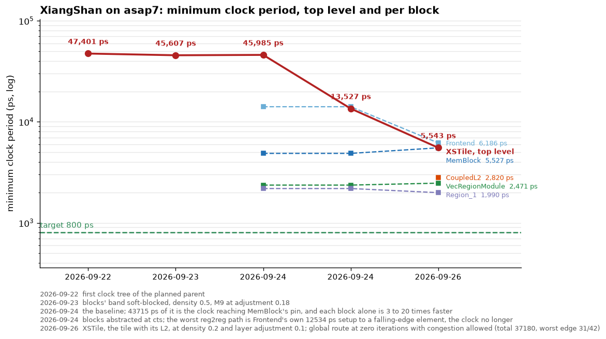
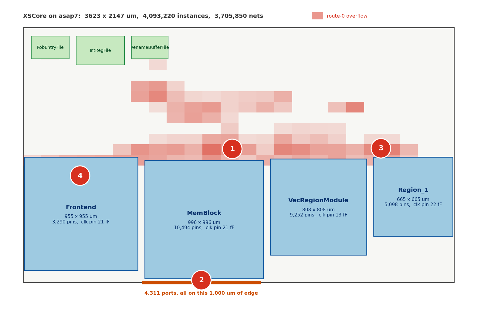

# XiangShan XSCore on asap7

The core of XiangShan's Kunminghu generation, about 4.1 million instances,
as a reference frame: something that reproduces, that anyone can look at,
and that we improve one concern at a time.

Nothing here runs in CI. Every target is `tags = ["manual"]`.

## The KPI



`kpi.json` is the series and `kpi.py` draws it. When a change moves the
number, add a row and re-render.

The number is the SDC period minus the worst slack of the `reg2reg`
group, which is the only group that can fail timing closure. Ask a
checkout for it with `.claude/commands/odb-debug.md`, and read
`.claude/skills/macro-constraints` before quoting any other group. Ask
for the group by name and not for the worst slack: on VecRegionModule the
overall worst slack is -2,006 ps and belongs to another group, while
`reg2reg` is -1,564 ps, and only the second one is a period.

Two series. The red one is the top level, the parent with its clock tree,
and it is the KPI. The squares are each hardened block measured alone at
its own place stage against an ideal clock, through
`<block>_place_odb_debug`:

| block | minimum period | worst `reg2reg` path |
|---|---|---|
| Frontend | 14,114 ps | a TAGE SRAM bank's clock-gate enable latch |
| MemBlock | 4,870 ps | inside `lsq.loadQueue.loadQueueReplay` |
| VecRegionModule | 2,364 ps | `issuePipes_3` to `issuePipes_4` exu data |
| Region_1 | 2,186 ps | `pipeToFEX0` to the FP convert's round shift mask |

The top level is bound by Frontend: its worst `reg2reg` path ends at the
same clock-gate enable latch that sets Frontend's own period.

## Running it

```
bazelisk run //test/coremark_joule/designs/asap7/xiangshan:XSCore_grt gui_grt
```

Needs 64 GB. About six hours cold, a download when the cache is warm.
Earlier stages are their own targets (`XSCore_synth`, `_floorplan`,
`_place`, `_cts`), each with `gui_`, `open_` and `_deps` forms, and
`XSCore_cts_odb_debug` and `XSCore_grt_odb_debug` open a checkpoint for
questions.

Not a download although another machine built it? `/cache-miss`:
each machine captures a few kilobytes into `cache_evidence/` and a diff
names the first action whose key differs. Usually it is the commit: every
stage takes the whole patched ORFS tree as input.

## Where the period is



The die to scale, the four hardened blocks, the three generated register
files in the parent's rows, the 1,000 um of bottom edge that carries all
4,311 ports, and the route-0 overflow shaded over the lot. The figure
carries illustration and labels only; the four markers on it are these,
in the order they cost clock period.

1. **One escape band above the macro row.** The blocks fill the bottom
   1,050 um edge to edge and nothing routes through them, so every
   block-to-parent wire escapes through the strip above. 97% of the
   sampled route-0 overflow is in two 90 um bins there. The floorplan
   owes that escape its own channel rather than the leftovers.
2. **4,311 ports on one metre of edge**, behind MemBlock. Nets that
   belong on the far side of the die cross it twice. This one is
   upstream of the floorplan: XSCore is an elaboration boundary, not a
   physical one, and cutting there cuts across the core-to-L2 buses.
3. **A millimetre per block-to-block hop.** MemBlock's output to
   Region_1's input is 1,793 ps on one parent wire, with timing-driven
   placement off and post-CTS repair skipped.
4. **Frontend's own period bounds the top level.** The worst path crosses
   the parent into a Frontend input whose setup is 12,534 ps to a
   falling clock edge: the TAGE SRAM bank's clock-gate enable latch.

The overflow shading was sampled every eighth gcell on M2 through M9 and
binned 24 x 24 over the die. It is a qualitative diagram: the geometry
and the numbers come from the routed ODB through an odb-debug session,
the choice of four and their ranking are a judgement.
`xscore_problems.py` draws it from tables at its top; re-measure with
`.claude/commands/odb-debug.md` and edit them when the baseline moves.

## The cut is in the wrong place: XSTile, not XSCore

XSCore is a chisel elaboration boundary, not a physical one, and everything
in the list above that is about pins follows from hardening it anyway.
Counted from the generated SystemVerilog, and cross-checked against the
ODB, which has one boundary terminal per bit:

| module | port names | **port bits = pins** |
|---|---|---|
| MemBlock | 999 | 10,495 |
| Backend | 1,071 | 7,088 |
| L2Top | 325 | 6,062 |
| **XSCore** | 255 | **4,311** |
| Frontend | 533 | 3,291 |
| CoupledL2 | 147 | 2,810 |
| XSTop | 167 | 2,155 |
| **XSTile** | 75 | **1,640** |

XSTile contains XSCore *and* the L2, and presents a third of the traffic
to the outside. The 2,671 bits that disappear are the core-to-L2 links,
made inside `XSTile.scala`: D-cache to L2 replicated per memory channel,
I-cache to L2, PTW to L2, both uncache ports, `l2_hint`, `l2_tlb_req`,
`l2_pmp_resp` and a vector of perf events per L2 bank. We cut across the
cache interface and then pushed it through a pin field.

XiangShan's own source says the tile is the physical unit, without saying
it in prose. Everything asynchronous sits at `XSTileWrap`, immediately
outside XSTile -- CHI async bridge, async queue for CLINT time, `cdc =
true` interrupt buffers, TL async crossing, reset synchronizers -- next to
a `PowerSwitchBuffer` with `pwrdown_req_n` and `iso_en` ports. Its comment
says everything inside is one clock domain and one voltage domain. Nothing
at XSCore's boundary crosses a domain; L2Top merely re-times core-facing
signals in the same clock. Clock gating and reset treat core and L2 as one
object, DFT and MBIST are fanned out from tile level, `generate_all.sh`
releases per-module Verilog for `... L2Top XSTile XSTop` with SRAM
replacement, and CI fails the build if more than one XSTile module appears
in the filelist, because every core must instantiate the same one with its
hart id through a port. That is the rule you write for a hardened macro.

So a XiangShan physical-design engineer looking at this package today sees
a partition their flow does not use. Fixing it means hardening XSTile,
which is XSCore plus CoupledL2, and dissolving the macros whose pins then
become parent-internal wiring, so the parent can place those pins where
the wires want them instead of against a fixed edge. Keeping a module
boundary for synthesis runtime is a separate knob from hardening it, and
stays. The CoreMark and power study is not in the way: its SAIF scope is
`.../core_with_l2/core`, and `core_with_l2` is the tile instance, so the
same simulation covers the tile.

Not measured yet, and both decide whether this is affordable here:
XSTile's area on asap7 with the L2, and whether CoupledL2's banks reach
the netlist as macros or as flops.

## The next three

1. **Block clock trees are most of a period deep**: 20 to 27 levels,
   477 to 944 ps of insertion delay at 800 ps, so every block boundary
   path is skewed by that much, or padded to match with balancing on
   (`ideas/xiangshan-timing.md`, entry 24).
2. **The block-to-block hop**: 1,793 ps on one wire across a millimetre,
   with timing-driven placement off and post-clock-tree repair skipped.
3. **Harden XSTile instead of XSCore**, and dissolve the macros whose
   pins become parent-internal wiring when it happens. The section above
   is the evidence; this is the one item on the list that a XiangShan
   physical-design engineer would call a correctness problem rather than
   a tuning problem, and until it is fixed the package hardens a boundary
   their own flow does not use.

Each block's own period is no longer on this list: the per block series
in `kpi.json` measures it.

## What is deliberately broken

Global route is skipped past pin access (OpenROAD DRT-0073) and does not
converge; the grt stage fails after the route, because antenna repair on
a platform with no diode cell leaves no route for the parasitics that
follow; the register files are generated rather
than synthesised, because yosys does not finish them at this size; the
configuration is integer-only with a small last-level cache. Eight
carried patches in `patches/` make it run at all.

`ideas/xiangshan-timing.md` has the inventory: 25 entries, each a
measurement and what it implies. That is where a question about this
design is usually already answered.

## The loop

Run the baseline. Find one measured thing wrong. Reproduce that thing in
the battery next door, which runs in seconds to minutes:
`test/structured_netlist`, `test/planned_parent`, `test/macro_select`.
Fix it where it belongs. Re-run, and add a row to `kpi.json`.

A day of this design costs what a minute of the small one does, so
nobody should be debugging against XSCore when a two-minute case
reproduces the same thing.

## Later

When the period approaches the 800 ps target, `kpi.json` gains the
CoreMark and power columns and the study reconnects to the simulation.
Until then the design does not depend on it.
