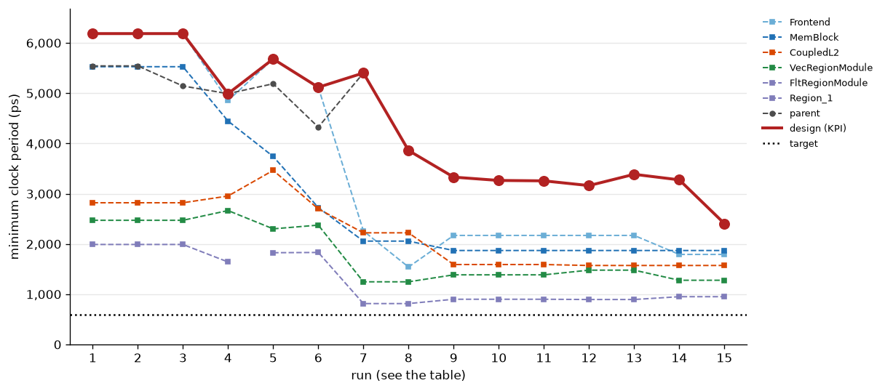

# XiangShan XSTile on asap7

The tile of XiangShan's Kunminghu generation, the core and its L2, as a
reference frame: something that reproduces, that anyone can look at,
and that we improve one concern at a time.

Nothing here runs in CI. Every target is `tags = ["manual"]`.

## The KPI



<!-- kpi-table begin: written by kpi.py -->
| # | date | design | parent | Frontend | MemBlock | CoupledL2 | VecRegionModule | FltRegionModule | Region_1 | change |
|---|---|---|---|---|---|---|---|---|---|---|
| not drawn | 2026-09-22 | ≥ 47,401 | 47,401 |  |  |  |  |  |  | first clock tree of the planned parent |
| not drawn | 2026-09-23 | ≥ 45,607 | 45,607 |  |  |  |  |  |  | blocks' band soft-blocked, density 0.5, M9 at adjustment 0.18 |
| not drawn | 2026-09-24 | 45,985 | 45,985 | 14,114 | 4,870 |  | 2,364 |  | 2,186 | the baseline; 43715 ps of it is the clock reaching MemBlock's pin, and each block alone is 3 to 20 times faster |
| not drawn | 2026-09-24 | 14,114 | 13,527 | 14,114 | 4,870 |  | 2,364 |  | 2,186 | blocks abstracted at cts; the worst reg2reg path is Frontend's own 12534 ps setup to a falling-edge element, the clock no longer |
| 1 | 2026-09-26 | 6,186 | 5,543 | 6,186 | 5,527 | 2,820 | 2,471 |  | 1,990 | XSTile, the tile with its L2, at density 0.2 and layer adjustment 0.1; global route at zero iterations with congestion allowed (total 37180, worst edge 31/42) |
| 2 | 2026-09-26 | 6,186 | 5,543 | 6,186 | 5,527 | 2,820 | 2,471 |  | 1,990 | SDC at 473 ps, 333 ps on 7 nm in FO4; the period of the 800 ps run to the picosecond: with timing repair skipped and ABC mapping for area the netlist does not depend on the SDC |
| 3 | 2026-09-27 | 6,186 | 5,143 | 6,186 | 5,527 | 2,820 | 2,471 |  | 1,990 | block abstracts carry their ports' max_transition and max_capacitance (OpenSTA patch 0008), so the parent's repair_design buffers the nets between blocks |
| 4 | 2026-09-28 | 4,991 | 4,991 | 4,854 | 4,446 | 2,954 | 2,665 |  | 1,642 | synthesis maps with ABC's speed script in every flow instead of the area script |
| 5 | 2026-09-28 | 5,681 | 5,188 | 5,681 | 3,741 | 3,464 | 2,301 | 1,826 |  | XiangShan kunminghu-v3 aa6b520, re-planned (Region_1 is now FltRegionModule); a different RTL, not comparable with the rows before |
| 6 | 2026-09-29 | 5,118 | 4,325 | 5,118 | 2,725 | 2,698 | 2,375 | 1,831 |  | REMOVE_ABC_BUFFERS dropped (deprecated in ORFS) and the planned blocks' kept modules stated with OpenROAD hierarchical: one repair_design call no longer leaves about 46,000 slew violators on Frontend; measured in the same build by xs_pathology's probe |
| 7 | 2026-10-01 | 5,402 | 5,402 | 2,259 | 2,057 | 2,222 | 1,247 | 814 |  | timing- and routability-driven global placement, ORFS's default, and RVT, LVT and SLVT from synthesis: every block faster, the parent slower and now the design's period |
| 8 | 2026-10-02 | 3,860 | 3,860 | 1,541 | 2,057 | 2,222 | 1,247 | 814 |  | the parent keeps no global-placement repair (GPL_KEEP_OVERFLOW 0) and repairs timing after CTS; the ORFS bump to ecb3cfdeb1ca between the rows |
| 9 | 2026-10-04 | 3,330 | 3,330 | 2,170 | 1,870 | 1,591 | 1,386 | 900 |  | AUTO_MEMORIES reaches every stage (#1157): from floorplan on, the flow times and optimizes against the generated memories' views, which earlier rows' later stages never loaded, so their paths through a memory went untimed; also the parent's CTS balancing the blocks' clock trees (#1150) and the bumps to ORFS d2b74aa79e98 |
| 10 | 2026-10-05 | 3,264 | 3,264 | 2,170 | 1,870 | 1,591 | 1,386 | 900 |  | the blocks repair timing after CTS, where their abstracts are cut: the parent 3,330 to 3,264 ps on an identical placement (its stages before CTS unchanged); the blocks' place-stage periods cannot move; Frontend's CTS 46 min |
| 11 | 2026-10-05 | 3,256 | 3,256 | 2,170 | 1,870 | 1,591 | 1,386 | 900 |  | the parent planned with each block mocked to density 0.6 (#1170): its die 2025 x 2666 um against 2377 x 3043, a quarter smaller, the period 3,256 against 3,264 ps; global route 81 GB against 93, congestion 21.2 % against 17.9 % |
| 12 | 2026-10-06 | 3,162 | 3,162 | 2,170 | 1,870 | 1,572 | 1,479 | 895 |  | the generated register files read as the RTL does (#1181): the false 1,161 ps read path through FltRegionModule is gone; the parent's worst path is now its own CtrlBlock logic; VecRegionModule slower with its real read-address registers |
| 13 | 2026-10-07 | 3,386 | 3,386 | 2,170 | 1,870 | 1,572 | 1,479 | 895 |  | in flight, to show where it stands: #1187 builds the register files with OpenROAD's generate_regfile through ORFS's AUTO_MEMORIES_REGFILES (OpenROAD#11669, OpenROAD-flow-scripts#4651) in place of bazel-orfs's structured_gen; the blocks unchanged, the parent 224 ps slower, its worst path CtrlBlock's own (rob/vtypeBuffer state to decodeBufBits ftqOffset), cause not diagnosed; measured at #1187's commit of that day, which has moved since |
| 14 | 2026-10-08 | 3,276 | 3,276 | 1,792 | 1,870 | 1,572 | 1,278 | 951 |  | in flight, #1187 a day on: generate_regfile's AOI22/NAND2/NOR2 read tree makes the blocks with register files faster, Frontend 2,170 to 1,792 ps and VecRegionModule 1,479 to 1,278, FltRegionModule 895 to 951 (its worst path ends at the register file's write port); the parent 3,276 ps, 110 below run 13 and 114 above run 12, its worst paths a mass of CtrlBlock control: the same CtrlBlock built alone closes at 1,200 ps, so the parent's gap is its placement and repair; global route 18.7 min, 83 GB, 21.5 % |
<!-- kpi-table end -->

Periods are in picoseconds; `≥` marks a run that did not measure the
blocks, a lower bound. The chart starts at the first run below the
Frontend block's 14,114 ps, and the runs before it are in the table only.
`kpi.json` is the series, and `kpi.py` draws the chart and writes this
table. When a change moves the number, add a row and re-run it.

The KPI is the design's minimum clock period, the red line: the largest
of the parent's period and each block's, since the design is only as
fast as its slowest part. On main it is **3,162 ps**, the parent's (run
12); runs 13 and 14 are #1187, in flight and not on main, there to show
where it stands. The parent is one of those parts, like any block, and each of
them is drawn dashed beneath the red line, a period that has to be at or
below it.

Each part's period is its SDC period minus the worst slack of its
`reg2reg` group, which is the only group that can fail timing closure.
Ask a checkout for it with `.claude/commands/odb-debug.md`, and read
`.claude/skills/macro-constraints` before quoting any other group. Ask
for the group by name and not for the worst slack: on VecRegionModule the
overall worst slack is -2,006 ps and belongs to another group, while
`reg2reg` is -1,564 ps, and only the second one is a period.

The parent, XSTile with its clock tree, is **3,860 ps** at global route
with the route's own parasitics; its `reg2reg` group does not see the
paths inside a block's abstract. Each block is measured alone at its
place stage against an ideal clock, through `<block>_place_odb_debug`:

| block | minimum period | worst `reg2reg` path |
|---|---|---|
| Frontend | 1,541 ps | a TAGE table SRAM's reset state into the predictor's `sramResetDone` |
| CoupledL2 | 2,222 ps | a slice's directory state at stage 3 into SinkC's buffer |
| MemBlock | 2,057 ps | load unit 0's stage-1 exception vector into stage 2's fast-replay grant |
| VecRegionModule | 1,247 ps | the vector divider's FP format into the FMA's operand |
| FltRegionModule | 814 ps | an FP adder's operand into its stage-1 round-up overflow |

XiangShan's `ClockGate` is mapped onto ASAP7's ICG cell (`xs_icg.ys`) in
every flow, the parent's and every block's.

Synthesis maps with ABC's speed script, ORFS's default, in every flow;
`synth_config_test` checks each flow's synthesis configuration once it
is built. ABC gets no delay target: ORFS passes the SDC period as `-D`
with a script file, and Yosys hands `-D` to ABC only through the `{D}`
placeholder of its built-in and inline scripts (ORFS #4585).

The blocks are abstracted at `cts`, and that is a choice with a measured
cost. On Frontend, the `cts` checkpoint's period was 28 percent
pessimistic against a route-0 global route and its `repair_design` on
the same checkpoint, with the same worst paths. Abstracting at `grt`
costs a route-0 global route per block. The grt probe,
`Frontend_grt_probe_grt`, measures it; `ideas/xiangshan-timing.md`,
entry 25, has the table.

## The 333 ps goal

XiangShan's published goal for Kunminghu is 3 GHz on an advanced node,
7 nm: a 333 ps cycle. It is a target, not a silicon result. The team's
HPCA'25 tutorial lists Kunminghu as "Advanced-node, 3GHz, 1.5x IPC of
NH" ([slides](https://tutorial.xiangshan.cc/hpca25/slides/20250302-HPCA25-1-Introduction-XiangShan.pdf)),
Hot Chips 2024 reported 7 nm and 3 GHz
([report](https://riscv.org/ecosystem-news/2024/08/xiangshan-high-performance-risc-v-processors-at-hot-chips-2024/)),
and at RISC-V Summit Europe 2025 "KMHv2" was "ready to tape-out" with
SPEC scores estimated at 3 GHz
([keynote](https://riscv-europe.org/summit/2025/media/proceedings/2025-05-14-RISC-V-Summit-Europe-09h30-BAO-slides.pdf),
[poster](https://riscv-europe.org/summit/2025/media/proceedings/2025-05-13-RISC-V-Summit-Europe-P2.1.06-TANG-poster.pdf)).
No measured frequency is published and no corner is stated for the core;
the same keynote quotes XiangShan's NoC at "7nm_SS". The previous
generation came close to its goal: Nanhu targeted 2 GHz on 14 nm, its
GDSII was delivered at 2 GHz, and the keynote lists its second tape-out
at 2.5 GHz. What we build is kunminghu-v3 at aa6b520, integer-only with
a small last-level cache.

In fanouts of four, 333 ps is 41.1 FO4 at the published ASAP7 RVT FO4 of
8.1 ps, which the ASAP7 authors call realistic for industrial 7 nm. On
the library this flow times with (RVT at the FF corner, FO4 14.37 ps)
that is 591 ps at global route, and the SDC synthesises at 0.8 of it,
473 ps (`period_fo4_test`). A cycle leaves about 38 FO4 of logic: the
flops on the paths below take 31 ps clock-to-output and 6 to 13 ps setup.

Is the Chisel RTL congruent with that? Read at the source, the worst path
of each block and of the top level is 6 to 30 gate levels, which at about
1.5 FO4 per level (logical effort for fanout-of-four stages) is 9 to 45
FO4. Measured, the same paths are 138 to 430 FO4:

| worst `reg2reg` path | construct in the RTL | gate levels, read | FO4, estimated | FO4, measured |
|---|---|---|---|---|
| Frontend: `mbtb.t1_startPcVec` to a bank's write `setIdx` | 8-bit equality and 16-bit zero detect into a flop enable, one bit fanning out to 4 banks of 4 ways | 6 to 8 | 9 to 12, plus the fanout tree | 430 |
| MemBlock: redirect `robIdx` to `loadQueueReplay` vaddr | 10-bit age compare, pop count, free-slot mux, 7-to-120 decode, write mux into a 120 by 50-bit flop array | about 15 | about 22, plus the array's fanout | 385 |
| CoupledL2: directory state to the L1 hint queue | 8-way hit and one-hot mux, main-pipe control, an arbiter, a queue write | 15 to 20 | 23 to 30 | 196 |
| VecRegionModule: `Vfma` widen flag to its CSA stage | operand muxes, radix-4 Booth encoding, a 27-to-4 carry-save tree | 16 to 20 | 24 to 30 | 172 |
| Region_1: the FMA's fp64 flag to its shift mask | a 107-bit add with carry select, a 110-bit invert and AND-reduce compare | about 20 | about 30 | 138 |
| XSTile: vector issue queue's accept to the decode buffer | a ready chain back through six modules, a priority encode, an adder and an 8-to-1 index mux | 20 to 30 | 30 to 45 | 358, with clock trees |

The measured column is each block alone at its place stage against an
ideal clock, and for XSTile the parent's period; the read and estimated columns are
source reading, with files and lines in `ideas/xiangshan-timing.md`,
entry 27. The paths and the measured column are the area-mapped netlist's
of the RTL before aa6b520 (Region_1 is now FltRegionModule); with ABC's
speed script and the new RTL every block's worst path moved (the table in
"The KPI"), and those have not been read at the source yet.

By logic depth the RTL is congruent with the goal: every one of these
paths fits in 41 FO4, the deepest two, the FMA's wide add and the top
level's ready chain, at the edge of it, and XiangShan's own comments mark
the ready chain as a timing concern. The measured paths are 4 to 45 times
their logic, and the difference is ours to explain, not the RTL's. The
shallowest paths are the furthest off, which points at fanout and
buffering (Frontend's startPc, MemBlock's 120-entry array) before logic,
and at synthesis mapping for area (`ABC_AREA=1`). None of the six runs
through a memory XiangShan builds as SRAM: the replay queue, the write
buffer and the hint queue are flops in its RTL too.

What would make the RTL incongruent is a path whose logic alone exceeds
41 FO4 however it is mapped. None of the six does by reading; the
best-effort mapping of each cone, and the logic-only period of each
block with the wires taken out, are the measurements that would show one.

## Running it

```
bazelisk run //test/coremark_joule/designs/asap7/xiangshan:XSTile_grt gui_grt
```

Needs 64 GB. About six hours cold, a download when the cache is warm.
Earlier stages are their own targets (`XSTile_synth`, `_floorplan`,
`_place`, `_cts`), each with `gui_` and `open_` forms and a `//:deps`
tree (`bazelisk run //:deps -- start //test/coremark_joule/designs/asap7/xiangshan:XSTile <stage>`), and
`XSTile_cts_odb_debug` and `XSTile_grt_odb_debug` open a checkpoint for
questions.

`cache_evidence/` is the witness and `/cache-miss` the method. A capture
never executes a flow action: a miss is killed as it appears and the
build carries on, so a laptop can ask in minutes whether a target is
cached, and a builder captures after it built and uploaded, in the same
pull request as the change that moved the keys.

- `consumer.txt`: `XSTile_cts`, every action a remote hit, seen from a
  consumer on 2026-09-26 at tree `eb1ceb30f248a1dc33345ffbeec278b100b3509c`.
- `machine_a.txt`: `XSTile_grt`, every action a remote hit on the machine
  that built it, at a commit main does not carry (captured on a branch
  and rebased away) and before the tool wrote tree hashes and `input`
  lines, so a diff against it says that sources moved but not which file.
  The next builder capture of `XSTile_grt` retires it.

Not a download although another machine built it? Capture here and diff
against the file above; the diff names the first action whose key differs,
which part of the key moved and the source file behind it.

## Where the period is

The parent's worst paths at global route, by group:

| group | worst slack at 473 ps | path |
|---|---|---|
| reg2reg | -3,387 ps | Frontend's `io_backend_cfVec_0_bits_instr` output into CtrlBlock's store set table, `memCtrl/ssit` |
| in2reg | -1,238 ps | `io_hartId` into the FP region's `in_fromTop_hartId` |
| reg2out | -1,384 ps | the L2's `io_lcreditCHI_tx_dat_flit` out to the tile's port |

Only the first is a period (`.claude/skills/macro-constraints`); the
other two are optimisation targets.

Route-0 at global route: total congestion 84,006, 17.2
percent of the routing resources used, 109 m of wire. The floorplan is the planner's at
parent density 0.3, each block placed at a footprint mocked to density 0.6 (its own
outline and pins unchanged), and layer adjustment 0.1; `plan/plan.json` is its input.

## The next two

1. **Frontend's fetched instructions into CtrlBlock**, 3,387 ps over
   the period. The path starts inside Frontend: on #1143's checkpoint
   the 200 worst paths all began at Frontend's `cfVec` instruction
   outputs, 1,414 ps of each in Frontend's clock-to-output arc.
2. **Block clock trees are a period deep**: 20 to 27 levels, 477 to
   944 ps of insertion delay against a 591 ps target, so every block
   boundary path is skewed by that much, or padded to match with
   balancing on (`ideas/xiangshan-timing.md`, entry 24).

## What is deliberately broken

Global route is skipped past pin access (OpenROAD DRT-0073) and does not
converge: it runs with congestion allowed, and the period is the number
tracked; the register files are generated rather than synthesised,
because yosys does not finish them at this size; the configuration is
integer-only with a small last-level cache. The carried patches in
`patches/` make it run at all.

`ideas/xiangshan-timing.md` has the inventory: 25 entries, each a
measurement and what it implies. That is where a question about this
design is usually already answered.

## The loop

Run the baseline. Find one measured thing wrong. Reproduce that thing in
the battery next door, which runs in seconds to minutes:
`test/structured_netlist`, `test/planned_parent`, `test/macro_select`.
Fix it where it belongs. Re-run, and add a row to `kpi.json`.

A day of this design costs what a minute of the small one does, so
nobody should be debugging against XSTile when a two-minute case
reproduces the same thing.

## Later

When the period approaches the 591 ps target, `kpi.json` gains the
CoreMark and power columns and the study reconnects to the simulation.
Until then the design does not depend on it.
