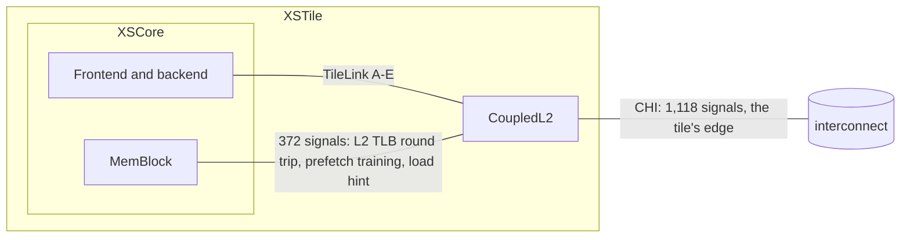
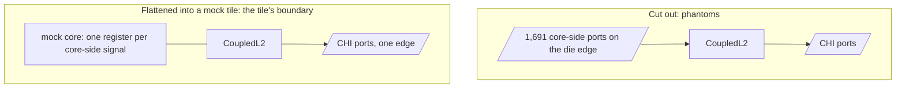
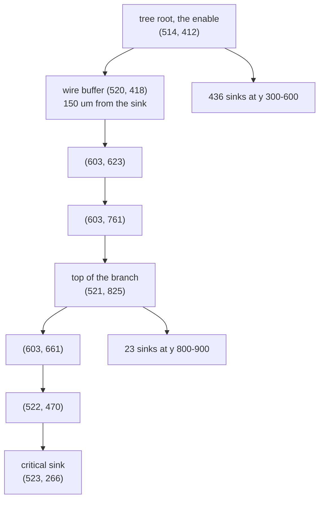
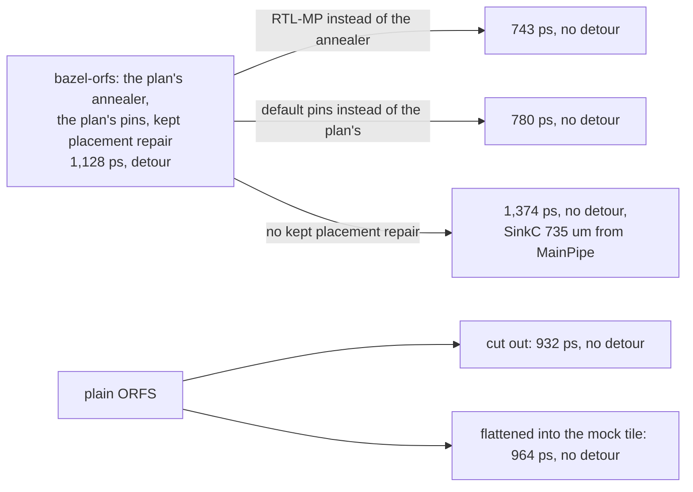
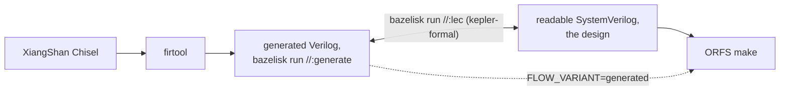

# xstile_mock: CoupledL2 in a mock of its real parent

XiangShan's L2, CoupledL2, flattened into a mock of XSTile, so that what
the flow shows is CoupledL2's problem and not the problem of cutting it out
of its parent.

**The SystemVerilog in this folder is the design.** It is what people read,
build with ORFS's own `make`, and change. The Bazel module here is a
certificate, not a tool: it documents how the generated Verilog is made from
XiangShan's Chisel, and proves the readable SystemVerilog equivalent to it
by LEC. Nobody needs to run it to use the design, and no generated file is
committed.

```sh
bazelisk run //:generate   # generated/CoupledL2.sv and its MANIFEST, for inspection
bazelisk run //:lec        # the proof; fails until it is wired up
```

The module is self-contained: XiangShan and every repository it pulls in
pinned by commit and sha256, each one's BUILD overlay inline in
`MODULE.bazel`, the configuration in `CoupledL2Generator.scala`. Its output
is CoupledL2 and everything it instantiates, 182 modules and 100,606 lines,
byte-identical to the CoupledL2 the measurements below were made on.

What follows is the problem, whose problem it turned out to be, and the
plan. The readable SystemVerilog is not written yet; the folder grows as the
plan lands.

## The problem

### CoupledL2 in its tile



Of CoupledL2's 2,809 boundary signals, only the CHI link is the tile's
edge. The other 1,691 meet logic a few microns away inside the tile.

### The phantom problem

Cut CoupledL2 out as a design of its own
([OpenROAD-flow-scripts#4547](https://github.com/The-OpenROAD-Project/OpenROAD-flow-scripts/pull/4547))
and those 1,691 signals become ports on the die's edge. A standalone flow
then shows problems the chip does not have
([the comment on #4547](https://github.com/The-OpenROAD-Project/OpenROAD-flow-scripts/pull/4547#issuecomment-5926077443)):
placement pulled toward edge pins, congestion where the pins funnel in,
buffers on wires the tile does not have, input and output paths against
made-up budgets, and an SRAM floorplan that follows fictional pin sides.



In the mock tile, every core-side path is a short register-to-register path
inside the design, and only CHI meets the edge, as in the real tile.

### The path

Measured on XiangShan Kunminghu (aa6b520), CoupledL2 (XSCache 300515bc) as a
block of XSTile, at global route with the route's parasitics, 473 ps SDC:

| | |
|---|---|
| minimum period | **1,128 ps**, with the SRAMs untimed (see below) |
| worst path | the directory's s3 request tag, `directory/req_s3_tag`, to bit 176 of a 256-bit register in SinkC, `sinkC/r_1[176]` |
| logic / repeaters / wire | 341 ps (24 cells) / 473 ps (35) / 247 ps |

The path starts at the directory's tag compare and hit, passes MainPipe's
decision, the directory's single port and RequestArb's ready, and ends at
the enable of a wide register in SinkC. XiangShan's own source names the
first half of it: "The combinational logic path of Directory metaAll ->
Directory response -> MainPipe judging whether to respond data is too long"
(`MainPipe.scala`).

### The detour

Most of the 1,128 ps is not that logic. The enable reaches its 514 sinks
through a buffer tree, and the tree hangs the critical bit off the far end
of a branch:



| | |
|---|---|
| walk from the tree's root to the sink | 1,360 um |
| distance from the root to the sink | 155 um |
| nearest tree buffer to the sink | 61 um, where its parent is 204 um away |
| the tree | 514 leaves, 69 buffers: 62 from timing-driven global placement's kept repair, 4 from long-wire repair, 3 rebuffered at global route |

The tree passes within 150 um of the sink, climbs about 400 um to a small
far cluster of 23 sinks, and hangs one of 3 sinks *below* the root off the
end of that upward branch. The branch is already there at the placement
checkpoint, unchanged at CTS; global route only rebuffers along it.

A problem counts as reproduced when that signature shows at global route,
on a checkpoint with routes:

| | criterion | XiangShan |
|---|---|---|
| R1 | the worst register-to-register path runs through a wide enable's buffer tree | 514 leaves |
| R2 | the path's walk inside the tree is at least 3 times the root-to-sink distance | 8.8 |
| R3 | a tree buffer is at most half as far from the sink as the sink's parent, and the parent is at least 100 um away | 0.30 |
| R4 | it survives global route's timing repair | yes |

Only then does the minimum period matter.

## What was measured

### Whose detour is it? The flow's

Each arm changes one thing from the flow that measured 1,128 ps, and is
measured at global route on a checkpoint with routes, 473 ps SDC. Every
bazel-orfs row timed the generated SRAMs as black boxes from floorplan on
(a bazel-orfs setting since fixed); the plain ORFS rows had them timed.
The detour is geometry and does not depend on it; the periods do.



| flow | change | worst | worst into SinkC's wide register | detour ratio |
|---|---|---|---|---|
| bazel-orfs | as built | 1,128 ps | 1,128 ps | **8.8** |
| bazel-orfs | ORFS's macro placer, RTL-MP, instead of the plan's annealer | 743 ps | 737 ps | 1.0 |
| bazel-orfs | default pins instead of the plan's | 780 ps | 776 ps | 1.1 |
| bazel-orfs | no kept placement repair (`GPL_KEEP_OVERFLOW=0`) | 1,374 ps | 1,370 ps | 1.1 |
| plain ORFS | CoupledL2 cut out, as in #4547 | 1,129 ps, an undeclared two-cycle SRAM read | 932 ps | 1.0 |
| plain ORFS | CoupledL2 flattened into the mock tile | 1,449 ps, MainPipe's status into the directory SRAM's enable | 964 ps | 1.0 |

The detour is bazel-orfs's own: the plan's annealer and the plan's pins
together place SinkC's wide register where its enable's tree has to reach
far, and timing-driven global placement keeps the buffers of its first
repair along the way (`ideas/xiangshan-timing.md`, entry 40). Take away
either the annealer or the pins and the detour is gone, with a third of
the period. Take away the kept repair alone and the detour is gone, but
the distance it was hiding stays and costs more. Plain ORFS never makes it.

Repair does not undo the detour once it is made:

| arm | change | worst | detour |
|---|---|---|---|
| ORFS's default global-route repair | `TNS_END_PERCENT=100`, last gasp on | 1,121 ps | unchanged |
| CTS-stage repair on | `SKIP_CTS_REPAIR_TIMING=0` | 1,078 ps | unchanged |
| an ORFS knob | `SETUP_MOVE_SEQUENCE` with load splitting and rebuffering first | 1,066 ps | unchanged |
| OpenROAD's own moves | `repair_timing -sequence "split buffer"` on the routed checkpoint | 1,141 ps | the worst endpoint is not touched |

### With the memories timed: CoupledL2's own problem

The same macro-placer A/B in the whole tile, with the SRAMs timed in every
stage (bazel-orfs main bf39d26d):

| XSTile, memories timed | the plan's annealer | RTL-MP for CoupledL2 |
|---|---:|---:|
| the tile, reg2reg at global route | 3,330 ps | 3,328 ps |
| CoupledL2 at its place stage | 1,591 ps | 1,894 ps |

RTL-MP's gain was in paths that do not set the period once the SRAMs are
timed. The tile's worst path, the same in both, is in the core. CoupledL2's
worst, in both, is MainPipe's status into the write data of a DataStorage
SRAM; with RTL-MP the next is DataStorage's read into grantBuf, the read
the RTL states takes two cycles (`readMCP2`). Plain ORFS showed the same
read first, cut out (1,129 ps). These are CoupledL2's paths, not the
flow's.

### Why the test designs did not reproduce the 1,128 ps

It was not CoupledL2's. The single-concern test design, `asap7/l2_dir_hit`
([#4599](https://github.com/The-OpenROAD-Project/OpenROAD-flow-scripts/pull/4599)),
found the detour's path and endpoint at 580-711 ps, which is about what
CoupledL2 runs at on a floorplan that does not stretch it. Synthetic wide
enables, 64 to 512 bits spread round the die, and XiangShan's sink
geometry pinned with `IO_CONSTRAINTS`, ran straight too (ratios 1.0-2.0).
The test design chose its path from an untimed run; the SRAM paths above
are the ones to start from.

### What ORFS master cannot do yet

The test design needs `AUTO_MEMORIES`, ORFS's generated SRAM macros, and on
ORFS master as it stands, plain `make` cannot run it:

| | |
|---|---|
| fixes bazel-orfs carries | five ORFS patches: conversion only of a memory that is its own module, a column mux (an 8192-deep array is otherwise 635:1), firtool memory modules, write masks, and slang's renamed memory modules. ORFS master now finds its vendored FakeRAM and carries the asap7 backend ([#4603](https://github.com/The-OpenROAD-Project/OpenROAD-flow-scripts/pull/4603)) |
| hierarchy | `SYNTH_HIERARCHICAL` with `AUTO_MEMORIES` stops with "Missing cost information on instanced blackbox"; flat, the macro placer can stop with MPL-0045 when one SRAM is most of a cluster's area |

## The plan



1. **Reproduce first** (done). The 1,128 ps detour is the bazel-orfs
   flow's: plain ORFS, cut out or in the mock tile, never makes it. With
   the SRAMs timed, CoupledL2's own worst paths are into and out of
   DataStorage's SRAMs; the read is a two-cycle contract the RTL states,
   so it belongs in the SDC, and what remains after it is the baseline
   the readable SystemVerilog is measured against.
2. **This folder is a small Bazel module, as a certificate** (done).
   `bazelisk run //:generate` writes CoupledL2's generated Verilog for
   inspection, so nobody carries the generated lines, and the rule is the
   documentation of how they are made. `bazelisk run //:lec` will prove
   each readable module equivalent to its generated original. kepler-formal
   now builds natively in Bazel (oneTBB from the BCR, one TBB runtime), and
   proves or refutes a small pair; until a readable module exists and the
   build is vendored here, `//:lec` fails, so nobody mistakes it for a
   pass.
3. **Readable SystemVerilog, written from the Chisel's intent** once the
   problem reproduces: one module per generated module, the same ports and
   the same flip-flops so LEC compares them register by register, named
   signals instead of `_GEN_123`, the Chisel line each piece comes from.
   Co-simulation gates each module now, LEC once kepler-formal is ready.
   `equivalence.md` lists every pair and its proof.
4. **The round trip.** A real CoupledL2 fix from XSCache's history,
   replayed both ways, Chisel to SystemVerilog and SystemVerilog to Chisel,
   each proven by LEC. The two may diverge on purpose: Chisel is the next
   generation's source, the SystemVerilog is what is taped out.

## Credits

[OpenROAD-flow-scripts#4547](https://github.com/The-OpenROAD-Project/OpenROAD-flow-scripts/pull/4547),
jhkim-pii's CoupledL2 work, is what made the phantom problem visible.
