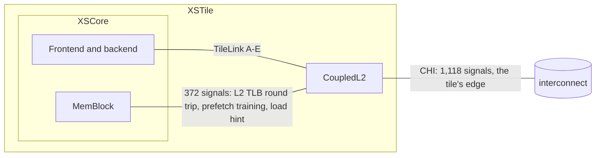
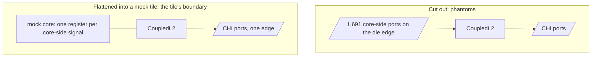
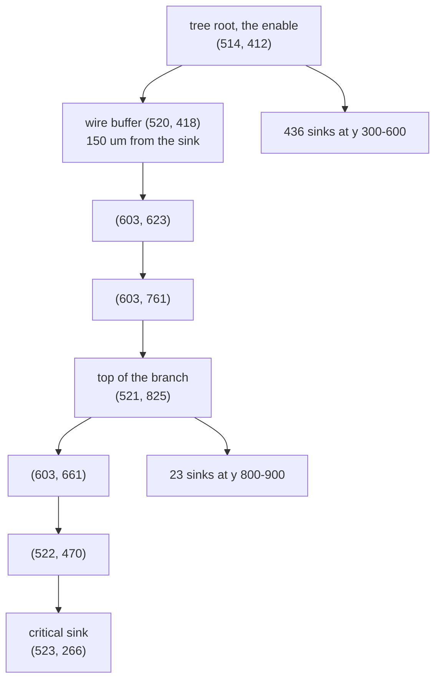
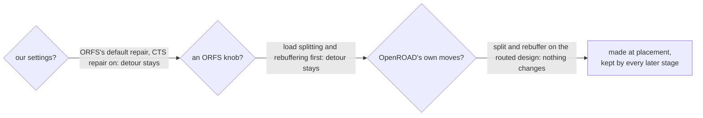
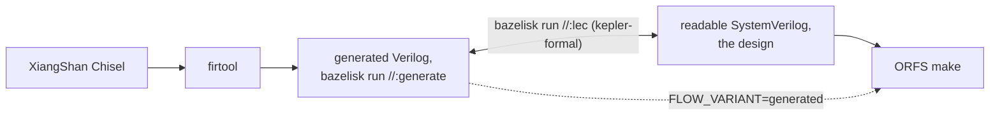

# xstile_mock: CoupledL2 in a mock of its real parent

XiangShan's L2, CoupledL2, flattened into a mock of XSTile, so that what
the flow shows is CoupledL2's problem and not the problem of cutting it out
of its parent.

**The SystemVerilog in this folder is the design.** It is what people read,
build with ORFS's own `make`, and change. The Bazel module here (to come) is
a certificate, not a tool: it documents how the generated Verilog is made
from XiangShan's Chisel, and proves the readable SystemVerilog equivalent to
it by LEC. Nobody needs to run it to use the design.

What follows is the problem, what was measured, what did not work, and the
plan. Nothing here is built yet; the folder grows as the plan lands.

## The problem

### CoupledL2 in its tile

Of CoupledL2's 2,809 boundary signals, only the CHI link is the tile's
edge. The other 1,691 meet logic a few microns away inside the tile.

### The phantom problem

Cut CoupledL2 out as a design of its own
([OpenROAD-flow-scripts#4547](https://github.com/The-OpenROAD-Project/OpenROAD-flow-scripts/pull/4547))
and those 1,691 signals become ports on the die's edge. A standalone flow
then shows problems the chip does not have
([the comment on #4547](https://github.com/The-OpenROAD-Project/OpenROAD-flow-scripts/pull/4547#issuecomment-5926077443)):
placement pulled toward edge pins, congestion where the pins funnel in,
buffers on wires the tile does not have, input and output paths against
made-up budgets, and an SRAM floorplan that follows fictional pin sides.

In the mock tile, every core-side path is a short register-to-register path
inside the design, and only CHI meets the edge, as in the real tile.

### The path

Measured on XiangShan Kunminghu (aa6b520), CoupledL2 (XSCache 300515bc) as a
block of XSTile, at global route with the route's parasitics, 473 ps SDC:

| | |
|---|---|
| minimum period | **1,128 ps** |
| worst path | the directory's s3 request tag, `directory/req_s3_tag`, to bit 176 of a 256-bit register in SinkC, `sinkC/r_1[176]` |
| logic / repeaters / wire | 341 ps (24 cells) / 473 ps (35) / 247 ps |

The path starts at the directory's tag compare and hit, passes MainPipe's
decision, the directory's single port and RequestArb's ready, and ends at
the enable of a wide register in SinkC. XiangShan's own source names the
first half of it: "The combinational logic path of Directory metaAll ->
Directory response -> MainPipe judging whether to respond data is too long"
(`MainPipe.scala`).

### The detour

Most of the 1,128 ps is not that logic. The enable reaches its 514 sinks
through a buffer tree, and the tree hangs the critical bit off the far end
of a branch:

| | |
|---|---|
| walk from the tree's root to the sink | 1,360 um |
| distance from the root to the sink | 155 um |
| nearest tree buffer to the sink | 61 um, where its parent is 204 um away |
| the tree | 514 leaves, 69 buffers: 62 from timing-driven global placement's kept repair, 4 from long-wire repair, 3 rebuffered at global route |

The tree passes within 150 um of the sink, climbs about 400 um to a small
far cluster of 23 sinks, and hangs one of 3 sinks *below* the root off the
end of that upward branch. The branch is already there at the placement
checkpoint, unchanged at CTS; global route only rebuffers along it.

A problem counts as reproduced when that signature shows at global route,
on a checkpoint with routes:

| | criterion | XiangShan |
|---|---|---|
| R1 | the worst register-to-register path runs through a wide enable's buffer tree | 514 leaves |
| R2 | the path's walk inside the tree is at least 3 times the root-to-sink distance | 8.8 |
| R3 | a tree buffer is at most half as far from the sink as the sink's parent, and the parent is at least 100 um away | 0.30 |
| R4 | it survives global route's timing repair | yes |

Only then does the minimum period matter.

## What was measured

### Whose problem is it?

Every arm on XiangShan's own CoupledL2 checkpoints:

| arm | change | worst at global route | detour |
|---|---|---|---|
| as built | | 1,128 ps | ratio 8.8 |
| ORFS's default global-route repair | `TNS_END_PERCENT=100`, last gasp on | 1,121 ps | unchanged |
| CTS-stage repair on | `SKIP_CTS_REPAIR_TIMING=0` | 1,078 ps | unchanged |
| an ORFS knob | `SETUP_MOVE_SEQUENCE` with load splitting and rebuffering first | 1,066 ps | unchanged; the tree gains 3 buffers |
| OpenROAD's own moves | `repair_timing -sequence "split buffer"` on the routed checkpoint: 62,340 violating endpoints, 114 buffers inserted, 36 load splits | 1,141 ps | the worst endpoint is not touched |

Since then, bazel-orfs's main has found the same mechanism in XSTile's
parent (`ideas/xiangshan-timing.md`, entry 40): timing-driven global
placement keeps the buffers of its first repair, made at an overflow of
0.63, and they zig-zag as the cells move. The parent now builds its buffers
on the final placement (`GPL_KEEP_OVERFLOW=0`); the blocks do not yet.

### What did not reproduce it

| attempt | worst | detour | why not |
|---|---|---|---|
| a single-concern test design, `asap7/l2_dir_hit` ([#4599](https://github.com/The-OpenROAD-Project/OpenROAD-flow-scripts/pull/4599)), the directory, MainPipe, RequestArb, SinkC and the MSHRs written from the Chisel | 580-653 ps | not probed | the same path and endpoint, at about half the period |
| the same on XiangShan's own die and macro placement | 711 ps | ratio 1.2 | the floorplan stretches the path, the tree still runs straight |
| a wide enable fanning out to 64, 256 and 512 bits spread round the die | 470-635 ps | ratio 1.0 | the bits' spread alone does not make a detour |
| XiangShan's measured sink geometry pinned with `IO_CONSTRAINTS` | 361 ps | ratio 1.1-2.0 | a port is a weak pull: the placer draws the outliers toward the root |

The detour seems to need CoupledL2's own placement pressures around it,
which is the case for the mock tile.

### What ORFS master cannot do yet

The test design needs `AUTO_MEMORIES`, ORFS's generated SRAM macros, and on
ORFS master as it stands, plain `make` cannot run it:

| | |
|---|---|
| FakeRAM | the copy ORFS ships in `tools/FakeRAM2.0` is never found unless `FAKERAM_RUN_PY` is set, and it lacks the asap7 backend `AUTO_MEMORIES` calls |
| fixes bazel-orfs carries | six ORFS patches: the asap7 backend (which ORFS ships but nothing applies), conversion only of a memory that is its own module, a column mux (an 8192-deep array is otherwise 635:1), firtool memory modules, write masks, and slang's renamed memory modules |
| hierarchy | `SYNTH_HIERARCHICAL` with `AUTO_MEMORIES` stops with "Missing cost information on instanced blackbox"; flat, the macro placer can stop with MPL-0045 when one SRAM is most of a cluster's area |

## The plan

1. **Reproduce first.** CoupledL2's generated Verilog, unchanged, flattened
   into the mock tile, built with plain ORFS; the signature above at global
   route. Beside it, CoupledL2 cut out as in #4547, to measure the cut's
   phantoms against the mock tile, and the bazel-orfs flow with its own
   machinery (planned macro placement, planned pins, the kept-repair
   setting) taken out one piece at a time.
2. **This folder becomes a small Bazel module, as a certificate.**
   `bazelisk run //:generate` writes CoupledL2's generated Verilog for
   inspection, so nobody carries the generated lines, and the rule is
   the documentation of how they are made. `bazelisk run //:lec` proves
   each readable module equivalent to its generated original; until
   kepler-formal builds natively in Bazel it fails, so nobody mistakes it
   for a pass.
3. **Readable SystemVerilog, written from the Chisel's intent** once the
   problem reproduces: one module per generated module, the same ports and
   the same flip-flops so LEC compares them register by register, named
   signals instead of `_GEN_123`, the Chisel line each piece comes from.
   Co-simulation gates each module now, LEC once kepler-formal is ready.
   `equivalence.md` lists every pair and its proof.
4. **The round trip.** A real CoupledL2 fix from XSCache's history,
   replayed both ways, Chisel to SystemVerilog and SystemVerilog to Chisel,
   each proven by LEC. The two may diverge on purpose: Chisel is the next
   generation's source, the SystemVerilog is what is taped out.

## Credits

[OpenROAD-flow-scripts#4547](https://github.com/The-OpenROAD-Project/OpenROAD-flow-scripts/pull/4547),
jhkim-pii's CoupledL2 work, is what made the phantom problem visible.
