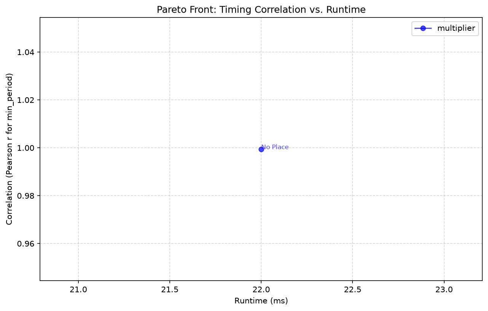

# Estimation Ladder

## Abstract / Results

Synthesis vs. GRT correlation for minimum clock period is adequate for a simple `multiplier`, but degrades poorly for complex designs populated with macros because simple wireload models fail to capture complex inter-macro routing congestion.

This tuning study demonstrates how we can restore accuracy by incrementally adding early placement and global routing stages ("the estimation ladder"), forming a Pareto front of Runtime vs. Correlation.



### Pareto Front: `multiplier` (Simple Design)
|   correlation |   runtime_ms |   run_place |   place_timing |   place_routability |   run_grt |
|--------------:|-------------:|------------:|---------------:|--------------------:|----------:|
|      0.999437 |           22 |           0 |              0 |                   1 |         0 |

<!-- TODO: Re-add multiplier_top once macro estimator is fixed -->
<!-- ### Pareto Front: `multiplier_top` (Complex Macro Design) -->
<!-- table_top_md goes here -->


---

## Details and Methodology

This directory contains a test suite that uses Optuna to evaluate the trade-off between runtime and timing correlation accuracy across different early-estimation stages (Synthesis only, Global Placement, and Global Routing) against a Global-Routed ground truth.

### Designs
- `multiplier.sv`: A simple parameterizable pipelined multiplier.
- `multiplier_top.sv`: A complex design instantiating a 4x4 array of the multiplier macros, introducing significant wire routing complexity between macros.

### Execution
The `optuna_study.py` script sweeps parameters (`RUN_PLACE`, `GPL_TIMING_DRIVEN`, `GPL_ROUTABILITY_DRIVEN`, `RUN_GRT`) to maximize Pearson correlation of extracted paths while minimizing runtime. 

To run the full suite and regenerate this README:
```bash
bazel test //test/estimation_ladder/...
bazel run //test/estimation_ladder:update-readme
```
