# Estimation Ladder

**How close can you get to the clock period the flow would give you,
without running the flow?**

The baseline throughout is running floorplan through global route and
reading the timing off the result. Everything here is measured against
that, because that is the thing you would otherwise have to do.

- **multiplier (simple)**: the flow takes **49s**. The estimator gets within **1.9%** of it in **5.38s**, of which 2.37s is loading the design and running the timing query -- overhead any rung pays.
- **multiplier_top (macro array)**: the flow takes **737s**. The estimator gets within **6.9%** of it in **66.1s**, of which 9.02s is loading the design and running the timing query -- overhead any rung pays.
- **multiplier_top, macro paths only**: the flow takes **737s**. The estimator gets within **6.1%** of it in **34s**, of which 3.95s is loading the design and running the timing query -- overhead any rung pays.

The synthesis-only rung is in the tables below as an accuracy
floor -- what you get for reading the netlist and asking OpenSTA --
not as a speedup to quote. Almost all of its runtime is loading the
design and running the timing query, and both of those grow with
design size while the flow grows faster still. Read its ratio as an
artifact of these designs being small, not as something that would
hold on a real one.

### Why the estimate is off at all

The estimator places cells but never routes them, so it works from
straight-line wire estimates. The router builds longer wires than that
-- detours, congestion, vias -- so every path comes out optimistic.
That is what pre-route means, and it is not a defect.

### The useful part: it is off by nearly the same amount everywhere

The estimator is not erratic, it is consistently optimistic. Almost
every path is short by close to the same amount, so **one correction
term removes most of the error**, and a term worked out on one design
still helps on another. Adding that correction to plain global
placement beats an uncorrected run that also pays for a clock tree and
global routing, at a fraction of the runtime. Much of what the
expensive stages appear to buy is an offset you can subtract for free.

The correction is worth more to the cheap rungs than the expensive
ones. On rungs that are already accurate, a correction borrowed from
another design makes them worse, because what is left of their error
belongs to that particular design.

### The limit: a good speedometer, a poor map

It predicts the period well and it is poor at telling you *which*
paths are critical. Of the ten genuinely worst paths, the estimator
puts only one to three of them in its own worst ten on the macro
design -- and picking at random would get one. Spending more runtime
does not fix it: on the simple design the 0.012s synthesis-only
estimate finds more of the worst paths than the 6.9s estimate that
predicts the period twenty times more precisely.

So for *what clock period will this close at*, the estimator works.
For *which path do I go fix*, it does not replace the flow.

### What did not help

- `-place_ios`, letting placement move the IO pins: fastest rung,
  worst accuracy.
- `-virtual_cts`, a cheap stand-in clock tree: worse than doing
  nothing about the clock at all.
- `repair_timing` at its default setting: 48s of runtime, no
  measurable change to the answer.
- Fancier corrections. A cubic, an isotonic fit, a Gaussian process --
  all fit the design they were tuned on better and all transfer to a
  new design worse. The Gaussian process reaches zero error on its own
  design, which is memorisation, and then does worse than no
  correction at all on the other one.

A real clock tree, by contrast, was worth it: it cut the error by a
third for under two seconds, because it captures the insertion delay
through the macros that an ideal clock hides.

### One thing to know before copying a configuration

Several of the fastest rungs skip the macro placer. Global placement
does then position the macros itself, and their locations are real --
but twelve of the hundred and twenty macro pairs end up overlapping,
where the macro placer leaves none. That is serviceable to estimate
timing from and impossible as a floorplan. These rungs are estimators,
not placements.

---

## Results per design

## multiplier (simple)

Running the flow itself -- floorplan through global route, the baseline this is all measured against -- takes **49s**. The cheapest rung on the front is 20x faster than that at 21.3% error, and the most accurate is 4x faster at 1.3%.

Sampled 54 near-critical reg2reg paths. Recall@10 by chance is 0.19: a rung scoring at or below that has no skill at picking the critical paths.

Rung A explored 238 configurations.

10 front points across 2.44s to 10.9s; widest normalized gap 0.286, so **a gap exceeds** the 0.15 target and the budget did not fill it.

|   # | rungs                                           |   runtime_s |   mean_rel_err |   kendall_tau |      bias |   spread |   worst_recall |
|----:|:------------------------------------------------|------------:|---------------:|--------------:|----------:|---------:|---------------:|
|   1 | synth only                                      |       2.443 |        0.2132  |        0.8532 | -0.2132   |  0.01367 |            0.8 |
|   2 | place, place_ios, prop                          |       3.66  |        0.1132  |        0.7932 | -0.1132   |  0.02577 |            0.5 |
|   3 | place, NO macro place, place_ios, vCTS, GRT(21) |       3.671 |        0.0827  |        0.8421 | -0.0827   |  0.02306 |            0.8 |
|   4 | place, NO macro place, place_ios, vCTS, rd      |       3.956 |        0.0794  |        0.8365 | -0.0794   |  0.01874 |            0.7 |
|   5 | place, NO macro place, place_ios, GRT(15)       |       4.02  |        0.07304 |        0.8029 | -0.07304  |  0.028   |            0.5 |
|   6 | place, NO macro place, TD, prop                 |       5.348 |        0.06057 |        0.8756 | -0.06057  |  0.01202 |            0.7 |
|   7 | place, NO macro place, TD, RD, GRT(20)          |       5.383 |        0.01865 |        0.8351 | -0.01478  |  0.01684 |            0.6 |
|   8 | place, TD, rd, GRT(13), rt                      |       6.359 |        0.01815 |        0.8281 | -0.01376  |  0.01556 |            0.7 |
|   9 | place, NO macro place, TD, RD, rd, GRT(28), rt  |       7.097 |        0.01575 |        0.8113 | -0.0116   |  0.01603 |            0.5 |
|  10 | place, NO macro place, TD, RD, CTS, GRT(2), rt  |      10.87  |        0.0131  |        0.8393 | -0.007871 |  0.01363 |            0.6 |

**Where the flow's time goes**, largest first: global_route 12s, global_place 11s, cts 8s, floorplan 6s, detailed_place 4s, repair_design 4s, place_pins 1s, macro_place 1s. The single biggest stage is global_route at 25% of the flow, and the estimator does not skip it so much as run a far cheaper version of it -- which is where the saving comes from.

**What each stage costs**, from the deepest rung measured (place, TD, rd, GRT(13), rt): global_place 2.38s, repair_design 0.728s, repair_timing 0.402s, global_route 0.192s, place_pins 0.009s, floorplan 0.002s.

**Where each rung's time goes.** Overhead is loading the design and running the timing query, which cost the same whatever the rung does.

| rung                                               |   total_s |   overhead_s |   work_s |   overhead_pct | vs flow   |
|:---------------------------------------------------|----------:|-------------:|---------:|---------------:|:----------|
| the full flow (baseline)                           |     48.5  |       nan    |   48.5   |          nan   | 1x        |
| 1. synth only                                      |      2.44 |         2.42 |    0.018 |           99.3 | 20x       |
| 2. place, place_ios, prop                          |      3.66 |         2.45 |    1.21  |           67   | 13x       |
| 3. place, NO macro place, place_ios, vCTS, GRT(21) |      3.67 |         2.36 |    1.31  |           64.4 | 13x       |
| 4. place, NO macro place, place_ios, vCTS, rd      |      3.96 |         2.36 |    1.6   |           59.6 | 12x       |
| 5. place, NO macro place, place_ios, GRT(15)       |      4.02 |         2.52 |    1.5   |           62.7 | 12x       |
| 6. place, NO macro place, TD, prop                 |      5.35 |         3.04 |    2.31  |           56.8 | 9x        |
| 7. place, NO macro place, TD, RD, GRT(20)          |      5.38 |         2.37 |    3.01  |           44.1 | 9x        |
| 8. place, TD, rd, GRT(13), rt                      |      6.36 |         2.42 |    3.94  |           38.1 | 8x        |
| 9. place, NO macro place, TD, RD, rd, GRT(28), rt  |      7.1  |         2.41 |    4.69  |           33.9 | 7x        |
| 10. place, NO macro place, TD, RD, CTS, GRT(2), rt |     10.9  |         3.55 |    7.32  |           32.7 | 4x        |

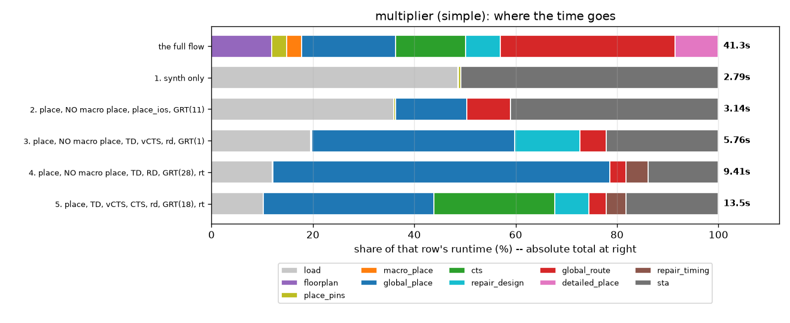

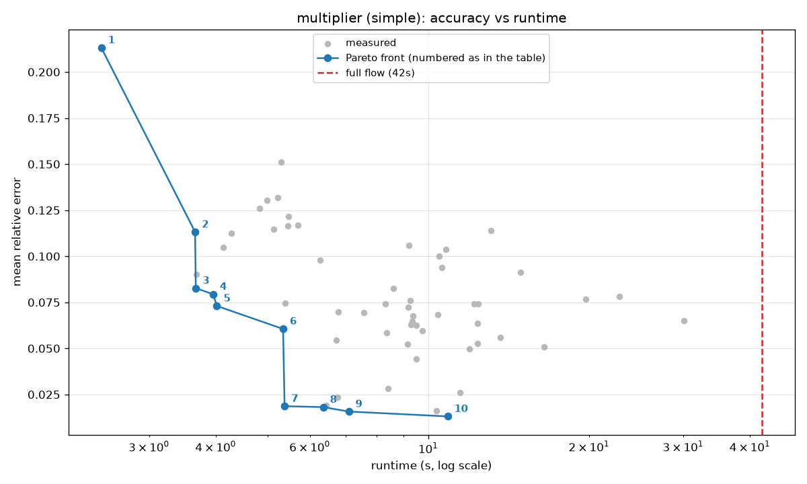

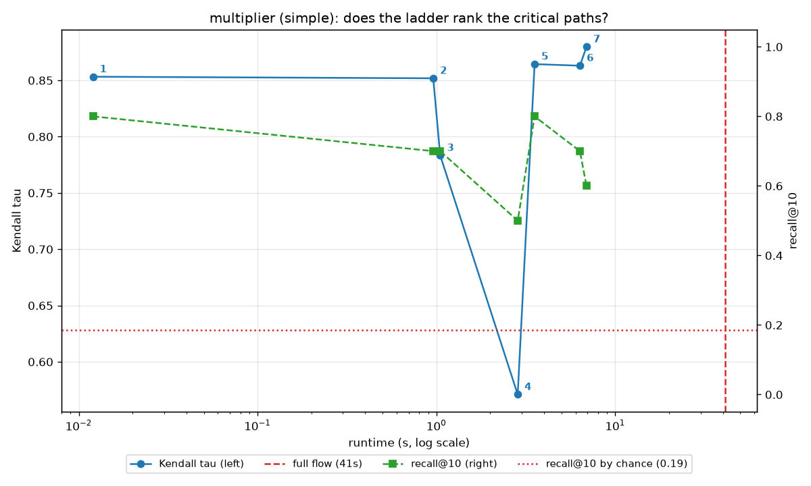

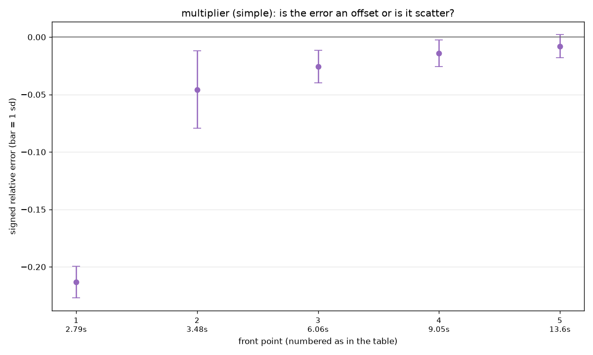

## multiplier_top (macro array)

Running the flow itself -- floorplan through global route, the baseline this is all measured against -- takes **737s**. The cheapest rung on the front is 186x faster than that at 32.1% error, and the most accurate is 11x faster at 6.9%.

Sampled 177 near-critical reg2reg paths. Recall@10 by chance is 0.06: a rung scoring at or below that has no skill at picking the critical paths.

Rung A explored 231 configurations.

6 front points across 3.96s to 66.1s. The widest gap (0.718) spans 3.96s to 29.8s and is structural rather than unexplored: it separates the configurations that skip placement from those that run it. Of 7 placed configurations timed here the fastest took 29.8s, so there is no cheap-but-placed estimate to be found in between -- the choice is binary.

|   # | rungs                                        |   runtime_s |   mean_rel_err |   kendall_tau |     bias |   spread |   worst_recall |   mean_rel_err_nonmacro |   kendall_tau_nonmacro |   mean_rel_err_macro |   kendall_tau_macro |
|----:|:---------------------------------------------|------------:|---------------:|--------------:|---------:|---------:|---------------:|------------------------:|-----------------------:|---------------------:|--------------------:|
|   1 | synth only                                   |       3.956 |        0.321   |        0.7604 | -0.321   |  0.08412 |            0.1 |                 0.2729  |                 0.7073 |               0.3821 |             0.2735  |
|   2 | place, NO macro place, TD, RD, vCTS, CTS, rd |      29.84  |        0.1392  |        0.7492 | -0.02325 |  0.1899  |            0   |                 0.08275 |                 0.5597 |               0.2109 |             0.4705  |
|   3 | place, NO macro place, GRT(11), rt           |      41.23  |        0.1259  |        0.7205 | -0.02993 |  0.1587  |            0.2 |                 0.09379 |                 0.6895 |               0.1666 |             0.1242  |
|   4 | place, place_ios, vCTS, prop                 |      47.76  |        0.1151  |        0.7185 | -0.03034 |  0.148   |            0.4 |                 0.06858 |                 0.6887 |               0.1741 |             0.09091 |
|   5 | place, NO macro place, vCTS, rd, GRT(29), rt |      48.24  |        0.1087  |        0.7203 | -0.08287 |  0.1394  |            0.2 |                 0.03916 |                 0.7048 |               0.197  |             0.08492 |
|   6 | place, RD, vCTS, CTS, rd, GRT(9), rt         |      66.08  |        0.06919 |        0.7793 | -0.01845 |  0.09514 |            0.2 |                 0.03549 |                 0.76   |               0.112  |             0.2954  |

**Where the flow's time goes**, largest first: global_route 385s, global_place 220s, cts 53s, macro_place 34s, floorplan 27s, detailed_place 9s, repair_design 7s, place_pins 2s. The single biggest stage is global_route at 52% of the flow, and the estimator does not skip it so much as run a far cheaper version of it -- which is where the saving comes from.

**What each stage costs**, from the deepest rung measured (place, RD, vCTS, CTS, rd, GRT(9), rt): macro_place 20.9s, global_route 18.6s, cts 6.33s, global_place 5.2s, repair_design 3.87s, repair_timing 2.57s, place_pins 0.02s, floorplan 0.008s.

**Macro paths behave differently, and worse.** Of the 177 sampled paths, 78 touch a macro pin and 99 do not, and the two are separate populations: the macro paths run faster and none of them is among the ten worst overall, which is why a slack-ranked sample reaches almost none of them and has to be told to go and find them. Scored on their own, rank correlation across the front runs from +0.08 to +0.47 against +0.70 to +0.56 on everything else. Where that number is negative the estimator is ordering the macro paths backwards, and the healthy-looking aggregate is the non-macro majority outvoting them.

**Where each rung's time goes.** Overhead is loading the design and running the timing query, which cost the same whatever the rung does.

| rung                                            |   total_s |   overhead_s |   work_s |   overhead_pct | vs flow   |
|:------------------------------------------------|----------:|-------------:|---------:|---------------:|:----------|
| the full flow (baseline)                        |    737    |       nan    |   737    |         nan    | 1x        |
| 1. synth only                                   |      3.96 |         3.95 |     0.01 |          99.7  | 186x      |
| 2. place, NO macro place, TD, RD, vCTS, CTS, rd |     29.8  |         8.72 |    21.1  |          29.2  | 25x       |
| 3. place, NO macro place, GRT(11), rt           |     41.2  |         3.97 |    37.3  |           9.62 | 18x       |
| 4. place, place_ios, vCTS, prop                 |     47.8  |         3.72 |    44    |           7.79 | 15x       |
| 5. place, NO macro place, vCTS, rd, GRT(29), rt |     48.2  |         3.65 |    44.6  |           7.56 | 15x       |
| 6. place, RD, vCTS, CTS, rd, GRT(9), rt         |     66.1  |         9.02 |    57.1  |          13.6  | 11x       |

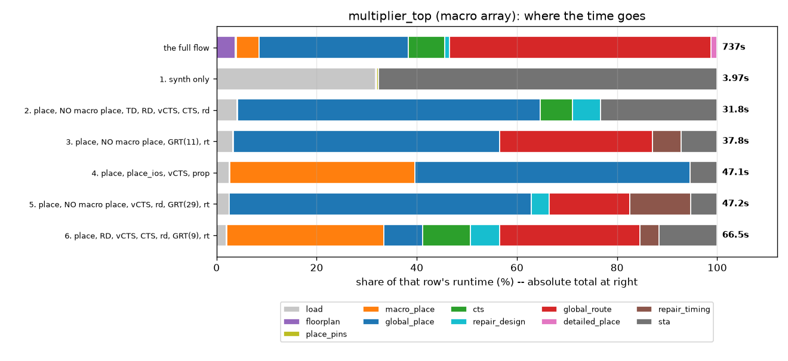

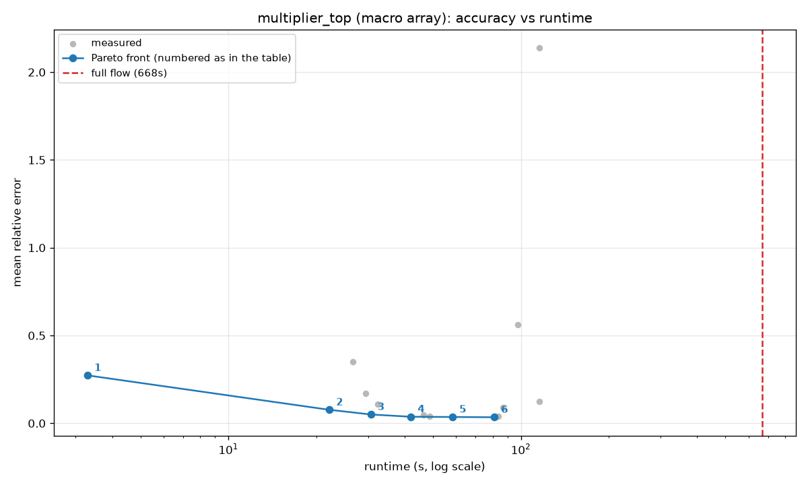

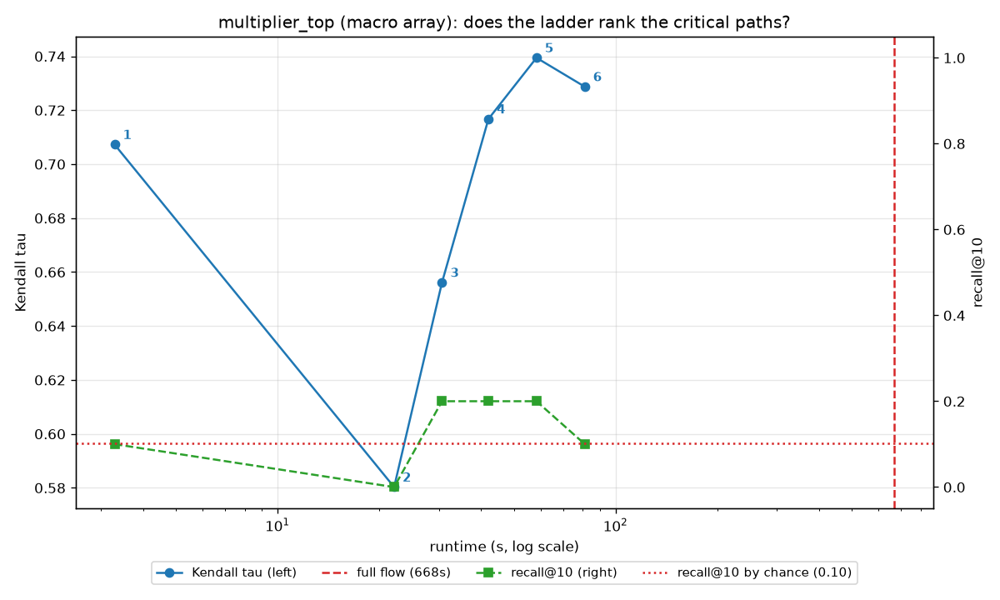

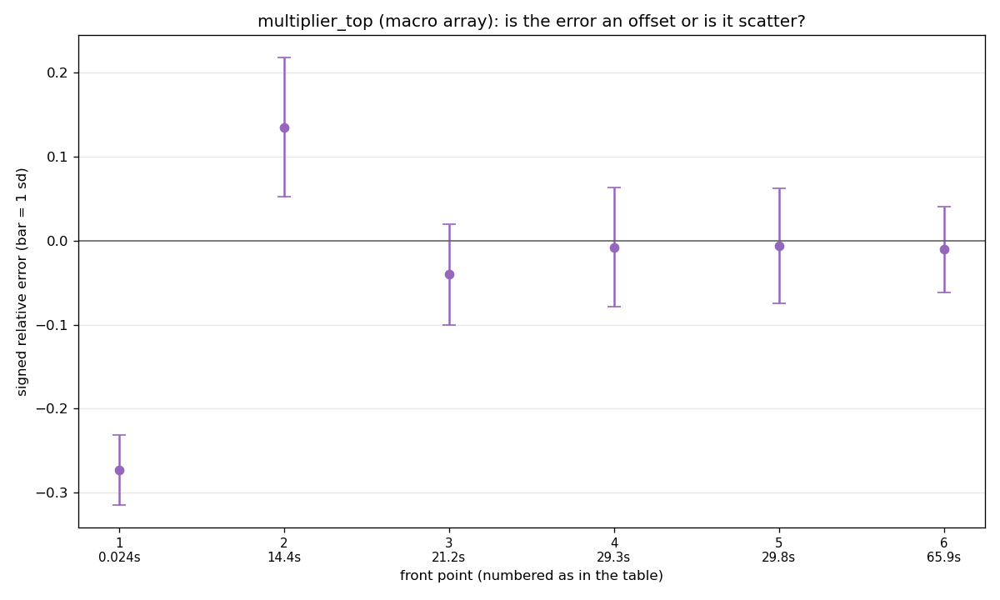

## multiplier_top, macro paths only

Running the flow itself -- floorplan through global route, the baseline this is all measured against -- takes **737s**. The cheapest rung on the front is 50x faster than that at 18.7% error, and the most accurate is 22x faster at 6.2%.

Sampled 78 near-critical reg2reg paths. Recall@10 by chance is 0.13: a rung scoring at or below that has no skill at picking the critical paths.

Rung A explored 234 configurations.

2 front points across 14.9s to 34s. 21 of 23 measured configurations are dominated -- slower and no more accurate -- so the front is narrow because the trade-off runs out, not because the search budget did. Beyond the last point, more runtime buys nothing.

|   # | rungs                                  |   runtime_s |   mean_rel_err |   kendall_tau |     bias |   spread |   worst_recall |   mean_rel_err_nonmacro |   kendall_tau_nonmacro |   mean_rel_err_macro |   kendall_tau_macro |
|----:|:---------------------------------------|------------:|---------------:|--------------:|---------:|---------:|---------------:|------------------------:|-----------------------:|---------------------:|--------------------:|
|   1 | place, NO macro place, place_ios, prop |       14.89 |        0.1869  |        0.7682 |  0.1186  |  0.1845  |              0 |                 0.2681  |                 0.5226 |              0.08383 |              0.5764 |
|   2 | place, TD, GRT(3)                      |       34.02 |        0.06164 |        0.8175 | -0.02387 |  0.07016 |              0 |                 0.06251 |                 0.6417 |              0.06053 |              0.7043 |

**Where the flow's time goes**, largest first: global_route 385s, global_place 220s, cts 53s, macro_place 34s, floorplan 27s, detailed_place 9s, repair_design 7s, place_pins 2s. The single biggest stage is global_route at 52% of the flow, and the estimator does not skip it so much as run a far cheaper version of it -- which is where the saving comes from.

**What each stage costs**, from the deepest rung measured (place, TD, GRT(3)): macro_place 18.7s, global_route 5.61s, global_place 4.64s, place_pins 0.017s, floorplan 0.007s.

**Macro paths behave differently, and worse.** Of the 177 sampled paths, 78 touch a macro pin and 99 do not, and the two are separate populations: the macro paths run faster and none of them is among the ten worst overall, which is why a slack-ranked sample reaches almost none of them and has to be told to go and find them. Scored on their own, rank correlation across the front runs from +0.58 to +0.70 against +0.52 to +0.64 on everything else. Where that number is negative the estimator is ordering the macro paths backwards, and the healthy-looking aggregate is the non-macro majority outvoting them.

**Where each rung's time goes.** Overhead is loading the design and running the timing query, which cost the same whatever the rung does.

| rung                                      |   total_s |   overhead_s |   work_s |   overhead_pct | vs flow   |
|:------------------------------------------|----------:|-------------:|---------:|---------------:|:----------|
| the full flow (baseline)                  |     737   |       nan    |    737   |          nan   | 1x        |
| 1. place, NO macro place, place_ios, prop |      14.9 |         3.73 |     11.2 |           25   | 50x       |
| 2. place, TD, GRT(3)                      |      34   |         3.95 |     30.1 |           11.6 | 22x       |

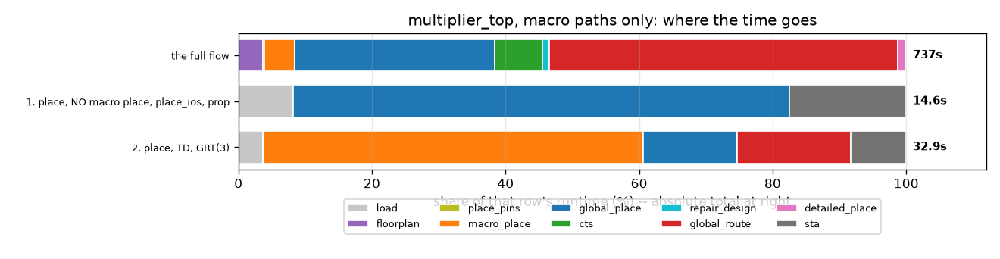

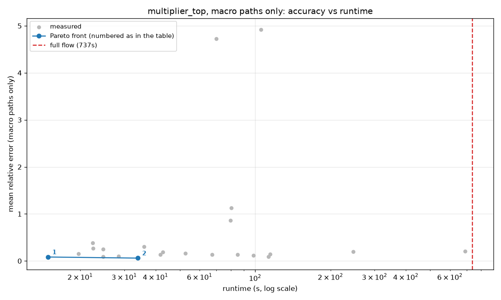

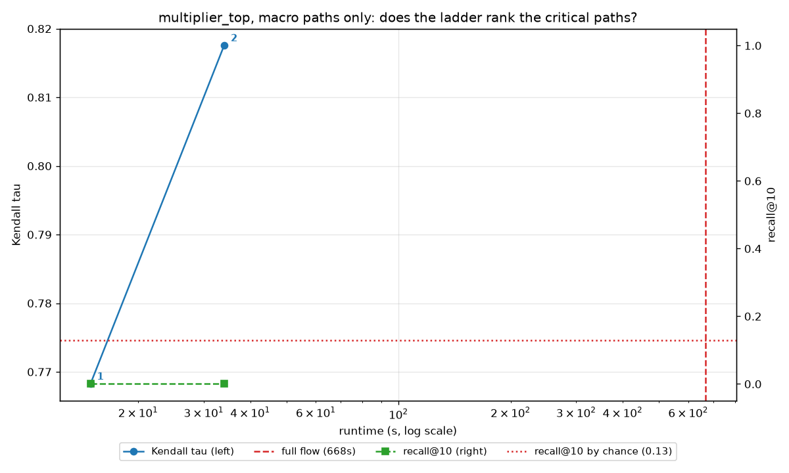

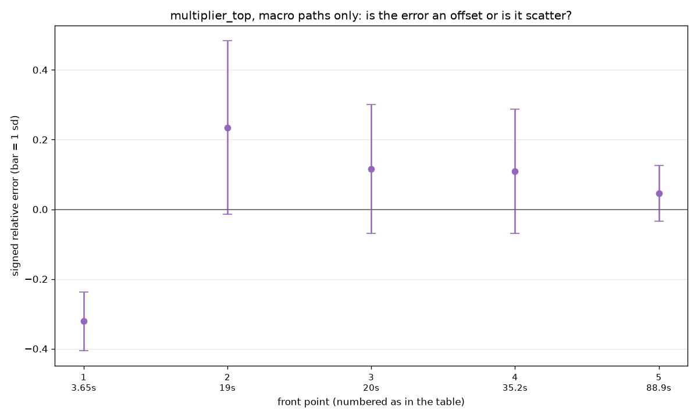

## Does the bias transfer between designs?

The scale factor is fitted on `multiplier` and applied unchanged to
`multiplier_top`, which never contributed to it. **oracle** is what a
constant fitted on `multiplier_top`'s own ground truth would have
achieved -- the ceiling the transferred number is measured against,
not a result in itself.

| rung           |   scale |   raw err |   transferred |   oracle | helped   |
|:---------------|--------:|----------:|--------------:|---------:|:---------|
| place_only     |   1.121 |   0.1381  |        0.1177 |  0.1139  | yes      |
| place_ios      |   1.119 |   0.1841  |        0.108  |  0.07943 | yes      |
| virtual_cts    |   1.158 |   0.145   |        0.1243 |  0.115   | yes      |
| cts            |   1.105 |   0.1185  |        0.1247 |  0.1073  | no       |
| cts_grt        |   1.053 |   0.09771 |        0.1182 |  0.1     | no       |
| cts_grt_repair |   1.053 |   0.09769 |        0.1182 |  0.1     | no       |

Rank correlation is absent from this table on purpose: it is
invariant under a positive scale factor, so calibration cannot
change the order the paths come out in, only how wrong the numbers
are.

---

## How stable is any of this?

Every number above comes from one run per configuration, and
adjacent rungs on the front sit 0.0005 apart in mean relative
error. `knob_sweep.py` states the assumption that makes that
acceptable -- accuracy is deterministic for a given configuration,
so repeating it would measure nothing -- and it is true. An
identical re-run reproduces exactly.

Determinism is not stability. The question is what happens when an
input moves by an amount nobody would call a design change.

This is somebody else's experiment. Kahng & Mantik (ISQED 2002)
gave the taxonomy of perturbations that leave a solution
well-formed and measured tool noise with it; Jeong & Kahng found a
1ps timing-constraint change moving post-synthesis area by up to
16.4%; Chan, Kahng & Woo (SLIP 2020) re-ran both on commercial
tools, found 7% on routed wirelength from netlist reordering and
11.5% from nudging a placement blockage, and framed the result as
a *noise floor* -- a lower bound on how accurate any predictor of
that flow can be. Nothing about the method here is new. What is
new is the subject (OpenROAD, not a commercial tool), the target
(a predictor being audited rather than a flow characterised), and
the per-stage attribution, which is affordable only because `fork`
makes the shared prefix free.

### Which stage manufactures the noise

A clock-period nudge of 1-10ps cannot legitimately move the
answer: `min_period = clk_period - slack`, so the constraint
cancels out of the metric exactly. Anything that survives is
tool noise. Applied at each stage in turn, the nudge persisting
to the end of the run, so the difference between consecutive
stages isolates one stage's contribution:

| rung     | perturbation    | stage         | class        |   period range % |   err span |
|:---------|:----------------|:--------------|:-------------|-----------------:|-----------:|
| cheap    | floorplan_area  | floorplan     | geometric    |           5.0376 |    0.02088 |
| cheap    | floorplan_clock | floorplan     | null_control |           0      |    0       |
| cheap    | floorplan_rows  | floorplan     | geometric    |           4.4527 |    0.01908 |
| cheap    | macro_density   | macro_place   | geometric    |           0.8125 |    0.00228 |
| cheap    | pins_clock      | pins_pre      | null_control |           0      |    0       |
| middle   | floorplan_area  | floorplan     | geometric    |           2.8731 |    0.02547 |
| middle   | floorplan_clock | floorplan     | constraint   |           2.7929 |    0.02995 |
| middle   | floorplan_rows  | floorplan     | geometric    |           3.84   |    0.02308 |
| middle   | grt_clock       | grt           | constraint   |           0      |    0       |
| middle   | macro_density   | macro_place   | geometric    |           1.0264 |    0.0119  |
| middle   | pins_clock      | pins_pre      | constraint   |           2.7929 |    0.02995 |
| middle   | place_clock     | global_place  | constraint   |           2.7825 |    0.02995 |
| middle   | repair_clock    | repair_design | constraint   |           0      |    0       |
| accurate | cts_clock       | clock         | constraint   |           0      |    0       |
| accurate | floorplan_area  | floorplan     | geometric    |           3.0037 |    0.02328 |
| accurate | floorplan_clock | floorplan     | constraint   |           3.1387 |    0.03117 |
| accurate | floorplan_rows  | floorplan     | geometric    |           4.3477 |    0.02081 |
| accurate | grt_clock       | grt           | constraint   |           0      |    0       |
| accurate | macro_clock     | macro_place   | constraint   |           3.1219 |    0.03117 |
| accurate | macro_density   | macro_place   | geometric    |           1.0995 |    0.01213 |
| accurate | pins_clock      | pins_pre      | constraint   |           3.1387 |    0.03117 |
| accurate | place_clock     | global_place  | constraint   |           3.1219 |    0.03117 |
| accurate | repair_clock    | repair_design | constraint   |           0      |    0       |

On the middle rung the spread is **0.0300** in
mean relative error, against that rung's own error of
**0.0630**. The noise is about half
the size of the quantity being measured, and it is
60x the smallest gap the front
is ranked by. Resolving that gap at this spread would need
roughly **28709 runs** per configuration.

Nudges at CTS, repair_design and global route move the answer
by **exactly zero**. All of it comes from timing-driven global
placement.

**What this is not.** Var(E - T) = sigma_E^2 + sigma_T^2, and
the noise floor in Chan/Kahng/Woo's sense is sigma_T: the
perturbation is not an input the estimator is given, so no
predictor can beat its target's own dispersion. The flow is
not re-run here, so what is measured is sigma_E. That bounds
how reproducible the front is, not how accurate an estimator
could ever be.

## Can it tell you whether your change helped?

That is the question a developer actually asks, and the reason
it is hard is not that the flow is slow. One flow run is one
draw from a distribution wider than most changes. An infinitely
fast flow would still not answer it.

Eleven RTL variants were run through the real flow and through
the estimator, each at five site-aligned core-area
perturbations. Three variants are equivalence-preserving, so
their true effect on the achieved period is exactly zero; the
rest move it by a real and measured amount.

### Provisioning an ensemble

What an extra ensemble member costs is not a whole run's
memory. Fork children are copy-on-write, so shared pages are
paid once and the marginal cost is the pages a child dirties
after the fork:

| stage         |   private dirty MB |
|:--------------|-------------------:|
| sta           |              770   |
| repair_timing |              742.4 |
| grt           |              742.3 |
| repair_design |              189.1 |
| clock         |              189   |
| global_place  |              188.9 |
| load          |              135.5 |
| macro_place   |               60.3 |
| pins_pre      |               17.7 |
| wire_rc       |                5.6 |
| floorplan     |                5.6 |

So a member forked before global placement costs single-digit
megabytes, and one forked after it costs a few hundred. On any
plausible CI machine cores bind the ensemble long before
memory does.

### Reproducing the stability results

```sh
bazel test //test/estimation_ladder:seed_sensitivity_test
bazel run  //test/estimation_ladder:seed_sensitivity
bazel run  //test/estimation_ladder:fuzz_floor
```

---

## Can a PR be given a quantified verdict?

The question a developer asks is whether their change helped.
The usual answer is to run the flow and compare -- and on a design
with macros that answer is worth very little, for a reason that has
nothing to do with how long the flow takes.

### Macro placement is reproducible, and chaotic

`rtl_macro_placer` is deterministic -- a forked re-run of an
identical configuration reproduces every macro exactly -- and
independent of thread count. Neither was safe to assume: the
RTL-MP papers describe a multi-start scheme across ten threads.

But nudging the core edge by **one site (0.054um, 0.014% of
a 392um core)** moves **16 of 16 macros**, by **144um on average** and 285um at worst, flipping 8 of them.

The achieved period across five such nudges spans **24.7%**. Nothing is monotone: two
sites in one direction barely moves anything while one site
moves everything.

For comparison, the same class of perturbation moves the
wire-only `multiplier` design by 1.2%. So a single flow run
on a macro design is one draw from a wide distribution, and
**an infinitely fast flow would still not answer the
question**. Latency was never the binding constraint;
variance is.

### Ensembles buy resolution

The spread is noise and it averages away: the resolvable
difference falls roughly as 1/sqrt(k). What does *not* average
away is the effect underneath -- `roworder`'s estimated shift
holds near +7.8% while its interval shrinks, which is the
signature of signal.

| variant   |   k |   resolvable % |   estimated shift % |
|:----------|----:|---------------:|--------------------:|
| roworder  |   5 |          13.95 |                7.41 |
| roworder  |  10 |          10.04 |                7.71 |
| roworder  |  20 |           7.95 |                7.85 |
| roworder  |  40 |           5.73 |                7.79 |
| stage1    |   5 |          10.94 |               -0.06 |
| stage1    |  10 |           8.55 |               -0.43 |
| stage1    |  20 |           6.04 |               -0.37 |
| stage1    |  40 |           4.26 |               -0.28 |

### Does the estimator reach the flow's verdict? (`multiplier`)

41 perturbations per arm; the flow is 47s here. Magnitudes are not expected to match -- the
estimator is biased and its per-perturbation response is
uncorrelated with the flow's. Only the *ordering* has to
carry over.

| variant   |   flow shift % | flow verdict   |   est shift % | est verdict   | agree   |
|:----------|---------------:|:---------------|--------------:|:--------------|:--------|
| load8     |           0.45 | worse          |         -0.1  | none          | no      |
| split     |           9.43 | worse          |         26.78 | worse         | yes     |

It catches the large regression and is blind to the small
one. The failure direction is the tolerable one: on `load8`
the estimator returns inconclusive rather than a confident
wrong answer.

**Precision is not accuracy.** On `load8` the estimator's own
bootstrap is tight -- -0.10% [-0.19, +0.04] -- while the truth
is +0.45%. The ensemble is *precisely wrong*, and more `k`
narrows that interval without moving it toward truth. So the
gate requires two bars: the interval must exclude no-change,
**and** the shift must exceed a validated accuracy floor.

Without the second bar the gate reports `+65.6 points`
(improved) for a change the flow says is 0.45% *worse* --
exactly the failure that ends a KPI's credibility the first
time someone checks it by hand.

### Does the estimator reach the flow's verdict? (`multiplier_top`)

9 perturbations per arm; the flow is 900s, so the reference is itself underpowered. Magnitudes are not expected to match -- the
estimator is biased and its per-perturbation response is
uncorrelated with the flow's. Only the *ordering* has to
carry over.

| variant   |   flow shift % | flow verdict   |   est shift % | est verdict   | agree   |
|:----------|---------------:|:---------------|--------------:|:--------------|:--------|
| roworder  |           1.52 | none           |          9.72 | worse         | no      |
| stage1    |          -1.06 | none           |         -0.45 | none          | yes     |
| stage4    |          19.68 | worse          |         37.78 | worse         | yes     |

**The failure mode inverts on the macro design, and it
inverts the wrong way.** On `multiplier` the estimator
under-claims: it returns inconclusive where the flow sees an
effect, which is the safe direction. Here it *over*-claims --
`roworder` is called a confident ~10% regression where the
flow cannot detect a change at all. A false alarm is the
failure that ends a KPI, because the first developer to check
one by hand finds nothing there.

So the accuracy floor for this design is **at least 10%**,
not the 1% measured on `multiplier`. That is the same warning
as before, now with a number attached: the machinery
transfers and the magnitudes do not.

Two things soften it without excusing it. The flow reference
is itself underpowered -- nine runs give it a +-5% interval,
so 'inconclusive' partly means the reference cannot resolve
7.8% either. And the estimator overstates magnitudes by a
fairly consistent factor (37.8% against 19.7% on `stage4`,
26.8% against 9.4% on `split`), which suggests a calibration
rather than a randomly wrong answer. Neither is measured well
enough to act on.

`stage4` is the positive control and it agrees, so the
comparison itself is sound; it is the estimator's confidence
that is not.

### What it costs

Every other runtime in this study was measured under `fork`:
contended, and single-threaded because `fork` quiesces the host
before forking. Neither is the number to plan a CI budget from,
so a gate member is timed alone on the machine with all its
threads.

| design         | one member, all threads, alone   |   threads |
|:---------------|:---------------------------------|----------:|
| multiplier     | 4.9s                             |        16 |
| multiplier_top | 86.2s                            |        16 |

On `multiplier_top` that is 86s against ~470s single-threaded, a
5.4x difference -- which is why an ensemble runs as separate
processes rather than as a forked walk. Thread scaling is
sublinear while process parallelism is not, so the right
arrangement flips at k = cores: below it, spend spare cores on
threads within each member; at or above it, one thread each.

For `multiplier_top` on 64 cores: k=8 takes ~2 min per arm, k=16
~2.9 min, k=40 ~7.8 min. A single flow run is 900s. So for the
wall-clock of **one** flow sample you can have a 40-member
ensemble on **both** arms -- and a cached merge-base halves it.

### What is not measured

Open, in rough order of what would change a decision:

- **Whether the estimator's overstatement is a calibration.** It runs
  about 2x high consistently -- 37.8% against 19.7% on `stage4`,
  26.8% against 9.4% on `split`. If that factor is stable it is a
  correction; if it is coincidence across two points it is not. Two
  points cannot tell the difference.
- **A configuration search.** Five rungs were compared by hand and
  timing-driven placement lost on both designs. A factorial over the
  stage gates (`macro_place` effort x timing-driven x
  routability-driven x clock x repair x grt) is the shape the fork
  tree is best at, since ordering the expensive stages first makes
  macro placement run once for the whole factorial rather than once
  per point.
- **RTL-MP's objective function.** Its authors say the weights are
  design-specific and need per-design tuning, and ORFS runs the
  defaults untuned. Given the placer moves macros 144um on a 0.054um
  input change, the question is not only whether the weights give
  good QoR but whether any weighting makes it land in a consistent
  basin. `RTLMP_ARGS` is already a registered knob.
- **A flow reference with real power on the macro design.** Nine runs
  give +-5%, which cannot resolve the 7.8% in dispute. Roughly
  twenty-five per variant would, at about three hours each.
- **More than three variants anywhere.** Every accuracy claim here
  rests on two or three RTL edits.

### Running these campaigns

Two things cost hours to learn and are worth stating.

**Bazel concurrency is not free to raise.** Each ORFS flow action
spawns a 16-thread OpenROAD, so `--jobs` multiplies that. Measured on
a 16-core machine: `--jobs=4` sustained about 8 flow runs an hour at
load ~30, while `--jobs=8` completed *zero* in fifteen minutes at
load ~70. The extra concurrency was pure thrashing. Size `--jobs` so
that jobs x threads is near the core count, and measure the
completion rate rather than assuming more is faster.

**Size the ensemble from the effect you need to resolve**, not from a
round number. `z*s*sqrt(2/k)` below the effect size is the whole
calculation; it turned a planned 15-perturbation reference into a
9-perturbation one and saved three hours that would have changed no
conclusion.

### Calibrating this on another design

The machinery transfers. **The magnitudes do not**, and neither does
the accuracy floor: the perturbation that moves `multiplier` by 1.2%
moves `multiplier_top` by 25%. Run these in order before showing
anyone a KPI, because each one can change what the next should be:

1. `macro_stability` -- is the placer deterministic, thread-
   independent, and how chaotic? Minutes, and it can invalidate the
   rest.
2. `k_scaling` -- does an ensemble buy resolution, and how much `k`
   does the effect size you care about need?
3. `method_validation` -- **not optional.** It sets the accuracy
   floor by comparing against real flow ensembles. Until it has run,
   the gate reports a precision it cannot back: on `load8` it would
   otherwise have called a 0.45% regression a +65.6 point
   improvement.
4. `ci_gate` -- only now.

Step 3 needs a design whose flow you can afford to ensemble. Where
you cannot, validate the method on a smaller vehicle and carry over
the *mechanism*, never the numbers.

### Reproducing the gate campaign

```sh
bazel run //test/estimation_ladder:macro_stability_top   # is the placer chaotic?
bazel run //test/estimation_ladder:k_scaling_top         # does ensemble buy resolution?
bazel run //test/estimation_ladder:method_validation     # does it match the flow?
bazel run //test/estimation_ladder:ci_gate_demo          # a large regression
bazel run //test/estimation_ladder:ci_gate_demo_small    # below the floor
```

`method_validation` is not optional before using the gate on a new
design: it is what sets the accuracy floor, and the floor is
design-specific.

---

## Where in the flow is the noise born?

Everything the seed-sensitivity study measures is the ESTIMATOR's
stability; the flow's own dispersion was declared out of its scope.
This campaign is that flow-side arm: the production ORFS stage
scripts floorplan..grt in one OpenROAD process, an ensemble forked
off each stage boundary -- `GPL_RANDOM_SEED` at place, a 1ps-scale
clock nudge at cts (which exposes no seed; the nudge cancels in
`min_period = clk_period - slack`, so what survives is tool noise),
`GRT_SEED` at grt -- and every member running the production tail
to grt, measured there by the same instrument as the ground truth.
A stage's spread therefore includes whatever the stages after it
amplify it into, and an all-levers arm supplies the directly
measured total the per-arm decomposition must predict: under
independence the variances add, and the residual is the interaction
the per-stage view cannot see.

The sigmas below are of KPI *candidates*, not of a chosen KPI:
extremal statistics track what tapeout cares about but inherit the
tail's noise; aggregates average the tail away but measure
something softer. The KPI is PPA-shaped -- performance and
std-cell area now, power recorded equal to area and left as a
TODO -- and picking the compromise is a decision for whoever reads
the table, not for this campaign.

### multiplier_top

Per-arm sigma of each KPI candidate, in % of the spine's value
-- the noise born at that stage, as seen at flow end:

| KPI        |      spine |   sigma_place_pct |   sigma_cts_pct |   sigma_grt_pct |   sigma_all_pct | decomposition   |
|:-----------|-----------:|------------------:|----------------:|----------------:|----------------:|:----------------|
| achieved   |   1.08e+03 |             0.684 |          0.358  |          0.134  |           1.44  | consistent      |
| top10_mean |   1.07e+03 |             0.72  |          0.367  |          0.113  |           1.44  | consistent      |
| p95        |   1.07e+03 |             0.738 |          0.38   |          0.137  |           1.48  | consistent      |
| mean       | 832        |             0.848 |          0.184  |          0.154  |           1.45  | consistent      |
| area       |   2.07e+03 |             0.435 |          0.0669 |          0.0376 |           0.452 | consistent      |

Every null member reproduced the spine exactly and every nudge landed.

What an ensemble buys, per generator: a member re-runs only its
arm's tail (`c` seconds), and k members resolve
`delta_min = 1.96 * sigma * sqrt(2/k)`:

| generator   | KPI        |   c_s |   dmin@k=5 (%) |   dmin@k=10 (%) |   dmin@k=20 (%) |   dmin@k=40 (%) |
|:------------|:-----------|------:|---------------:|----------------:|----------------:|----------------:|
| all         | achieved   |   848 |          1.79  |          1.26   |          0.894  |          0.632  |
| all         | mean       |   848 |          1.8   |          1.27   |          0.9    |          0.636  |
| all         | top10_mean |   848 |          1.79  |          1.27   |          0.895  |          0.633  |
| cts         | achieved   |   527 |          0.443 |          0.314  |          0.222  |          0.157  |
| cts         | mean       |   527 |          0.228 |          0.161  |          0.114  |          0.0805 |
| cts         | top10_mean |   527 |          0.455 |          0.321  |          0.227  |          0.161  |
| grt         | achieved   |   459 |          0.167 |          0.118  |          0.0833 |          0.0589 |
| grt         | mean       |   459 |          0.19  |          0.135  |          0.0952 |          0.0673 |
| grt         | top10_mean |   459 |          0.139 |          0.0986 |          0.0697 |          0.0493 |
| place       | achieved   |   832 |          0.848 |          0.599  |          0.424  |          0.3    |
| place       | mean       |   832 |          1.05  |          0.744  |          0.526  |          0.372  |
| place       | top10_mean |   832 |          0.893 |          0.632  |          0.447  |          0.316  |

### multiplier

Per-arm sigma of each KPI candidate, in % of the spine's value
-- the noise born at that stage, as seen at flow end:

| KPI        |   spine |   sigma_place_pct |   sigma_cts_pct |   sigma_grt_pct |   sigma_all_pct | decomposition   |
|:-----------|--------:|------------------:|----------------:|----------------:|----------------:|:----------------|
| achieved   |     918 |            0.428  |        1.69e-06 |        0        |           0.565 | consistent      |
| top10_mean |     911 |            0.391  |        1.78e-06 |        0.0027   |           0.35  | consistent      |
| p95        |     912 |            0.395  |        1.73e-06 |        6.33e-06 |           0.369 | consistent      |
| mean       |     845 |            0.41   |        1.98e-06 |        0.00125  |           0.567 | consistent      |
| area       |     576 |            0.0944 |        0        |        0        |           0.121 | consistent      |

Every null member reproduced the spine exactly and every nudge landed.

What an ensemble buys, per generator: a member re-runs only its
arm's tail (`c` seconds), and k members resolve
`delta_min = 1.96 * sigma * sqrt(2/k)`:

| generator   | KPI        |   c_s |   dmin@k=5 (%) |   dmin@k=10 (%) |   dmin@k=20 (%) |   dmin@k=40 (%) |
|:------------|:-----------|------:|---------------:|----------------:|----------------:|----------------:|
| all         | achieved   |  94.3 |       0.7      |        0.495    |        0.35     |        0.247    |
| all         | mean       |  94.3 |       0.703    |        0.497    |        0.351    |        0.248    |
| all         | top10_mean |  94.3 |       0.434    |        0.307    |        0.217    |        0.154    |
| cts         | achieved   |  85.2 |       2.1e-06  |        1.48e-06 |        1.05e-06 |        7.42e-07 |
| cts         | mean       |  85.2 |       2.45e-06 |        1.73e-06 |        1.23e-06 |        8.67e-07 |
| cts         | top10_mean |  85.2 |       2.21e-06 |        1.56e-06 |        1.1e-06  |        7.81e-07 |
| grt         | achieved   |  80   |       0        |        0        |        0        |        0        |
| grt         | mean       |  80   |       0.00154  |        0.00109  |        0.000772 |        0.000546 |
| grt         | top10_mean |  80   |       0.00335  |        0.00237  |        0.00167  |        0.00118  |
| place       | achieved   |  95   |       0.531    |        0.375    |        0.265    |        0.188    |
| place       | mean       |  95   |       0.508    |        0.359    |        0.254    |        0.18     |
| place       | top10_mean |  95   |       0.485    |        0.343    |        0.243    |        0.171    |

### Reproducing the decomposition

```sh
bazel run //test/estimation_ladder:stage_variance_small  # ~minutes
bazel run //test/estimation_ladder:stage_variance_top    # hours
```

---

## Does the macro placer's objective predict the flow?

The variance decomposition put the birthplace of the noise at
macro placement, which makes RTL-MP's choice of placement a
choice of downstream outcome -- selected by an internal
annealing cost that had never been compared against the flow.
This audit runs a population of candidate placements through
the production tail: the placer's own winners (W), optima of
singly-distorted objectives (T), its best efforts inside
adversarial fences (D_fence -- worse by its own accounting),
and injected permutations of the winner's slots.

A finding before the first number: **RTL-MP cannot be made to
score an external placement.** It has no evaluate-only entry
point; the Total Cost it prints is normalized per run, so even
its own totals are not comparable across runs; and forcing the
annealer onto a target via guidance regions fails structurally
-- the annealer explores sequence-pair packings, and arbitrary
geometry is not in that space (measured 80-247um of
non-compliance, including against its own winner). Every score
below therefore comes from a placement RTL-MP itself produced:
raw penalty values parsed from its debug table and recombined
into the default objective under one fixed normalization. The
injected permutations are evaluated on the flow side only,
reported as unscored.

Candidates: 21; pair ties below the
variance campaign's measured downstream noise are discarded, so
none of the numbers below reward noise-chasing.

`P_pick` is the probability the objective picks the better of
two candidates (0.5 = coin flip) counting only pairs separated
by more than the flow's measured noise floor; `P_pick raw`
counts every pair, defensible because injection is
deterministic. The AUC pair asks whether the
score and the flow can each tell winners from degraded
placements; regret is what the objective's favorite costs
against the best candidate on the table.

| KPI        |   P_pick | P_pick CI   |   P_pick raw |   AUC score |   AUC flow |   regret % |   P_pick in W |
|:-----------|---------:|:------------|-------------:|------------:|-----------:|-----------:|--------------:|
| achieved   |    0.378 | 0.00..0.83  |        0.55  |       0.325 |      0.25  |       1.68 |         0.4   |
| top10_mean |    0.417 | 0.00..0.88  |        0.522 |       0.325 |      0.275 |       1.58 |         0.4   |
| p95        |    0.464 | 0.20..1.00  |        0.512 |       0.325 |      0.325 |       1.59 |         0.333 |
| mean       |    0.61  | 0.27..0.93  |        0.498 |       0.325 |      0.525 |       3.4  |         0.714 |
| area       |    0.684 | 0.53..0.84  |        0.636 |       0.325 |      0.4   |       3.42 |         0.357 |

Including the unscored injected permutations, the flow's own
winners-vs-degraded separation (achieved period) is AUC 0.42 -- whether bad macro placements even hurt at
grt, independent of anyone's scoring function.

### Reproducing the audit

```sh
bazel run //test/estimation_ladder:stage_variance_top  # delta_tie first
bazel run //test/estimation_ladder:macro_score_top     # the audit
```

---

## How we measured it

### The ground truth

The flow is run properly -- floorplan, placement, CTS, global route --
and the timing read off the result with propagated clocks and
global-routing parasitics. Up to 100 reg2reg paths are sampled from
the worst quarter of the period range, in ten buckets, so the sample
is spread across the near-critical paths rather than piled on the
single worst one. A *register* here can be a macro. The estimator has
to report every sampled path: one it cannot find is an error, not a
path to quietly drop, because dropping the awkward ones would make any
configuration look good.

The flow runtime it is compared against is the floorplan-through-
global-route stages summed from their own logs. Synthesis is excluded
from both sides, since both start from the same post-synthesis
netlist.

### What a runtime includes

Everything from having the post-synthesis netlist to having a timing
number: reading the ODB, the SDC and the liberties, whatever flow
stages the rung runs, and the timing queries themselves. OpenSTA
builds its graph and computes delays on the first query, so the query
is not bookkeeping around the result -- on a rung that runs no flow
stages it is most of the work. An earlier version of this study timed
only the flow stages, which reported a rung whose real cost is 3.5s at
0.024s and made it look thousands of times faster than the flow rather
than a couple of hundred.

The flow baseline is summed from its own stage logs, each of which
includes that stage's load, so both sides are counted the same way.

Load and timing-query cost scale with design size. On a design much
larger than these the fixed overhead grows, and the cheapest rungs
lose most of their apparent advantage; the rungs that run real flow
stages are affected proportionally less.

### How these times would scale

Not measured -- there is no large design here -- but the components
scale differently and it is worth knowing which way. Loading grows
with netlist size. The timing query grows with the number of paths
and their depth. Global placement grows faster than linearly in
instance count. Global routing grows with net count and, badly, with
congestion. The fixed overhead therefore grows more slowly than the
flow does, so the rungs that run real stages should hold their
advantage on a larger design while the near-empty rungs lose most of
theirs.

### Why runtime and accuracy are measured separately

Accuracy is a property of the placement and the parasitics, so many
estimators can run at once without affecting it. Runtime is not: eight
concurrent runs measure contention between siblings as much as the
settings under test. So there are two passes. The first sweeps the
knob space concurrently and records accuracy only. The second re-runs
selected configurations one at a time and times them, with whatever
thread count ORFS hands the tool, three times over, taking the median
and adding repeats when they disagree by more than 5%.

The second pass chooses what to measure adaptively. Because the first
pass already knows every configuration's accuracy, the only open
question is whether a configuration is fast enough to matter, so it
measures wherever a runtime model thinks a configuration might beat
the best already timed at that accuracy.

### The accuracy numbers

- **mean relative error** -- the average of |estimate - truth| / truth
  over the sampled paths.
- **bias** and **spread** -- the average signed error, and the
  variation around it. Reported separately because they mean different
  things: an estimator that is wrong by a consistent amount can be
  corrected with one number, and one that is wrong erratically cannot,
  even when their mean relative errors match.
- **Kendall tau** -- rank correlation between estimated and true path
  order. 1 is perfect agreement, 0 is unrelated.
- **recall@10** -- of the ten truly worst paths, how many the
  estimator also puts in its worst ten. Chance level is ten divided
  by the number of sampled paths (multiplier: 0.19, multiplier_top: 0.06, multiplier_top_macro: 0.13); a rung at or below that
  has no skill at all rather than a little.

### The correction

Ten families were fitted -- a multiplicative constant, an additive
offset, an affine fit, a power law, quadratic and cubic polynomials,
an isotonic fit, a Gaussian process, and Bayesian linear regression --
and each was scored three ways: on the design it was fitted to, on
held-out paths of that design, and on the *other* design entirely.
Only the third number says anything, because a correction fitted
against the ground truth it is then graded on is measuring its own
free parameter.

Every one of these reads only the estimate, and a function of the
estimate alone cannot reorder the paths. So none of them can improve
rank correlation or worst-path recall -- the ordering after correction
is identical, which is checked rather than assumed. Fixing the order
would need a per-path correction using features of each path, which is
a different study.

### What the numbers do not cover

Two small designs, one of which is 400um square. The knob-to-outcome
associations come from a sweep that concentrates its sampling near the
best configurations, so they are suggestive rather than controlled
experiments. The macro design's front rests on 14 timed
configurations, and the simple design's search hit its budget before
meeting its own spread criterion.

### Reproducing it

```sh
bazel build //test/estimation_ladder:extract_ground_truth \
            //test/estimation_ladder:extract_ground_truth_top
bazel run //test/estimation_ladder:optuna_study        # accuracy sweep
bazel run //test/estimation_ladder:optuna_study_top
bazel run //test/estimation_ladder:measure_runtime     # timed pass
bazel run //test/estimation_ladder:measure_runtime_top
bazel run //test/estimation_ladder:calibration_transfer
bazel run //test/estimation_ladder:calibration_models
bazel run //test/estimation_ladder:update-readme
```

## The macro-placement selector apparatus

`macro_select.tcl`, `macro_score.tcl`, `seed_distribution.py`,
`score_vs_flow.py`, `extract_from_src.tcl` and `sdc/swerv_c*.sdc` are the
rig from the macro-placement selection study: RTL-MP driven as a
distribution generator, a report-only global placement used to rank the
candidates it produces, and the accuracy analysis over the result.

The findings are in `../../docs/estimate.md` ("Negative findings of
importance") and `../../ideas/e12-clustered-scorer.md`. Two of the
OpenROAD-side conclusions are filed upstream as
The-OpenROAD-Project/OpenROAD#11315 (`rtl_macro_placer` has no
`-random_seed`, so its anneal cannot be used as a candidate generator)
and #11316 (`gpl` fillers and nets ignore `placement_cluster`).

**The measured populations are deliberately not carried here.** They run
to some 84,000 lines of JSON -- the per-candidate scores, the stage
variance sweeps and the clock shmoo -- and they live on the
`macro-selector` branch and its pull request, both immutable. Anyone who
doubts a published number has to regenerate the population anyway: these
scripts are what regenerate it, and a seeded rerun is the check, not a
diff against an archive. That last point is not incidental. An archived
score/truth pair turned out to be unusable for grading a later rerun at
all, because the bazel-orfs pin changes the synthesis netlist and
therefore the candidates -- see the negative findings.

The bazel targets that drove these scripts are on that branch too, since
several of them take an archived population as an input.
