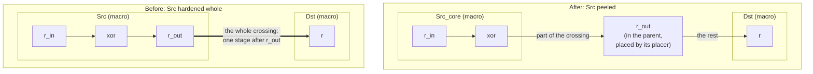

# Peeling a block's boundary flops into the parent

A hardened block keeps every flop it has, including the ones that sit
right at its ports. The parent's placer cannot move them: a block output
that is registered inside the block is a stage that starts at the
block's edge, so the whole wire to the block that reads it falls into
one cycle. On XiangShan that is the parent's worst path:
`ideas/xiangshan-timing.md`, entries 26 and 40, Frontend's `cfVec`
outputs into CtrlBlock.

Peeling splits the block at synthesis, without touching the RTL. The
flops that drive an output port directly stay in a thin wrapper with the
block's name and ports; everything else becomes `<block>_core`, which is
hardened as before. The parent instantiates the block as it always did,
flattens the wrapper, and places the peeled flops itself, anywhere along
the crossing, which splits the wire's delay between the cycle before the
flop and the cycle after it.



The register count is unchanged and so is the logic; only which side of
the macro boundary the output register sits on changes.
`peel_equiv_test` proves the wrapper and the core flattened are the RTL's
`Src`.

## The miniature

`blocks.sv` has two blocks, `Src` and `Dst`; `top.sv` connects Src's
registered 32-bit output to Dst across a 220 um die, Src in the
bottom-left corner and Dst in the top-right (`place_macros.tcl`).

| target | what it is |
|---|---|
| `:peel_src` | `tools/macro_select/peel.tcl` on Src: `Src_wrapper.v` (the output flops) and `Src_core.v` (the rest) |
| `:peel_equiv_test` | yosys `equiv_*`: wrapper plus core is Src; `r_out` is in the wrapper and not in the core |
| `:top_cts` | the base parent: Src and Dst hardened whole |
| `:top_peel_cts` | the peeled parent: Src_core and Dst hardened, the wrapper flattened into the parent |
| `:peel_report_base`, `:peel_report_peel` | the period after CTS and where the parent's own flops sit on the line from Src to Dst (0 at Src's centre, 1 at Dst's) |

Both parents use the same settings, timing-driven placement on: a peeled
flop's two nets have the same wirelength wherever it sits on the line,
so only timing tells the placer where to put it.

## What it does

The 150 ps clock is set so the crossing fails in both arms; with slack to
spare the timing-driven placer has no reason to move a flop. Period is
the clock minus the worst setup slack after CTS with placement
parasitics (`peel_report.tcl`).

| parent | period | stage into the peeled flops | stage out of them | flops the parent placed | where (0 at Src, 1 at Dst) |
|---|---:|---:|---:|---:|---|
| base, Src hardened whole | 238.3 ps | | | 0 | |
| peeled, Src_core hardened | 198.5 ps | 169.0 ps | 198.5 ps | 32 | mean 0.18, 0.10 to 0.32 |

- The period falls by 17 percent with the same registers and logic.
- The two stages around the peeled flops are 169 and 198.5 ps; a flop at
  the balance point would make both about 184 ps. The timing-driven
  placer gets within 15 ps of it.
- The miniature needs Src's own stage to be short: with `r_in + 3` in
  place of the xor, the turnaround's area mapping made a 32-bit ripple
  carry, the stage into the flops became the longest one (235 ps), and
  peeling bought 6 ps. On XiangShan the stage into Frontend's `cfVec`
  flops is about 1.2 ns against the parent's 3.8 ns crossing.

`peel_test` checks the behaviour on these two reports: the flops are the
parent's, they left Src, and the period is at least 5 percent shorter.

```sh
bazelisk test //test/peel:all            # minutes cold, seconds cached
bazelisk build //test/peel:peel_report_base //test/peel:peel_report_peel
```

## How the split is done

`tools/macro_select/peel.tcl`, run by yosys on the block's RTL after
`proc` and `opt_dff`:

1. select the flops whose Q is an output port (`o:* %a %ci1`, intersected
   with the flop cell types); `opt_dff` has already folded each flop's
   hold mux into the flop, so the mux moves with it;
2. `submod -name <block>_core` on every other cell: the block becomes a
   wrapper holding the selected flops and one instance of the core, with
   a core port wherever a wire crosses the cut. A flop whose Q also feeds
   logic inside the core gets a core input pin for it.

It selects by structure only. An OpenROAD version could choose which flops
to peel by slack and pin position; which of the two to keep is decided by
measurement on XiangShan, not here.

## The full run on XiangShan

The miniature shows the mechanism; whether it pays on XiangShan is a
measurement that needs a machine with more than 128 GB (the parent's
global route peaks at about 88 GiB). First the bound from a built tree,
then the peel itself.

1. The block side, on each hardened block's place checkpoint (timing on):

   ```sh
   bazelisk run //test/coremark_joule/designs/asap7/xiangshan:Frontend_place_odb_debug -- \
       ODB_DEBUG_DIR=$PWD/tmp/odb-debug GUI_TIMING=1 &
   python3 tools/odb_debug/odbdebug.py tmp/odb-debug --tcl \
       "set ::env(PEEL_OUT) $PWD/tmp/peel_Frontend.tsv; set ::env(PEEL_TIMING) 1; source $PWD/tools/macro_select/probe_peel.tcl"
   ```

   Repeat for MemBlock, CoupledL2, VecRegionModule and FltRegionModule.
2. The parent side, on `XSTile_grt_odb_debug` (timing on):

   ```sh
   python3 tools/odb_debug/odbdebug.py tmp/odb-debug --tcl \
       "set ::env(PEEL_PATHS_OUT) $PWD/tmp/peel_paths.tsv; source $PWD/tools/macro_select/probe_peel_paths.tcl"
   ```

3. The bound:

   ```sh
   bazelisk run //tools/macro_select:peel_bound -- $PWD/tmp/peel_paths.tsv \
       Frontend=$PWD/tmp/peel_Frontend.tsv MemBlock=$PWD/tmp/peel_MemBlock.tsv ...
   ```

   It prints the parent's period now, the best it could be with the
   blocks' output flops peeled, and the worst path no peel reaches;
   `--pure-only` leaves out the flops that would cost a core pin.
4. If the bound is worth it, peel Frontend and MemBlock with `peel.tcl`
   and build XSTile to global route, the protocol of
   `ideas/xiangshan-timing.md` entry 34.

Frontend's block side, measured on this machine at its place checkpoint:
804 of 1,205 outputs registered right at the port; 539 output flops peel
without a new core pin, 264 would need one (their Q also feeds a gate
inside); all 256 `cfVec` instruction bits, which launch the parent's
worst path, are among the 264, and the stage into them is 1,142 to
1,208 ps.

## Not covered yet

- Input flops (a port that feeds only a register). Only 286 of Frontend's
  2,086 inputs are registered that way, against 804 of its 1,205 outputs.
- The clock: a peeled flop gets the parent's clock tree, while the core's
  flops keep the block's insertion delay. The parent's CTS balances
  against the abstract's insertion delay; the miniature's period is what
  it is with that, and XiangShan is where the skew it leaves matters.
