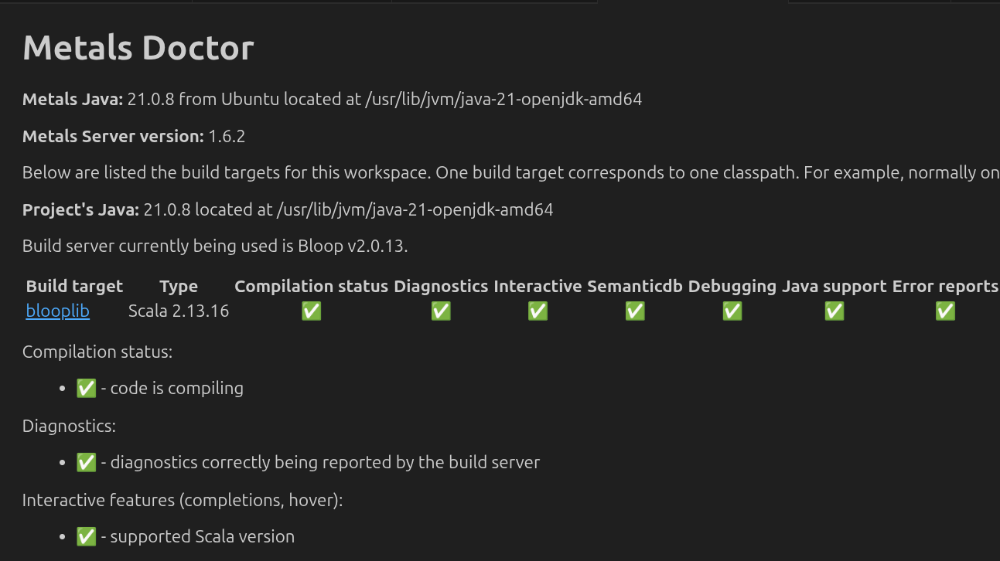
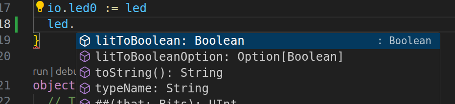

# Scala toolchain to work with Chisel

This toolchain is adapted to work with Chisel and support vscode with bloop.

One of the problem with bazelbsp is that it invokes bazel, which locks up the GUI as well as the command line.

bloop on the other hand runs completely independently of Bazel inside vscode

## Setting up example

See ./BUILD.bazel for an example on how to set up `scala_bloop`.

    NOTE! This will erase any existing .metals, .bloop and .bazelbsp folders in the project.

Set up bloop files, stop vscode, re-run every time you add and remove a file from the project:

    bazelisk run :bloop

Now run vscode:

    code .

Open Example.scala, start the Metals doctor to verify that "blooplib" is hooked up and working without any serious warnings.

You should now have Scala tooltips, references, etc. for your project.

Add this [workaround](https://github.com/scalacenter/bloop/issues/2711) in .bazelrc:

    # Stamping the manifest changes the name of `scala-compiler-2.13.17.jar` to
    # `processed_scala-compiler-2.13.17.jar`, which keeps `bloop` from recognizing
    # it.
    # Read more:
    # https://web.archive.org/web/20250624074624/https://github.com/scalacenter/bloop/blob/b90aaa82e0799b8783b1812f4c07961d4c47ec30/backend/src/main/scala/bloop/ScalaInstance.scala#L73-L75
    # https://web.archive.org/web/20250624074941/https://github.com/bazel-contrib/rules_jvm_external/issues/786
    common --@rules_jvm_external//settings:stamp_manifest=false

## Metals doctor healthy example

## Intellisense example

